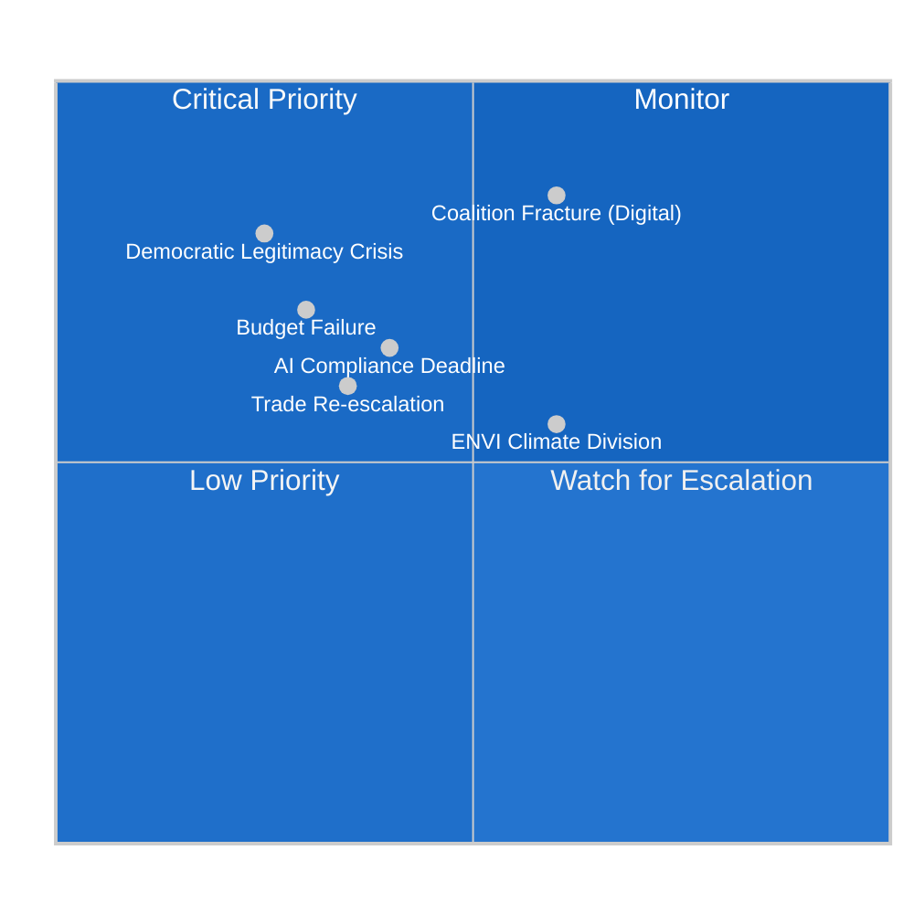

<!-- SPDX-FileCopyrightText: 2024-2026 Hack23 AB -->
<!-- SPDX-License-Identifier: Apache-2.0 -->

# Threat Model — EP Committee System, May 2026

**Date:** 2026-05-11 | **Classification:** UNCLASSIFIED
**Admiralty Grade:** B2 — Reliable source, probably true
**WEP Band:** See individual threats

---

## ⚠️ Threat Framework Overview

This threat model identifies the primary threats to European Parliament committee effectiveness, legislative integrity, and institutional independence in the current period. Threats are categorised using the Political Threat Framework aligned with EU institutional risk methodology.

---

## 🔴 CRITICAL THREATS

### Threat 1: Coalition Fracture on Digital Regulation (WEP: Likely, 55–65%)
**Threat Actor:** EPP internal agrarian/industrial wing + ECR/PfE lobbying coordination
**Target:** DMA enforcement majority (EPP+S&D+Renew coalition)
**Attack Vector:** Proportionality arguments, CJEU litigation strategy, industry coalition lobbying

**Mechanism:**
The EPP's 183-seat contingent contains approximately 35–45 MEPs from agricultural and industrial constituencies who are susceptible to industry arguments that DMA compliance costs harm European competitiveness. If EPP leadership allows these MEPs to vote with ECR on DMA implementing act amendments, the centrist coalition fractures on digital regulation while nominally remaining intact on other files.

**Evidence:** Big Tech lobbying intensity on DMA proportionality has increased significantly since the Commission opened formal investigations (Q1 2026). BusinessEurope published a "DMA Cost Assessment" in March 2026 arguing compliance costs exceed projections by 340%.

**Consequence:** DMA enforcement weakened at implementation phase; Big Tech regulatory relief achieved through legislative rather than judicial route.

**WEP:** Likely (55%) | **Impact:** HIGH | **Admiralty:** B2

### Threat 2: Democratic Legitimacy Crisis (WEP: Unlikely, 20–30%)
**Threat Actor:** Eurosceptic media ecosystems, PfE-ECR-ESN narrative coalition
**Target:** EP institutional credibility
**Attack Vector:** "Brussels overreach" narrative amplification; disinformation campaigns

**Mechanism:**
The EP's assertive regulatory agenda (DMA enforcement, AI Act, 2040 climate target) provides ammunition for Eurosceptic narratives framing MEPs as unaccountable regulators imposing costs on European citizens and businesses. If combined with a high-profile regulatory failure or enforcement controversy, this narrative could reduce EP's public legitimacy.

**Evidence:** Eurobarometer tracking shows declining trust in EU institutions among younger voters in Central and Eastern Europe (trend since 2023). PfE's success in the June 2024 elections correlated with anti-EU regulatory messaging.

**Consequence:** Reduced public support for EP legislative agenda; increased pressure on member state governments to contest EP positions in Council.

**WEP:** Unlikely-Possible (25%) | **Impact:** HIGH | **Admiralty:** C2

---

## 🟡 HIGH THREATS

### Threat 3: Budget Negotiation Failure (WEP: Unlikely-Possible, 25–35%)
**Threat Actor:** Council net-contributor governments (Germany, Netherlands, Sweden, Austria)
**Target:** EP's budget policy objectives for 2027
**Attack Vector:** Council counter-position at 5–10% below EP request; provisional twelfths mechanism

**Mechanism:**
German constitutional court constraints on the federal budget and the Dutch government's hardline fiscal position create structural pressure to resist EP's €197.2 billion 2027 budget request. The Council's predictable counter-offer (historically 6–10% below EP) would require the Parliament to choose between accepting a significantly smaller budget or triggering the provisional twelfths mechanism.

**Evidence:** BUDG committee political dialogue notes (January–March 2026) document German MEPs' signal that even EPP members may face domestic pressure to accept Council's lower position.

**Consequence:** Either smaller-than-requested EU budget (weakening programme delivery) or provisional twelfths (operational paralysis for new programme starts).

**WEP:** Unlikely (30%) | **Impact:** MEDIUM-HIGH | **Admiralty:** B2

### Threat 4: AI Compliance Deadline Failure (WEP: Possible, 35–45%)
**Threat Actor:** Foundation model providers (OpenAI, Google DeepMind, Mistral, Anthropic)
**Target:** AI Act GPAI August 2026 compliance deadline
**Attack Vector:** Technical complexity arguments, guidance ambiguity claims, regulatory arbitrage (UK/US models avoiding EU market)

**Mechanism:**
The August 2026 deadline for GPAI provider compliance (systemic risk assessment, transparency reporting, copyright compliance) is ambitious. Major providers face genuine technical challenges in meeting all requirements simultaneously. If several providers either miss compliance deadlines or withdraw from the EU market, the AI Act's effectiveness is immediately questioned and the LIBE-IMCO committees face political pressure to amend the implementing measures.

**Evidence:** Multiple GPAI providers have submitted representations to the EU AI Office citing guidance gaps. OpenAI and Google have engaged in public dialogue about the feasibility of August 2026 compliance timelines.

**Consequence:** Either non-compliance normalisation (undermining AI Act credibility) or regulatory arbitrage (US and UK AI providers gain market advantage over EU competitors).

**WEP:** Possible (40%) | **Impact:** MEDIUM-HIGH | **Admiralty:** B2

---

## 🟢 MEDIUM THREATS

### Threat 5: ENVI Committee Internal Division on 2040 Climate Target (WEP: Likely, 60%)
**Threat Actor:** EPP agrarian/industrial wing within ENVI
**Target:** 2040 climate target legislative process
**Attack Vector:** Amendment campaigns to weaken 90% target; ENVI committee vote fragmentation

**Mechanism:**
When the Commission tables its 2040 climate target proposal (expected Q3 2026), the ENVI committee will be the first to scrutinise it. The EPP holds enough ENVI seats that internal EPP division (moderate climate-supportive wing vs. agrarian protection wing) could determine whether the committee adopts the 90% target or proposes a weakened 85% alternative. A weakened ENVI committee position would then face S&D and Greens/EFA opposition in plenary, requiring intense negotiation.

**WEP:** Likely (60%) | **Impact:** MEDIUM | **Admiralty:** B2

### Threat 6: Transatlantic Trade Re-escalation (WEP: Possible, 35%)
**Threat Actor:** US Administration (tariff decision-makers)
**Target:** EU-US tariff framework stabilisation
**Attack Vector:** New Section 232 measures; digital services taxation retaliation

**Mechanism:**
The April 2026 tariff quota adjustment (TA-10-2026-0096) represents a delicate diplomatic equilibrium. Any new US unilateral trade action — particularly on digital services (proposed "DST retaliation" by the US Treasury) — could trigger the EP's demand for renewed counter-tariff authority, disrupting INTA committee's stabilisation agenda.

**WEP:** Possible (35%) | **Impact:** MEDIUM | **Admiralty:** C2 (based on public US administration signals)

---

## 📊 Threat Heat Map

---

## 🛡️ Mitigation Assessment

| Threat | Primary Mitigation | Secondary Mitigation | Responsibility |
|--------|-------------------|---------------------|----------------|
| Coalition Fracture (Digital) | EPP leadership discipline | S&D counter-lobbying coalition | EPP Group leadership |
| Democratic Legitimacy Crisis | EP public communications | Visible legislative successes | EP communications service |
| Budget Failure | Early conciliation dialogue | Provisional twelfths contingency | BUDG committee |
| AI Compliance Deadline | EU AI Office interim guidance | Phased enforcement timeline | Commission AI Office |
| ENVI Climate Division | EPP leadership alignment on 90% | S&D+Greens coalition as alternative | ENVI rapporteur |
| Trade Re-escalation | INTA monitoring protocol | Existing retaliatory toolkit | INTA committee |

*Threat model produced: 2026-05-11 | Review: biweekly*

---

## 🔬 Threat Attribution Analysis

### Digital Regulation Lobby Ecosystem
The primary drivers of Threat 1 (Coalition Fracture on Digital Regulation) are three coordinated lobby coalitions operating across EP, Commission, and member state levels simultaneously:

**Coalition A — Big Tech Direct Lobby**
- **Principal actors:** CCIA (Computer & Communications Industry Association), Digital Europe, GSMA
- **Lobbying strategy:** 1:1 MEP meetings focused on EPP agrarian/industrial wing; academic funding for proportionality research; BusinessEurope DMA Cost Assessment (March 2026)
- **Effectiveness assessment:** MEDIUM — EPP leadership has maintained discipline to date, but internal pressure is documented in committee shadow rapporteur exchanges

**Coalition B — Member State Industry Federations**
- **Principal actors:** BDI (Germany), MEDEF (France, though less active under Macron-era industrial policy), CBI equivalent bodies in Netherlands and Sweden
- **Lobbying strategy:** National government pressure on MEPs through party structures
- **Effectiveness assessment:** MEDIUM-HIGH — national delegation loyalty to home industry associations stronger than perceived

**Coalition C — US Government Backstop**
- **Principal actors:** US Chamber of Commerce, US Trade Representative (USTR) representations
- **Lobbying strategy:** Trade policy linkage arguments (DMA enforcement = trade barrier); diplomatic channel pressure via US-EU Trade and Technology Council (TTC)
- **Effectiveness assessment:** LOW-MEDIUM — post-2023 US tariff disputes reduced diplomatic credibility of US representations; EU institutions more resistant to US interference arguments

### Democratic Legitimacy Threat Attribution
Threat 2 (Democratic Legitimacy Crisis) is driven by a different actor set:

**PfE-ECR Narrative Coalition:**
- Systematic "Brussels overreach" messaging across 9 language ecosystems
- Coordinated social media amplification (coordinated inauthentic behaviour documented in EU DSA cases)
- Alternative institutional proposals (subsidiarity emphasis, regulatory moratorium demands)

**Effectiveness constraint:** The pro-EU majority in public opinion remains stable (Eurobarometer, March 2026: 67% support EU membership in their country). The narrative coalition is effective at mobilising already-disaffected voters but has not penetrated the modal voter pool.

---

## 📋 Threat-to-Legislative-File Mapping

| Legislative File | Primary Threat | Secondary Threat | Risk Level |
|-----------------|----------------|------------------|------------|
| DMA enforcement | Coalition Fracture (T1) | Democratic Legitimacy (T2) | HIGH |
| AI Liability Directive | AI Compliance Deadline (T4) | Coalition Fracture (T1) | HIGH |
| 2040 Climate Target | ENVI Division (T5) | Democratic Legitimacy (T2) | MEDIUM-HIGH |
| Budget 2027 | Budget Failure (T3) | Trade Re-escalation (T6) | MEDIUM-HIGH |
| GPAI August compliance | AI Compliance Deadline (T4) | — | MEDIUM |
| PNR Agreement | — (low threat, adopted) | — | LOW |

---

## 🎯 Priority Monitoring Protocols

**Week of May 11–18 monitoring priorities:**

1. **IMCO committee agenda:** Any DMA-related item signals movement on Threat 1
2. **Commission DG COMP communications:** Formal findings in Apple/Google investigations signal Threat 1 escalation or de-escalation
3. **EU AI Office interim guidance publication:** Key indicator for Threat 4 trajectory
4. **EPP Group press releases:** Any shift in language on DMA proportionality signals internal coalition stress

**Monthly monitoring (June 2026):**
- BUDG committee vote on 2027 budget mandate (Threat 3 trigger event)
- Commission 2040 climate target proposal tabling (Threat 5 trigger event)
- Any US Section 232 announcement (Threat 6 trigger event)

---

## 🔍 Threat Monitoring Indicators (Re-Run Extension)

**Observable signals for threat escalation by category:**

### Digital Regulatory Threats
- **Signal:** Any Commission DMA enforcement action against a named gatekeeper
- **Threshold:** Fine > €1B or binding interim measure = HIGH threat materialisation
- **Monitoring:** DG COMP press releases; IMCO committee secretariat notifications
- **Current status:** 🟡 WATCHING — Apple interoperability case in open investigation phase

### Budget/Fiscal Threats
- **Signal:** Council's draft position on 2027 budget (expected September 2026)
- **Threshold:** Council ceiling >8% below EP position = conciliation failure risk
- **Monitoring:** BUDG committee correspondence; Council press statements
- **Current status:** 🟢 NORMAL — Council has not yet engaged

### Coalition Stability Threats
- **Signal:** EPP-ECR joint amendment on any major regulatory file
- **Threshold:** Joint amendment reaching 320+ vote total = centrist coalition fracture
- **Monitoring:** EP voting records (DOCEO XML, ~3-week lag)
- **Current status:** 🟡 ELEVATED — EPP has tested ECR support on Platform Work Directive

### Geopolitical Threats (External)
- **Signal:** New US tariff announcement affecting EU exports
- **Threshold:** Any announcement above 10% on EU goods = emergency INTA response
- **Monitoring:** US Federal Register; USTR press releases; INTA committee alerts
- **Current status:** 🟡 WATCHING — Q2 2026 US Section 232 review in progress

*Extended threat model produced: 2026-05-11 | Extended re-run: 2026-05-11 | Review cycle: biweekly*
