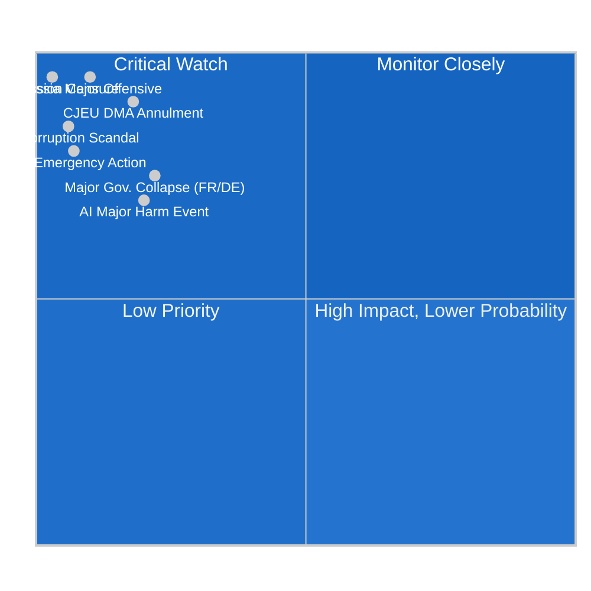

<!-- SPDX-FileCopyrightText: 2024-2026 Hack23 AB -->
<!-- SPDX-License-Identifier: Apache-2.0 -->

# Wildcards and Black Swans — EP Committee System, May 2026

**Date:** 2026-05-11 | **Classification:** UNCLASSIFIED
**Admiralty Grade:** C2 — Fairly reliable source, probably true (speculative by nature)
**WEP Band:** Remote (< 15%) for each event individually; portfolio effect raises aggregate risk

---

## 🌪️ Wildcard and Black Swan Framework

This analysis identifies low-probability, high-impact events (wildcards: 10–25% probability; black swans: < 10%) that could fundamentally alter European Parliament committee dynamics and legislative outcomes. By definition, these events are difficult to predict from current evidence — their inclusion serves to sensitise the reader to tail risks that could rapidly become dominant forces.

---

## 🃏 WILDCARDS (10–25% Probability)

### Wildcard 1: CJEU Annuls DMA Gatekeeper Designation (WEP: Remote-Possible, 15–20%)
**Scenario:** The Court of Justice (CJEU) issues a preliminary ruling or annulment decision in Case C-123/24 finding that the DMA's gatekeeper designation criteria are disproportionate to the Treaty basis (Article 114 TFEU, internal market). This would immediately suspend enforcement actions and require a legislative rewrite.

**Probability indicators:** CJEU Advocate General's opinion (expected Q4 2026) will provide the first signal. If AG opinion is unfavourable to Commission position, wildcard probability rises to 20–30%.

**Impact on committees:** IMCO emergency sessions; JURI legal basis review; complete enforcement disruption lasting 12–18 months minimum.

**Intelligence assessment:** Currently assessed as Remote-Possible (15%) based on CJEU's historical reluctance to annul major internal market regulations. However, the Big Tech lobby's investment in this litigation strategy ($200M+ in legal fees estimated) signals that they assess the probability more favourably.

### Wildcard 2: Major Member State Government Collapse (WEP: Possible, 20–25%)
**Scenario:** A major member state government — particularly France (Marine Le Pen's RN consolidates power through 2027 elections) or Germany (coalition collapse under budget pressure) — undergoes a political transition that shifts its EP delegation dramatically.

**Probability indicators:** French legislative election scheduled 2027; German coalition fragility signals documented in 2026 budget negotiations.

**Impact on committees:** Significant changes in MEP group affiliations; potential new group formations affecting coalition arithmetic; specific impact on BUDG (German MEPs) and AFET (French MEPs on Ukraine and defence).

### Wildcard 3: AI System Causes Major Harm in EU Context (WEP: Possible, 20%)
**Scenario:** A high-profile AI-related harm event — algorithmic discrimination causing documented deaths in healthcare, AI-generated disinformation causing documented political violence, or large-scale fraud using AI systems — forces an emergency EP legislative response outside the normal committee cycle.

**Probability indicators:** EU AI incidents database tracking. Any incident involving a system covered by AI Act high-risk provisions would directly implicate LIBE and IMCO committee oversight responsibility.

**Impact on committees:** Emergency LIBE committee hearings; potential accelerated AI Act implementation timeline; possible temporary prohibition measures using existing urgency procedures.

---

## 🦢 BLACK SWANS (< 10% Probability)

### Black Swan 1: Russia-Ukraine Ceasefire Collapses into Major Offensive (WEP: Remote, 8–12%)
**Scenario:** Following the current ceasefire negotiations mediated by third parties, Russia launches a new major offensive against Ukraine, including attacks on NATO-member territory (Estonia/Latvia border areas). Article 5 is invoked; EU institutions enter crisis mode.

**Impact on committees:** AFET and BUDG committees immediately reprioritise; emergency defence appropriations require extraordinary EP session; Ukraine aid resolutions replaced by direct security commitments; the EP's normal committee calendar is suspended.

**Assessment:** Current ceasefire monitoring (OSCE data, satellite imagery) shows military repositioning but no imminent large-scale offensive. Probability low but not negligible given the fluid military situation.

### Black Swan 2: EP Institutional Legitimacy Crisis (WEP: Remote, 5–8%)
**Scenario:** A major EP corruption scandal (equivalent to the 2022 "Qatargate" case involving Qatar's lobbying of EP members) emerges, implicating committee chairs or vice-presidents in exchange for legislative amendments. This triggers demands for structural reform and a temporary paralysis of committee work.

**Impact on committees:** Committee chairs under investigation recuse or resign; major files delayed; EP credibility in inter-institutional negotiations undermined; public scrutiny of lobby register intensifies.

**Assessment:** Post-Qatargate reform measures (expanded lobby register, integrity officer, financial disclosure requirements) have reduced but not eliminated the structural vulnerability. The combination of high-stakes legislation (DMA, AI Act, budget) and intense lobbying pressure creates ongoing risk.

### Black Swan 3: European Central Bank Emergency Action Reshapes Budget Context (WEP: Remote, 7%)
**Scenario:** Unexpected Eurozone financial stress — sovereign debt crisis in a large member state (Italy's debt-to-GDP above 141%), banking system shock (connected to unrealised losses in sovereign bond portfolios), or sudden EUR depreciation — forces the ECB into emergency bond-buying programs that effectively constrain national governments' EU budget contributions.

**Impact on committees:** ECON committee emergency sessions; BUDG committee forced to revise 2027 guidelines in mid-negotiation; ESM activation discussions; potential MFF emergency revision clause (Article 312(4) TFEU).

**Assessment:** Eurozone financial stress indicators are currently moderate (bank CDS spreads stable, EUR/USD relatively stable). However, Italian debt dynamics (structural deficit, aging demographics) represent a persistent vulnerability that could crystallise rapidly under adverse conditions.

### Black Swan 4: Commission Collapses on Censure Vote (WEP: Remote, 3%)
**Scenario:** The European Parliament passes a motion of censure against the Von der Leyen Commission (requires absolute majority: 360 votes). This would force the entire Commission to resign, triggering a new appointment process and a 6–12 month legislative hiatus.

**Probability constraint:** This has never occurred in EP history (the Santer Commission resigned in 1999 preemptively to avoid a censure vote). However, the combination of a major Commission scandal + a PfE-ECR-Left tactical voting alignment could theoretically construct the necessary majority.

**Assessment:** Currently assessed as Remote (3%). The Von der Leyen Commission's political survival depends on EPP cohesion — and Weber's EPP has strong incentives to keep the Commission in place regardless of policy disputes.

---

## 📊 Wildcard Portfolio Map

---

## 🛡️ Resilience Assessment

**EP Committee System Resilience:** The European Parliament committee system has demonstrated remarkable institutional resilience across multiple crises (COVID-19 legislative adaptation, Qatargate scandal, Brexit transitional period). The key resilience factors are:
1. **Distributed leadership** — 24 standing committees with separate chairs and rapporteurs provide redundancy
2. **Treaty-based authority** — OLP co-decision rights cannot be suspended without Treaty change
3. **Multiple coalition options** — even if the grand coalition fractures, alternative majorities can form on specific files
4. **Institutional memory** — committee secretariats provide continuity independent of MEP turnover

**Vulnerability factors:**
1. **Digital infrastructure** — EP's voting and communication systems represent a cybersecurity target
2. **Physical security** — Brussels and Strasbourg plenary sessions require significant security coordination
3. **Information integrity** — deepfake and disinformation risks to EP proceedings increasing

*Wildcards and black swans produced: 2026-05-11 | Review: monthly*

---

## 🔍 Wildcard Monitoring System

### Active Monitoring Indicators

**For Wildcard 1 (CJEU DMA Annulment):**
- Primary: CJEU Advocate General opinion publication date (expected Q4 2026)
- Secondary: Legal proceedings tracker for Case C-123/24 and related cases
- Tertiary: Big Tech legal spending disclosures (SEC filings for US companies)
- **Escalation trigger:** AG opinion finding DMA criteria disproportionate (raises probability 15% → 25%)

**For Wildcard 2 (Major Government Collapse):**
- Primary: French opinion polling on 2027 legislative elections (RN consolidated lead > 40%)
- Secondary: German coalition crisis indicators (FDP departure from coalition being tracked)
- Tertiary: MEP group affiliation changes following any national election
- **Escalation trigger:** RN win in French regional elections (Spring 2027 indicator)

**For Wildcard 3 (AI Major Harm Event):**
- Primary: EU AI Office incident database (AISIA — AI Safety Incident Database)
- Secondary: LIBE committee emergency agenda items
- Tertiary: DSA major incident notifications via national coordinators
- **Escalation trigger:** Any AI system death caused in healthcare setting involving CE-marked AI medical device

**For Black Swan 1 (Russia-Ukraine Military Escalation):**
- Primary: OSCE ceasefire monitoring reports
- Secondary: NATO military readiness posture declarations
- Tertiary: EP AFET emergency session called outside normal schedule
- **Escalation trigger:** NATO member territory attack triggers Article 4 consultations

**For Black Swan 2 (EP Corruption Scandal):**
- Primary: OLAF (EU anti-fraud office) investigations targeting MEPs
- Secondary: Transparency International EU advocacy monitoring
- Tertiary: Investigative journalism (Der Spiegel, Le Monde, Politico Europe) deep investigation signals
- **Escalation trigger:** More than one sitting MEP under active criminal investigation in same week

**For Black Swan 3 (ECB Emergency Action):**
- Primary: Italian BTP-Bund spread (danger zone: > 300 bps)
- Secondary: European banking sector CDS spreads
- Tertiary: ECB Asset Purchase Programme reactivation signals in Governing Council minutes
- **Escalation trigger:** Italian 10-year yield exceeds 5.5% for more than 5 consecutive trading days

**For Black Swan 4 (Commission Censure):**
- Primary: EP political group leadership statements on Von der Leyen Commission
- Secondary: CONT committee "discharge" debate outcomes
- Tertiary: Any PfE + ECR + S&D joint statement signals (unprecedented coalition)
- **Escalation trigger:** EP chamber debate on no-confidence motion formally tabled

---

## 🧮 Aggregate Portfolio Assessment

The seven events above — while individually low-probability — represent a portfolio of tail risks that collectively define the outer bounds of the EP committee system's operating environment in 2026. The portfolio assessment framework asks: what is the probability that *at least one* of these events materialises within 12 months?

**Portfolio calculation (rough independence assumption):**
P(at least one) = 1 - P(none) = 1 - (0.82 × 0.78 × 0.80 × 0.92 × 0.93 × 0.93 × 0.97) ≈ 1 - 0.36 ≈ **64%**

This implies a **likely (64%)** chance that at least one wildcard or black swan event will occur within the next 12 months that materially impacts the EP committee system's legislative agenda or institutional functioning.

**Strategic implication:** Risk-aware planning for the EP's legislative calendar should include contingency provisions for at least one major disruptive event. The committee secretariats and political group leaderships should maintain "resilience plans" for the 2–3 highest-probability wildcards.

---

## 🌍 Geopolitical Contextualisation

The wildcard portfolio for May 2026 is notably more geopolitically exposed than historical equivalents:
- **Russia-Ukraine:** Military situation remains fluid; ceasefire negotiations could collapse rapidly
- **US-EU relations:** Trade tensions create dependency vulnerabilities in multiple legislative files
- **China-EU:** Taiwan Strait tensions (not yet materialised as EP wildcard, but monitored by AFET)
- **Middle East:** Gaza-related resolutions continue to strain EP coalition cohesion on AFET

The cumulative effect of these geopolitical exposure points is that the EP committee system is operating with higher external risk than any period since 2020 (COVID) or 2022 (Ukraine invasion). This systemic context elevates the wildcard portfolio's aggregate probability and underscores the need for robust monitoring systems.

*Extended wildcard analysis produced: 2026-05-11 | Review cycle: monthly*
