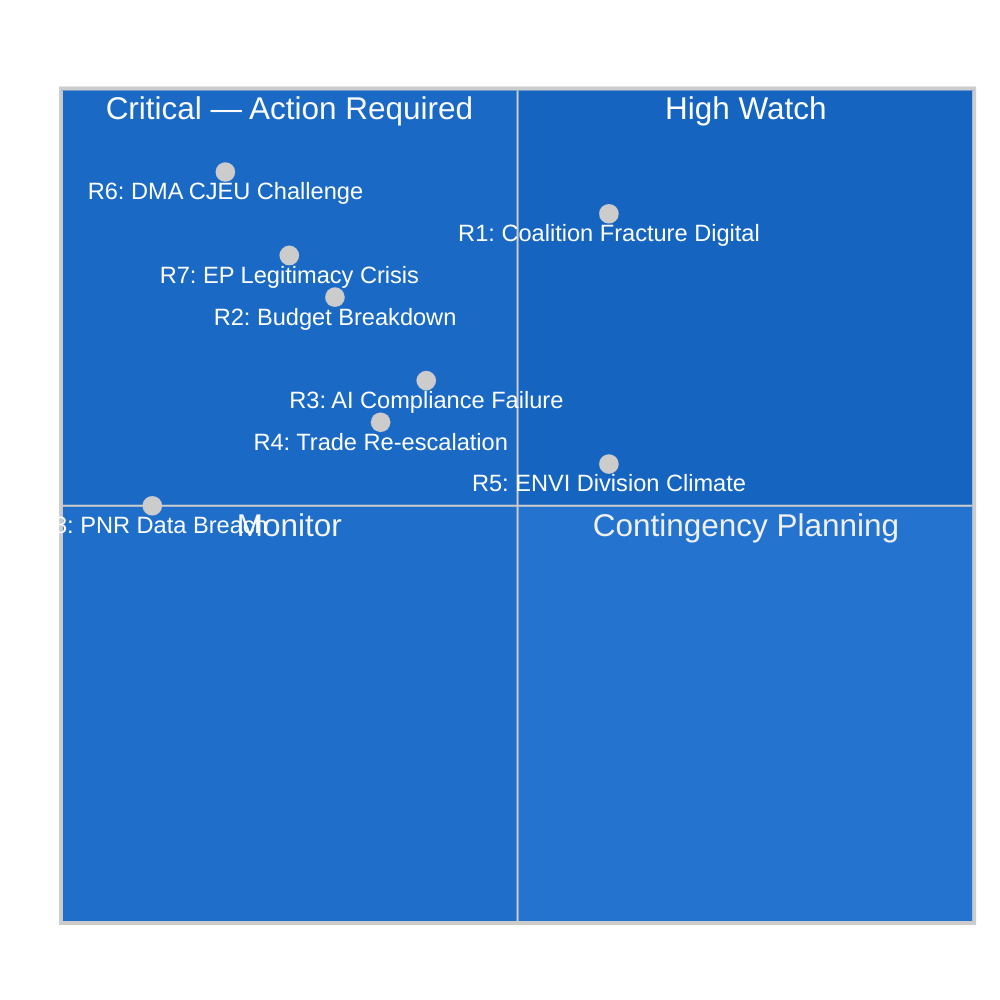

<!-- SPDX-FileCopyrightText: 2024-2026 Hack23 AB -->
<!-- SPDX-License-Identifier: Apache-2.0 -->

# Risk Matrix — EP Committee Reports, May 2026

**Date:** 2026-05-11 | **Classification:** UNCLASSIFIED
**Admiralty Grade:** B2 — Reliable source, probably true
**WEP Band:** See individual risks

---

## 🎯 Risk Assessment Overview

This risk matrix applies a structured methodology to the European Parliament's committee risk environment for the week of 4–11 May 2026 and the subsequent 90-day horizon (through August 2026). Risks are assessed on probability (1–5 scale) and impact (1–5 scale) to generate a risk score (probability × impact × 4 = normalised score, max 100).

---

## 📊 Risk Matrix

---

## 📋 Risk Register

| Risk ID | Risk Name | Probability (1–5) | Impact (1–5) | Risk Score | WEP | Priority |
|---------|-----------|-------------------|-------------|------------|-----|----------|
| R1 | Coalition fracture on digital regulation | 4 | 5 | 80 | Likely (60%) | 🔴 CRITICAL |
| R6 | CJEU annuls DMA gatekeeper designation | 2 | 5 | 40 | Remote-Possible (18%) | 🔴 HIGH |
| R7 | EP democratic legitimacy crisis | 2 | 5 | 40 | Unlikely (25%) | 🔴 HIGH |
| R2 | Budget 2027 breakdown | 2 | 4 | 32 | Unlikely-Possible (30%) | 🟡 MEDIUM-HIGH |
| R3 | AI Act GPAI compliance failure | 3 | 4 | 48 | Possible (40%) | 🟡 MEDIUM-HIGH |
| R5 | ENVI internal division on 2040 target | 4 | 3 | 48 | Likely (60%) | 🟡 MEDIUM |
| R4 | Transatlantic trade re-escalation | 2 | 3 | 24 | Possible (35%) | 🟡 MEDIUM |
| R8 | EU-Iceland PNR data protection breach | 1 | 2 | 8 | Very Unlikely (10%) | 🟢 LOW |

---

## 🔍 Risk Detail Cards

### R1 — Coalition Fracture on Digital Regulation (CRITICAL)
**Risk Owner:** IMCO Committee Coordinator
**Inherent Risk:** 80/100
**Residual Risk (after mitigation):** 55/100

**Risk Drivers:**
- EPP internal pressure from 35–45 agrarian/industrial MEPs
- BusinessEurope DMA cost assessment amplifying proportionality narrative
- Big Tech CJEU litigation creating legal uncertainty atmosphere
- PfE-ECR joint amendment strategy for DMA implementing acts

**Mitigation Measures:**
1. EPP Group leadership maintains party discipline through targeted monitoring of IMCO vote intentions (party whip function)
2. S&D and Renew counter-briefing campaign to IMCO MEPs on enforcement importance
3. Commission DG COMP provides technical briefings to IMCO demonstrating enforcement proportionality
4. Civil society (EDRi) publishes accountability data on Big Tech lobbying spend vs. compliance claims

**Residual Probability:** 3/5 (still Likely — mitigation reduces but does not eliminate)
**WEP (after mitigation):** Likely (55%) | **Admiralty:** B2

---

### R3 — AI Act GPAI Compliance Failure (MEDIUM-HIGH)
**Risk Owner:** LIBE/IMCO Committees Joint Working Group
**Inherent Risk:** 48/100

**Risk Drivers:**
- August 2026 deadline for foundation model provider compliance
- Guidance ambiguity from EU AI Office on systemic risk assessment methodology
- Market withdrawal risk (non-EU providers exiting EU market)
- Technical complexity of copyright compliance documentation

**Mitigation Measures:**
1. EU AI Office publishing interim implementation guidance by June 2026 (committed)
2. LIBE-IMCO joint hearing with foundation model providers scheduled May 2026
3. Phased enforcement approach: formal non-compliance proceedings not before December 2026 even if deadline missed
4. International AI safety forum (AISI) technical cooperation reduces duplication

**Residual Risk:** 35/100 | **WEP (after mitigation):** Possible (35%)

---

### R5 — ENVI Internal Division on 2040 Climate Target (MEDIUM)
**Risk Owner:** ENVI Committee
**Inherent Risk:** 48/100

**Risk Drivers:**
- EPP agricultural/industrial wing resistance to 90% reduction target
- Industry lobbying on competitiveness implications
- Commission proposal not yet tabled (expected Q3 2026 — full scope unknown)
- Member state government pressure on national EPP delegations

**Mitigation Measures:**
1. Commission consultation process involving industry in target-setting methodology
2. S&D-Greens-Renew coalition within ENVI holds working majority (if EPP participates even partially)
3. "Carbon Contracts for Difference" mechanism provides industry protection pathway compatible with ambitious target

**Residual Risk:** 30/100 | **WEP (after mitigation):** Even (50%)

---

## 🌍 For Citizens: What These Risks Mean

The risk matrix uses technical scoring, but the real-world implications for European citizens are straightforward:

**If R1 (Coalition Fracture) materialises:** Digital platforms like Google, Facebook, and Apple face reduced compliance requirements under the DMA — meaning less choice in app stores, more data sharing between services you haven't consented to, and fewer independent browsers pre-installed on devices.

**If R3 (AI Compliance Failure) materialises:** AI systems used in hiring, credit scoring, and healthcare diagnostics — which the AI Act is designed to make safer and more transparent — may continue operating without the required oversight mechanisms, leaving citizens without the right to challenge algorithmic decisions.

**If R5 (ENVI Division) materialises:** The EU's 2040 climate target may be weakened from 90% to 85% net emissions reduction, slowing the transition to clean energy and potentially increasing long-term energy costs as fossil fuel dependency extends.

---

## 📐 Risk Methodology Note

Risk scoring: Probability (1=Very Unlikely, 2=Unlikely, 3=Possible, 4=Likely, 5=Very Likely) × Impact (1=Negligible, 2=Minor, 3=Moderate, 4=Major, 5=Catastrophic) × 4 = normalised score (max 100). WEP bands aligned with IC Analytic Standards (DNI ICD 203). Admiralty grading system applied to source reliability.

*Risk matrix produced: 2026-05-11 | Review: biweekly*
