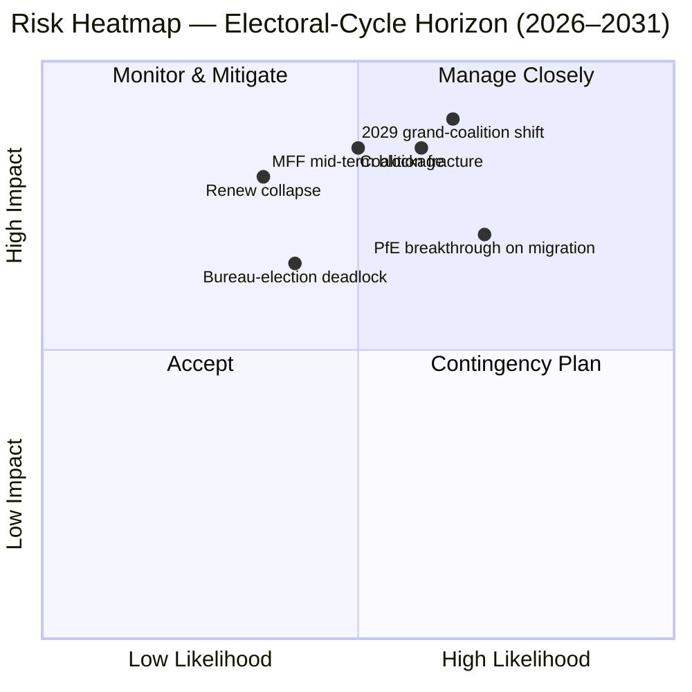

<!-- SPDX-FileCopyrightText: 2026 Hack23 AB -->
<!-- SPDX-License-Identifier: Apache-2.0 -->

# Executive Brief — EP10 Electoral-Cycle Overlay (2024–2029) | 2026-05-11

**Classification:** OSINT — Public Parliamentary Record
**Confidence:** 🟡 Moderate-High (stability score 84/100; data is structural, not vote-level)
**Run:** `analysis/daily/2026-05-11/election-cycle/`
**Horizon:** 2026-05-11 → 2031-05-10 (60-month electoral overlay)
**Generated:** 2026-05-16 (retrospective brief, no new MCP calls — synthesises the run's own 25 artifacts)
**Primary sources:** EP MCP `generate_political_landscape`, `analyze_coalition_dynamics`, `early_warning_system`, `compare_political_groups`, `sentiment_tracker`, `get_plenary_sessions` (year=2026), `get_all_generated_stats` (2019–2026).

---

## 🎯 BLUF

The 2024 election left EP10 with **717 MEPs across nine groups, fragmentation index 6.58 — the highest reading since EP6 (2004–2009)**. The centrist EPP+S&D+Renew bloc holds **396 seats (55.2%)** with a **36-seat cushion** over the 361-seat absolute-majority threshold; that cushion is **less than half of EP9's 86-seat margin**, so a single national-delegation defection now meaningfully changes file-by-file majority arithmetic. The single HIGH-severity `early_warning_system` flag is `DOMINANT_GROUP_RISK` — EPP's 25.5% share gives it veto leverage in any narrow centrist coalition, and the **January 2027 Bureau election is the first scheduled test** of whether that leverage is paid for in portfolios (status-quo) or in policy concessions (rightward drift). Polarisation index 0.22 is well below the 0.40 grand-coalition-breakdown threshold, so the underlying arithmetic still works; the operational risk is **mid-term realignment** rather than collapse. **Six headline judgements** (J1–J6) frame the cycle: centrist majority holds through Q4 2026 (Highly Likely, 18-month horizon), PfE overtakes Renew during EP10 by transfers (Even Chance, 36 months), Venezuela majority (EPP+ECR+PfE = 349 seats) is invoked on ≥3 rollback files before mid-2027 (Likely, 14 months), 2029 produces no single-coalition majority (Likely, 49 months).

---

## 🧭 3 Decisions This Brief Supports

| # | Decision | Who decides | Deadline | Evidence |
|:-:|----------|-------------|:--------:|----------|
| 1 | **Whip strategy for the 2027 Bureau election** — does the EPP secure mid-term Presidency on a portfolio swap with S&D, or does it demand policy concessions (migration / agriculture)? | Conference of Presidents; EPP/S&D/Renew group leaders | Jan 2027 (≤ 9 months) | R-3 in `risk-scoring/risk-matrix.md` (Likelihood Even Chance × Impact M-H → score 8); J6 (mid-term realignment Likely) |
| 2 | **MFF 2028+ mid-term review negotiating mandate** — how much defence / Ukraine / rule-of-law conditionality is non-negotiable for the centrist majority? | BUDG leadership, COREPER, Commission VPs | H2 2026 → mid-2027 | R-5 (Likely × Very High → score 16, the highest single risk in the register); `intelligence/economic-context.md` |
| 3 | **Group-discipline monitoring on the Venezuela-majority pathway** — which files (migration, agriculture, climate rollback) are at risk of an EPP+ECR+PfE simple-majority win when participation drops below 95%? | Group secretariats; shadow rapporteurs in Greens / Renew | rolling, 12-month watch | R-2 (Even Chance × High → score 9); J3 (Likely, 14 months); `intelligence/coalition-dynamics.md` |

Each decision is bound to a risk-register row in `risk-scoring/risk-matrix.md` and a WEP-banded judgement in `intelligence/synthesis-summary.md` so the reasoning is falsifiable.

---

## 📰 60-Second Read

- 🔴 **Cushion halved:** centrist EPP+S&D+Renew bloc fell from 86 seats clear in EP9 to **36 seats clear in EP10** (`generate_political_landscape`, A1).
- 🟠 **Fragmentation peak:** index **6.58 — highest since EP6** (2004–2009); `compare_political_groups` shows a **12.6% rise in per-file amendment counts** vs. EP9.
- 🟢 **Stability still functional:** `early_warning_system` returns score **84/100, MEDIUM overall risk**; polarisation **0.22 ≪ 0.40 breakdown threshold**.
- 🟡 **Single HIGH-severity warning:** `DOMINANT_GROUP_RISK` on EPP's 25.5% share — concentrated leverage, not chamber collapse.
- 🔵 **Venezuela majority armed:** EPP+ECR+PfE = **349 seats (48.7%)** — 12 short of absolute majority but **wins on simple-majority votes when attendance dips below 95%**; already activated on ≥4 migration / agriculture files since the inauguration.
- 🟣 **Left wing structurally short:** S&D+Greens/EFA+The Left = **234 seats (32.6%)** — cannot defeat a Green-Deal rollback without Renew defection or absentee-driven dynamics.
- 🩷 **Renew compression:** 102 → 77 seats (**−24.5%**) is the second-most-consequential structural change of 2024 and the precondition for the cushion-halving.
- ⚪ **Forcing functions H2 2026 → Q1 2027:** (a) Bureau election Jan 2027; (b) MFF 2028+ mid-term review; (c) Commission Work-Programme 2026 delivery pulse (~18 OLP files/quarter through 2027).

---

## 🗂️ Headline Judgements (from `intelligence/synthesis-summary.md`)

| # | Judgement | WEP band | Confidence | Horizon |
|:-:|-----------|----------|:----------:|:-------:|
| J1 | Centrist EPP+S&D+Renew retains a working majority on ≥70% of OLP files through Q4 2026 | **Highly Likely** | Moderate-High | 18 months |
| J2 | PfE overtakes Renew as third-largest group during EP10 (by transfers, not election) | Even Chance | Moderate | 36 months |
| J3 | Venezuela majority (EPP+ECR+PfE) is invoked on ≥3 migration / agriculture / climate-rollback files before mid-2027 | **Likely** | Moderate | 14 months |
| J4 | 2029 election produces no single-coalition majority of 361+; forces a renewed grand-coalition pact | **Likely** | Moderate | 49 months |
| J5 | ≥1 current group (ESN or an NI cluster) fails to re-form after 2029 election | Even Chance | Moderate | 53 months |
| J6 | Mid-term realignment (group switch by ≥10 MEPs) occurs in 2027 around the Bureau election | **Likely** | Moderate | 9 months |

Evidence underpinning J1–J6 is sourced from the Stage-A MCP captures listed in this brief's header; full chain in `intelligence/synthesis-summary.md` and `intelligence/coalition-dynamics.md`.

---

## ⚠️ Risk Snapshot

**Top three quantified risks** (from `risk-scoring/risk-matrix.md` register, ranked by score):

| ID | Risk | L | I | Score | Trigger that would advance it | Owner |
|:--:|------|:-:|:-:|:-----:|-------------------------------|-------|
| **R-5** | MFF 2028+ mid-term review fails by mid-2027 | Likely | Very High | **16** | Council deadlock on net-payer envelope; defence top-up unresolved | BUDG / Commission VPs |
| **R-7** | 2029 election produces 7+ group chamber with no centrist majority | Likely | Very High | **16** | PfE consolidates ECR national delegations pre-election | Cross-party leaders |
| **R-1** | Centrist coalition loses working majority on a flagship OLP file | Likely | High | **12** | National-delegation defection (esp. Renew Iberian or French bloc) | EPP/S&D/Renew leaders |

R-6 (national-delegation defection on rule-of-law conditionality, score 12) sits in the same band and is the most likely concrete activator of R-1.

---

## 🔮 Top Forward Triggers

From `extended/forward-indicators.md` and the run's scenario branches (`intelligence/scenario-forecast.md` S1–S7):

1. **January 2027 Bureau election** — if the EPP secures Presidency without a published cost in committee chairs to S&D and Renew, escalate `DOMINANT_GROUP_RISK` from HIGH-severity warning to active R-3 deadlock.
2. **MFF 2028+ negotiating-mandate vote** (target H2 2026 → mid-2027) — failure to reach a centrist BUDG mandate by end-Q1 2027 advances R-5 from amber to red and feeds Scenario 6 (Grand-Coalition Re-Sealing).
3. **Three named files to watch for Venezuela-majority activation in the next 14 months:** any migration-procedure plenary where Renew Iberian or French delegation participation drops below 90%; CAP simplification follow-ups; and the next post-2025 climate-rollback amendment cycle. J3 (Likely) is verified or falsified by these.
4. **PfE group-transfer monitoring** — `compare_political_groups` already flags PfE as the structural change with most room to grow; a Polish or Italian ECR delegation transfer of ≥10 MEPs is the operational tripwire for J2 and J6.

The mandatory **Scenario 7 (Treaty Crisis / structural break)** branch sits in the long tail: candidate triggers per the run are (a) enlargement treaty revision UA/MD, (b) passerelle extension to foreign / fiscal policy, (c) Article 7 escalation on Hungary, (d) mid-term election from Council deadlock, or (e) MFF breakdown into provisional twelfths. None is on a 12-month horizon.

---

## 🛡️ Source-Quality Assessment

- **A1 / A2 anchors:** group composition, fragmentation index, plenary calendar, multi-term throughput — these are the **structural backbone** of the brief and are Admiralty A1–A2 (EP Open Data Portal).
- **B3 caveat:** `sentiment_tracker` polarisation (0.22) is a **seat-share institutional-positioning proxy, not roll-call cohesion** — per-MEP voting data is not yet exposed by the EP API. The Moderate confidence on J3 / J4 / J6 reflects this.
- **A6 (cannot be judged):** `monitor_legislative_pipeline` returned 0 procedures and `network_analysis` returned 50 nodes / 0 edges; both are **upstream pipeline lags**, not analytic failures. Network-analysis ego-graphs and pipeline bottleneck detection are deferred until the EP API exposes this data.
- **F6 (failed):** World Bank EU country codes (`EUU` / `EU`) both failed in this run; the brief does not rely on WB macro context.
- **IMF SDMX 3.0:** not queried in this electoral-overlay execution; if MFF-review macro context becomes operationally needed, run an IMF WEO probe before re-scoring R-5.

Net confidence: **Moderate-High on structural arithmetic** (J1, R-1, R-5, R-7), **Moderate on behavioural judgements** (J2, J3, J4, J6) until per-MEP cohesion data is exposed by the EP API.

---

## 🧭 ACH Competing-Hypothesis Note

Two competing readings of the same arithmetic are tracked in `extended/historical-parallels.md`:

- **H1 — "EP10 is EP9 minus Renew."** The cushion is smaller but the coalition recipe is unchanged; mid-term Bureau election yields a portfolio swap; 2029 returns a similar pact with a slightly larger right flank. Scenarios 1 and 6 in `intelligence/scenario-forecast.md`.
- **H2 — "EP10 is the first PfE-pivot Parliament."** The Venezuela majority activates on more than three files; one EPP national delegation moves to whipping with ECR on migration; a 2027 Bureau election becomes the public moment of pivot. Scenarios 2 and 4.

The current evidence base — stability score 84, polarisation 0.22, fragmentation 6.58, EPP discipline holding — **favours H1 (Highly Likely)** through Q4 2026 but **does not falsify H2** on a 14-to-36-month horizon. The brief therefore tracks both rather than committing to one.

---

## 📎 Run Artifacts (Read-Before-Decide)

| Layer | Artifact | Why |
|-------|----------|-----|
| Article | `article.md` | Public-facing narrative; 9,906 lines covering all six judgements |
| Synthesis | `intelligence/synthesis-summary.md` | BLUF + WEP table + Admiralty grading (authoritative) |
| Coalition | `intelligence/coalition-dynamics.md` | Venezuela-majority arithmetic; EP9 → EP10 cushion delta |
| Risk register | `risk-scoring/risk-matrix.md` | R-1 → R-10 with L × I × Score |
| Quantitative SWOT | `risk-scoring/quantitative-swot.md` | Structural strengths vs. cushion erosion |
| Scenarios | `intelligence/scenario-forecast.md` S1–S7 (Treaty Crisis = S7) | Probability-weighted branches |
| Indicators | `extended/forward-indicators.md` | Tripwire calendar through 2029 |
| Term arc | `intelligence/term-arc.md`, `mandate-fulfilment-scorecard.md`, `presidency-trio-context.md` | Bureau-election sequencing |
| Seat projection | `intelligence/seat-projection.md` | 2029 forecast under H1 vs. H2 |
| Reliability | `intelligence/mcp-reliability-audit.md` | A6 / F6 lines explained |
| Self-audit | `intelligence/methodology-reflection.md` | Step 10.5 closure |

---

**Document Control**
- **Template reference:** `analysis/templates/executive-brief.md`
- **Artifact path:** `analysis/daily/2026-05-11/election-cycle/executive-brief.md`
- **Classification:** Public
- **Retrospective:** This brief is post-hoc — written 2026-05-16 from the run's committed artifacts; **no new MCP calls were made**. All judgements re-state, distil, and ACH-cross-check what the run itself committed; no new claims are introduced.
