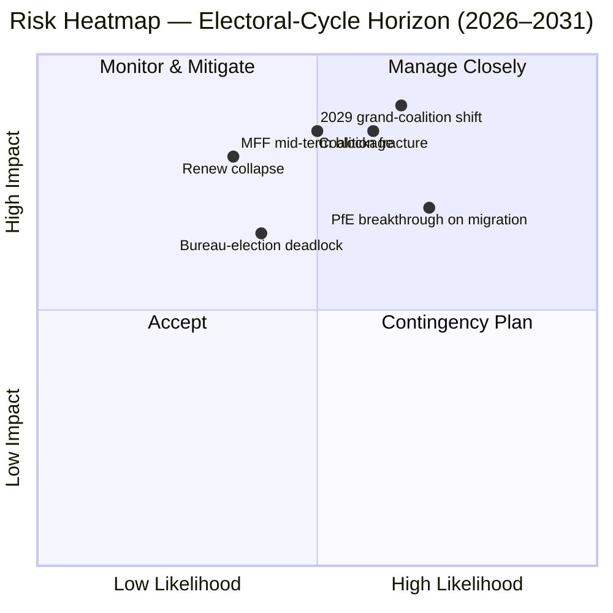

<!-- SPDX-FileCopyrightText: 2026 Hack23 AB -->
<!-- SPDX-License-Identifier: Apache-2.0 -->

# الموجز التنفيذي — EP10 تراكب دورة الانتخابات (2024–2029) | 2026-05-11

**التصنيف:** OSINT — سجل برلماني علني
**مستوى الثقة:** 🟡 معتدل-مرتفع (درجة الاستقرار 84/100؛ البيانات هيكلية وليست على مستوى التصويت)
**التشغيل:** `analysis/daily/2026-05-11/election-cycle/`
**الأفق الزمني:** 2026-05-11 → 2031-05-10 (تراكب دورة انتخابية مدتها 60 شهراً)
**تاريخ الإنشاء:** 2026-05-16 (موجز استرجاعي، لا استدعاءات MCP جديدة — يُلخّص الـ 25 مصنوعاً الخاصة بالتشغيل)
**المصادر الأولية:** EP MCP `generate_political_landscape`، `analyze_coalition_dynamics`، `early_warning_system`، `compare_political_groups`، `sentiment_tracker`، `get_plenary_sessions` (السنة=2026)، `get_all_generated_stats` (2019–2026).

---

## 🎯 BLUF

أسفرت انتخابات 2024 عن EP10 بـ **717 عضواً موزعين على تسع كتل، مؤشر التجزؤ 6.58 — وهو أعلى قراءة منذ EP6 (2004–2009)**. يمتلك الكتلة المركزية EPP+S&D+Renew **396 مقعداً (55.2 %)** بـ **هامش 36 مقعداً** فوق عتبة الأغلبية المطلقة البالغة 361 مقعداً؛ وهذا الهامش **أقل من نصف هامش 86 مقعداً في EP9**، لذا فإن انحراف وفد وطني واحد يُغيّر الآن بشكل ملموس حسابات الأغلبية ملفاً بملف. التحذير الوحيد عالي الخطورة HIGH من `early_warning_system` هو `DOMINANT_GROUP_RISK` — تُمنح حصة EPP البالغة 25.5 % نفوذ الفيتو في أي ائتلاف مركزي ضيق، و**انتخاب مكتب البرلمان في يناير 2027 هو الاختبار الأول المُجدوَل** لمعرفة ما إذا كان هذا النفوذ يُدفع في حقائب وزارية (الوضع الراهن) أو في تنازلات سياسية (انزياح نحو اليمين). مؤشر الاستقطاب 0.22 أقل بكثير من عتبة انهيار الائتلاف الكبير 0.40، لذا فإن الحسابات الأساسية لا تزال تعمل؛ المخاطر التشغيلية هي **إعادة توازن في منتصف الدورة** لا انهيار. تُؤطر **ستة أحكام رئيسية** (J1–J6) الدورة: الأغلبية المركزية تتماسك حتى Q4 2026 (شبه مؤكد، أفق 18 شهراً)، PfE يتجاوز Renew خلال EP10 عبر الانتقالات (احتمال متساوٍ، 36 شهراً)، أغلبية فنزويلا (EPP+ECR+PfE = 349 مقعداً) يُتذرع بها في ≥3 ملفات للتراجع قبل منتصف 2027 (محتمل، 14 شهراً)، ولن تُنتج 2029 أغلبية ائتلاف منفردة (محتمل، 49 شهراً).

---

## 🧭 3 Decisions This Brief Supports

| # | القرار | من يقرر | الموعد النهائي | الأدلة |
|:-:|--------|---------|:-------------:|--------|
| 1 | **استراتيجية الانضباط لانتخاب المكتب 2027** — هل تضمن EPP رئاسة منتصف الدورة عبر تبادل حقائب مع S&D، أم تطالب بتنازلات سياسية (هجرة / زراعة)؟ | مؤتمر الرؤساء؛ قادة مجموعات EPP/S&D/Renew | يناير 2027 (≤ 9 أشهر) | R-3 في `risk-scoring/risk-matrix.md` (احتمال متساوٍ × تأثير م-ع → نقاط 8)؛ J6 (إعادة توازن في منتصف الدورة محتمل) |
| 2 | **تفويض مفاوضات مراجعة MFF 2028+ في منتصف المدة** — كم من مشروطية الدفاع / أوكرانيا / سيادة القانون غير قابل للتفاوض للأغلبية المركزية؟ | قيادة BUDG، COREPER، نواب رئيس المفوضية | H2 2026 → منتصف 2027 | R-5 (محتمل × مرتفع جداً → نقاط 16، أعلى مخاطرة فردية في السجل)؛ `intelligence/economic-context.md` |
| 3 | **رصد انضباط المجموعة على مسار أغلبية فنزويلا** — أي الملفات (الهجرة، الزراعة، التراجع المناخي) معرضة لفوز EPP+ECR+PfE بأغلبية بسيطة حين تنخفض المشاركة دون 95 %؟ | أمانات الكتل؛ المقررون الظل في Greens / Renew | مستمر، رصد لمدة 12 شهراً | R-2 (احتمال متساوٍ × مرتفع → نقاط 9)؛ J3 (محتمل، 14 شهراً)؛ `intelligence/coalition-dynamics.md` |

كل قرار مرتبط بسطر في سجل المخاطر في `risk-scoring/risk-matrix.md` وتقييم WEP في `intelligence/synthesis-summary.md` حتى تكون الحجة قابلة للتفنيد.

---

## 📰 60-Second Read

- 🔴 **تقلّص الهامش إلى النصف:** انخفض كتلة EPP+S&D+Renew المركزية من 86 مقعداً أمام EP9 إلى **36 مقعداً أمام EP10** (`generate_political_landscape`، A1).
- 🟠 **ذروة التجزؤ:** مؤشر **6.58 — الأعلى منذ EP6** (2004–2009)؛ يُظهر `compare_political_groups` **ارتفاعاً بنسبة 12.6 % في عدد التعديلات لكل ملف** مقارنة بـ EP9.
- 🟢 **الاستقرار لا يزال وظيفياً:** `early_warning_system` يُعيد درجة **84/100، مخاطر إجمالية MEDIUM**؛ الاستقطاب **0.22 ≪ عتبة الانهيار 0.40**.
- 🟡 **التحذير الوحيد HIGH:** `DOMINANT_GROUP_RISK` عند حصة EPP البالغة 25.5 % — نفوذ مُركَّز، لا انهيار في الغرفة.
- 🔵 **أغلبية فنزويلا مُسلَّحة:** EPP+ECR+PfE = **349 مقعداً (48.7 %)** — 12 مقعداً دون الأغلبية المطلقة لكنها **تفوز في التصويت بالأغلبية البسيطة حين تنخفض الحضور دون 95 %**؛ فُعِّلت بالفعل في ≥4 ملفات هجرة/زراعة منذ التأسيس.
- 🟣 **الجناح اليساري أقصر هيكلياً:** S&D+Greens/EFA+The Left = **234 مقعداً (32.6 %)** — لا يستطيع إسقاط التراجع عن الصفقة الخضراء دون انشقاق Renew أو ديناميكيات الغياب.
- 🩷 **ضغط Renew:** 102 → 77 مقعداً (**−24.5 %**) هو ثاني أكبر تغيير هيكلي في 2024 والشرط المسبق لتقليص الهامش إلى النصف.
- ⚪ **وظائف القسر H2 2026 → Q1 2027:** (أ) انتخاب المكتب يناير 2027؛ (ب) مراجعة MFF 2028+ في منتصف المدة؛ (ج) نبضة تسليم برنامج العمل 2026 للمفوضية (~18 ملف OLP/ربع سنة حتى 2027).

---

## 🗂️ Headline Judgements (from `intelligence/synthesis-summary.md`)

| # | الحكم | نطاق WEP | الثقة | الأفق |
|:-:|-------|----------|:-----:|:-----:|
| J1 | تحتفظ EPP+S&D+Renew المركزية بأغلبية عاملة في ≥70 % من ملفات OLP حتى Q4 2026 | **شبه مؤكد** | معتدل-مرتفع | 18 شهراً |
| J2 | PfE يتجاوز Renew بوصفه المجموعة الثالثة الأكبر خلال EP10 (عبر انتقالات لا انتخابات) | احتمال متساوٍ | معتدل | 36 شهراً |
| J3 | أغلبية فنزويلا (EPP+ECR+PfE) يُتذرع بها في ≥3 ملفات هجرة/زراعة/تراجع مناخي قبل منتصف 2027 | **محتمل** | معتدل | 14 شهراً |
| J4 | انتخابات 2029 لا تُنتج أغلبية ائتلاف منفردة 361+؛ وتُجبر على ميثاق ائتلاف كبير مُجدَّد | **محتمل** | معتدل | 49 شهراً |
| J5 | ≥1 مجموعة حالية (ESN أو تجمع NI) تفشل في إعادة تشكيلها بعد انتخابات 2029 | احتمال متساوٍ | معتدل | 53 شهراً |
| J6 | إعادة توازن في منتصف الدورة (تغيير كتلة من ≥10 أعضاء) يحدث في 2027 حول انتخاب المكتب | **محتمل** | معتدل | 9 أشهر |

الأدلة الداعمة لـ J1–J6 مستمدة من عمليات التقاط MCP في المرحلة A المُدرجة في رأس هذا الموجز؛ السلسلة الكاملة في `intelligence/synthesis-summary.md` و`intelligence/coalition-dynamics.md`.

---

## ⚠️ Risk Snapshot

**أعلى ثلاث مخاطر مُحدَّدة كمياً** (من سجل `risk-scoring/risk-matrix.md`، مُرتَّبة حسب الدرجة):

| المعرّف | الخطر | ا | ت | الدرجة | المحفّز الذي سيُسرّعها | المالك |
|:-------:|-------|:-:|:-:|:------:|------------------------|--------|
| **R-5** | مراجعة MFF 2028+ في منتصف المدة تفشل قبل منتصف 2027 | محتمل | مرتفع جداً | **16** | مأزق المجلس بشأن مظروف صافي المدفوعين؛ التعزيز الدفاعي غير محلول | BUDG / نواب رئيس المفوضية |
| **R-7** | انتخابات 2029 تُنتج برلماناً بـ 7+ كتل دون أغلبية مركزية | محتمل | مرتفع جداً | **16** | PfE يوطّد الوفود الوطنية لـ ECR قبيل الانتخابات | قادة عابرون للأحزاب |
| **R-1** | الائتلاف المركزي يخسر الأغلبية العاملة في ملف OLP رئيسي | محتمل | مرتفع | **12** | انحراف وفد وطني (esp. Renew Iberian or French bloc) | قادة EPP/S&D/Renew |

R-6 (انحراف وفد وطني في مشروطية سيادة القانون، 12 نقطة) يقع في النطاق نفسه وهو أكثر محفّزات R-1 قابلية للحدوث.

---

## 🔮 Top Forward Triggers

من `extended/forward-indicators.md` وفروع السيناريوهات في التشغيل (`intelligence/scenario-forecast.md` S1–S7):

1. **انتخاب المكتب يناير 2027** — إذا أحرزت EPP الرئاسة دون تكلفة منشورة في رئاسات اللجان لـ S&D وRenew، فتُصعَّد `DOMINANT_GROUP_RISK` من تحذير HIGH إلى مأزق R-3 نشط.
2. **التصويت على تفويض مفاوضات MFF 2028+** (الهدف H2 2026 → منتصف 2027) — الفشل في التوصل إلى تفويض BUDG مركزي بحلول نهاية Q1 2027 يُقدّم R-5 من الأصفر إلى الأحمر ويُغذّي السيناريو 6 (إعادة ختم الائتلاف الكبير).
3. **ثلاثة ملفات مُسمَّاة لمراقبتها لتفعيل أغلبية فنزويلا في الـ 14 شهراً القادمة:** أي جلسة عامة لإجراء هجرة ينخفض فيها حضور وفد Renew الإيبيري أو الفرنسي دون 90 %؛ متابعات تبسيط CAP؛ ودورة التراجع المناخي بعد 2025. J3 (محتمل) يُتحقق منه أو يُفنَّد بهذه الأحداث.
4. **رصد انتقالات مجموعة PfE** — `compare_political_groups` يُعلّم PfE بالفعل باعتباره التغيير الهيكلي الأكثر إمكانية للنمو؛ انتقال وفد ECR البولندي أو الإيطالي بـ ≥10 أعضاء هو خيط التشغيل لـ J2 وJ6.

فرع **السيناريو 7 (أزمة معاهدات / كسر هيكلي)** الإلزامي يقع في الذيل الطويل: المحفزات المرشحة وفق التشغيل هي (أ) تعديل معاهدة التوسيع UA/MD، (ب) توسيع الممر إلى السياسة الخارجية/المالية، (ج) تصعيد المادة 7 بشأن المجر، (د) انتخاب منتصف مدة من مأزق المجلس، أو (هـ) انهيار MFF إلى أثواب مؤقتة. لا شيء منها على أفق 12 شهراً.

---

## 🛡️ Source-Quality Assessment

- **مراسي A1 / A2:** تكوين الكتل، مؤشر التجزؤ، تقويم الجلسة العامة، معدل الإنتاجية متعدد الدورات — هذه هي **العمود الفقري الهيكلي** للموجز وتُصنَّف Admiralty A1–A2 (بوابة البيانات المفتوحة للبرلمان الأوروبي).
- **تحفّظ B3:** استقطاب `sentiment_tracker` (0.22) هو **وكيل تموضع مؤسسي بناءً على حصص المقاعد، لا تماسك التصويت الاسمي** — بيانات التصويت لكل عضو لم تُكشف بعد بواسطة EP API. الثقة المعتدلة في J3/J4/J6 تعكس ذلك.
- **A6 (لا يمكن الحكم):** `monitor_legislative_pipeline` أعاد 0 إجراء و`network_analysis` أعاد 50 عقدة / 0 حافة؛ كلاهما **تأخيرات في خطوط الأنابيب الأمامية**، لا إخفاقات تحليلية. رسومات شبكة ego وكشف الاختناقات مُؤجَّلة حتى تكشف EP API عن هذه البيانات.
- **F6 (فشل):** رموز دول الاتحاد الأوروبي في World Bank (`EUU` / `EU`) كلاهما أخفق في هذا التشغيل؛ الموجز لا يعتمد على سياق WB الاقتصادي الكلي.
- **IMF SDMX 3.0:** لم يُستعلَم عنه في هذا التشغيل لتراكب دورة الانتخابات؛ إذا أصبح السياق الاقتصادي الكلي لمراجعة MFF ضرورياً تشغيلياً، فأجرِ مسباراً IMF WEO قبل إعادة تقييم R-5.

الثقة الصافية: **معتدلة-مرتفعة في الحسابات الهيكلية** (J1، R-1، R-5، R-7)، **معتدلة في الأحكام السلوكية** (J2، J3، J4، J6) حتى تُكشف بيانات التماسك لكل عضو بواسطة EP API.

---

## 🧭 ACH Competing-Hypothesis Note

قراءتان متنافستان للحسابات ذاتها تُتابَعان في `extended/historical-parallels.md`:

- **H1 — "EP10 هو EP9 ناقص Renew."** الهامش أصغر لكن وصفة الائتلاف غير متغيرة؛ انتخاب مكتب منتصف المدة يُفضي إلى تبادل حقائب؛ 2029 يُعيد ميثاقاً مماثلاً مع جناح أيمن أكبر قليلاً. السيناريوهان 1 و6 في `intelligence/scenario-forecast.md`.
- **H2 — "EP10 هو أول برلمان محور PfE."** تُفعَّل أغلبية فنزويلا في أكثر من ثلاثة ملفات؛ وفد وطني لـ EPP يتحرك للانضباط مع ECR في الهجرة؛ انتخاب مكتب 2027 يصبح لحظة المحور العام. السيناريوهان 2 و4.

قاعدة الأدلة الحالية — درجة الاستقرار 84، الاستقطاب 0.22، التجزؤ 6.58، انضباط EPP محفوظ — **تُرجّح H1 (شبه مؤكد)** حتى Q4 2026 لكنها **لا تُفنّد H2** على أفق 14 إلى 36 شهراً. لذا يتابع الموجز كلتيهما بدلاً من الالتزام بإحداهما.

---

## 📎 Run Artifacts (Read-Before-Decide)

| الطبقة | المصنوع | السبب |
|--------|---------|-------|
| المقال | `article.md` | السرد العام؛ 9,906 سطراً تغطي الأحكام الستة |
| التوليف | `intelligence/synthesis-summary.md` | BLUF + جدول WEP + تقييم Admiralty (موثوق) |
| الائتلاف | `intelligence/coalition-dynamics.md` | حسابات أغلبية فنزويلا؛ دلتا الهامش EP9 → EP10 |
| سجل المخاطر | `risk-scoring/risk-matrix.md` | R-1 → R-10 مع L × I × الدرجة |
| SWOT الكمي | `risk-scoring/quantitative-swot.md` | نقاط القوة الهيكلية مقابل تآكل الهامش |
| السيناريوهات | `intelligence/scenario-forecast.md` S1–S7 (أزمة المعاهدات = S7) | فروع مُرجَّحة باحتمال |
| المؤشرات | `extended/forward-indicators.md` | تقويم المحفزات حتى 2029 |
| قوس الدورة | `intelligence/term-arc.md`، `mandate-fulfilment-scorecard.md`، `presidency-trio-context.md` | تسلسل انتخاب المكتب |
| توقع المقاعد | `intelligence/seat-projection.md` | توقع 2029 تحت H1 مقابل H2 |
| الموثوقية | `intelligence/mcp-reliability-audit.md` | A6 / F6 سطور مُفسَّرة |
| المراجعة الذاتية | `intelligence/methodology-reflection.md` | إغلاق الخطوة 10.5 |

---

**مراقبة الوثيقة**
- **مرجع القالب:** `analysis/templates/executive-brief.md`
- **مسار المصنوع:** `analysis/daily/2026-05-11/election-cycle/executive-brief.md`
- **التصنيف:** عام
- **استرجاعي:** هذا الموجز ما بعدي — كُتب في 2026-05-16 من المصنوعات المُلتزم بها في التشغيل؛ **لم تُجرَ أي استدعاءات MCP جديدة**. جميع الأحكام تُعيد صياغة وتُقطّر وتُراجع ACH ما التزم به التشغيل ذاته؛ لا تُقدَّم ادعاءات جديدة.
