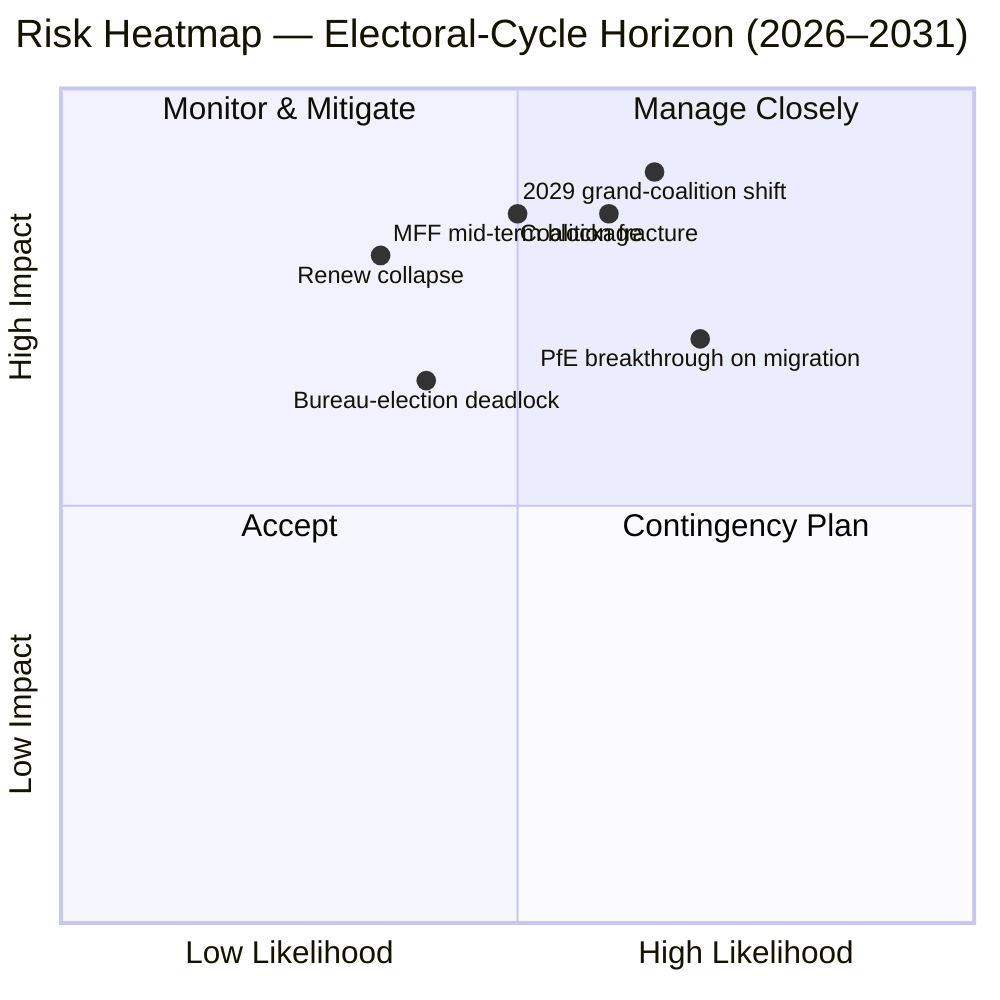

<!-- SPDX-FileCopyrightText: 2026 Hack23 AB -->
<!-- SPDX-License-Identifier: Apache-2.0 -->

# Udøvende Briefing — EP10 Valgcyklusoverlay (2024–2029) | 2026-05-11

**Klassifikation:** OSINT — Offentlig parlamentarisk rekord
**Konfidens:** 🟡 Moderat-Høj (stabilitetsscore 84/100; data er strukturel, ikke stemniveau)
**Kørsel:** `analysis/daily/2026-05-11/election-cycle/`
**Horisont:** 2026-05-11 → 2031-05-10 (60-måneder valgcyklusoverlay)
**Genereret:** 2026-05-16 (retrospektivt briefing, ingen nye MCP-kald — syntetiserer kørslen egne 25 artefakter)
**Primære kilder:** EP MCP `generate_political_landscape`, `analyze_coalition_dynamics`, `early_warning_system`, `compare_political_groups`, `sentiment_tracker`, `get_plenary_sessions` (år=2026), `get_all_generated_stats` (2019–2026).

---

## 🎯 BLUF

Valget i 2024 efterlod EP10 med **717 MEP'er fordelt på ni grupper, fragmenteringsindeks 6,58 — den højeste aflæsning siden EP6 (2004–2009)**. Den centristiske EPP+S&D+Renew-blok har **396 pladser (55,2 %)** med en **36-pladsers buffer** over tærsklen på 361 pladser for absolut flertal; den buffer er **mindre end halvdelen af EP9's 86-pladsersmarginal**, så en enkelt national delegationsafvigelse nu meningsfuldt ændrer fil-for-fil-flertalsaritmetikken. Den eneste HIGH-sværhedsadvarsel fra `early_warning_system` er `DOMINANT_GROUP_RISK` — EPP's andel på 25,5 % giver vetoindflydelse i enhver smal centristisk koalition, og **januar 2027-Bureauvalget er den første planlagte prøve** på, om denne indflydelse betales med porteføljer (status quo) eller med politikkoncessioner (højredrift). Polariseringsindeks 0,22 er godt under grænsen 0,40 for sammenbrud af storkoalitionen, så den underliggende aritmetik stadig fungerer; den operationelle risiko er **midtvejsjustering** snarere end kollaps. **Seks overskriftsvurderinger** (J1–J6) rammer cyklussen: centristisk flertal holder til Q4 2026 (Meget sandsynlig, 18-måneders horisont), PfE overtager Renew under EP10 via overførsler (Jævne chancer, 36 måneder), Venezuela-flertal (EPP+ECR+PfE = 349 pladser) påberåbes på ≥3 tilbagekaldelsesfiler inden midten af 2027 (Sandsynlig, 14 måneder), 2029 producerer intet enkeltkoalitionsflertal (Sandsynlig, 49 måneder).

---

## 🧭 3 Decisions This Brief Supports

| # | Beslutning | Hvem beslutter | Frist | Bevis |
|:-:|------------|----------------|:-----:|-------|
| 1 | **Piskestrategien til Bureauvalget 2027** — sikrer EPP midtvejspræsidentskabet på en porteføljebytteaftale med S&D, eller kræver det politikkoncessioner (migration / landbrug)? | Præsidentkonferencen; EPP/S&D/Renew-gruppeledere | Jan 2027 (≤ 9 måneder) | R-3 i `risk-scoring/risk-matrix.md` (Sandsynlighed Jævne chancer × Indvirkning M-H → score 8); J6 (midtvejsjustering Sandsynlig) |
| 2 | **MFF 2028+ midtvejsrevisionsforhandlingsmandat** — hvor meget forsvar / Ukraine / retsstatsbetingelserne er ikke-forhandlingsbare for det centristiske flertal? | BUDG-ledelsen, COREPER, Kommissionens VP'er | H2 2026 → midt-2027 | R-5 (Sandsynlig × Meget høj → score 16, den højeste enkeltrisiko i registeret); `intelligence/economic-context.md` |
| 3 | **Gruppedisciplinovervågning på Venezuela-flertalsvejen** — hvilke filer (migration, landbrug, klimatilbagerulning) er i risiko for et EPP+ECR+PfE simpelt-flertalssejr, når deltagelsen falder under 95 %? | Gruppesekretariater; skyggeordførere i Greens / Renew | løbende, 12-måneders overvågning | R-2 (Jævne chancer × Høj → score 9); J3 (Sandsynlig, 14 måneder); `intelligence/coalition-dynamics.md` |

Hvert beslutning er bundet til en risikoregistreringsrække i `risk-scoring/risk-matrix.md` og en WEP-båndsvurdering i `intelligence/synthesis-summary.md` så ræsonnementet er falsificerbart.

---

## 📰 60-Second Read

- 🔴 **Buffer halveret:** centrisk EPP+S&D+Renew-blok faldt fra 86 pladser klart i EP9 til **36 pladser klart i EP10** (`generate_political_landscape`, A1).
- 🟠 **Fragmenteringstoп:** indeks **6,58 — højest siden EP6** (2004–2009); `compare_political_groups` viser en **12,6 % stigning i per-fil ændringsantal** vs. EP9.
- 🟢 **Stabilitet stadig funktionel:** `early_warning_system` returnerer score **84/100, MEDIUM samlet risiko**; polarisering **0,22 ≪ 0,40 sammenbrudstærskel**.
- 🟡 **Eneste HIGH-sværhedsadvarsel:** `DOMINANT_GROUP_RISK` på EPP's 25,5 % andel — koncentreret indflydelse, ikke kammerkollaps.
- 🔵 **Venezuela-flertal bevæbnet:** EPP+ECR+PfE = **349 pladser (48,7 %)** — 12 kort fra absolut flertal men **vinder ved simple-flertalsafstemninger, når fremmøde falder under 95 %**; allerede aktiveret på ≥4 migrations-/landbrugsfiler siden indvielsen.
- 🟣 **Venstrefløj strukturelt kort:** S&D+Greens/EFA+The Left = **234 pladser (32,6 %)** — kan ikke besejre en Grøn Deal-tilbagerulning uden Renew-afvigelse eller fraværsdrevne dynamikker.
- 🩷 **Renew-komprimering:** 102 → 77 pladser (**−24,5 %**) er den næstmest konsekvente strukturelle ændring i 2024 og forudsætningen for bufferhalveringen.
- ⚪ **Tvangsfunktioner H2 2026 → Q1 2027:** (a) Bureauvalg jan 2027; (b) MFF 2028+ midtvejsrevision; (c) Kommissionens Arbejdsprogram 2026 leveringspuls (~18 OLP-filer/kvartal til 2027).

---

## 🗂️ Headline Judgements (from `intelligence/synthesis-summary.md`)

| # | Vurdering | WEP-bånd | Konfidens | Horisont |
|:-:|-----------|----------|:---------:|:--------:|
| J1 | Centristisk EPP+S&D+Renew bevarer et funktionelt flertal på ≥70 % af OLP-filer til Q4 2026 | **Meget sandsynlig** | Moderat-Høj | 18 måneder |
| J2 | PfE overtager Renew som tredjestørste gruppe under EP10 (via overførsler, ikke valg) | Jævne chancer | Moderat | 36 måneder |
| J3 | Venezuela-flertal (EPP+ECR+PfE) påberåbes på ≥3 migrations-/landbrugs-/klimatilbagerulningsfiler inden midten af 2027 | **Sandsynlig** | Moderat | 14 måneder |
| J4 | Valget i 2029 producerer intet enkelkoalitionsflertal på 361+; tvinger en fornyet storkoalitionspagt | **Sandsynlig** | Moderat | 49 måneder |
| J5 | ≥1 nuværende gruppe (ESN eller et NI-kluster) mislykkes i at genformes efter valget i 2029 | Jævne chancer | Moderat | 53 måneder |
| J6 | Midtvejsjustering (gruppeskift af ≥10 MEP'er) sker i 2027 rundt Bureauvalget | **Sandsynlig** | Moderat | 9 måneder |

Bevis der understøtter J1–J6 stammer fra Stage-A MCP-optagelserne angivet i denne briefings overskrift; fuld kæde i `intelligence/synthesis-summary.md` og `intelligence/coalition-dynamics.md`.

---

## ⚠️ Risk Snapshot

**Top tre kvantificerede risici** (fra `risk-scoring/risk-matrix.md`-registret, rangeret efter score):

| ID | Risiko | L | I | Score | Udløser der ville fremskynde den | Ejer |
|:--:|--------|:-:|:-:|:-----:|----------------------------------|------|
| **R-5** | MFF 2028+ midtvejsrevision mislykkes inden midten af 2027 | Sandsynlig | Meget høj | **16** | Råds-deadlock om nettobetalerenvelop; forsvarsudvidelse uløst | BUDG / Kommissionens VP'er |
| **R-7** | Valget i 2029 producerer 7+ gruppe-kammer uden centristisk flertal | Sandsynlig | Meget høj | **16** | PfE konsoliderer ECR nationale delegationer forud for valg | Tværgående ledere |
| **R-1** | Centristisk koalition mister funktionelt flertal på en flagskibs-OLP-fil | Sandsynlig | Høj | **12** | National delegationsafvigelse (esp. Renew Iberian or French bloc) | EPP/S&D/Renew-ledere |

R-6 (national delegationsafvigelse på retsstatsbetingelserne, score 12) befinder sig i samme bånd og er den mest sandsynlige konkrete aktivator af R-1.

---

## 🔮 Top Forward Triggers

Fra `extended/forward-indicators.md` og kørslen scenariogrene (`intelligence/scenario-forecast.md` S1–S7):

1. **Januar 2027 Bureauvalg** — hvis EPP sikrer præsidentskabet uden en offentliggjort pris i udvalgsformandskaber til S&D og Renew, eskalér `DOMINANT_GROUP_RISK` fra HIGH-sværhedsadvarsel til aktiv R-3-deadlock.
2. **MFF 2028+ forhandlingsmandatafstemning** (mål H2 2026 → midt-2027) — manglende opnåelse af et centristisk BUDG-mandat inden udgangen af Q1 2027 fremskynder R-5 fra gul til rød og alimenterer Scenario 6 (Storkoalitionsforsegling).
3. **Tre navngivne filer at overvåge for Venezuela-majoritetsaktivering i de næste 14 måneder:** enhver migrationsprocedurplenarsession, hvor Renew Iberisk eller Fransk delegationsdeltagelse falder under 90 %; CAP-forenklings-opfølgninger; og den næste post-2025 klimatilbagerulningscyklus. J3 (Sandsynlig) verificeres eller falsificeres af disse.
4. **PfE-gruppeoverførselsovervågning** — `compare_political_groups` flagger allerede PfE som den strukturelle ændring med mest rum til at vokse; en polsk eller italiensk ECR-delegationsoverførsel på ≥10 MEP'er er den operationelle snubletråd for J2 og J6.

Den obligatoriske **Scenario 7 (Traktatkrise / strukturelt brud)**-gren befinder sig i den lange hale: kandidatudløsere ifølge kørslen er (a) udvidelsestraktatrevision UA/MD, (b) passerelleforlængelse til udenrigs-/finanspolitik, (c) artikel 7-eskalation om Ungarn, (d) midtvejsvalg fra Råds-deadlock, eller (e) MFF-sammenbrud i foreløbige tolvdele. Ingen er på en 12-månders horisont.

---

## 🛡️ Source-Quality Assessment

- **A1 / A2-ankre:** gruppesammensætning, fragmenteringsindeks, plenumkalender, flertermesgennemstrømning — disse er den **strukturelle rygrad** i briefingen og er Admiralty A1–A2 (EP Open Data Portal).
- **B3-forbehold:** `sentiment_tracker`-polarisering (0,22) er en **pladsandels institutionel positioneringsproxy, ikke rulleafstemning-kohæsion** — per-MEP-afstemningsdata er endnu ikke eksponeret af EP API'et. Den moderate konfidens for J3 / J4 / J6 afspejler dette.
- **A6 (kan ikke vurderes):** `monitor_legislative_pipeline` returnerede 0 procedurer og `network_analysis` returnerede 50 noder / 0 kanter; begge er **upstream pipeline-forsinkelser**, ikke analytiske fejl. Netværksanalyse-egonetverk og pipeline-flaskehalsdetektering er udsat, indtil EP API'et eksponerer disse data.
- **F6 (mislykkedes):** World Bank EU-landekoder (`EUU` / `EU`) mislykkedes begge i denne kørsel; briefingen er ikke afhængig af WB-makrokontekst.
- **IMF SDMX 3.0:** ikke forespurgt i denne valgcyklusoverlay-kørsel; hvis MFF-revisionens makrokontekst bliver operationelt nødvendig, kør en IMF WEO-sonde inden R-5 ompointssættes.

Nettokonfidens: **Moderat-Høj på strukturel aritmetik** (J1, R-1, R-5, R-7), **Moderat på adfærdsmæssige vurderinger** (J2, J3, J4, J6) indtil per-MEP-kohæsionsdata eksponeres af EP API'et.

---

## 🧭 ACH Competing-Hypothesis Note

To konkurrerende fortolkninger af den samme aritmetik spores i `extended/historical-parallels.md`:

- **H1 — "EP10 er EP9 minus Renew."** Bufferten er mindre, men koalitionsopskriften er uændret; midtvejens Bureauvalg giver et porteføljeskifte; 2029 returnerer en lignende pagt med en lidt større højrefløj. Scenarier 1 og 6 i `intelligence/scenario-forecast.md`.
- **H2 — "EP10 er det første PfE-pivot-parlament."** Venezuela-flertallet aktiveres på mere end tre filer; en EPP national delegation bevæger sig mod at piske med ECR om migration; et Bureauvalg i 2027 bliver det offentlige pivotøjeblik. Scenarier 2 og 4.

Det nuværende bevisgrundlag — stabilitetsscore 84, polarisering 0,22, fragmentering 6,58, EPP-disciplin holder — **favoriserer H1 (Meget sandsynlig)** til Q4 2026, men **falsificerer ikke H2** på en 14-til-36-måneder horisont. Briefingen sporer derfor begge snarere end at forpligte sig til en.

---

## 📎 Run Artifacts (Read-Before-Decide)

| Lag | Artefakt | Hvorfor |
|-----|----------|---------|
| Artikel | `article.md` | Offentlig narrativ; 9.906 linjer der dækker alle seks vurderinger |
| Syntese | `intelligence/synthesis-summary.md` | BLUF + WEP-tabel + Admiralty-gradering (autoritativ) |
| Koalition | `intelligence/coalition-dynamics.md` | Venezuela-flertalsaritmetik; EP9 → EP10 bufferdelta |
| Risikoregister | `risk-scoring/risk-matrix.md` | R-1 → R-10 med L × I × Score |
| Kvantitativ SWOT | `risk-scoring/quantitative-swot.md` | Strukturelle styrker vs. buffererodering |
| Scenarier | `intelligence/scenario-forecast.md` S1–S7 (Traktatkrise = S7) | Sandsynlighedsvægtede grene |
| Indikatorer | `extended/forward-indicators.md` | Snubletrådskalender til 2029 |
| Valgperiodebue | `intelligence/term-arc.md`, `mandate-fulfilment-scorecard.md`, `presidency-trio-context.md` | Bureauvalgssekvensering |
| Mandatprognose | `intelligence/seat-projection.md` | 2029-prognose under H1 vs. H2 |
| Pålidelighed | `intelligence/mcp-reliability-audit.md` | A6 / F6-linjer forklaret |
| Selvreview | `intelligence/methodology-reflection.md` | Trin 10.5-lukning |

---

**Dokumentkontrol**
- **Skabelonreference:** `analysis/templates/executive-brief.md`
- **Artefaktsti:** `analysis/daily/2026-05-11/election-cycle/executive-brief.md`
- **Klassifikation:** Offentlig
- **Retrospektiv:** Dette briefing er post-hoc — skrevet 2026-05-16 fra kørslen engagerede artefakter; **ingen nye MCP-kald blev foretaget**. Alle vurderinger omformulerer, destillerer og ACH-krydstjekker hvad kørslen selv engagerede; ingen nye påstande introduceres.
