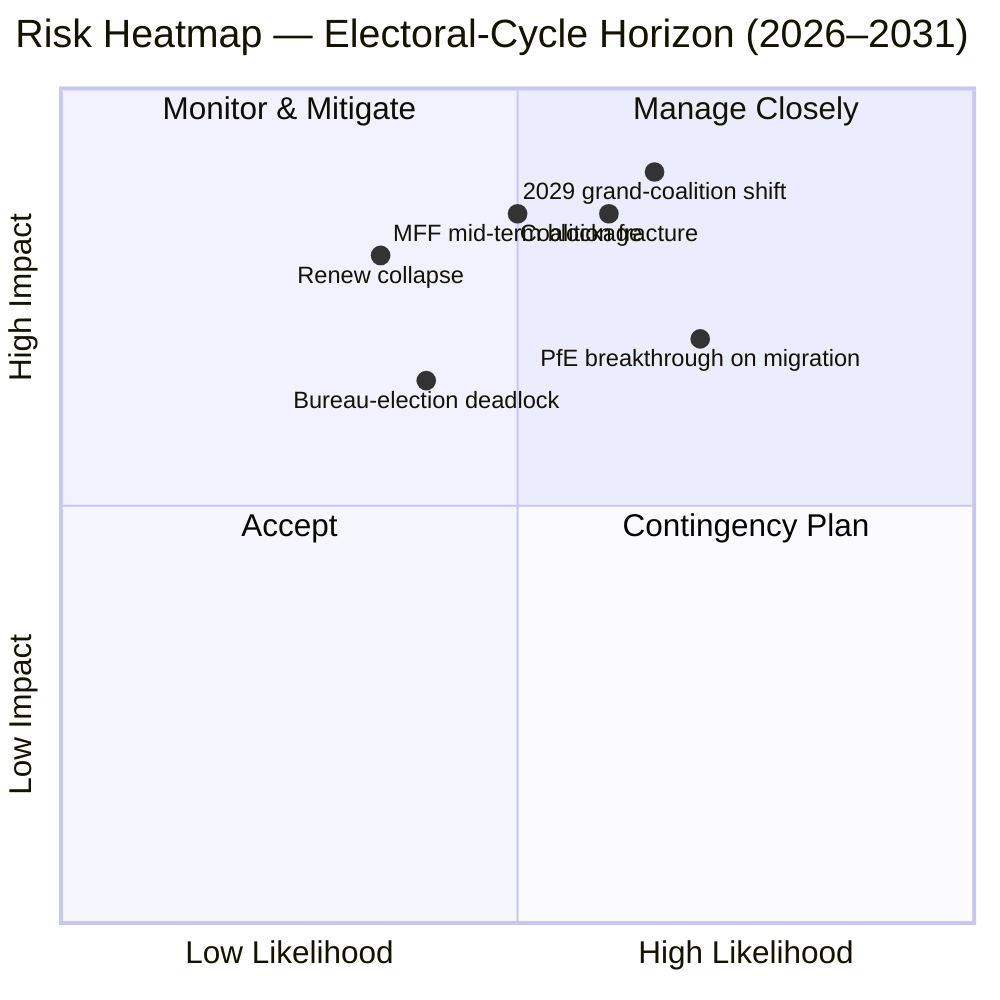

<!-- SPDX-FileCopyrightText: 2026 Hack23 AB -->
<!-- SPDX-License-Identifier: Apache-2.0 -->

# Exekutivbericht — EP10 Wahlzyklus-Overlay (2024–2029) | 2026-05-11

**Einstufung:** OSINT — Öffentlicher parlamentarischer Rekord
**Konfidenz:** 🟡 Moderat-Hoch (Stabilitätswert 84/100; Daten sind strukturell, nicht auf Abstimmungsebene)
**Durchlauf:** `analysis/daily/2026-05-11/election-cycle/`
**Horizont:** 2026-05-11 → 2031-05-10 (60-monatiges Wahlzyklus-Overlay)
**Erstellt:** 2026-05-16 (retrospektiver Bericht, keine neuen MCP-Aufrufe — synthetisiert die eigenen 25 Artefakte des Durchlaufs)
**Primärquellen:** EP MCP `generate_political_landscape`, `analyze_coalition_dynamics`, `early_warning_system`, `compare_political_groups`, `sentiment_tracker`, `get_plenary_sessions` (Jahr=2026), `get_all_generated_stats` (2019–2026).

---

## 🎯 BLUF

Die Wahl 2024 hinterließ EP10 mit **717 Abgeordneten in neun Fraktionen, Fragmentierungsindex 6,58 — der höchste Wert seit EP6 (2004–2009)**. Der zentristische EPP+S&D+Renew-Block hält **396 Sitze (55,2 %)** mit einem **36-Sitze-Puffer** über der absoluten Mehrheitsschwelle von 361 Sitzen; dieser Puffer ist **weniger als die Hälfte von EP9s 86-Sitze-Margin**, sodass eine einzige nationale Delegationsabweichung die Mehrheitsarithmetik Datei für Datei nun bedeutsam verändert. Die einzige HIGH-Schwerewarnung von `early_warning_system` ist `DOMINANT_GROUP_RISK` — EPPs Anteil von 25,5 % verleiht Veto-Einfluss in jeder schmalen zentristischen Koalition, und die **Bürowahl Januar 2027 ist der erste geplante Test**, ob dieser Einfluss in Portfolios (Status quo) oder in politische Zugeständnisse (Rechtsdrift) umgemünzt wird. Polarisierungsindex 0,22 liegt gut unter der 0,40 Zusammenbruchschwelle der Großkoalition, sodass die zugrundeliegende Arithmetik noch funktioniert; das operationelle Risiko ist **Zwischenphasen-Neuausrichtung** und kein Zusammenbruch. **Sechs Leitbeurteilungen** (J1–J6) bestimmen den Zyklus: Zentristische Mehrheit hält bis Q4 2026 (Sehr wahrscheinlich, 18-Monats-Horizont), PfE überholt Renew während EP10 durch Übertritte (Gleiche Chancen, 36 Monate), Venezuela-Mehrheit (EPP+ECR+PfE = 349 Sitze) wird bei ≥3 Rücknahme-Dateien vor Mitte 2027 in Anspruch genommen (Wahrscheinlich, 14 Monate), 2029 bringt keine Einzelkoalitions-Mehrheit (Wahrscheinlich, 49 Monate).

---

## 🧭 3 Decisions This Brief Supports

| # | Entscheidung | Wer entscheidet | Frist | Beleg |
|:-:|--------------|-----------------|:-----:|-------|
| 1 | **Fraktionsdisziplin-Strategie für die Bürowahl 2027** — sichert die EPP die Zwischenphasenpräsidentschaft durch einen Portfolio-Tausch mit S&D, oder verlangt sie politische Zugeständnisse (Migration / Landwirtschaft)? | Konferenz der Präsidenten; EPP/S&D/Renew-Fraktionsvorsitzende | Jan 2027 (≤ 9 Monate) | R-3 in `risk-scoring/risk-matrix.md` (Wahrscheinlichkeit Gleiche Chancen × Auswirkung M-H → Wert 8); J6 (Zwischenphasen-Neuausrichtung Wahrscheinlich) |
| 2 | **MFF 2028+ Zwischenphasenüberprüfungs-Verhandlungsmandat** — wie viel Verteidigung / Ukraine / Rechtsstaatlichkeitskonditionalität ist für die zentristische Mehrheit nicht verhandelbar? | BUDG-Leitung, COREPER, Kommissions-VPs | H2 2026 → Mitte 2027 | R-5 (Wahrscheinlich × Sehr hoch → Wert 16, das höchste Einzelrisiko im Register); `intelligence/economic-context.md` |
| 3 | **Fraktionsdisziplin-Überwachung auf dem Venezuela-Mehrheitspfad** — welche Dateien (Migration, Landwirtschaft, Klimarücknahme) riskieren einen EPP+ECR+PfE Einfachmehrheitssieg, wenn die Beteiligung unter 95 % fällt? | Fraktionssekretariate; Schattenberichterstatter in Greens / Renew | laufend, 12-monatige Überwachung | R-2 (Gleiche Chancen × Hoch → Wert 9); J3 (Wahrscheinlich, 14 Monate); `intelligence/coalition-dynamics.md` |

Jede Entscheidung ist an eine Risikoregistrierungszeile in `risk-scoring/risk-matrix.md` und eine WEP-Bandbeurteilung in `intelligence/synthesis-summary.md` gebunden, sodass die Begründung falsifizierbar ist.

---

## 📰 60-Second Read

- 🔴 **Puffer halbiert:** Zentristischer EPP+S&D+Renew-Block sank von 86 Sitzen Vorsprung in EP9 auf **36 Sitze Vorsprung in EP10** (`generate_political_landscape`, A1).
- 🟠 **Fragmentierungsgipfel:** Index **6,58 — höchster seit EP6** (2004–2009); `compare_political_groups` zeigt einen **12,6 % Anstieg bei Änderungsantragsanzahl pro Datei** vs. EP9.
- 🟢 **Stabilität noch funktional:** `early_warning_system` gibt Wert **84/100, MEDIUM Gesamtrisiko** zurück; Polarisierung **0,22 ≪ 0,40 Zusammenbruchschwelle**.
- 🟡 **Einzige HIGH-Schwerewarnung:** `DOMINANT_GROUP_RISK` bei EPPs 25,5 % Anteil — konzentrierter Einfluss, kein Parlamentszusammenbruch.
- 🔵 **Venezuela-Mehrheit bewaffnet:** EPP+ECR+PfE = **349 Sitze (48,7 %)** — 12 Sitze kurz vor absoluter Mehrheit aber **gewinnt bei Einfachmehrheitsabstimmungen, wenn Anwesenheit unter 95 % fällt**; bereits bei ≥4 Migrations-/Landwirtschaftsdateien seit der Konstituierung aktiviert.
- 🟣 **Linker Flügel strukturell schwach:** S&D+Greens/EFA+The Left = **234 Sitze (32,6 %)** — kann eine Grüner-Deal-Rücknahme ohne Renew-Abweichung oder abwesenheitsgetriebene Dynamiken nicht verhindern.
- 🩷 **Renew-Kompression:** 102 → 77 Sitze (**−24,5 %**) ist die zweitfolgenreichste strukturelle Veränderung von 2024 und Voraussetzung für die Pufferhalbierung.
- ⚪ **Zwangsfunktionen H2 2026 → Q1 2027:** (a) Bürowahl Jan 2027; (b) MFF 2028+ Zwischenphasenüberprüfung; (c) Kommissions-Arbeitsprogramm 2026 Lieferpuls (~18 OLP-Dateien/Quartal bis 2027).

---

## 🗂️ Headline Judgements (from `intelligence/synthesis-summary.md`)

| # | Beurteilung | WEP-Band | Konfidenz | Horizont |
|:-:|-------------|----------|:---------:|:--------:|
| J1 | Zentristische EPP+S&D+Renew behält eine arbeitsfähige Mehrheit bei ≥70 % der OLP-Dateien bis Q4 2026 | **Sehr wahrscheinlich** | Moderat-Hoch | 18 Monate |
| J2 | PfE überholt Renew als drittgrößte Fraktion während EP10 (durch Übertritte, nicht Wahlen) | Gleiche Chancen | Moderat | 36 Monate |
| J3 | Venezuela-Mehrheit (EPP+ECR+PfE) wird bei ≥3 Migrations-/Landwirtschafts-/Klimarücknahme-Dateien vor Mitte 2027 in Anspruch genommen | **Wahrscheinlich** | Moderat | 14 Monate |
| J4 | Wahl 2029 bringt keine Einzelkoalitions-Mehrheit von 361+; erzwingt einen erneuerten Großkoalitionspakt | **Wahrscheinlich** | Moderat | 49 Monate |
| J5 | ≥1 aktuelle Fraktion (ESN oder ein NI-Cluster) scheitert an der Neuformierung nach der Wahl 2029 | Gleiche Chancen | Moderat | 53 Monate |
| J6 | Zwischenphasen-Neuausrichtung (Fraktionswechsel von ≥10 Abgeordneten) erfolgt 2027 rund um die Bürowahl | **Wahrscheinlich** | Moderat | 9 Monate |

Die J1–J6 unterstützenden Belege stammen aus den Stage-A MCP-Erfassungen im Header dieses Berichts; vollständige Kette in `intelligence/synthesis-summary.md` und `intelligence/coalition-dynamics.md`.

---

## ⚠️ Risk Snapshot

**Top drei quantifizierte Risiken** (aus dem `risk-scoring/risk-matrix.md`-Register, nach Wert geordnet):

| ID | Risiko | L | I | Wert | Auslöser, der es vorantreiben würde | Verantwortlicher |
|:--:|--------|:-:|:-:|:----:|-------------------------------------|------------------|
| **R-5** | MFF 2028+ Zwischenphasenüberprüfung scheitert bis Mitte 2027 | Wahrscheinlich | Sehr hoch | **16** | Ratsdeadlock über Nettozahler-Envelope; Verteidigungsaufstockung ungelöst | BUDG / Kommissions-VPs |
| **R-7** | Wahl 2029 bringt 7+-Fraktions-Parlament ohne zentristische Mehrheit | Wahrscheinlich | Sehr hoch | **16** | PfE konsolidiert ECR-Nationaldelegationen vor der Wahl | Fraktionsübergreifende Führungspersonen |
| **R-1** | Zentrische Koalition verliert arbeitsfähige Mehrheit bei einer Flaggschiff-OLP-Datei | Wahrscheinlich | Hoch | **12** | Nationaldelegationsabweichung (esp. Renew Iberian or French bloc) | EPP/S&D/Renew-Führungspersonen |

R-6 (Nationaldelegationsabweichung bei Rechtsstaatlichkeitskonditionalität, Wert 12) befindet sich im selben Band und ist der wahrscheinlichste konkrete Aktivator von R-1.

---

## 🔮 Top Forward Triggers

Aus `extended/forward-indicators.md` und den Szenariozweigen des Durchlaufs (`intelligence/scenario-forecast.md` S1–S7):

1. **Bürowahl Januar 2027** — wenn die EPP die Präsidentschaft ohne einen veröffentlichten Preis in Ausschussvorsitzen für S&D und Renew sichert, `DOMINANT_GROUP_RISK` von HIGH-Schwerewarnung zu aktivem R-3-Deadlock eskalieren.
2. **MFF 2028+ Verhandlungsmandat-Abstimmung** (Ziel H2 2026 → Mitte 2027) — Versäumnis, bis Ende Q1 2027 ein zentristisches BUDG-Mandat zu erreichen, rückt R-5 von Gelb zu Rot vor und speist Szenario 6 (Großkoalitions-Neuversiegelung).
3. **Drei benannte Dateien zur Beobachtung auf Venezuela-Mehrheitsaktivierung in den nächsten 14 Monaten:** jedes Migrationsverfahrens-Plenum, bei dem die Renew Iberischen oder Französischen Delegationsteilnahme unter 90 % fällt; GAP-Vereinfachungs-Folgemaßnahmen; und der nächste Post-2025 Klimarücknahmezyklus. J3 (Wahrscheinlich) wird durch diese verifiziert oder falsifiziert.
4. **PfE-Fraktionsübertrittüberwachung** — `compare_political_groups` kennzeichnet PfE bereits als die strukturelle Veränderung mit dem meisten Wachstumsraum; ein polnischer oder italienischer ECR-Delegationsübertritt von ≥10 Abgeordneten ist der operationelle Auslösedraht für J2 und J6.

Der obligatorische **Szenario 7 (Vertragskrise / struktureller Bruch)**-Zweig befindet sich im langen Schwanz: Kandidatenauslöser laut Durchlauf sind (a) Erweiterungsvertragsrevision UA/MD, (b) Passerelle-Erweiterung auf Außen-/Finanzpolitik, (c) Artikel-7-Eskalation zu Ungarn, (d) Zwischenphasenwahl aus Ratsdeadlock, oder (e) MFF-Zusammenbruch in vorläufige Zwölftel. Keiner liegt auf einem 12-Monats-Horizont.

---

## 🛡️ Source-Quality Assessment

- **A1 / A2-Anker:** Fraktionszusammensetzung, Fragmentierungsindex, Plenarkalender, Mehrterm-Durchsatz — diese sind das **strukturelle Rückgrat** des Berichts und sind Admiralty A1–A2 (EP Open Data Portal).
- **B3-Vorbehalt:** `sentiment_tracker`-Polarisierung (0,22) ist ein **Sitzanteil-institutioneller Positionierungsstellvertreter, keine namentliche Abstimmungs-Kohäsion** — Abstimmungsdaten pro Abgeordneter werden vom EP-API noch nicht offengelegt. Die Moderate Konfidenz für J3 / J4 / J6 spiegelt dies wider.
- **A6 (nicht beurteilbar):** `monitor_legislative_pipeline` gab 0 Verfahren zurück und `network_analysis` gab 50 Knoten / 0 Kanten zurück; beides sind **Upstream-Pipeline-Verzögerungen**, keine analytischen Fehler. Netzwerkanalyse-Ego-Graphen und Pipeline-Engpass-Erkennung werden verschoben, bis das EP-API diese Daten offenlegt.
- **F6 (gescheitert):** World Bank EU-Ländercodes (`EUU` / `EU`) scheiterten beide in diesem Durchlauf; der Bericht stützt sich nicht auf WB-Makrokontext.
- **IMF SDMX 3.0:** nicht abgefragt in dieser Wahlzyklus-Overlay-Ausführung; wenn MFF-Überprüfungs-Makrokontext operationell notwendig wird, eine IMF WEO-Sonde vor einer Neubewertung von R-5 durchführen.

Netto-Konfidenz: **Moderat-Hoch bei struktureller Arithmetik** (J1, R-1, R-5, R-7), **Moderat bei Verhaltensbeurteilungen** (J2, J3, J4, J6) bis per-Abgeordneter-Kohäsionsdaten vom EP-API offengelegt werden.

---

## 🧭 ACH Competing-Hypothesis Note

Zwei konkurrierende Lesarten derselben Arithmetik werden in `extended/historical-parallels.md` verfolgt:

- **H1 — "EP10 ist EP9 minus Renew."** Der Puffer ist kleiner, aber die Koalitionsformel ist unverändert; die Zwischenphasen-Bürowahl ergibt einen Portfolio-Tausch; 2029 bringt einen ähnlichen Pakt mit einem etwas größeren rechten Flügel. Szenarien 1 und 6 in `intelligence/scenario-forecast.md`.
- **H2 — "EP10 ist das erste PfE-Pivot-Parlament."** Die Venezuela-Mehrheit aktiviert bei mehr als drei Dateien; eine EPP-Nationaldelegation bewegt sich dazu, bei der Migration mit ECR zu peitschen; eine Bürowahl 2027 wird zum öffentlichen Pivot-Moment. Szenarien 2 und 4.

Die aktuelle Beweislage — Stabilitätswert 84, Polarisierung 0,22, Fragmentierung 6,58, EPP-Disziplin haltend — **bevorzugt H1 (Sehr wahrscheinlich)** bis Q4 2026, **falsifiziert H2** auf einem 14-bis-36-Monats-Horizont jedoch nicht. Der Bericht verfolgt daher beide, anstatt sich auf eine festzulegen.

---

## 📎 Run Artifacts (Read-Before-Decide)

| Schicht | Artefakt | Warum |
|---------|----------|-------|
| Artikel | `article.md` | Öffentliche Erzählung; 9.906 Zeilen, die alle sechs Beurteilungen abdecken |
| Synthese | `intelligence/synthesis-summary.md` | BLUF + WEP-Tabelle + Admiralty-Bewertung (autoritativ) |
| Koalition | `intelligence/coalition-dynamics.md` | Venezuela-Mehrheitsarithmetik; EP9 → EP10 Puffer-Delta |
| Risikoregister | `risk-scoring/risk-matrix.md` | R-1 → R-10 mit L × I × Wert |
| Quantitatives SWOT | `risk-scoring/quantitative-swot.md` | Strukturelle Stärken vs. Puffererosion |
| Szenarien | `intelligence/scenario-forecast.md` S1–S7 (Vertragskrise = S7) | Wahrscheinlichkeitsgewichtete Zweige |
| Indikatoren | `extended/forward-indicators.md` | Auslösedrahtkalender bis 2029 |
| Legislaturbogen | `intelligence/term-arc.md`, `mandate-fulfilment-scorecard.md`, `presidency-trio-context.md` | Bürowahlsequenzierung |
| Sitzprognose | `intelligence/seat-projection.md` | Prognose 2029 unter H1 vs. H2 |
| Zuverlässigkeit | `intelligence/mcp-reliability-audit.md` | A6 / F6-Zeilen erklärt |
| Selbstprüfung | `intelligence/methodology-reflection.md` | Schritt 10.5-Abschluss |

---

**Dokumentkontrolle**
- **Vorlagenreferenz:** `analysis/templates/executive-brief.md`
- **Artefaktpfad:** `analysis/daily/2026-05-11/election-cycle/executive-brief.md`
- **Einstufung:** Öffentlich
- **Retrospektiv:** Dieser Bericht ist ex post — verfasst am 2026-05-16 aus den engagierten Artefakten des Durchlaufs; **es wurden keine neuen MCP-Aufrufe gemacht**. Alle Beurteilungen formulieren um, destillieren und ACH-kreuzkontrollieren, was der Durchlauf selbst engagierte; es werden keine neuen Behauptungen eingeführt.
