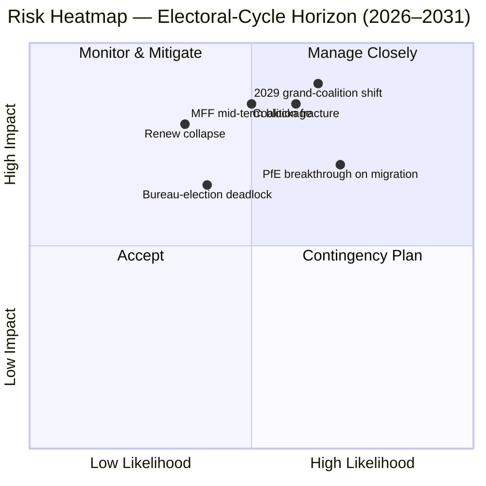

<!-- SPDX-FileCopyrightText: 2026 Hack23 AB -->
<!-- SPDX-License-Identifier: Apache-2.0 -->

# Informe Ejecutivo — EP10 Superposición del Ciclo Electoral (2024–2029) | 2026-05-11

**Clasificación:** OSINT — Registro parlamentario público
**Confianza:** 🟡 Moderada-Alta (puntuación de estabilidad 84/100; datos estructurales, no a nivel de votación)
**Ejecución:** `analysis/daily/2026-05-11/election-cycle/`
**Horizonte:** 2026-05-11 → 2031-05-10 (superposición del ciclo electoral de 60 meses)
**Generado:** 2026-05-16 (informe retrospectivo, sin nuevas llamadas MCP — sintetiza los 25 propios artefactos de la ejecución)
**Fuentes primarias:** EP MCP `generate_political_landscape`, `analyze_coalition_dynamics`, `early_warning_system`, `compare_political_groups`, `sentiment_tracker`, `get_plenary_sessions` (año=2026), `get_all_generated_stats` (2019–2026).

---

## 🎯 BLUF

Las elecciones de 2024 dejaron EP10 con **717 eurodiputados distribuidos en nueve grupos, índice de fragmentación 6,58 — la lectura más alta desde EP6 (2004–2009)**. El bloque centrista PPE+S&D+Renew mantiene **396 escaños (55,2 %)** con un **margen de 36 escaños** sobre el umbral de 361 escaños para la mayoría absoluta; ese margen es **menos de la mitad del margen de 86 escaños de EP9**, por lo que una única desviación de delegación nacional ahora modifica significativamente la aritmética de mayorías expediente por expediente. La única alerta de gravedad HIGH de `early_warning_system` es `DOMINANT_GROUP_RISK` — la cuota del 25,5 % del PPE le otorga palanca de veto en cualquier coalición centrista estrecha, y **la elección de la Mesa de enero de 2027 es la primera prueba programada** de si esa palanca se paga en carteras (statu quo) o en concesiones políticas (deriva hacia la derecha). El índice de polarización 0,22 está muy por debajo del umbral de ruptura 0,40 para la gran coalición, por lo que la aritmética subyacente sigue funcionando; el riesgo operacional es **realineamiento a medio plazo** y no colapso. **Seis juicios de titular** (J1–J6) enmarcan el ciclo: la mayoría centrista se mantiene hasta el Q4 2026 (Muy probable, horizonte de 18 meses), PfE supera a Renew durante EP10 por traspasos (Probabilidad igual, 36 meses), la mayoría Venezuela (PPE+ECR+PfE = 349 escaños) se invoca en ≥3 expedientes de reversión antes de mediados de 2027 (Probable, 14 meses), 2029 no produce ninguna mayoría de coalición única (Probable, 49 meses).

---

## 🧭 3 Decisions This Brief Supports

| # | Decisión | Quién decide | Plazo | Pruebas |
|:-:|----------|--------------|:-----:|---------|
| 1 | **Estrategia de disciplina para la elección de la Mesa 2027** — ¿el PPE asegura la presidencia a medio plazo mediante un intercambio de carteras con el S&D, o exige concesiones políticas (migración / agricultura)? | Conferencia de Presidentes; líderes de grupo PPE/S&D/Renew | Ene. 2027 (≤ 9 meses) | R-3 en `risk-scoring/risk-matrix.md` (Probabilidad Igual × Impacto M-A → puntuación 8); J6 (realineamiento a medio plazo Probable) |
| 2 | **Mandato de negociación para la revisión intermedia del MFP 2028+** — ¿cuánta condicionalidad de defensa / Ucrania / Estado de Derecho es innegociable para la mayoría centrista? | Dirección BUDG, COREPER, VP de la Comisión | H2 2026 → mediados de 2027 | R-5 (Probable × Muy alto → puntuación 16, el mayor riesgo individual del registro); `intelligence/economic-context.md` |
| 3 | **Vigilancia de la disciplina de grupo en la trayectoria de mayoría Venezuela** — ¿qué expedientes (migración, agricultura, reversión climática) corren el riesgo de que PPE+ECR+PfE gane por mayoría simple cuando la participación cae por debajo del 95 %? | Secretarías de grupo; ponentes en la sombra en Greens / Renew | continuo, vigilancia de 12 meses | R-2 (Probabilidad igual × Alto → puntuación 9); J3 (Probable, 14 meses); `intelligence/coalition-dynamics.md` |

Cada decisión está vinculada a una fila del registro de riesgos en `risk-scoring/risk-matrix.md` y a una evaluación de banda WEP en `intelligence/synthesis-summary.md` para que el razonamiento sea falsificable.

---

## 📰 60-Second Read

- 🔴 **Margen reducido a la mitad:** el bloque centrista PPE+S&D+Renew cayó de 86 escaños de ventaja en EP9 a **36 escaños de ventaja en EP10** (`generate_political_landscape`, A1).
- 🟠 **Pico de fragmentación:** índice **6,58 — el más alto desde EP6** (2004–2009); `compare_political_groups` muestra un **aumento del 12,6 % en el recuento de enmiendas por expediente** vs. EP9.
- 🟢 **Estabilidad todavía funcional:** `early_warning_system` devuelve una puntuación **84/100, riesgo global MEDIUM**; polarización **0,22 ≪ umbral de ruptura 0,40**.
- 🟡 **Única alerta de gravedad HIGH:** `DOMINANT_GROUP_RISK` sobre la cuota del 25,5 % del PPE — influencia concentrada, no colapso de la cámara.
- 🔵 **Mayoría Venezuela armada:** PPE+ECR+PfE = **349 escaños (48,7 %)** — 12 escaños por debajo de la mayoría absoluta pero **gana en votaciones por mayoría simple cuando la asistencia cae por debajo del 95 %**; ya activada en ≥4 expedientes de migración/agricultura desde la inauguración.
- 🟣 **Ala izquierda estructuralmente corta:** S&D+Greens/EFA+The Left = **234 escaños (32,6 %)** — no puede derrotar una reversión del Pacto Verde sin disidencia de Renew o dinámicas impulsadas por ausencias.
- 🩷 **Compresión de Renew:** 102 → 77 escaños (**−24,5 %**) es el segundo cambio estructural más consecuente de 2024 y la condición previa para la reducción del margen a la mitad.
- ⚪ **Funciones forzosas H2 2026 → Q1 2027:** (a) elección de la Mesa ene. 2027; (b) revisión intermedia del MFP 2028+; (c) pulso de entrega del Programa de Trabajo de la Comisión 2026 (~18 expedientes OLP/trimestre hasta 2027).

---

## 🗂️ Headline Judgements (from `intelligence/synthesis-summary.md`)

| # | Juicio | Banda WEP | Confianza | Horizonte |
|:-:|--------|-----------|:---------:|:---------:|
| J1 | PPE+S&D+Renew centristas conservan una mayoría operativa en ≥70 % de los expedientes OLP hasta el Q4 2026 | **Muy probable** | Moderada-Alta | 18 meses |
| J2 | PfE supera a Renew como tercer grupo más grande durante EP10 (por traspasos, no por elección) | Probabilidad igual | Moderada | 36 meses |
| J3 | La mayoría Venezuela (PPE+ECR+PfE) se invoca en ≥3 expedientes de migración/agricultura/reversión climática antes de mediados de 2027 | **Probable** | Moderada | 14 meses |
| J4 | Las elecciones de 2029 no producen ninguna mayoría de coalición única de 361+; fuerzan un pacto de gran coalición renovado | **Probable** | Moderada | 49 meses |
| J5 | ≥1 grupo actual (ESN o un clúster NI) no logra reformarse tras las elecciones de 2029 | Probabilidad igual | Moderada | 53 meses |
| J6 | Realineamiento a medio plazo (cambio de grupo de ≥10 eurodiputados) ocurre en 2027 en torno a la elección de la Mesa | **Probable** | Moderada | 9 meses |

Las pruebas que respaldan J1–J6 provienen de las capturas MCP de la Etapa A enumeradas en el encabezado de este informe; cadena completa en `intelligence/synthesis-summary.md` e `intelligence/coalition-dynamics.md`.

---

## ⚠️ Risk Snapshot

**Tres mayores riesgos cuantificados** (del registro `risk-scoring/risk-matrix.md`, ordenados por puntuación):

| ID | Riesgo | L | I | Punt. | Desencadenante que lo avanzaría | Propietario |
|:--:|--------|:-:|:-:|:-----:|---------------------------------|-------------|
| **R-5** | La revisión intermedia del MFP 2028+ fracasa antes de mediados de 2027 | Probable | Muy alto | **16** | Bloqueo del Consejo sobre el sobre de contribuyentes netos; refuerzo de defensa sin resolver | BUDG / VP de la Comisión |
| **R-7** | Las elecciones de 2029 producen un Parlamento de 7+ grupos sin mayoría centrista | Probable | Muy alto | **16** | PfE consolida las delegaciones nacionales ECR antes de las elecciones | Líderes transpartidistas |
| **R-1** | La coalición centrista pierde la mayoría operativa en un expediente OLP insignia | Probable | Alto | **12** | Desviación de delegación nacional (esp. Renew Iberian or French bloc) | Líderes PPE/S&D/Renew |

R-6 (desviación de delegación nacional en condicionalidad del Estado de Derecho, puntuación 12) se encuentra en la misma banda y es el activador concreto más probable de R-1.

---

## 🔮 Top Forward Triggers

De `extended/forward-indicators.md` y las ramas de escenario de la ejecución (`intelligence/scenario-forecast.md` S1–S7):

1. **Elección de la Mesa de enero de 2027** — si el PPE asegura la presidencia sin un coste publicado en presidencias de comisión para el S&D y Renew, escalar `DOMINANT_GROUP_RISK` de alerta de gravedad HIGH a bloqueo activo R-3.
2. **Votación del mandato de negociación del MFP 2028+** (objetivo H2 2026 → mediados de 2027) — el fracaso en alcanzar un mandato BUDG centrista antes de finales de Q1 2027 avanza R-5 de ámbar a rojo y alimenta el Escenario 6 (Resellado de la gran coalición).
3. **Tres expedientes con nombre a vigilar para la activación de la mayoría Venezuela en los próximos 14 meses:** cualquier sesión plenaria de procedimiento de migración en la que la participación de la delegación Renew ibérica o francesa caiga por debajo del 90 %; seguimientos de la simplificación de la PAC; y el siguiente ciclo de reversión climática post-2025. J3 (Probable) es verificado o falsificado por estos eventos.
4. **Vigilancia de traspasos de grupo PfE** — `compare_political_groups` ya señala a PfE como el cambio estructural con más potencial de crecimiento; un traspaso de delegación polaca o italiana ECR de ≥10 eurodiputados es el detonante operacional para J2 y J6.

La rama obligatoria **Escenario 7 (Crisis de tratados / ruptura estructural)** se encuentra en la cola larga: los desencadenantes candidatos según la ejecución son (a) revisión del tratado de ampliación UA/MD, (b) extensión de la pasarela a política exterior/fiscal, (c) escalada del artículo 7 sobre Hungría, (d) elección intermedia por bloqueo del Consejo, o (e) colapso del MFP en doceavas partes provisionales. Ninguno está en un horizonte de 12 meses.

---

## 🛡️ Source-Quality Assessment

- **Anclajes A1 / A2:** composición de grupos, índice de fragmentación, calendario plenario, rendimiento multi-legislatura — estos son la **columna vertebral estructural** del informe y son Almirantazgo A1–A2 (Portal de datos abiertos del PE).
- **Reserva B3:** la polarización de `sentiment_tracker` (0,22) es un **proxy institucional de posicionamiento basado en la cuota de escaños, no en la cohesión de votaciones nominales** — los datos de votación por eurodiputado no están todavía expuestos por la API del PE. La confianza Moderada para J3/J4/J6 refleja esto.
- **A6 (no puede evaluarse):** `monitor_legislative_pipeline` devolvió 0 procedimientos y `network_analysis` devolvió 50 nodos / 0 aristas; ambos son **retrasos de canalización aguas arriba**, no fallos analíticos. Los gráficos ego de análisis de red y la detección de cuellos de botella de canalización se posponen hasta que la API del PE exponga estos datos.
- **F6 (fallido):** los códigos de país UE de World Bank (`EUU` / `EU`) fallaron ambos en esta ejecución; el informe no depende del contexto macro WB.
- **IMF SDMX 3.0:** no consultado en esta ejecución de superposición de ciclo electoral; si el contexto macro de revisión del MFP se vuelve operacionalmente necesario, ejecutar una sonda IMF WEO antes de reestimar R-5.

Confianza neta: **Moderada-Alta en aritmética estructural** (J1, R-1, R-5, R-7), **Moderada en juicios de comportamiento** (J2, J3, J4, J6) hasta que los datos de cohesión por eurodiputado sean expuestos por la API del PE.

---

## 🧭 ACH Competing-Hypothesis Note

Dos lecturas competidoras de la misma aritmética se rastrean en `extended/historical-parallels.md`:

- **H1 — "EP10 es EP9 menos Renew."** El margen es menor pero la fórmula de coalición no ha cambiado; la elección de la Mesa a medio plazo da lugar a un intercambio de carteras; 2029 devuelve un pacto similar con un flanco derecho ligeramente mayor. Escenarios 1 y 6 en `intelligence/scenario-forecast.md`.
- **H2 — "EP10 es el primer Parlamento-pivote PfE."** La mayoría Venezuela se activa en más de tres expedientes; una delegación nacional del PPE pasa a votar con el ECR en migración; la elección de la Mesa de 2027 se convierte en el momento público del pivote. Escenarios 2 y 4.

La base de pruebas actual — puntuación de estabilidad 84, polarización 0,22, fragmentación 6,58, disciplina PPE sostenida — **favorece H1 (Muy probable)** hasta el Q4 2026 pero **no falsifica H2** en un horizonte de 14 a 36 meses. Por tanto, el informe rastrea ambas hipótesis en lugar de comprometerse con una.

---

## 📎 Run Artifacts (Read-Before-Decide)

| Capa | Artefacto | Por qué |
|------|-----------|---------|
| Artículo | `article.md` | Narrativa pública; 9.906 líneas que cubren los seis juicios |
| Síntesis | `intelligence/synthesis-summary.md` | BLUF + tabla WEP + calificación del Almirantazgo (autorizada) |
| Coalición | `intelligence/coalition-dynamics.md` | Aritmética de la mayoría Venezuela; delta de margen EP9 → EP10 |
| Registro de riesgos | `risk-scoring/risk-matrix.md` | R-1 → R-10 con L × I × Puntuación |
| SWOT cuantitativo | `risk-scoring/quantitative-swot.md` | Fortalezas estructurales vs. erosión del margen |
| Escenarios | `intelligence/scenario-forecast.md` S1–S7 (Crisis de tratados = S7) | Ramas ponderadas por probabilidad |
| Indicadores | `extended/forward-indicators.md` | Calendario de detonantes hasta 2029 |
| Arco de legislatura | `intelligence/term-arc.md`, `mandate-fulfilment-scorecard.md`, `presidency-trio-context.md` | Secuenciación de la elección de la Mesa |
| Proyección de escaños | `intelligence/seat-projection.md` | Previsión 2029 bajo H1 vs. H2 |
| Fiabilidad | `intelligence/mcp-reliability-audit.md` | Líneas A6 / F6 explicadas |
| Autoauditoría | `intelligence/methodology-reflection.md` | Cierre del paso 10.5 |

---

**Control del documento**
- **Referencia de plantilla:** `analysis/templates/executive-brief.md`
- **Ruta del artefacto:** `analysis/daily/2026-05-11/election-cycle/executive-brief.md`
- **Clasificación:** Público
- **Retrospectivo:** Este informe es ex post — redactado el 2026-05-16 a partir de los artefactos comprometidos de la ejecución; **no se realizaron nuevas llamadas MCP**. Todos los juicios reformulan, destilan y ACH-verifican lo que la propia ejecución comprometió; no se introducen nuevas afirmaciones.
