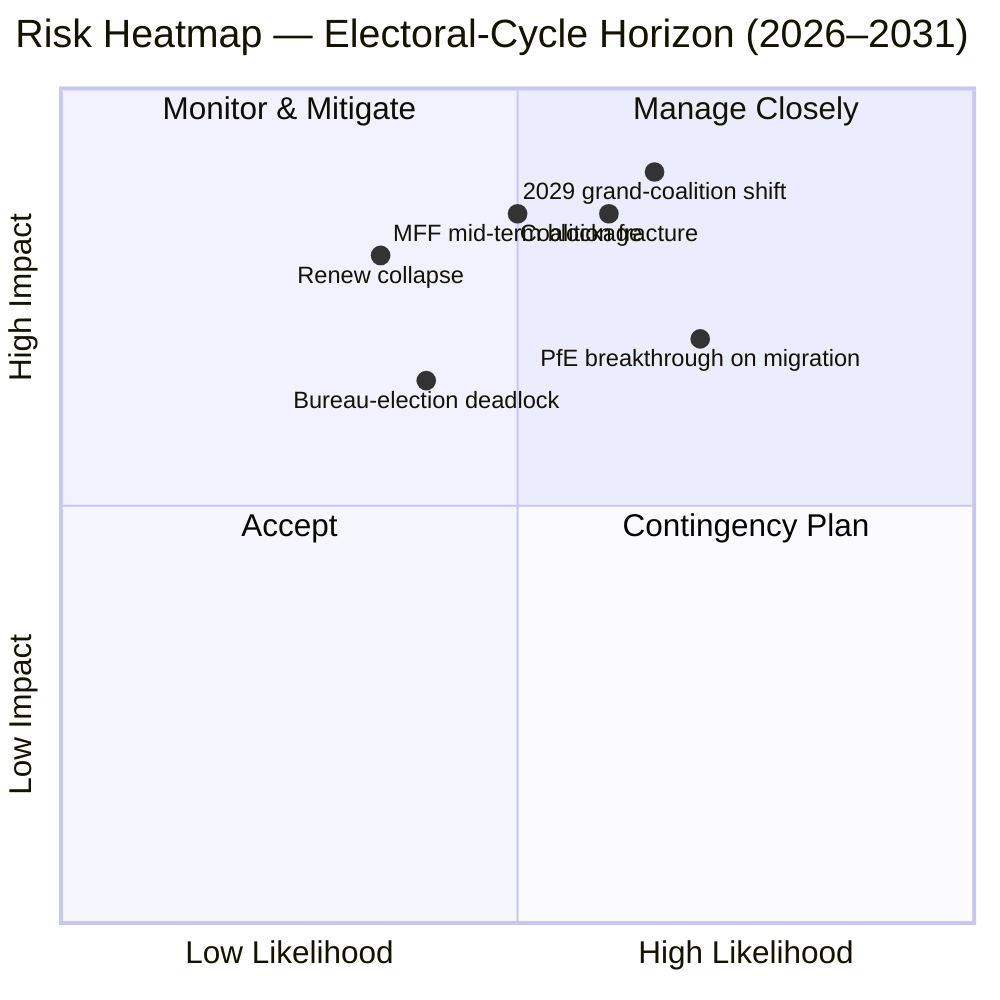

<!-- SPDX-FileCopyrightText: 2026 Hack23 AB -->
<!-- SPDX-License-Identifier: Apache-2.0 -->

# Toimeenpaneva Tiedote — EP10 Vaalikierros-Overlay (2024–2029) | 2026-05-11

**Luokittelu:** OSINT — Julkinen parlamentaarinen rekisteri
**Luotettavuus:** 🟡 Kohtalainen-Korkea (vakauspistemäärä 84/100; data on rakenteellista, ei äänestystasolla)
**Ajo:** `analysis/daily/2026-05-11/election-cycle/`
**Horisontti:** 2026-05-11 → 2031-05-10 (60 kuukauden vaalikierros-overlay)
**Luotu:** 2026-05-16 (retrospektiivinen tiedote, ei uusia MCP-kutsuja — kokoaa ajon omat 25 artefaktia)
**Ensisijaiset lähteet:** EP MCP `generate_political_landscape`, `analyze_coalition_dynamics`, `early_warning_system`, `compare_political_groups`, `sentiment_tracker`, `get_plenary_sessions` (vuosi=2026), `get_all_generated_stats` (2019–2026).

---

## 🎯 BLUF

Vuoden 2024 vaalit jättivät EP10:n tilaan, jossa on **717 MEP:iä yhdeksässä ryhmässä, pirstoutumisindeksi 6,58 — korkein arvo sitten EP6:n (2004–2009)**. Sentristinen EPP+S&D+Renew-blokki pitää hallussaan **396 paikkaa (55,2 %)** **36 paikan puskurilla** yli 361 paikan absoluuttisen enemmistön kynnyksen; tämä puskuri on **alle puolet EP9:n 86 paikan marginaalista**, joten yksittäinen kansallinen valtuuskunnan poikkeama muuttaa nyt merkittävästi tiedoston tiedostolta -enemmistölaskentaa. `early_warning_system`-järjestelmän ainoa HIGH-vakavuusvaroitus on `DOMINANT_GROUP_RISK` — EPP:n 25,5 %:n osuus antaa veto-vaikutuksen missä tahansa kapeassa sentristisessä koalitiossa, ja **tammikuun 2027 viraston vaali on ensimmäinen suunniteltu testi** siitä, maksetaanko tämä vaikutus salkkuina (status quo) vai politiikkamyönnytyksinä (oikeistoajautuminen). Polarisoitumisindeksi 0,22 on selvästi alle 0,40 suurkoalition romahtamiskynnyksen, joten taustalla oleva laskenta toimii edelleen; operatiivinen riski on **väliaikainen uudelleenjärjestely** ei romahdus. **Kuusi otsikkoarviota** (J1–J6) kehystävät kierroksen: sentristinen enemmistö pitää Q4 2026 asti (Erittäin todennäköinen, 18 kuukauden horisontti), PfE ohittaa Renewin EP10:n aikana siirtojen kautta (Tasaiset mahdollisuudet, 36 kuukautta), Venezuela-enemmistö (EPP+ECR+PfE = 349 paikkaa) vetoaa ≥3 peruutustiedostoon ennen vuoden 2027 puoliväliä (Todennäköinen, 14 kuukautta), vuosi 2029 ei tuota yksittäistä koalition enemmistöä (Todennäköinen, 49 kuukautta).

---

## 🧭 3 Decisions This Brief Supports

| # | Päätös | Kuka päättää | Määräaika | Näyttö |
|:-:|--------|--------------|:---------:|--------|
| 1 | **Peitsistrategia vuoden 2027 viraston vaaliin** — saako EPP väliaikaisesti puheenjohtajuuden salkkuliikkeellä S&D:n kanssa vai vaatiiko se politiikkamyönnytyksiä (muuttoliike / maatalous)? | Puheenjohtajien konferenssi; EPP/S&D/Renew-ryhmäjohtajat | Tammi 2027 (≤ 9 kuukautta) | R-3 `risk-scoring/risk-matrix.md`-tiedostossa (Todennäköisyys Tasaiset mahdollisuudet × Vaikutus M-K → pistemäärä 8); J6 (väliaikainen uudelleenjärjestely Todennäköinen) |
| 2 | **MFF 2028+ väliaikaistarkastuksen neuvotteluvaltuutus** — kuinka paljon puolustus / Ukraina / oikeusvaltioehdollisuutta on ei-neuvoteltavissa sentristiselle enemmistölle? | BUDG-johto, COREPER, komission varapresidentit | H2 2026 → keski-2027 | R-5 (Todennäköinen × Erittäin korkea → pistemäärä 16, rekisterin yksittäinen korkein riski); `intelligence/economic-context.md` |
| 3 | **Ryhmäkurin seuranta Venezuela-enemmistöpolulla** — mitkä tiedostot (muuttoliike, maatalous, ilmaston peruuttaminen) ovat vaarassa EPP+ECR+PfE yksinkertaisella enemmistövoitolla kun osallistuminen laskee alle 95 %? | Ryhmäsihteeristöt; varjoesittelijät Greens / Renew | jatkuva, 12 kuukauden seuranta | R-2 (Tasaiset mahdollisuudet × Korkea → pistemäärä 9); J3 (Todennäköinen, 14 kuukautta); `intelligence/coalition-dynamics.md` |

Jokainen päätös on sidottu riskikirjauksen riviin `risk-scoring/risk-matrix.md`-tiedostossa ja WEP-vyöhykkeen arvioon `intelligence/synthesis-summary.md`-tiedostossa, jotta päättely on falsifioitavissa.

---

## 📰 60-Second Read

- 🔴 **Puskuri puolitettu:** sentristinen EPP+S&D+Renew-blokki laski 86 paikan selvästä ylivoimasta EP9:ssä **36 paikan ylivoimaan EP10:ssä** (`generate_political_landscape`, A1).
- 🟠 **Pirstoutumishuippu:** indeksi **6,58 — korkein sitten EP6:n** (2004–2009); `compare_political_groups` näyttää **12,6 %:n lisäyksen tiedoston muutoslukumäärissä** vs. EP9.
- 🟢 **Vakaus edelleen toiminnallinen:** `early_warning_system` palauttaa pistemäärän **84/100, MEDIUM kokonaisriski**; polarisoituminen **0,22 ≪ 0,40 romahtamiskynnys**.
- 🟡 **Ainoa HIGH-vakavuusvaroitus:** `DOMINANT_GROUP_RISK` EPP:n 25,5 %:n osuudessa — keskittynyt vaikutus, ei kamarin romahdus.
- 🔵 **Venezuela-enemmistö aseistettu:** EPP+ECR+PfE = **349 paikkaa (48,7 %)** — 12 vähemmän kuin absoluuttinen enemmistö mutta **voittaa yksinkertaisilla enemmistöäänestyksillä kun läsnäolo laskee alle 95 %**; jo aktivoitu ≥4 muuttoliike-/maataloustiedostossa vihkiäisten jälkeen.
- 🟣 **Vasemmisto rakenteellisesti lyhyt:** S&D+Greens/EFA+The Left = **234 paikkaa (32,6 %)** — ei pysty kukistamaan Vihreän sopimuksen peruuttamista ilman Renew-poikkeamaa tai poissaolovetoisia dynamiikkoja.
- 🩷 **Renew-tiivistyminen:** 102 → 77 paikkaa (**−24,5 %**) on toiseksi merkityksellisin rakenteellinen muutos vuodelta 2024 ja puskurin puolittamisen edellytys.
- ⚪ **Pakotustoiminnot H2 2026 → Q1 2027:** (a) Viraston vaali tammi 2027; (b) MFF 2028+ väliaikaistarkastus; (c) Komission Työohjelma 2026 toimituspulssi (~18 OLP-tiedostoa/neljännes vuoteen 2027).

---

## 🗂️ Headline Judgements (from `intelligence/synthesis-summary.md`)

| # | Arvio | WEP-vyöhyke | Luotettavuus | Horisontti |
|:-:|-------|-------------|:------------:|:----------:|
| J1 | Sentristinen EPP+S&D+Renew säilyttää toimivan enemmistön ≥70 %:ssa OLP-tiedostoista Q4 2026 asti | **Erittäin todennäköinen** | Kohtalainen-Korkea | 18 kuukautta |
| J2 | PfE ohittaa Renewin kolmanneksi suurimpana ryhmänä EP10:n aikana (siirtojen, ei vaalien kautta) | Tasaiset mahdollisuudet | Kohtalainen | 36 kuukautta |
| J3 | Venezuela-enemmistö (EPP+ECR+PfE) vetoaa ≥3 muuttoliike-/maatalous-/ilmastonperuuttamistiedostoon ennen vuoden 2027 puoliväliä | **Todennäköinen** | Kohtalainen | 14 kuukautta |
| J4 | Vuoden 2029 vaalit eivät tuota yksittäistä koalition enemmistöä 361+; pakottaa uusitun suurkoalitiopaktin | **Todennäköinen** | Kohtalainen | 49 kuukautta |
| J5 | ≥1 nykyinen ryhmä (ESN tai NI-klusteri) epäonnistuu muodostumaan uudelleen vuoden 2029 vaalien jälkeen | Tasaiset mahdollisuudet | Kohtalainen | 53 kuukautta |
| J6 | Väliaikainen uudelleenjärjestely (ryhmävaihto ≥10 MEP:llä) tapahtuu vuonna 2027 viraston vaalin ympärillä | **Todennäköinen** | Kohtalainen | 9 kuukautta |

J1–J6:ta tukeva näyttö on peräisin Stage-A MCP-tallenteista, jotka on lueteltu tämän tiedotteen otsikossa; täydellinen ketju `intelligence/synthesis-summary.md`- ja `intelligence/coalition-dynamics.md`-tiedostoissa.

---

## ⚠️ Risk Snapshot

**Kolme parasta kvantifioitua riskiä** (`risk-scoring/risk-matrix.md`-rekisteristä, pistemäärän mukaan järjestetty):

| ID | Riski | L | I | Pisteet | Laukaisin joka edistäisi sitä | Omistaja |
|:--:|-------|:-:|:-:|:-------:|-------------------------------|---------|
| **R-5** | MFF 2028+ väliaikaistarkastus epäonnistuu vuoden 2027 puoliväliin mennessä | Todennäköinen | Erittäin korkea | **16** | Neuvostokonflikti nettomaksajakirjekuoresta; puolustuslaajennos ratkaisematta | BUDG / Komission varapresidentit |
| **R-7** | Vuoden 2029 vaalit tuottavat 7+ ryhmän kamarin ilman sentrististä enemmistöä | Todennäköinen | Erittäin korkea | **16** | PfE vahvistaa ECR:n kansalliset valtuuskunnat ennen vaaleja | Ryhmien väliset johtajat |
| **R-1** | Sentristinen koalitio menettää toimivan enemmistön lippulaivaisen OLP-tiedoston | Todennäköinen | Korkea | **12** | Kansallinen valtuuskunnan poikkeama (esp. Renew Iberian or French bloc) | EPP/S&D/Renew-johtajat |

R-6 (kansallinen valtuuskunnan poikkeama oikeusvaltioehdollisuudesta, pisteet 12) on samassa vyöhykkeessä ja on todennäköisin konkreettinen R-1:n aktivaattori.

---

## 🔮 Top Forward Triggers

`extended/forward-indicators.md`-tiedostosta ja ajon skenaariohaaroista (`intelligence/scenario-forecast.md` S1–S7):

1. **Tammikuun 2027 viraston vaali** — jos EPP turvaa puheenjohtajuuden ilman julkaistua hintaa valiokuntien puheenjohtajuuksissa S&D:lle ja Renewille, eskaloida `DOMINANT_GROUP_RISK` HIGH-vakavuusvaroituksesta aktiiviseen R-3-pattitilanteeseen.
2. **MFF 2028+ neuvotteluvaltuusäänestys** (tavoite H2 2026 → keski-2027) — sentristisen BUDG-mandaatin saavuttamatta jättäminen Q1 2027 loppuun mennessä edistää R-5:tä keltaisesta punaiseen ja ruokkii Skenaario 6:ta (Suurkoalition uudelleensinetöinti).
3. **Kolme nimettyjä tiedostoja seurattavaksi Venezuela-enemmistön aktivoimiseksi seuraavien 14 kuukauden aikana:** mikä tahansa muuttoliikemenettelyn täysistunto jossa Renew Iberian tai Ranskan valtuuskunnan osallistuminen laskee alle 90 %; CAP-yksinkertaistamisen seurannat; ja seuraava post-2025 ilmastonperuuttamissykli. J3 (Todennäköinen) todistetaan tai kumotaan näillä.
4. **PfE-ryhmän siirtojen seuranta** — `compare_political_groups` merkitsee jo PfE:n rakenteelliseksi muutokseksi jolla on eniten kasvutilaa; puolalaisen tai italialaisen ECR-valtuuskunnan siirto ≥10 MEP:lle on J2:n ja J6:n operatiivinen laukaisukaapeli.

Pakollinen **Skenaario 7 (Sopimuskriisi / rakenteellinen murros)** -haara sijaitsee pitkässä hännässä: ajon mukaiset ehdokaslaukaisimet ovat (a) laajentumissopimuksen tarkistus UA/MD, (b) passerellen laajentaminen ulkomaan-/finanssipolitiikkaan, (c) artikla 7 -eskalaatio Unkarista, (d) väliaikainen vaali neuvoston pattitilanteesta, tai (e) MFF:n romahtaminen väliaikaisiin kahdentoista osaan. Mikään ei ole 12 kuukauden horisontilla.

---

## 🛡️ Source-Quality Assessment

- **A1 / A2-ankkurit:** ryhmäkoostumus, pirstoutumisindeksi, täysistuntokalenteri, useiden kausien läpivienti — nämä ovat tiedotteen **rakenteellinen selkäranka** ja ovat Admiralty A1–A2 (EP Open Data Portal).
- **B3-varaus:** `sentiment_tracker`-polarisoituminen (0,22) on **paikkajaon institutionaalinen asemoinnin välitysmuuttuja, ei nimenhuudon koheesio** — per-MEP-äänestysdata ei ole vielä EP API:n paljastaama. Kohtalainen luotettavuus J3:lle / J4:lle / J6:lle heijastaa tätä.
- **A6 (ei voida arvioida):** `monitor_legislative_pipeline` palautti 0 menettelyä ja `network_analysis` palautti 50 solmua / 0 kaarta; molemmat ovat **ylävirran putkilinjan viivästyksiä**, ei analyyttisiä epäonnistumisia. Verkkoanalyysin egoverkkoja ja putkilinjan pullonkaulojen havaitseminen siirretään myöhemmäksi, kunnes EP API paljastaa nämä tiedot.
- **F6 (epäonnistui):** World Bank EU-maakoodit (`EUU` / `EU`) molemmat epäonnistuivat tässä ajossa; tiedote ei perustu WB-makrokontekstiin.
- **IMF SDMX 3.0:** ei kysytty tässä vaalikierros-overlay-ajossa; jos MFF-tarkastelun makrokonteksti tulee operatiivisesti tarpeelliseksi, suorita IMF WEO -sonda ennen R-5:n uudelleenpisteytystä.

Nettoluotettavuus: **Kohtalainen-Korkea rakenteellisessa laskennassa** (J1, R-1, R-5, R-7), **Kohtalainen käyttäytymisarvioinneissa** (J2, J3, J4, J6) kunnes per-MEP:n koheesiodata paljastetaan EP API:ssa.

---

## 🧭 ACH Competing-Hypothesis Note

Kahta kilpailevaa tulkintaa samasta laskennasta seurataan `extended/historical-parallels.md`-tiedostossa:

- **H1 — "EP10 on EP9 miinus Renew."** Puskuri on pienempi, mutta koalitiokaava on muuttumaton; väliaikainen viraston vaali tuottaa salkkuliikkeen; vuosi 2029 palauttaa samanlaisen paktin hieman suuremmalla oikeistolaivalla. Skenaariot 1 ja 6 `intelligence/scenario-forecast.md`-tiedostossa.
- **H2 — "EP10 on ensimmäinen PfE-pivot-parlamentti."** Venezuela-enemmistö aktivoituu yli kolmessa tiedostossa; yksi EPP:n kansallinen valtuuskunta siirtyy piiskaamaan ECR:n kanssa muuttoliikkeessä; vuoden 2027 viraston vaali tulee julkiseksi pivot-hetkeksi. Skenaariot 2 ja 4.

Nykyinen näyttöpohja — vakauspistemäärä 84, polarisoituminen 0,22, pirstoutuminen 6,58, EPP-kuri pitää — **suosii H1:tä (Erittäin todennäköinen)** Q4 2026 asti mutta **ei kumoa H2:ta** 14–36 kuukauden horisontilla. Tiedote seuraa siksi molempia eikä sitoudu yhteen.

---

## 📎 Run Artifacts (Read-Before-Decide)

| Kerros | Artefakti | Miksi |
|--------|-----------|-------|
| Artikkeli | `article.md` | Julkinen kertomus; 9 906 riviä kattaen kaikki kuusi arviota |
| Synteesi | `intelligence/synthesis-summary.md` | BLUF + WEP-taulukko + Admiralty-luokittelu (auktoritatiivinen) |
| Koalitio | `intelligence/coalition-dynamics.md` | Venezuela-enemmistölaskenta; EP9 → EP10 puskuridelta |
| Riskikirjaus | `risk-scoring/risk-matrix.md` | R-1 → R-10 L × I × Pisteet |
| Kvantitatiivinen SWOT | `risk-scoring/quantitative-swot.md` | Rakenteelliset vahvuudet vs. puskurin eroosio |
| Skenaariot | `intelligence/scenario-forecast.md` S1–S7 (Sopimuskriisi = S7) | Todennäköisyyspainotetut haarat |
| Indikaattorit | `extended/forward-indicators.md` | Laukaisukaapelikalenteri vuoteen 2029 |
| Toimikausikaari | `intelligence/term-arc.md`, `mandate-fulfilment-scorecard.md`, `presidency-trio-context.md` | Viraston vaalin sekvensointi |
| Paikkaennuste | `intelligence/seat-projection.md` | Vuoden 2029 ennuste H1 vs. H2 |
| Luotettavuus | `intelligence/mcp-reliability-audit.md` | A6 / F6-rivit selitetty |
| Itsetarkastelu | `intelligence/methodology-reflection.md` | Vaihe 10.5-sulkeminen |

---

**Asiakirjavalvonta**
- **Mallviite:** `analysis/templates/executive-brief.md`
- **Artefaktipolku:** `analysis/daily/2026-05-11/election-cycle/executive-brief.md`
- **Luokittelu:** Julkinen
- **Retrospektiivinen:** Tämä tiedote on jälkikäteen laadittu — kirjoitettu 2026-05-16 ajon sitoutuneiden artefaktien perusteella; **uusia MCP-kutsuja ei tehty**. Kaikki arviot muotoilevat uudelleen, tiivistävät ja ACH-ristitarkistavat mitä ajo itse sitoutui; uusia väitteitä ei esitetä.
