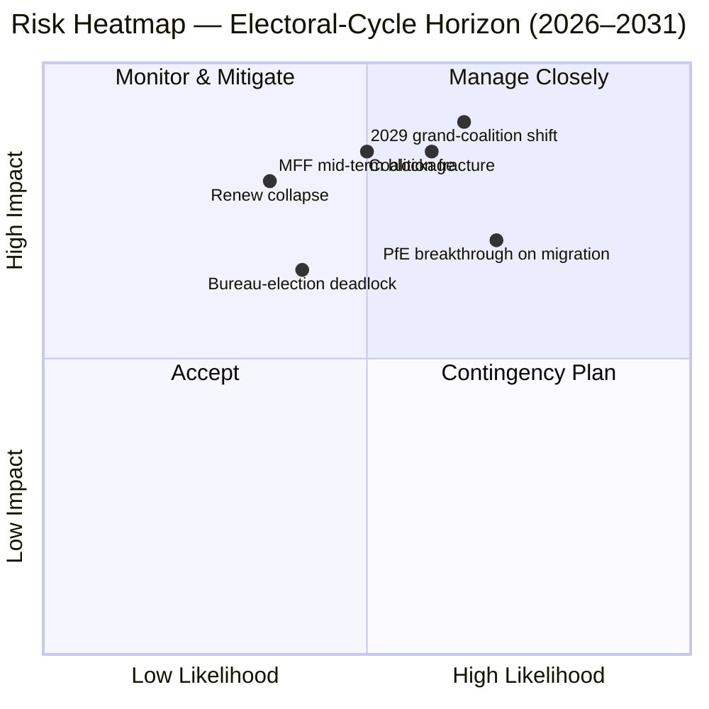

<!-- SPDX-FileCopyrightText: 2026 Hack23 AB -->
<!-- SPDX-License-Identifier: Apache-2.0 -->

# Note de synthèse exécutive — EP10 Superposition du cycle électoral (2024–2029) | 2026-05-11

**Classification :** OSINT — Archives parlementaires publiques
**Confiance :** 🟡 Modérée-Haute (score de stabilité 84/100 ; données structurelles, non au niveau des votes)
**Exécution :** `analysis/daily/2026-05-11/election-cycle/`
**Horizon :** 2026-05-11 → 2031-05-10 (superposition du cycle électoral sur 60 mois)
**Générée :** 2026-05-16 (note rétrospective, aucun nouvel appel MCP — synthétise les 25 artefacts propres à cette exécution)
**Sources primaires :** EP MCP `generate_political_landscape`, `analyze_coalition_dynamics`, `early_warning_system`, `compare_political_groups`, `sentiment_tracker`, `get_plenary_sessions` (année=2026), `get_all_generated_stats` (2019–2026).

---

## 🎯 BLUF

L'élection de 2024 a laissé EP10 avec **717 députés répartis en neuf groupes, indice de fragmentation 6,58 — la lecture la plus haute depuis EP6 (2004–2009)**. Le bloc centriste EPP+S&D+Renew détient **396 sièges (55,2 %)** avec un **coussin de 36 sièges** au-dessus du seuil de 361 sièges pour la majorité absolue ; ce coussin est **inférieur à la moitié de la marge de 86 sièges d'EP9**, de sorte qu'un seul écart de délégation nationale modifie désormais de façon significative l'arithmétique des majorités dossier par dossier. L'unique alerte de gravité HIGH de `early_warning_system` est `DOMINANT_GROUP_RISK` — la part de 25,5 % du PPE lui confère un pouvoir de veto dans toute coalition centriste étroite, et **l'élection du Bureau de janvier 2027 est le premier test programmé** pour savoir si ce levier est payé en portefeuilles (statu quo) ou en concessions politiques (dérive vers la droite). L'indice de polarisation de 0,22 est bien en dessous du seuil de rupture 0,40 pour la grande coalition, de sorte que l'arithmétique sous-jacente fonctionne encore ; le risque opérationnel est un **réalignement à mi-mandat** plutôt qu'un effondrement. **Six jugements de titre** (J1–J6) cadrent le cycle : la majorité centriste tient jusqu'au Q4 2026 (Très probable, horizon de 18 mois), PfE dépasse Renew pendant EP10 par transferts (Chances égales, 36 mois), la majorité Venezuela (EPP+ECR+PfE = 349 sièges) est invoquée sur ≥3 dossiers de retrait avant mi-2027 (Probable, 14 mois), 2029 ne produit aucune majorité de coalition unique (Probable, 49 mois).

---

## 🧭 3 Decisions This Brief Supports

| # | Décision | Qui décide | Échéance | Preuves |
|:-:|----------|------------|:--------:|---------|
| 1 | **Stratégie de discipline pour l'élection du Bureau 2027** — le PPE sécurise-t-il la présidence à mi-mandat sur un échange de portefeuilles avec le S&D, ou exige-t-il des concessions politiques (migration / agriculture) ? | Conférence des présidents ; chefs de groupe PPE/S&D/Renew | Janv. 2027 (≤ 9 mois) | R-3 dans `risk-scoring/risk-matrix.md` (Probabilité Chances égales × Impact M-H → score 8) ; J6 (réalignement à mi-mandat Probable) |
| 2 | **Mandat de négociation pour la révision à mi-parcours du CFP 2028+** — quelle part de conditionnalité défense / Ukraine / État de droit est non-négociable pour la majorité centriste ? | Direction BUDG, COREPER, VP de la Commission | H2 2026 → mi-2027 | R-5 (Probable × Très haut → score 16, le risque individuel le plus élevé du registre) ; `intelligence/economic-context.md` |
| 3 | **Surveillance de la discipline de groupe sur la trajectoire de la majorité Venezuela** — quels dossiers (migration, agriculture, retrait climatique) risquent d'être gagnés par EPP+ECR+PfE à la majorité simple lorsque la participation chute sous 95 % ? | Secrétariats de groupe ; rapporteurs fictifs dans Greens / Renew | en cours, surveillance sur 12 mois | R-2 (Chances égales × Haut → score 9) ; J3 (Probable, 14 mois) ; `intelligence/coalition-dynamics.md` |

Chaque décision est liée à une ligne du registre des risques dans `risk-scoring/risk-matrix.md` et à une évaluation balisée WEP dans `intelligence/synthesis-summary.md`, afin que le raisonnement soit falsifiable.

---

## 📰 60-Second Read

- 🔴 **Coussin réduit de moitié :** le bloc centriste EPP+S&D+Renew est passé de 86 sièges de marge dans EP9 à **36 sièges de marge dans EP10** (`generate_political_landscape`, A1).
- 🟠 **Pic de fragmentation :** indice **6,58 — le plus haut depuis EP6** (2004–2009) ; `compare_political_groups` indique une **hausse de 12,6 % du nombre d'amendements par dossier** par rapport à EP9.
- 🟢 **Stabilité encore fonctionnelle :** `early_warning_system` renvoie un score **84/100, risque global MEDIUM** ; polarisation **0,22 ≪ seuil de rupture 0,40**.
- 🟡 **Unique alerte de gravité HIGH :** `DOMINANT_GROUP_RISK` sur la part de 25,5 % du PPE — influence concentrée, pas d'effondrement de la chambre.
- 🔵 **Majorité Venezuela armée :** EPP+ECR+PfE = **349 sièges (48,7 %)** — 12 sièges en deçà de la majorité absolue mais **l'emporte lors des votes à la majorité simple lorsque la présence tombe sous 95 %** ; déjà activée sur ≥4 dossiers migration/agriculture depuis l'inauguration.
- 🟣 **Aile gauche structurellement faible :** S&D+Greens/EFA+The Left = **234 sièges (32,6 %)** — ne peut pas vaincre un retrait du Pacte Vert sans dissidence de Renew ou dynamiques liées aux absences.
- 🩷 **Compression de Renew :** 102 → 77 sièges (**−24,5 %**) est la deuxième plus grande modification structurelle de 2024 et la condition préalable au halving du coussin.
- ⚪ **Fonctions contraignantes H2 2026 → Q1 2027 :** (a) élection du Bureau janv. 2027 ; (b) révision à mi-parcours du CFP 2028+ ; (c) pulse de livraison du Programme de travail de la Commission 2026 (~18 dossiers OLP/trimestre jusqu'en 2027).

---

## 🗂️ Headline Judgements (from `intelligence/synthesis-summary.md`)

| # | Jugement | Bande WEP | Confiance | Horizon |
|:-:|----------|-----------|:---------:|:-------:|
| J1 | PPE+S&D+Renew centristes conservent une majorité de travail sur ≥70 % des dossiers OLP jusqu'au Q4 2026 | **Très probable** | Modérée-Haute | 18 mois |
| J2 | PfE dépasse Renew comme troisième groupe le plus important pendant EP10 (par transferts, pas par élection) | Chances égales | Modérée | 36 mois |
| J3 | La majorité Venezuela (EPP+ECR+PfE) est invoquée sur ≥3 dossiers migration/agriculture/retrait climatique avant mi-2027 | **Probable** | Modérée | 14 mois |
| J4 | L'élection de 2029 ne produit aucune majorité de coalition unique de 361+ ; oblige un nouveau pacte de grande coalition | **Probable** | Modérée | 49 mois |
| J5 | ≥1 groupe actuel (ESN ou un cluster NI) échoue à se reformer après l'élection de 2029 | Chances égales | Modérée | 53 mois |
| J6 | Réalignement à mi-mandat (changement de groupe par ≥10 députés) survient en 2027 autour de l'élection du Bureau | **Probable** | Modérée | 9 mois |

Les preuves soutenant J1–J6 proviennent des captures MCP de l'étape A répertoriées dans l'en-tête de cette note ; chaîne complète dans `intelligence/synthesis-summary.md` et `intelligence/coalition-dynamics.md`.

---

## ⚠️ Risk Snapshot

**Top trois risques quantifiés** (du registre `risk-scoring/risk-matrix.md`, classés par score) :

| ID | Risque | L | I | Score | Déclencheur qui le ferait avancer | Responsable |
|:--:|--------|:-:|:-:|:-----:|-----------------------------------|-------------|
| **R-5** | La révision à mi-parcours du CFP 2028+ échoue avant mi-2027 | Probable | Très haut | **16** | Blocage au Conseil sur l'enveloppe des contributeurs nets ; renforcement défense non résolu | BUDG / VP de la Commission |
| **R-7** | L'élection de 2029 produit un parlement à 7+ groupes sans majorité centriste | Probable | Très haut | **16** | PfE consolide les délégations nationales ECR avant l'élection | Dirigeants transpartisans |
| **R-1** | La coalition centriste perd sa majorité de travail sur un dossier OLP phare | Probable | Haut | **12** | Écart de délégation nationale (esp. Renew Iberian or French bloc) | Dirigeants PPE/S&D/Renew |

R-6 (écart de délégation nationale sur la conditionnalité État de droit, score 12) se situe dans le même registre et est l'activateur concret le plus probable de R-1.

---

## 🔮 Top Forward Triggers

D'après `extended/forward-indicators.md` et les branches scénarios de l'exécution (`intelligence/scenario-forecast.md` S1–S7) :

1. **Élection du Bureau de janvier 2027** — si le PPE sécurise la présidence sans coût publié en présidences de commissions pour le S&D et Renew, faire passer `DOMINANT_GROUP_RISK` d'alerte de gravité HIGH à R-3 blocage actif.
2. **Vote sur le mandat de négociation du CFP 2028+** (objectif H2 2026 → mi-2027) — l'échec à atteindre un mandat BUDG centriste d'ici fin Q1 2027 fait passer R-5 de l'orange au rouge et alimente le Scénario 6 (Renforcement de la grande coalition).
3. **Trois dossiers nommés à surveiller pour l'activation de la majorité Venezuela dans les 14 prochains mois :** toute session plénière sur une procédure migratoire où la participation des délégations Renew ibérique ou française tombe sous 90 % ; suites de la simplification de la PAC ; et le prochain cycle de retrait climatique post-2025. J3 (Probable) est vérifié ou falsifié par ces événements.
4. **Surveillance des transferts de groupe PfE** — `compare_political_groups` signale déjà PfE comme le changement structurel avec le plus de potentiel de croissance ; un transfert de délégation polonaise ou italienne ECR de ≥10 députés est le déclencheur opérationnel pour J2 et J6.

La branche obligatoire **Scénario 7 (Crise des traités / rupture structurelle)** se situe dans la longue traîne : les déclencheurs candidats selon l'exécution sont (a) révision du traité d'élargissement UA/MD, (b) extension de la passerelle à la politique étrangère/fiscale, (c) escalade de l'article 7 sur la Hongrie, (d) élection à mi-mandat suite à un blocage du Conseil, ou (e) effondrement du CFP en douzièmes provisoires. Aucun n'est à l'horizon de 12 mois.

---

## 🛡️ Source-Quality Assessment

- **Ancres A1 / A2 :** composition des groupes, indice de fragmentation, calendrier plénière, débit multi-législature — ce sont la **colonne vertébrale structurelle** de la note et sont Amirauté A1–A2 (Portail de données ouvertes du PE).
- **Réserve B3 :** la polarisation de `sentiment_tracker` (0,22) est un **proxy institutionnel de positionnement fondé sur la part des sièges, non sur la cohésion des votes nominaux** — les données de vote par député ne sont pas encore exposées par l'API du PE. La confiance Modérée pour J3/J4/J6 reflète cela.
- **A6 (ne peut pas être évaluée) :** `monitor_legislative_pipeline` a renvoyé 0 procédure et `network_analysis` a renvoyé 50 nœuds / 0 arêtes ; les deux sont des **délais de pipeline en amont**, pas des échecs analytiques. Les graphes ego d'analyse de réseau et la détection des goulots d'étranglement de pipeline sont différés jusqu'à ce que l'API du PE expose ces données.
- **F6 (échoué) :** les codes pays UE de World Bank (`EUU` / `EU`) ont tous deux échoué lors de cette exécution ; la note ne repose pas sur le contexte macro WB.
- **IMF SDMX 3.0 :** non interrogé dans cette exécution d'overlay de cycle électoral ; si le contexte macro de la révision CFP devient opérationnellement nécessaire, exécuter une sonde IMF WEO avant de réévaluer R-5.

Confiance nette : **Modérée-Haute sur l'arithmétique structurelle** (J1, R-1, R-5, R-7), **Modérée sur les jugements comportementaux** (J2, J3, J4, J6) jusqu'à ce que les données de cohésion par député soient exposées par l'API du PE.

---

## 🧭 ACH Competing-Hypothesis Note

Deux lectures concurrentes de la même arithmétique sont suivies dans `extended/historical-parallels.md` :

- **H1 — « EP10 est EP9 moins Renew. »** Le coussin est plus petit mais la formule de coalition est inchangée ; l'élection du Bureau à mi-mandat donne lieu à un échange de portefeuilles ; 2029 ramène un pacte similaire avec un flanc droit légèrement plus grand. Scénarios 1 et 6 dans `intelligence/scenario-forecast.md`.
- **H2 — « EP10 est le premier parlement-pivot PfE. »** La majorité Venezuela s'active sur plus de trois dossiers ; une délégation nationale PPE passe à voter avec l'ECR sur la migration ; une élection du Bureau en 2027 devient le moment public du pivot. Scénarios 2 et 4.

La base de preuves actuelle — score de stabilité 84, polarisation 0,22, fragmentation 6,58, discipline PPE maintenue — **favorise H1 (Très probable)** jusqu'au Q4 2026 mais **ne falsifie pas H2** sur un horizon de 14 à 36 mois. La note suit donc les deux plutôt que de s'engager sur l'une.

---

## 📎 Run Artifacts (Read-Before-Decide)

| Couche | Artefact | Pourquoi |
|--------|----------|----------|
| Article | `article.md` | Récit public ; 9 906 lignes couvrant les six jugements |
| Synthèse | `intelligence/synthesis-summary.md` | BLUF + tableau WEP + notation Amirauté (faisant autorité) |
| Coalition | `intelligence/coalition-dynamics.md` | Arithmétique de la majorité Venezuela ; delta du coussin EP9 → EP10 |
| Registre des risques | `risk-scoring/risk-matrix.md` | R-1 → R-10 avec L × I × Score |
| SWOT quantitatif | `risk-scoring/quantitative-swot.md` | Forces structurelles vs. érosion du coussin |
| Scénarios | `intelligence/scenario-forecast.md` S1–S7 (Crise des traités = S7) | Branches pondérées par probabilité |
| Indicateurs | `extended/forward-indicators.md` | Calendrier des déclencheurs jusqu'en 2029 |
| Arc de législature | `intelligence/term-arc.md`, `mandate-fulfilment-scorecard.md`, `presidency-trio-context.md` | Séquençage de l'élection du Bureau |
| Projection des sièges | `intelligence/seat-projection.md` | Prévision 2029 sous H1 vs. H2 |
| Fiabilité | `intelligence/mcp-reliability-audit.md` | Lignes A6 / F6 expliquées |
| Auto-audit | `intelligence/methodology-reflection.md` | Clôture étape 10.5 |

---

**Contrôle du document**
- **Référence du modèle :** `analysis/templates/executive-brief.md`
- **Chemin de l'artefact :** `analysis/daily/2026-05-11/election-cycle/executive-brief.md`
- **Classification :** Public
- **Rétrospectif :** Cette note est post-hoc — rédigée le 2026-05-16 à partir des artefacts engagés de l'exécution ; **aucun nouvel appel MCP n'a été effectué**. Tous les jugements reformulent, distillent et ACH-croisent ce que l'exécution elle-même a engagé ; aucune nouvelle affirmation n'est introduite.
