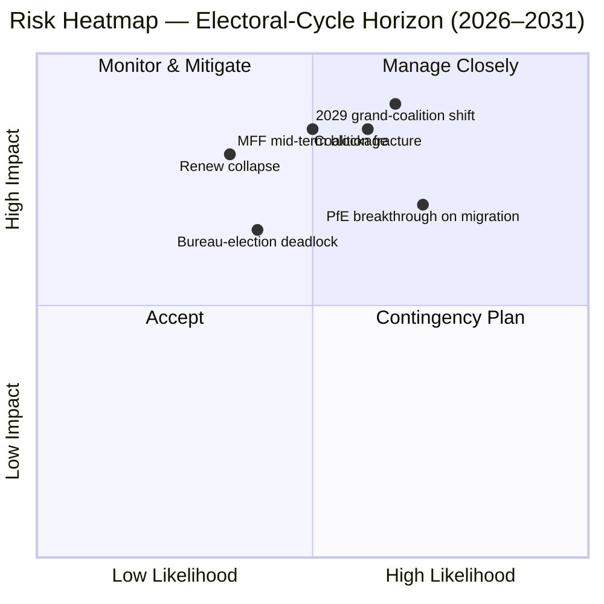

<!-- SPDX-FileCopyrightText: 2026 Hack23 AB -->
<!-- SPDX-License-Identifier: Apache-2.0 -->

# תקציר מנהלים — EP10 כיסוי מחזור הבחירות (2024–2029) | 2026-05-11

**סיווג:** OSINT — רשומה פרלמנטרית ציבורית
**רמת אמינות:** 🟡 בינונית-גבוהה (ציון יציבות 84/100; נתונים מבניים, לא ברמת הצבעה)
**הרצה:** `analysis/daily/2026-05-11/election-cycle/`
**אופק זמן:** 2026-05-11 → 2031-05-10 (כיסוי מחזור בחירות של 60 חודשים)
**נוצר:** 2026-05-16 (תקציר רטרואקטיבי; אין קריאות MCP חדשות — מסכם 25 פריטי ניתוח של ההרצה)
**מקורות ראשיים:** EP MCP `generate_political_landscape`, `analyze_coalition_dynamics`, `early_warning_system`, `compare_political_groups`, `sentiment_tracker`, `get_plenary_sessions` (שנה=2026), `get_all_generated_stats` (2019–2026).

---

## 🎯 BLUF

בחירות 2024 הניבו EP10 עם **717 חברים ב-9 קבוצות, מדד פיצול 6.58 — הקריאה הגבוהה ביותר מאז EP6 (2004–2009)**. לגרעין המרכזי EPP+S&D+Renew יש **396 מנדטים (55.2%)** עם **מרווח 36 מנדטים** מעל סף הרוב המוחלט של 361; מרווח זה **פחות ממחצית מרווח EP9 של 86 מנדטים**, כך שסטייה של משלחת לאומית אחת משנה כעת חישובי רוב ניכר מתיק לתיק. האזהרה היחידה בדרגה HIGH מ-`early_warning_system` היא `DOMINANT_GROUP_RISK` — נתח EPP של 25.5% מעניק לו זכות וטו בכל קואליציה מרכזית צרה, ו**בחירת לשכת הנשיאות בינואר 2027 היא הבחינה המתוזמנת הראשונה** לבדיקה האם מינוף זה נדחף לתיקים (הסטטוס קוו) או לוויתורים מדיניים (הסטה ימינה). מדד הקיטוב 0.22 נמוך בהרבה מסף קריסת הקואליציה הגדולה של 0.40, כך שהחשבון המרכזי עדיין עובד; הסיכונים התפעוליים הם **איזון מחדש באמצע הכהונה** ולא קריסה. **שישה שיפוטים מרכזיים** (J1–J6) ממסגרים את הכהונה: הרוב המרכזי מחזיק עד Q4 2026 (כמעט ודאי, אופק 18 חודשים), PfE עולה על Renew במהלך EP10 דרך מעברים (סיכויים שווים, 36 חודשים), "רוב ונציה" (EPP+ECR+PfE = 349 מנדטים) מופעל ב-≥3 תיקים לנסיגה לפני אמצע 2027 (סביר, 14 חודשים), ובחירות 2029 לא ייצרו רוב קואליציה יחיד (סביר, 49 חודשים).

---

## 🧭 3 Decisions This Brief Supports

| # | ההחלטה | מי מחליט | דדליין | ראיות |
|:-:|---------|----------|:------:|-------|
| 1 | **אסטרטגיית הצבעה לבחירת לשכת הנשיאות 2027** — האם EPP מבטיחה נשיאות אמצע כהונה דרך חילוף תיקים עם S&D, או תובעת ויתורי מדיניות (הגירה/חקלאות)? | ועידת יו"רים; מנהיגי קבוצות EPP/S&D/Renew | ינואר 2027 (≤9 חודשים) | R-3 ב-`risk-scoring/risk-matrix.md` (סיכויים שווים × השפעה M-H → ניקוד 8); J6 (איזון מחדש באמצע כהונה סביר) |
| 2 | **מנדט המשא ומתן על סקירת MFF 2028+ באמצע הכהונה** — כמה מהמיזם-ביטחון/אוקראינה/שלטון החוק אינו ניתן למשא ומתן עבור הרוב המרכזי? | מנהיגות BUDG, COREPER, סגני נשיאי הנציבות | H2 2026 → אמצע 2027 | R-5 (סביר × גבוה מאוד → ניקוד 16, הסיכון הגבוה ביותר בספר); `intelligence/economic-context.md` |
| 3 | **ניטור משמעת קבוצה על מסלול "רוב ונציה"** — אילו תיקים (הגירה, חקלאות, נסיגה אקלימית) נמצאים בסיכון לניצחון EPP+ECR+PfE ברוב פשוט כאשר הנוכחות יורדת מתחת ל-95%? | מזכירות קבוצות; מקברים צל ב-Greens/Renew | שוטף, ניטור 12 חודשים | R-2 (סיכויים שווים × גבוה → ניקוד 9); J3 (סביר, 14 חודשים); `intelligence/coalition-dynamics.md` |

כל החלטה מקושרת לשורה בספר הסיכונים ב-`risk-scoring/risk-matrix.md` ולהערכת WEP ב-`intelligence/synthesis-summary.md` כדי שהטיעון יהיה ניתן להפרכה.

---

## 📰 60-Second Read

- 🔴 **המרווח התכווץ בחצי:** ירידת קואליציה EPP+S&D+Renew המרכזית מ-86 מנדטים ב-EP9 ל-**36 מנדטים ב-EP10** (`generate_political_landscape`, A1).
- 🟠 **שיא הפיצול:** מדד **6.58 — הגבוה ביותר מאז EP6** (2004–2009); `compare_political_groups` מראה **עלייה של 12.6% בתיקוני קריאה שנייה לכל תיק** לעומת EP9.
- 🟢 **היציבות עדיין תפקודית:** `early_warning_system` מחזיר ציון **84/100, סיכון כולל MEDIUM**; קיטוב **0.22 ≪ סף קריסה של 0.40**.
- 🟡 **אזהרת HIGH יחידה:** `DOMINANT_GROUP_RISK` בנתח EPP של 25.5% — מינוף מרוכז, לא קריסת אולם.
- 🔵 **"רוב ונציה" חמוש:** EPP+ECR+PfE = **349 מנדטים (48.7%)** — 12 מתחת לרוב מוחלט אך **מנצח בהצבעות רוב פשוט כאשר הנוכחות יורדת מתחת ל-95%**; כבר הופעל ב-≥4 תיקי הגירה/חקלאות מאז ההקמה.
- 🟣 **גוש השמאל קצר מבנית:** S&D+Greens/EFA+The Left = **234 מנדטים (32.6%)** — לא יכול לחסום נסיגה מה-Green Deal ללא פיצול Renew או דינמיקת היעדרות.
- 🩷 **לחץ Renew:** 102 → 77 מנדטים (**−24.5%**) הוא השינוי המבני השני בגודלו ב-2024 ותנאי מוקדם לצמצום המרווח לחצי.
- ⚪ **פונקציות כפייה H2 2026 → Q1 2027:** (א) בחירת לשכת הנשיאות ינואר 2027; (ב) סקירת MFF 2028+ באמצע הכהונה; (ג) גל מסירת תוכנית העבודה 2026 של הנציבות (~18 תיקי OLP/רבעון עד 2027).

---

## 🗂️ Headline Judgements (from `intelligence/synthesis-summary.md`)

| # | השיפוט | טווח WEP | אמינות | אופק |
|:-:|---------|----------|:------:|:-----:|
| J1 | EPP+S&D+Renew המרכזיים שומרים על רוב עובד ב-≥70% מתיקי OLP עד Q4 2026 | **כמעט ודאי** | בינונית-גבוהה | 18 חודשים |
| J2 | PfE עולה על Renew כקבוצה השלישית בגודלה במהלך EP10 (דרך מעברים, לא בחירות) | סיכויים שווים | בינונית | 36 חודשים |
| J3 | "רוב ונציה" (EPP+ECR+PfE) מופעל ב-≥3 תיקי הגירה/חקלאות/נסיגה אקלימית לפני אמצע 2027 | **סביר** | בינונית | 14 חודשים |
| J4 | בחירות 2029 לא ייצרו רוב קואליציה יחיד 361+; יאלצו מגילת קואליציה גדולה מחודשת | **סביר** | בינונית | 49 חודשים |
| J5 | ≥1 קבוצה נוכחית (ESN או NI pool) נכשלת בהיאגדות מחדש לאחר בחירות 2029 | סיכויים שווים | בינונית | 53 חודשים |
| J6 | איזון מחדש באמצע הכהונה (מעבר קבוצה של ≥10 חברים) מתרחש ב-2027 סביב בחירת לשכת הנשיאות | **סביר** | בינונית | 9 חודשים |

הראיות התומכות ב-J1–J6 מגיעות מלכידות MCP בשלב A הרשומות בכותרת תקציר זה; השרשרת המלאה ב-`intelligence/synthesis-summary.md` ו-`intelligence/coalition-dynamics.md`.

---

## ⚠️ Risk Snapshot

**שלושת הסיכונים הגבוהים ביותר שנמדדו כמותית** (מספר `risk-scoring/risk-matrix.md`, לפי ניקוד):

| מזהה | הסיכון | ס' | ת' | ניקוד | טריגר מאיץ | בעלים |
|:----:|---------|:-:|:-:|:-----:|------------|-------|
| **R-5** | סקירת MFF 2028+ באמצע הכהונה נכשלת לפני אמצע 2027 | סביר | גבוה מאוד | **16** | מבוי סתום במועצה על מעטפת נשים נטו; חיזוק ביטחוני לא פתור | BUDG / סגני נשיאי הנציבות |
| **R-7** | בחירות 2029 מניבות פרלמנט בן 7+ קבוצות ללא רוב מרכזי | סביר | גבוה מאוד | **16** | PfE מאחד משלחות ECR לאומיות לפני הבחירות | מנהיגים חוצי-מפלגות |
| **R-1** | הקואליציה המרכזית מאבדת רוב עובד בתיק OLP מרכזי | סביר | גבוה | **12** | סטייה של משלחת לאומית (esp. Renew Iberian or French bloc) | מנהיגי EPP/S&D/Renew |

R-6 (סטיית משלחת לאומית בסעיף שלטון החוק, 12 נקודות) נמצא באותו טווח והוא הטריגר הנגיש ביותר של R-1.

---

## 🔮 Top Forward Triggers

מ-`extended/forward-indicators.md` וענפי תרחישים בהרצה (`intelligence/scenario-forecast.md` S1–S7):

1. **בחירת לשכת הנשיאות ינואר 2027** — אם EPP מבטיחה נשיאות ללא עלות מפורסמת בנשיאויות ועדה ל-S&D ו-Renew, `DOMINANT_GROUP_RISK` מועלה מאזהרת HIGH לסיכון R-3 פעיל.
2. **הצבעת מנדט על משא ומתן MFF 2028+** (יעד H2 2026 → אמצע 2027) — כישלון בהשגת מנדט BUDG מרכזי עד סוף Q1 2027 מקדם R-5 מצהוב לאדום ומזין תרחיש 6 (חתימה מחדש על קואליציה גדולה).
3. **שלושה תיקים ממונים לצפייה לגבי הפעלת "רוב ונציה" ב-14 חודשים הבאים:** כל מליאה על הגירה שבה נוכחות משלחת Renew האיברית או הצרפתית יורדת מתחת ל-90%; המשך פישוט CAP; ומחזור נסיגה אקלימית לאחר 2025. J3 (סביר) מאומת או מופרך על ידי אירועים אלה.
4. **ניטור מעברי קבוצת PfE** — `compare_political_groups` כבר מסמן PfE כשינוי המבני בעל הפוטנציאל הצמיחה הגבוה ביותר; מעבר משלחת ECR הפולנית או האיטלקית של ≥10 חברים הוא חוט הפעלה ל-J2 ו-J6.

**ענף תרחיש 7 (משבר אמנות/שבר מבני)** החובה נמצא בזנב הארוך: הטריגרים המועמדים לפי ההרצה הם (א) תיקון אמנת הצטרפות UA/MD, (ב) הרחבת מסדרון למדיניות חוץ/פיסקאלית, (ג) הסלמת סעיף 7 לגבי הונגריה, (ד) בחירת אמצע כהונה ממבוי סתום במועצה, או (ה) קריסת MFF לסמכויות ארעיות. אף אחד מהם לא נמצא באופק של 12 חודשים.

---

## 🛡️ Source-Quality Assessment

- **עוגן A1 / A2:** הרכב קבוצות, מדד פיצול, לוח שנה של מליאה, שיעור פרודוקטיביות רב-כהונה — אלה **עמוד השדרה המבני** של התקציר ומדורגים Admiralty A1–A2 (שער הנתונים הפתוחים של EP).
- **הסתייגות B3:** קיטוב `sentiment_tracker` (0.22) הוא **פרוקסי מיצוב מוסדי המבוסס על נתחי מנדטים, לא על לכידות הצבעות נומינלית** — נתוני הצבעות לכל חבר טרם נחשפו על ידי EP API. האמינות הבינונית ב-J3/J4/J6 משקפת זאת.
- **A6 (לא ניתן לשפוט):** `monitor_legislative_pipeline` החזיר 0 הליכים ו-`network_analysis` החזיר 50 צמתים / 0 קשתות; שניהם **עיכובי צינור קדימי**, לא כשלי ניתוח. שרטוטי רשת Ego וזיהוי צווארי בקבוק נדחים עד ש-EP API יחשוף נתונים אלה.
- **F6 (כישלון):** קודי מדינות EU של World Bank (`EUU` / `EU`) שניהם נכשלו בהרצה זו; התקציר אינו נשען על הקשר מאקרו-כלכלי של WB.
- **IMF SDMX 3.0:** לא נחקר בהרצה זו לגבי כיסוי מחזור הבחירות; אם ההקשר המאקרו-כלכלי לסקירת MFF יהפוך תפעולי נחוץ, בצע בדיקת IMF WEO לפני הערכה מחדש של R-5.

אמינות נטו: **בינונית-גבוהה בחשבונות מבניים** (J1, R-1, R-5, R-7), **בינונית בשיפוטים התנהגותיים** (J2, J3, J4, J6) עד ש-EP API יחשוף נתוני לכידות לכל חבר.

---

## 🧭 ACH Competing-Hypothesis Note

שתי פרשנויות מתחרות לאותם חשבונות עוקבות ב-`extended/historical-parallels.md`:

- **H1 — "EP10 הוא EP9 פחות Renew."** המרווח קטן יותר אך מתכון הקואליציה לא השתנה; בחירת לשכת הנשיאות באמצע הכהונה מניבה חילוף תיקים; 2029 מחדש אמנה דומה עם גוש ימין מעט גדול יותר. תרחישים 1 ו-6 ב-`intelligence/scenario-forecast.md`.
- **H2 — "EP10 הוא הפרלמנט הראשון שציר ה-PfE."** "רוב ונציה" מופעל ביותר משלושה תיקים; משלחת לאומית של EPP זוזה להצביע עם ECR בנושא הגירה; בחירת לשכת הנשיאות 2027 הופכת לרגע ציר ציבורי. תרחישים 2 ו-4.

בסיס הראיות הנוכחי — ציון יציבות 84, קיטוב 0.22, פיצול 6.58, משמעת EPP נשמרת — **מעדיף H1 (כמעט ודאי)** עד Q4 2026 אך **אינו מפריך H2** באופק של 14 עד 36 חודשים. לכן התקציר עוקב אחרי שניהם במקום להתחייב לאחד.

---

## 📎 Run Artifacts (Read-Before-Decide)

| שכבה | פריט ניתוח | סיבה |
|------|------------|------|
| מאמר | `article.md` | סיפור ראשי; 9,906 שורות המכסות שישה שיפוטים |
| סינתזה | `intelligence/synthesis-summary.md` | BLUF + טבלת WEP + דירוג Admiralty (אמין) |
| קואליציה | `intelligence/coalition-dynamics.md` | חישובי "רוב ונציה"; דלתא מרווח EP9 → EP10 |
| ספר סיכונים | `risk-scoring/risk-matrix.md` | R-1 → R-10 עם L × I × ניקוד |
| SWOT כמותי | `risk-scoring/quantitative-swot.md` | חוזקות מבניות מול שחיקת מרווח |
| תרחישים | `intelligence/scenario-forecast.md` S1–S7 (משבר אמנות = S7) | ענפים ממושקלים |
| אינדיקטורים | `extended/forward-indicators.md` | לוח זמנים טריגרים עד 2029 |
| קשת כהונה | `intelligence/term-arc.md`, `mandate-fulfilment-scorecard.md`, `presidency-trio-context.md` | רצף בחירת לשכת הנשיאות |
| תחזית מנדטים | `intelligence/seat-projection.md` | תחזית 2029 תחת H1 מול H2 |
| אמינות | `intelligence/mcp-reliability-audit.md` | שורות A6 / F6 פירוש |
| הרהור עצמי | `intelligence/methodology-reflection.md` | סגירת שלב 10.5 |

---

**מעקב מסמך**
- **עזר לתבנית:** `analysis/templates/executive-brief.md`
- **נתיב פריט ניתוח:** `analysis/daily/2026-05-11/election-cycle/executive-brief.md`
- **סיווג:** ציבורי
- **רטרואקטיבי:** תקציר זה הוא פוסט-הוק — נכתב ב-2026-05-16 מפריטי ניתוח שהוגשו בהרצה; **לא בוצעו קריאות MCP חדשות**. כל השיפוטים מנסחים מחדש, מזקקים ובודקים ACH מה שהרצה עצמה הגישה; לא מציגים טענות חדשות.
