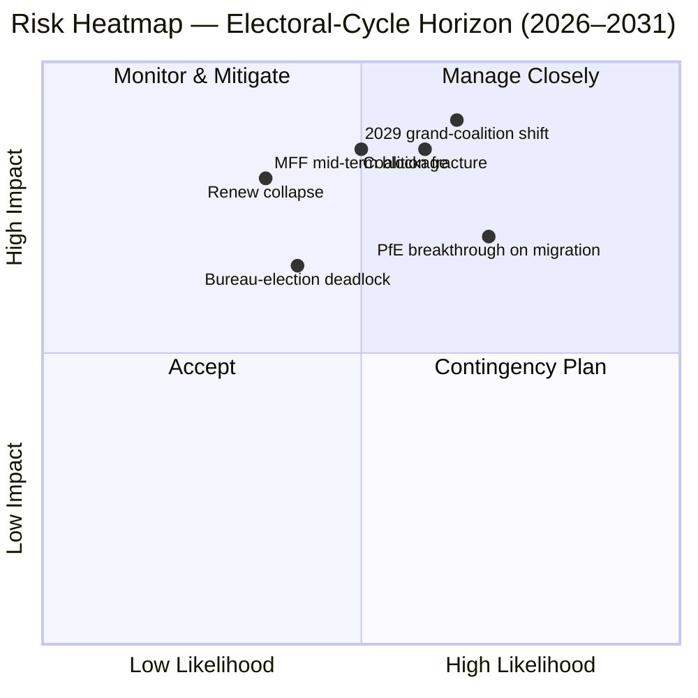

<!-- SPDX-FileCopyrightText: 2026 Hack23 AB -->
<!-- SPDX-License-Identifier: Apache-2.0 -->

# エグゼクティブ・ブリーフ — EP10 選挙サイクル俯瞰（2024–2029）| 2026-05-11

**分類：** OSINT — 公開議会記録
**信頼度：** 🟡 中高（安定性スコア 84/100；議会構造データに基づく。個別投票データは含まない）
**実行パス：** `analysis/daily/2026-05-11/election-cycle/`
**時間軸：** 2026-05-11 → 2031-05-10（60 か月間の選挙サイクル俯瞰）
**作成日：** 2026-05-16（事後ブリーフ。新規 MCP 呼び出しなし — 本実行の 25 成果物を要約）
**一次情報源：** EP MCP `generate_political_landscape`、`analyze_coalition_dynamics`、`early_warning_system`、`compare_political_groups`、`sentiment_tracker`、`get_plenary_sessions`（year=2026）、`get_all_generated_stats`（2019–2026）。

---

## 🎯 BLUF

2024 年選挙は、**9 会派 717 議員からなる EP10 を生み出した。分断指数 6.58 は EP6（2004–2009）以来の最高値**である。中道コアの EPP+S&D+Renew は**絶対過半数ライン 361 議席を 36 議席上回る 396 議席（55.2%）**を保有しているが、このマージンは **EP9 の 86 議席の半分にも満たない**。このため、一つの国別代表団の離反が票決結果を左右するようになっている。`early_warning_system` が発した唯一の HIGH 警告は `DOMINANT_GROUP_RISK` であり、EPP の 25.5% 議席シェアはいかなる僅差中道連立においても事実上の拒否権を与えている。**2027 年 1 月の議長団選挙が最初の試練**となり、この影響力がポスト配分（現状維持）として行使されるのか、政策譲歩（右傾化）として行使されるのかが問われる。分極化指数 0.22 は大連立崩壊の閾値 0.40 を大きく下回っており、中核的計算はまだ機能している。運営上のリスクは崩壊ではなく**任期中途の再調整**である。**6 つの主要判断**（J1–J6）がこの議会期を規定する：中道連立は Q4 2026 まで持続（ほぼ確実、18 か月）、PfE が議席移動を通じて EP10 中に Renew を逆転（五分五分、36 か月）、「ヴェネツィア多数派」（EPP+ECR+PfE = 349 議席）が 2027 年中盤前に ≥3 件のファイルで発動（蓋然的、14 か月）、2029 年選挙では単独連立過半数は不可能（蓋然的、49 か月）。

---

## 🧭 3 Decisions This Brief Supports

| # | 決定事項 | 意思決定者 | 期限 | 根拠 |
|:-:|---------|-----------|:----:|------|
| 1 | **2027 年議長団選挙における規律戦略** — EPP は S&D との委員長ポスト交換で任期中盤の議長職を確保するのか、それとも政策譲歩（移民・農業）を要求するのか？ | 議長会議；EPP/S&D/Renew グループ指導部 | 2027 年 1 月（≤9 か月） | `risk-scoring/risk-matrix.md` の R-3（五分五分 × 影響度 M-H → スコア 8）；J6（任期中途再調整は蓋然的） |
| 2 | **任期中盤 MFF 2028+ 見直しの交渉授権** — 防衛・ウクライナ・法の支配にかかる条件付けのうち、中道連立にとって交渉不能な部分はどこか？ | BUDG 指導部、COREPER、副委員長 | 2026 年下期 → 2027 年中盤 | R-5（蓋然的 × 非常に高い影響度 → スコア 16、台帳最高リスク）；`intelligence/economic-context.md` |
| 3 | **「ヴェネツィア多数派」経路における会派規律の監視** — 出席率が 95% を下回った際に EPP+ECR+PfE が単純過半数で可決できるファイル（移民・農業・気候後退）はどれか？ | 会派幹事局；Greens/Renew 影のレポーター | 継続的（12 か月監視） | R-2（五分五分 × 高い影響度 → スコア 9）；J3（蓋然的、14 か月）；`intelligence/coalition-dynamics.md` |

各決定事項は `risk-scoring/risk-matrix.md` のリスク台帳の行と `intelligence/synthesis-summary.md` の WEP 評価に紐付けられており、論拠が反証可能な形で示されている。

---

## 📰 60-Second Read

- 🔴 **マージンが半減：** 中道連立 EPP+S&D+Renew のマージンが EP9 の 86 議席から EP10 の **36 議席**へ縮小（`generate_political_landscape`、A1）。
- 🟠 **分断が最高値：** 指数 **6.58 は EP6（2004–2009）以来最高**；`compare_political_groups` は EP9 比で**1 ファイル当たりの修正案が 12.6% 増**と示す。
- 🟢 **安定性はまだ機能的：** `early_warning_system` が返したスコアは **84/100、総合リスク MEDIUM**；分極化 **0.22 ≪ 崩壊閾値 0.40**。
- 🟡 **唯一の HIGH 警告：** EPP 25.5% 議席シェアでの `DOMINANT_GROUP_RISK` — 集中した影響力であり、議場崩壊ではない。
- 🔵 **「ヴェネツィア多数派」の武器化：** EPP+ECR+PfE = **349 議席（48.7%）** — 絶対過半数には 12 議席不足するが、**出席率が 95% を下回ると単純過半数の票決で勝利**；結成以来 ≥4 件の移民・農業ファイルで既に発動。
- 🟣 **左派ブロックは構造的に少数：** S&D+Greens/EFA+The Left = **234 議席（32.6%）** — Renew の分裂や欠席ダイナミクスなしにはグリーンディール後退を阻止できない。
- 🩷 **Renew のプレッシャー：** 102 → 77 議席（**−24.5%**）は 2024 年の構造変化で 2 番目に大きく、マージン半減の前提条件。
- ⚪ **強制的節目 2026 年下期 → 2027 年第 1 四半期：** （a）2027 年 1 月議長団選挙；（b）任期中盤 MFF 2028+ 見直し；（c）欧州委員会 2026 年作業プログラムの成果物フロー（2027 年まで四半期約 18 件の OLP ファイル）。

---

## 🗂️ Headline Judgements (from `intelligence/synthesis-summary.md`)

| # | 判断 | WEP 範囲 | 信頼度 | 時間軸 |
|:-:|-----|---------|:------:|:------:|
| J1 | 中道 EPP+S&D+Renew は Q4 2026 まで ≥70% の OLP ファイルで作業過半数を維持 | **ほぼ確実** | 中高 | 18 か月 |
| J2 | PfE は EP10 中に議席移動（選挙でなく）を通じて第 3 会派として Renew を逆転 | 五分五分 | 中程度 | 36 か月 |
| J3 | 「ヴェネツィア多数派」（EPP+ECR+PfE）が 2027 年中盤前に ≥3 件の移民・農業・気候後退ファイルで発動 | **蓋然的** | 中程度 | 14 か月 |
| J4 | 2029 年選挙では単独 361+ 連立過半数は生まれない；新たな大連立憲章が必要 | **蓋然的** | 中程度 | 49 か月 |
| J5 | 現行会派 ≥1（ESN または NI プール）が 2029 年選挙後の再編に失敗 | 五分五分 | 中程度 | 53 か月 |
| J6 | 任期中途再調整（≥10 人の会派移動）が 2027 年に議長団選挙を巡って発生 | **蓋然的** | 中程度 | 9 か月 |

J1–J6 を裏付ける証拠は、本ブリーフ冒頭に記録されたフェーズ A の MCP キャプチャーに由来する；完全な証拠チェーンは `intelligence/synthesis-summary.md` と `intelligence/coalition-dynamics.md` にある。

---

## ⚠️ Risk Snapshot

**定量化された上位 3 リスク**（`risk-scoring/risk-matrix.md` よりスコア順）：

| ID | リスク | 蓋 | 影 | スコア | 加速トリガー | 担当 |
|:--:|-------|:-:|:-:|:-----:|------------|------|
| **R-5** | 任期中盤 MFF 2028+ 見直しが 2027 年中盤前に失敗 | 蓋然的 | 非常に高い | **16** | 純受取国の拠出分担を巡る理事会の行き詰まり；防衛増強の未解決 | BUDG / 副委員長 |
| **R-7** | 2029 年選挙で中道連立なき 7+ 会派議会が生まれる | 蓋然的 | 非常に高い | **16** | PfE が選挙前に ECR 国別代表団を統合 | 超党派指導者 |
| **R-1** | 主要 OLP ファイルで中道連立が作業過半数を失う | 蓋然的 | 高い | **12** | 国別代表団の離反（特に Renew イベリア半島・フランスブロック） | EPP/S&D/Renew 指導部 |

R-6（法の支配条件付けにおける国別代表団離反、12 ポイント）は同一範囲にあり、R-1 の中で最も実現しやすいトリガーである。

---

## 🔮 Top Forward Triggers

`extended/forward-indicators.md` と本実行のシナリオブランチ（`intelligence/scenario-forecast.md` S1–S7）より：

1. **2027 年 1 月議長団選挙** — EPP が S&D および Renew への委員長ポスト公開コストなしに議長職を確保した場合、`DOMINANT_GROUP_RISK` は HIGH 警告から R-3 アクティブリスクに格上げされる。
2. **MFF 2028+ 交渉授権の本会議採決**（目標 2026 年下期 → 2027 年中盤）— 2027 年第 1 四半期末までに中道 BUDG 授権が得られなければ、R-5 が黄色から赤に格上げされ、シナリオ 6（大連立再署名）を促進する。
3. **「ヴェネツィア多数派」発動を監視すべき 3 件の指名ファイル（今後 14 か月）：** Renew イベリア・フランスブロックの出席率が 90% を下回る移民本会議；CAP 簡素化フォローアップ；2025 年以降の気候後退サイクル。J3（蓋然的）はこれらで確認または反証される。
4. **PfE 会派移動の監視** — `compare_political_groups` はすでに PfE を成長ポテンシャルが最も高い構造変化として標識している；ECR ポーランドまたはイタリア代表団の ≥10 人の移動が J2 と J6 の引き金となる。

**シナリオ 7（条約危機・構造的断裂）** は義務的な長テール分岐である：本実行の候補トリガーは（a）UA/MD 加盟条約改正、（b）外交・財政政策回廊の拡大、（c）ハンガリーを巡る第 7 条の格上げ、（d）理事会の行き詰まりによる任期中盤選挙、または（e）MFF 崩壊と暫定予算への転落。いずれも 12 か月のホライゾンにはない。

---

## 🛡️ Source-Quality Assessment

- **A1/A2 アンカー：** 会派構成、分断指数、本会議カレンダー、多期生産性レート — これらはブリーフの**構造的背骨**であり、Admiralty A1–A2 評価（EP オープンデータポータル）。
- **B3 留保：** `sentiment_tracker` の分極化（0.22）は**議席シェアに基づく制度的ポジショニングの代理変数であり、名目上の投票結合度ではない** — 議員個別の投票データは EP API でまだ公開されていない。J3/J4/J6 の中程度信頼度はこれを反映している。
- **A6（判断不能）：** `monitor_legislative_pipeline` は 0 件の手続きを返し、`network_analysis` は 50 ノード / 0 エッジを返した；いずれも**前方パイプラインの遅延**であり分析的失敗ではない。エゴネットワーク図とボトルネック検出は EP API がデータを公開するまで先送り。
- **F6（失敗）：** World Bank の EU 国コード（`EUU` / `EU`）は両方とも今回の実行で失敗；ブリーフは WB マクロ経済コンテキストに依存しない。
- **IMF SDMX 3.0：** 本選挙サイクル俯瞰の実行では照会しなかった；MFF 見直しのマクロ経済コンテキストが運営上必要になった場合は R-5 の再評価前に IMF WEO プローブを実施すること。

正味信頼度：**構造的計算は中高**（J1、R-1、R-5、R-7）、**行動判断は中程度**（J2、J3、J4、J6）— EP API が議員別結合度データを公開するまで。

---

## 🧭 ACH Competing-Hypothesis Note

同一の計算に対する 2 つの競合解釈が `extended/historical-parallels.md` で追跡されている：

- **H1 — 「EP10 は Renew を差し引いた EP9 だ」** マージンは小さいが連立の処方箋は変わっていない；任期中盤議長団選挙はポスト交換をもたらす；2029 年は右派ブロックが若干大きな類似の憲章を再び生む。`intelligence/scenario-forecast.md` のシナリオ 1 と 6。
- **H2 — 「EP10 は最初の PfE 軸議会だ」** 「ヴェネツィア多数派」が 3 件超のファイルで発動；EPP の国別代表団が移民政策で ECR に同調して動く；2027 年議長団選挙が公開の軸足転換の瞬間となる。シナリオ 2 と 4。

現在の証拠基盤 — 安定性スコア 84、分極化 0.22、分断 6.58、EPP 規律維持 — は Q4 2026 まで **H1 を支持（ほぼ確実）** するが、14 か月から 36 か月のホライゾンでは **H2 を反証しない**。このため、ブリーフはどちらかにコミットするのではなく両方を追跡している。

---

## 📎 Run Artifacts (Read-Before-Decide)

| 層 | 成果物 | 理由 |
|---|-------|------|
| 記事 | `article.md` | 主要ナラティブ；6 つの判断をカバーする 9,906 行 |
| 統合 | `intelligence/synthesis-summary.md` | BLUF + WEP テーブル + Admiralty 評価（信頼性あり） |
| 連立 | `intelligence/coalition-dynamics.md` | 「ヴェネツィア多数派」計算；EP9 → EP10 マージンデルタ |
| リスク台帳 | `risk-scoring/risk-matrix.md` | R-1 → R-10（L × I × スコア付き） |
| 定量 SWOT | `risk-scoring/quantitative-swot.md` | 構造的強みとマージン侵食の対比 |
| シナリオ | `intelligence/scenario-forecast.md` S1–S7（条約危機 = S7） | 確率加重分岐 |
| 指標 | `extended/forward-indicators.md` | 2029 年までのトリガーカレンダー |
| 任期弧 | `intelligence/term-arc.md`、`mandate-fulfilment-scorecard.md`、`presidency-trio-context.md` | 議長団選挙シークエンス |
| 議席予測 | `intelligence/seat-projection.md` | H1 対 H2 下の 2029 年予測 |
| 信頼性 | `intelligence/mcp-reliability-audit.md` | A6 / F6 行の解釈 |
| 自己省察 | `intelligence/methodology-reflection.md` | ステップ 10.5 クロージング |

---

**文書追跡**
- **テンプレート参照：** `analysis/templates/executive-brief.md`
- **成果物パス：** `analysis/daily/2026-05-11/election-cycle/executive-brief.md`
- **分類：** 公開
- **事後：** このブリーフは事後的なものです — 実行が完了した成果物をもとに 2026-05-16 に作成；**新規 MCP 呼び出しは行っていません**。すべての判断は実行自体が完了した内容を言い換え・蒸留・ACH 検証したものであり、新たな主張を提示するものではありません。
