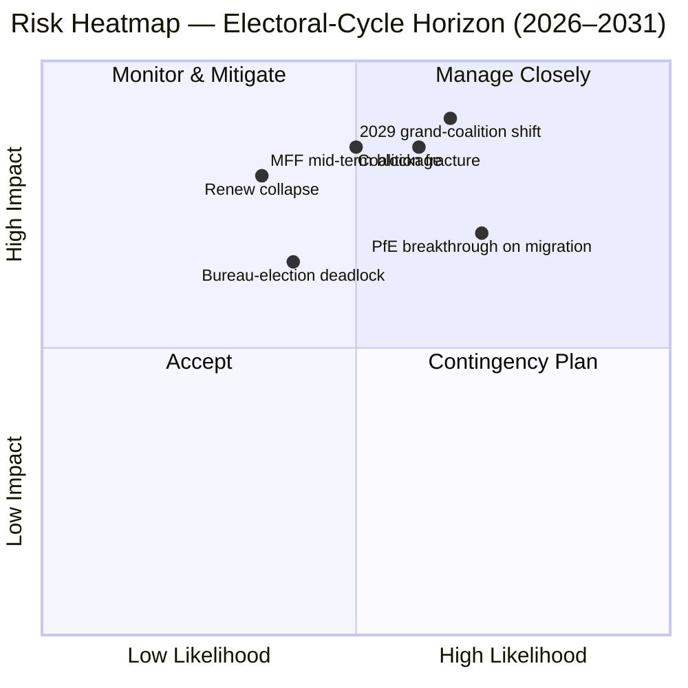

<!-- SPDX-FileCopyrightText: 2026 Hack23 AB -->
<!-- SPDX-License-Identifier: Apache-2.0 -->

# 집행 요약 — EP10 선거 주기 개관 (2024–2029) | 2026-05-11

**분류:** OSINT — 공개 의회 기록
**신뢰도:** 🟡 중상 (안정성 점수 84/100; 구조 데이터 기반, 개별 투표 데이터 미포함)
**실행 경로:** `analysis/daily/2026-05-11/election-cycle/`
**시간 범위:** 2026-05-11 → 2031-05-10 (60개월 선거 주기 개관)
**작성일:** 2026-05-16 (사후 브리핑; 신규 MCP 호출 없음 — 본 실행의 성과물 25건 요약)
**1차 출처:** EP MCP `generate_political_landscape`, `analyze_coalition_dynamics`, `early_warning_system`, `compare_political_groups`, `sentiment_tracker`, `get_plenary_sessions` (year=2026), `get_all_generated_stats` (2019–2026).

---

## 🎯 BLUF

2024년 선거는 **9개 교섭단체 717명으로 구성된 EP10을 탄생시켰다. 분열 지수 6.58은 EP6(2004–2009) 이래 최고치**다. 중도 핵심 EPP+S&D+Renew는 절대 과반수 기준선인 361석보다 **36석 많은 396석(55.2%)**을 보유하고 있지만, 이 마진은 **EP9의 86석 마진의 절반에도 미치지 못한다**. 따라서 한 국가 대표단의 이탈만으로도 파일별 과반수 계산이 상당히 달라진다. `early_warning_system`이 발령한 유일한 HIGH 경보는 `DOMINANT_GROUP_RISK`로, EPP의 25.5% 의석 점유율은 모든 좁은 중도 연립에서 사실상 거부권을 부여한다. **2027년 1월 의장단 선거가 첫 번째 검증 시험**으로, 이 영향력이 포트폴리오 거래(현상 유지)로 행사될지 아니면 정책 양보(우경화)로 행사될지를 가늠하게 된다. 분극화 지수 0.22는 대연립 붕괴 임계치 0.40보다 훨씬 낮으므로 핵심 계산은 여전히 작동한다. 운영 리스크는 붕괴가 아닌 **임기 중반 재조정**이다. **6개 주요 판단**(J1–J6)이 이 임기를 규정한다: 중도 연립은 Q4 2026까지 유지(거의 확실, 18개월), PfE가 이탈을 통해 EP10 기간 중 Renew를 추월(반반, 36개월), "베네치아 다수파"(EPP+ECR+PfE = 349석)가 2027년 중반 이전 ≥3개 파일에서 발동(가능성 있음, 14개월), 2029년 선거는 단일 연립 과반수를 만들어내지 못함(가능성 있음, 49개월).

---

## 🧭 3 Decisions This Brief Supports

| # | 결정 사항 | 결정 주체 | 마감 | 근거 |
|:-:|---------|---------|:----:|------|
| 1 | **2027년 의장단 선거 규율 전략** — EPP는 S&D와의 위원장직 교환으로 임기 중반 의장직을 확보할 것인가, 아니면 정책 양보(이민·농업)를 요구할 것인가? | 의장단 회의; EPP/S&D/Renew 교섭단체 대표 | 2027년 1월 (≤9개월) | `risk-scoring/risk-matrix.md`의 R-3 (반반 × 영향도 M-H → 점수 8); J6 (임기 중반 재조정 가능성 있음) |
| 2 | **임기 중반 MFF 2028+ 검토 협상 위임** — 국방·우크라이나·법치 조건 중 중도 연립에게 비협상 대상인 부분은 무엇인가? | BUDG 지도부, COREPER, 부위원장 | 2026년 하반기 → 2027년 중반 | R-5 (가능성 있음 × 매우 높은 영향도 → 점수 16, 대장부 최고 리스크); `intelligence/economic-context.md` |
| 3 | **"베네치아 다수파" 경로에서의 교섭단체 규율 모니터링** — 출석률이 95% 아래로 떨어질 때 EPP+ECR+PfE가 단순 과반수로 가결할 수 있는 파일(이민·농업·기후 후퇴)은 무엇인가? | 교섭단체 사무국; Greens/Renew 그림자 보고자 | 지속 (12개월 모니터링) | R-2 (반반 × 높은 영향도 → 점수 9); J3 (가능성 있음, 14개월); `intelligence/coalition-dynamics.md` |

각 결정은 `risk-scoring/risk-matrix.md`의 리스크 대장 행과 `intelligence/synthesis-summary.md`의 WEP 평가에 연결되어 있어 논거를 반증 가능한 형태로 제시한다.

---

## 📰 60-Second Read

- 🔴 **마진 절반으로 축소:** 중도 연립 EPP+S&D+Renew 마진이 EP9의 86석에서 EP10의 **36석**으로 감소 (`generate_political_landscape`, A1).
- 🟠 **분열 최고치:** 지수 **6.58 — EP6(2004–2009) 이래 최고**; `compare_political_groups`는 EP9 대비 **파일당 2차 독회 수정안 12.6% 증가**를 보여준다.
- 🟢 **안정성은 여전히 기능적:** `early_warning_system`이 반환한 점수는 **84/100, 종합 리스크 MEDIUM**; 분극화 **0.22 ≪ 붕괴 임계치 0.40**.
- 🟡 **유일한 HIGH 경보:** EPP 25.5% 의석 점유율에서의 `DOMINANT_GROUP_RISK` — 집중된 영향력이지 의회 붕괴가 아님.
- 🔵 **"베네치아 다수파" 무장화:** EPP+ECR+PfE = **349석(48.7%)** — 절대 과반수에 12석 부족하지만 **출석률 95% 미만 시 단순 과반수 투표에서 승리**; 창설 이후 이미 ≥4개 이민·농업 파일에서 발동.
- 🟣 **좌파 블록은 구조적으로 소수:** S&D+Greens/EFA+The Left = **234석(32.6%)** — Renew 분열이나 결석 역학 없이는 그린딜 후퇴를 막을 수 없음.
- 🩷 **Renew 압박:** 102 → 77석(**−24.5%**)은 2024년 두 번째로 큰 구조 변화이자 마진 절반 축소의 전제 조건.
- ⚪ **강제 변곡점 2026년 하반기 → 2027년 Q1:** (a) 2027년 1월 의장단 선거; (b) 임기 중반 MFF 2028+ 검토; (c) 집행위 2026년 작업 프로그램 성과물 흐름 (2027년까지 분기당 약 18개 OLP 파일).

---

## 🗂️ Headline Judgements (from `intelligence/synthesis-summary.md`)

| # | 판단 | WEP 범위 | 신뢰도 | 기간 |
|:-:|-----|---------|:------:|:----:|
| J1 | 중도 EPP+S&D+Renew는 Q4 2026까지 ≥70% OLP 파일에서 작동 과반수 유지 | **거의 확실** | 중상 | 18개월 |
| J2 | PfE는 선거가 아닌 이탈을 통해 EP10 기간 중 제3 교섭단체로 Renew를 추월 | 반반 | 중간 | 36개월 |
| J3 | "베네치아 다수파"(EPP+ECR+PfE)가 2027년 중반 이전 ≥3개 이민·농업·기후 후퇴 파일에서 발동 | **가능성 있음** | 중간 | 14개월 |
| J4 | 2029년 선거는 단일 361+ 연립 과반수를 만들지 못하고 갱신된 대연립 헌장을 강요 | **가능성 있음** | 중간 | 49개월 |
| J5 | 현행 교섭단체 ≥1개(ESN 또는 NI 풀)가 2029년 선거 이후 재구성에 실패 | 반반 | 중간 | 53개월 |
| J6 | 임기 중반 재조정(≥10인 교섭단체 이동)이 2027년 의장단 선거를 둘러싸고 발생 | **가능성 있음** | 중간 | 9개월 |

J1–J6을 뒷받침하는 증거는 이 브리핑 상단에 기록된 Phase A MCP 캡처에서 나온다; 완전한 증거 체인은 `intelligence/synthesis-summary.md`와 `intelligence/coalition-dynamics.md`에 있다.

---

## ⚠️ Risk Snapshot

**정량화된 상위 3개 리스크** (`risk-scoring/risk-matrix.md` 점수 순):

| ID | 리스크 | 가 | 영 | 점수 | 가속 트리거 | 담당 |
|:--:|-------|:-:|:-:|:---:|----------|------|
| **R-5** | 임기 중반 MFF 2028+ 검토가 2027년 중반 이전 실패 | 가능성 있음 | 매우 높음 | **16** | 순수취국 기여금 봉투를 둘러싼 이사회 교착; 방위 강화 미해결 | BUDG / 부위원장 |
| **R-7** | 2029년 선거가 중도 과반수 없는 7+ 교섭단체 의회 생성 | 가능성 있음 | 매우 높음 | **16** | PfE가 선거 전 ECR 국가 대표단 통합 | 초당파 지도자 |
| **R-1** | 중도 연립이 주요 OLP 파일에서 작동 과반수 상실 | 가능성 있음 | 높음 | **12** | 국가 대표단 이탈 (특히 Renew 이베리아·프랑스 블록) | EPP/S&D/Renew 지도부 |

R-6(법치 조건에서의 국가 대표단 이탈, 12점)은 같은 범위에 있으며 R-1의 트리거 중 가장 현실적이다.

---

## 🔮 Top Forward Triggers

`extended/forward-indicators.md`와 본 실행의 시나리오 분기(`intelligence/scenario-forecast.md` S1–S7):

1. **2027년 1월 의장단 선거** — EPP가 S&D 및 Renew에 대한 공개 비용 없이 의장직을 확보하면 `DOMINANT_GROUP_RISK`가 HIGH 경보에서 활성 R-3 리스크로 격상된다.
2. **MFF 2028+ 협상 위임 본회의 표결** (목표 2026년 하반기 → 2027년 중반) — 2027년 Q1 말까지 중도 BUDG 위임을 확보하지 못하면 R-5가 노란색에서 빨간색으로 격상되어 시나리오 6(대연립 재서명)을 촉진한다.
3. **향후 14개월 내 "베네치아 다수파" 발동을 위해 지명된 3개 파일:** Renew 이베리아·프랑스 블록 출석률이 90% 아래로 떨어지는 이민 본회의; CAP 간소화 후속 조치; 2025년 이후 기후 후퇴 주기. J3(가능성 있음)은 이 사건들로 확인 또는 반증된다.
4. **PfE 교섭단체 이탈 모니터링** — `compare_political_groups`는 이미 PfE를 가장 높은 성장 잠재력을 가진 구조 변화로 표시; ECR 폴란드 또는 이탈리아 대표단의 ≥10인 이탈이 J2와 J6의 방아쇠가 된다.

의무적 **시나리오 7(조약 위기·구조 단절)**은 긴 꼬리에 있다: 본 실행의 후보 트리거는 (a) UA/MD 가입 조약 개정, (b) 외교·재정 정책 회랑 확대, (c) 헝가리 관련 제7조 격상, (d) 이사회 교착에 의한 임기 중반 선거, (e) MFF 붕괴와 잠정 예산으로의 전락. 어느 것도 12개월 지평선에 없다.

---

## 🛡️ Source-Quality Assessment

- **A1/A2 앵커:** 교섭단체 구성, 분열 지수, 본회의 달력, 다임기 생산성 비율 — 브리핑의 **구조적 중추**이며 Admiralty A1–A2 등급(EP 오픈 데이터 포털).
- **B3 유보:** `sentiment_tracker` 분극화(0.22)는 **의석 점유율 기반 제도적 포지셔닝의 대리 변수이지 명목 투표 결속도가 아니다** — 의원별 투표 데이터는 EP API에서 아직 공개되지 않았다. J3/J4/J6의 중간 신뢰도는 이를 반영한다.
- **A6(판단 불능):** `monitor_legislative_pipeline`은 0건의 절차를 반환했고 `network_analysis`는 50 노드 / 0 엣지를 반환했다; 둘 다 **전방 파이프라인 지연**이지 분석 실패가 아니다. 에고 네트워크 도표와 병목 탐지는 EP API가 데이터를 공개할 때까지 연기된다.
- **F6(실패):** World Bank EU 국가 코드(`EUU` / `EU`)는 이번 실행에서 모두 실패; 브리핑은 WB 거시경제 맥락에 의존하지 않는다.
- **IMF SDMX 3.0:** 이번 선거 주기 개관 실행에서는 조회하지 않았다; MFF 검토를 위한 거시경제 맥락이 운영상 필요해지면 R-5 재평가 전에 IMF WEO 탐색을 실시할 것.

순 신뢰도: **구조적 계산은 중상**(J1, R-1, R-5, R-7), **행동 판단은 중간**(J2, J3, J4, J6) — EP API가 의원별 결속도 데이터를 공개할 때까지.

---

## 🧭 ACH Competing-Hypothesis Note

동일한 계산에 대한 두 경쟁 해석이 `extended/historical-parallels.md`에서 추적된다:

- **H1 — "EP10은 Renew를 뺀 EP9다."** 마진은 작지만 연립 처방은 변하지 않았다; 임기 중반 의장단 선거는 포트폴리오 교환을 낳는다; 2029년은 약간 더 큰 우파 블록을 가진 유사한 헌장을 재생성한다. `intelligence/scenario-forecast.md`의 시나리오 1과 6.
- **H2 — "EP10은 최초의 PfE 중심 의회다."** "베네치아 다수파"가 3개 이상의 파일에서 발동된다; EPP 국가 대표단이 이민 정책에서 ECR과 연대해 이동한다; 2027년 의장단 선거가 공개적인 축 전환의 순간이 된다. 시나리오 2와 4.

현재 증거 기반 — 안정성 점수 84, 분극화 0.22, 분열 6.58, EPP 규율 유지 — 은 Q4 2026까지 **H1을 지지(거의 확실)**하지만 14~36개월 지평선에서는 **H2를 반증하지 않는다**. 따라서 브리핑은 어느 하나에 헌신하지 않고 둘 다 추적한다.

---

## 📎 Run Artifacts (Read-Before-Decide)

| 레이어 | 성과물 | 이유 |
|------|-------|------|
| 기사 | `article.md` | 주요 서술; 6개 판단을 다루는 9,906행 |
| 종합 | `intelligence/synthesis-summary.md` | BLUF + WEP 테이블 + Admiralty 등급 (신뢰할 수 있음) |
| 연립 | `intelligence/coalition-dynamics.md` | "베네치아 다수파" 계산; EP9 → EP10 마진 델타 |
| 리스크 대장 | `risk-scoring/risk-matrix.md` | R-1 → R-10 (L × I × 점수 포함) |
| 정량 SWOT | `risk-scoring/quantitative-swot.md` | 구조적 강점 대 마진 침식 |
| 시나리오 | `intelligence/scenario-forecast.md` S1–S7 (조약 위기 = S7) | 확률 가중 분기 |
| 지표 | `extended/forward-indicators.md` | 2029년까지의 트리거 달력 |
| 임기 호 | `intelligence/term-arc.md`, `mandate-fulfilment-scorecard.md`, `presidency-trio-context.md` | 의장단 선거 시퀀스 |
| 의석 예측 | `intelligence/seat-projection.md` | H1 대 H2 하의 2029년 예측 |
| 신뢰성 | `intelligence/mcp-reliability-audit.md` | A6 / F6 행 해석 |
| 자기 성찰 | `intelligence/methodology-reflection.md` | 단계 10.5 완결 |

---

**문서 추적**
- **템플릿 참조:** `analysis/templates/executive-brief.md`
- **성과물 경로:** `analysis/daily/2026-05-11/election-cycle/executive-brief.md`
- **분류:** 공개
- **사후:** 이 브리핑은 사후 작성입니다 — 실행이 완료된 성과물에서 2026-05-16에 작성됨; **신규 MCP 호출 없음**. 모든 판단은 실행 자체가 완료한 내용을 재표현·정제·ACH 검증한 것이며 새로운 주장을 제시하지 않습니다.
