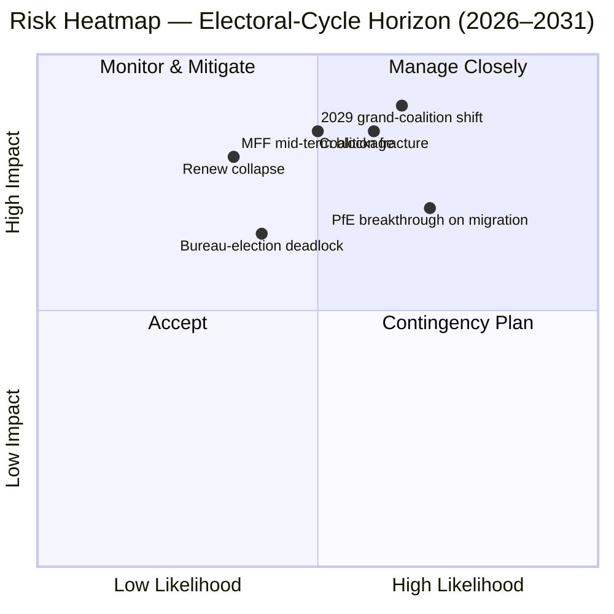

<!-- SPDX-FileCopyrightText: 2026 Hack23 AB -->
<!-- SPDX-License-Identifier: Apache-2.0 -->

# Uitvoerend Briefingrapport — EP10 Verkiezingscyclus-Overlay (2024–2029) | 2026-05-11

**Classificatie:** OSINT — Openbaar parlementair register
**Betrouwbaarheid:** 🟡 Matig-Hoog (stabiliteitsscore 84/100; gegevens zijn structureel, niet op stemniveau)
**Uitvoering:** `analysis/daily/2026-05-11/election-cycle/`
**Horizon:** 2026-05-11 → 2031-05-10 (60-maanden verkiezingscyclus-overlay)
**Gegenereerd:** 2026-05-16 (retrospectief briefingrapport, geen nieuwe MCP-aanroepen — synthetiseert de eigen 25 artefacten van de uitvoering)
**Primaire bronnen:** EP MCP `generate_political_landscape`, `analyze_coalition_dynamics`, `early_warning_system`, `compare_political_groups`, `sentiment_tracker`, `get_plenary_sessions` (jaar=2026), `get_all_generated_stats` (2019–2026).

---

## 🎯 BLUF

De verkiezingen van 2024 lieten EP10 achter met **717 EP-leden verdeeld over negen fracties, fragmentatie-index 6,58 — de hoogste waarde sinds EP6 (2004–2009)**. Het centristische EVP+S&D+Renew-blok heeft **396 zetels (55,2 %)** met een **buffer van 36 zetels** boven de drempel van 361 zetels voor een absolute meerderheid; die buffer is **minder dan de helft van EP9's marge van 86 zetels**, zodat één enkele nationale delegatieafwijking de meerderheidsrekening per dossier nu significant wijzigt. De enige HIGH-ernststwaarschuwing van `early_warning_system` is `DOMINANT_GROUP_RISK` — het aandeel van 25,5 % van de EVP geeft veto-invloed in elke smalle centristische coalitie, en **de Bureau-verkiezing van januari 2027 is de eerste geplande test** of die invloed wordt uitbetaald in portefeuilles (status quo) of in politieke concessies (rechtse drift). Polarisatie-index 0,22 ligt ruim onder de 0,40 breukdrempel voor de grote coalitie, zodat de onderliggende rekenkunde nog steeds werkt; het operationele risico is **tussentijdse herpositionering** en geen instorting. **Zes kopjudgements** (J1–J6) kaderen de cyclus: centristische meerderheid houdt stand tot Q4 2026 (Zeer waarschijnlijk, 18-maanden horizon), PfE passeert Renew tijdens EP10 via overdrachten (Gelijke kansen, 36 maanden), Venezuela-meerderheid (EVP+ECR+PfE = 349 zetels) wordt ingeroepen bij ≥3 terugdraaidossiers vóór midden 2027 (Waarschijnlijk, 14 maanden), 2029 levert geen enkel coalitieoverderheid op (Waarschijnlijk, 49 maanden).

---

## 🧭 3 Decisions This Brief Supports

| # | Beslissing | Wie besluit | Deadline | Bewijs |
|:-:|------------|-------------|:--------:|--------|
| 1 | **Fractiedisciplinestrategie voor de Bureau-verkiezing 2027** — behaalt de EVP het tussentijdse voorzitterschap via een portefeuilleruil met S&D, of eist het politieke concessies (migratie / landbouw)? | Conferentie van Voorzitters; EVP/S&D/Renew-fractieleiders | Jan 2027 (≤ 9 maanden) | R-3 in `risk-scoring/risk-matrix.md` (Kans Gelijk × Impact M-H → score 8); J6 (tussentijdse herpositionering Waarschijnlijk) |
| 2 | **MFF 2028+ tussentijdse herziening onderhandelingsmandaat** — hoeveel defensie / Oekraïne / rechtsstaatconditionaliteit is niet-onderhandelbaar voor de centristische meerderheid? | BUDG-leiding, COREPER, VP's van de Commissie | H2 2026 → midden 2027 | R-5 (Waarschijnlijk × Zeer hoog → score 16, het hoogste individuele risico in het register); `intelligence/economic-context.md` |
| 3 | **Fractiedisciplinetoezicht op het Venezuela-meerderheidspad** — welke dossiers (migratie, landbouw, klimaatterugdraaiing) lopen het risico op een EVP+ECR+PfE eenvoudige-meerderheidsoverwinning wanneer de deelname onder 95 % daalt? | Fractiesecretariaten; schaduwrapporteurs in Greens / Renew | doorlopend, 12-maanden toezicht | R-2 (Gelijke kansen × Hoog → score 9); J3 (Waarschijnlijk, 14 maanden); `intelligence/coalition-dynamics.md` |

Elke beslissing is gekoppeld aan een rij in het risicoregister in `risk-scoring/risk-matrix.md` en een WEP-bandevaluatie in `intelligence/synthesis-summary.md` zodat de redenering falsifieerbaar is.

---

## 📰 60-Second Read

- 🔴 **Buffer gehalveerd:** centristische EVP+S&D+Renew-blok daalde van 86 zetels voorsprong in EP9 naar **36 zetels voorsprong in EP10** (`generate_political_landscape`, A1).
- 🟠 **Fragmentatiepiek:** index **6,58 — hoogste sinds EP6** (2004–2009); `compare_political_groups` toont een **12,6 % stijging in amendementstelling per dossier** t.o.v. EP9.
- 🟢 **Stabiliteit nog steeds functioneel:** `early_warning_system` retourneert score **84/100, MEDIUM totaalrisico**; polarisatie **0,22 ≪ 0,40 breukdrempel**.
- 🟡 **Enige HIGH-ernststwaarschuwing:** `DOMINANT_GROUP_RISK` bij het aandeel van 25,5 % van de EVP — geconcentreerde invloed, geen kameristorting.
- 🔵 **Venezuela-meerderheid bewapend:** EVP+ECR+PfE = **349 zetels (48,7 %)** — 12 kort van absolute meerderheid maar **wint bij gewone-meerderheidsstemmen wanneer aanwezigheid onder 95 % daalt**; al geactiveerd bij ≥4 migratie-/landbouwdossiers sinds de inauguratie.
- 🟣 **Linkervleugel structureel kort:** S&D+Greens/EFA+The Left = **234 zetels (32,6 %)** — kan een Green Deal-terugdraaiing niet verslaan zonder Renew-afwijking of afwezigheidsgedreven dynamiek.
- 🩷 **Renew-compressie:** 102 → 77 zetels (**−24,5 %**) is de op één na ingrijpendste structurele wijziging van 2024 en de voorwaarde voor de bufferverdeling.
- ⚪ **Dwangfuncties H2 2026 → Q1 2027:** (a) Bureau-verkiezing jan 2027; (b) MFF 2028+ tussentijdse herziening; (c) Commissie Werkprogramma 2026 leveringspuls (~18 OLP-dossiers/kwartaal tot 2027).

---

## 🗂️ Headline Judgements (from `intelligence/synthesis-summary.md`)

| # | Oordeel | WEP-band | Betrouwbaarheid | Horizon |
|:-:|---------|----------|:---------------:|:-------:|
| J1 | Centristische EVP+S&D+Renew behoudt een werkende meerderheid op ≥70 % van de OLP-dossiers tot Q4 2026 | **Zeer waarschijnlijk** | Matig-Hoog | 18 maanden |
| J2 | PfE passeert Renew als op twee na grootste fractie tijdens EP10 (via overdrachten, niet via verkiezingen) | Gelijke kansen | Matig | 36 maanden |
| J3 | Venezuela-meerderheid (EVP+ECR+PfE) wordt ingeroepen bij ≥3 migratie-/landbouw-/klimaatterugdraaiingsdossiers vóór midden 2027 | **Waarschijnlijk** | Matig | 14 maanden |
| J4 | Verkiezingen 2029 leveren geen enkel coalitionsmeerderheid van 361+ op; dwingen een vernieuwd groot-coalitieakkoord | **Waarschijnlijk** | Matig | 49 maanden |
| J5 | ≥1 huidige fractie (ESN of een NI-cluster) slaagt er niet in zich na de verkiezingen van 2029 te hervormen | Gelijke kansen | Matig | 53 maanden |
| J6 | Tussentijdse herpositionering (fractiemisseling door ≥10 EP-leden) vindt plaats in 2027 rond de Bureau-verkiezing | **Waarschijnlijk** | Matig | 9 maanden |

Het bewijs dat J1–J6 ondersteunt, is afkomstig van de Fase A MCP-opnames vermeld in de koptekst van dit rapport; volledige keten in `intelligence/synthesis-summary.md` en `intelligence/coalition-dynamics.md`.

---

## ⚠️ Risk Snapshot

**Top drie gekwantificeerde risico's** (uit het `risk-scoring/risk-matrix.md`-register, gerangschikt op score):

| ID | Risico | L | I | Score | Aanleiding die het zou doen vorderen | Eigenaar |
|:--:|--------|:-:|:-:|:-----:|--------------------------------------|---------|
| **R-5** | MFF 2028+ tussentijdse herziening mislukt vóór midden 2027 | Waarschijnlijk | Zeer hoog | **16** | Raadsblokkade over nettobetaler-envelop; defensieversterking onopgelost | BUDG / VP's van de Commissie |
| **R-7** | Verkiezingen 2029 leveren een 7+-fractieparlament op zonder centristische meerderheid | Waarschijnlijk | Zeer hoog | **16** | PfE consolideert ECR-nationale delegaties vóór verkiezingen | Fractieoverstijgende leiders |
| **R-1** | Centristische coalitie verliest werkende meerderheid bij een vlaggenschip OLP-dossier | Waarschijnlijk | Hoog | **12** | Nationale delegatieafwijking (esp. Renew Iberian or French bloc) | EVP/S&D/Renew-leiders |

R-6 (nationale delegatieafwijking bij rechtsstaatconditionaliteit, score 12) bevindt zich in hetzelfde register en is de meest waarschijnlijke concrete activator van R-1.

---

## 🔮 Top Forward Triggers

Uit `extended/forward-indicators.md` en de scenariobranches van de uitvoering (`intelligence/scenario-forecast.md` S1–S7):

1. **Bureau-verkiezing januari 2027** — als de EVP het voorzitterschap behaalt zonder een gepubliceerde prijs in commissievoorzitterschappen voor S&D en Renew, `DOMINANT_GROUP_RISK` escaleren van HIGH-ernststwaarschuwing naar actieve R-3-patstelling.
2. **MFF 2028+ onderhandelingsmandaatstemming** (doel H2 2026 → midden 2027) — het niet behalen van een centristische BUDG-mandaat voor eind Q1 2027 brengt R-5 van oranje naar rood en voedt Scenario 6 (Groot-coalitie Herbesluiting).
3. **Drie genoemde dossiers om in de gaten te houden voor Venezuela-meerderheidsactivering in de komende 14 maanden:** elke migratieprocedureplenumzitting waarbij de deelname van Renew Iberische of Franse delegatie onder 90 % daalt; GAB-vereenvoudigings-follow-ups; en de volgende post-2025 klimaatterugdraaiingscyclus. J3 (Waarschijnlijk) wordt door deze geverifieerd of gefalsificeerd.
4. **PfE-fractieoverdrachttoezicht** — `compare_political_groups` signaleert PfE al als de structurele verandering met de meeste ruimte om te groeien; een Poolse of Italiaanse ECR-delegatieoverdracht van ≥10 EP-leden is de operationele drukknop voor J2 en J6.

De verplichte **Scenario 7 (Verdragscrisis / structurele breuk)**-branch bevindt zich in de lange staart: kandidaataanleidingen per uitvoering zijn (a) uitbreidingsverdragsherziening UA/MD, (b) passerelle-uitbreiding naar buitenlands-/fiscaal beleid, (c) artikel 7-escalatie over Hongarije, (d) tussentijdse verkiezing vanuit Raadsblokkade, of (e) MFF-instorting in voorlopige twaalfden. Geen enkele bevindt zich op een 12-maanden horizon.

---

## 🛡️ Source-Quality Assessment

- **A1 / A2-ankers:** fractieopstelling, fragmentatie-index, plenumkalender, multi-termijn doorvoer — dit zijn de **structurele ruggengraat** van het rapport en zijn Admiraliteit A1–A2 (EP Open Data Portal).
- **B3-voorbehoud:** `sentiment_tracker`-polarisatie (0,22) is een **zetelaaandeel institutionele positieringsproxy, geen naamsteminghesie** — per-EP-lid stemgegevens worden nog niet blootgesteld door de EP-API. De Matige betrouwbaarheid voor J3/J4/J6 weerspiegelt dit.
- **A6 (niet te beoordelen):** `monitor_legislative_pipeline` retourneerde 0 procedures en `network_analysis` retourneerde 50 knooppunten / 0 kanten; beide zijn **upstream pipelinevertragingenilies**, geen analytische mislukkingen. Netwerksanalyse-ego-grafieken en pijplijnknelpuntdetectie worden uitgesteld tot de EP-API deze gegevens blootlegt.
- **F6 (mislukt):** World Bank EU-landcodes (`EUU` / `EU`) zijn beide mislukt in deze uitvoering; het rapport is niet afhankelijk van WB-macrocontext.
- **IMF SDMX 3.0:** niet bevraagd in deze verkiezingscyclus-overlay-uitvoering; als MFF-herziening macrocontext operationeel noodzakelijk wordt, een IMF WEO-sonde uitvoeren vóór het opnieuw scoren van R-5.

Netto betrouwbaarheid: **Matig-Hoog op structurele rekenkunde** (J1, R-1, R-5, R-7), **Matig op gedragsoordelen** (J2, J3, J4, J6) totdat per-EP-lid cohesiedata worden blootgesteld door de EP-API.

---

## 🧭 ACH Competing-Hypothesis Note

Twee concurrerende lezingen van dezelfde rekenkunde worden bijgehouden in `extended/historical-parallels.md`:

- **H1 — "EP10 is EP9 minus Renew."** De buffer is kleiner maar de coalitieformule is ongewijzigd; de tussentijdse Bureau-verkiezing levert een portefeuilleruil op; 2029 brengt een vergelijkbaar akkoord terug met een iets grotere rechtervleugel. Scenario's 1 en 6 in `intelligence/scenario-forecast.md`.
- **H2 — "EP10 is het eerste PfE-pivot-parlement."** De Venezuela-meerderheid activeert bij meer dan drie dossiers; een EVP nationale delegatie beweegt naar disciplineren met de ECR op migratie; een Bureau-verkiezing 2027 wordt het publieke pivotmoment. Scenario's 2 en 4.

De huidige bewijsbasis — stabiliteitsscore 84, polarisatie 0,22, fragmentatie 6,58, EVP-discipline gehandhafd — **gunstigt H1 (Zeer waarschijnlijk)** tot Q4 2026 maar **falsificeert H2** op een 14-tot-36-maanden horizon niet. Het rapport volgt daarom beide in plaats van zich te binden aan één.

---

## 📎 Run Artifacts (Read-Before-Decide)

| Laag | Artefact | Waarom |
|------|----------|--------|
| Artikel | `article.md` | Publieke narratief; 9.906 regels die alle zes oordelen omvatten |
| Synthese | `intelligence/synthesis-summary.md` | BLUF + WEP-tabel + Admiraliteitsbeoordeling (gezaghebbend) |
| Coalitie | `intelligence/coalition-dynamics.md` | Venezuela-meerderheidsrekenkunde; EP9 → EP10 bufferedelta |
| Risicoregister | `risk-scoring/risk-matrix.md` | R-1 → R-10 met L × I × Score |
| Kwantitatief SWOT | `risk-scoring/quantitative-swot.md` | Structurele sterktes vs. buffererosie |
| Scenario's | `intelligence/scenario-forecast.md` S1–S7 (Verdragscrisis = S7) | Waarschijnlijkheidsgewogen branches |
| Indicatoren | `extended/forward-indicators.md` | Aanleididingskalender tot 2029 |
| Termijnboog | `intelligence/term-arc.md`, `mandate-fulfilment-scorecard.md`, `presidency-trio-context.md` | Bureau-verkiezingssequentiëring |
| Zetelprognose | `intelligence/seat-projection.md` | Prognose 2029 onder H1 vs. H2 |
| Betrouwbaarheid | `intelligence/mcp-reliability-audit.md` | A6 / F6-regels toegelicht |
| Zelfreview | `intelligence/methodology-reflection.md` | Stap 10.5-afsluiting |

---

**Documentbeheer**
- **Sjabloonreferentie:** `analysis/templates/executive-brief.md`
- **Artefactpad:** `analysis/daily/2026-05-11/election-cycle/executive-brief.md`
- **Classificatie:** Openbaar
- **Retrospectief:** Dit rapport is post-hoc — geschreven op 2026-05-16 vanuit de gecommitteerde artefacten van de uitvoering; **er zijn geen nieuwe MCP-aanroepen gedaan**. Alle oordelen herformuleren, destilleren en ACH-kruisverwijzen wat de uitvoering zelf heeft gecommitteerd; er worden geen nieuwe beweringen geïntroduceerd.
