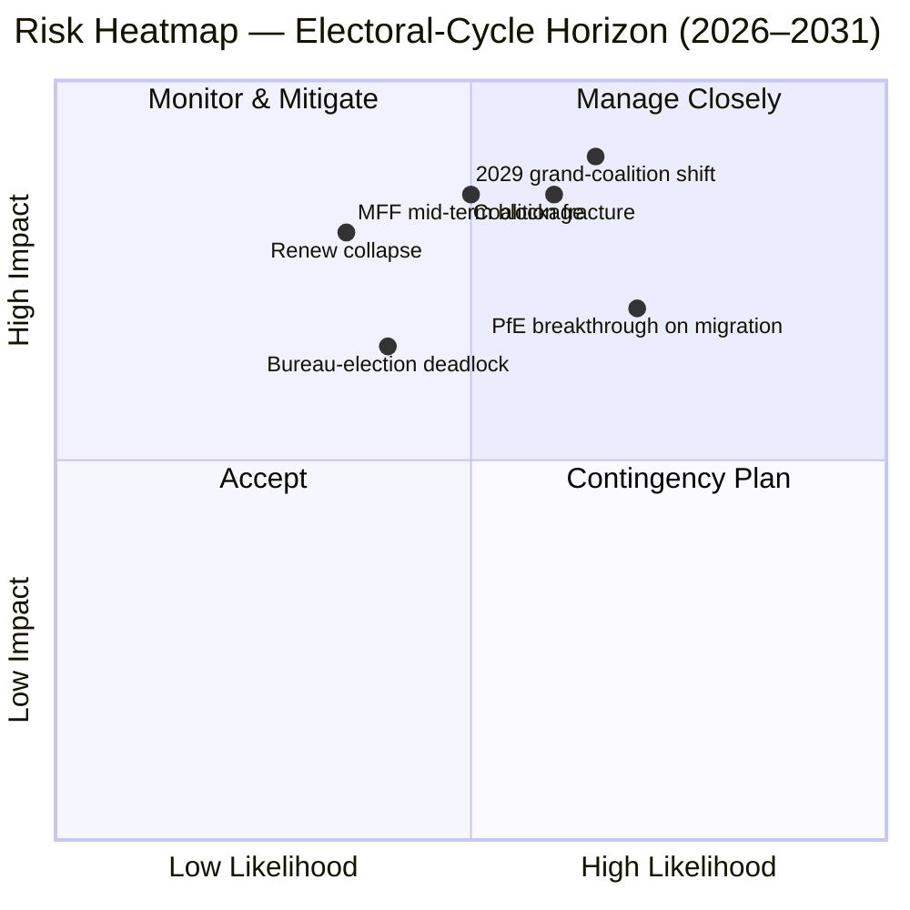

<!-- SPDX-FileCopyrightText: 2026 Hack23 AB -->
<!-- SPDX-License-Identifier: Apache-2.0 -->

# Utøvende Briefing — EP10 Valgssyklus-Overlay (2024–2029) | 2026-05-11

**Klassifisering:** OSINT — Offentlig parlamentarisk rekord
**Konfidens:** 🟡 Moderat-Høy (stabilitetspoeng 84/100; data er strukturell, ikke stemmenivå)
**Kjøring:** `analysis/daily/2026-05-11/election-cycle/`
**Horisont:** 2026-05-11 → 2031-05-10 (60-måneders valgssyklus-overlay)
**Generert:** 2026-05-16 (retrospektivt briefing, ingen nye MCP-kall — syntetiserer kjøringens egne 25 artefakter)
**Primære kilder:** EP MCP `generate_political_landscape`, `analyze_coalition_dynamics`, `early_warning_system`, `compare_political_groups`, `sentiment_tracker`, `get_plenary_sessions` (år=2026), `get_all_generated_stats` (2019–2026).

---

## 🎯 BLUF

Valget i 2024 etterlot EP10 med **717 MEP-er fordelt på ni grupper, fragmenteringsindeks 6,58 — den høyeste avlesningen siden EP6 (2004–2009)**. Det sentristiske EPP+S&D+Renew-blokket har **396 seter (55,2 %)** med en **36-seters buffer** over terskelen på 361 seter for absolutt flertall; den bufferen er **mindre enn halvparten av EP9s 86-seters margin**, slik at en enkelt nasjonal delegasjonsavvik nå meningsfullt endrer fil-for-fil-flertallsaritmetikken. Den eneste HIGH-alvorlighetsadvarselen fra `early_warning_system` er `DOMINANT_GROUP_RISK` — EPPs andel på 25,5 % gir vetoinnflytelse i enhver smal sentristisk koalisjon, og **januar 2027-Byråvalget er den første planlagte prøven** på om den innflytelsen betales med porteføljer (status quo) eller med politikkkonsesjoner (høyredrift). Polariseringsindeks 0,22 er godt under grensen 0,40 for sammenbrudd av storkoalisjonen, slik at den underliggende aritmetikken fortsatt fungerer; den operasjonelle risikoen er **mellomtermsjustering** snarere enn kollaps. **Seks overskriftsvurderinger** (J1–J6) rammer inn syklusen: sentristisk flertall holder til Q4 2026 (Svært sannsynlig, 18-måneders horisont), PfE overtar Renew under EP10 via overførsler (Jevne sjanser, 36 måneder), Venezuela-flertall (EPP+ECR+PfE = 349 seter) påberopes på ≥3 tilbakekallelsesfiler innen midten av 2027 (Sannsynlig, 14 måneder), 2029 produserer ingen enkeltkoalisjonsflertall (Sannsynlig, 49 måneder).

---

## 🧭 3 Decisions This Brief Supports

| # | Beslutning | Hvem beslutter | Frist | Bevis |
|:-:|------------|----------------|:-----:|-------|
| 1 | **Piskestrategien til Byråvalget 2027** — sikrer EPP mellomtermspresidentskapet på en porteføljebytteordning med S&D, eller krever det politikkkonsesjoner (migrasjon / landbruk)? | Konferansen for presidenter; EPP/S&D/Renew-gruppeledere | Jan 2027 (≤ 9 måneder) | R-3 i `risk-scoring/risk-matrix.md` (Sannsynlighet Jevne sjanser × Innvirkning M-H → poeng 8); J6 (mellomtermsjustering Sannsynlig) |
| 2 | **MFF 2028+ mellomtermsgransking forhandlingsmandat** — hvor mye forsvar / Ukraina / rettsstatsbetingelsene er ikke-forhandlingsbare for det sentristiske flertallet? | BUDG-ledelsen, COREPER, Kommisjonens VP-er | H2 2026 → midt-2027 | R-5 (Sannsynlig × Svært høy → poeng 16, den høyeste enkeltrisikoen i registeret); `intelligence/economic-context.md` |
| 3 | **Gruppedisiplinovervåking på Venezuela-flertallsveien** — hvilke filer (migrasjon, landbruk, klimatilbakerulling) er i fare for et EPP+ECR+PfE enkelt-flertallssejr når deltakelsen faller under 95 %? | Gruppesekretariater; skyggeordførere i Greens / Renew | løpende, 12-måneders overvåking | R-2 (Jevne sjanser × Høy → poeng 9); J3 (Sannsynlig, 14 måneder); `intelligence/coalition-dynamics.md` |

Hvert beslutning er bundet til en risikoregistreringsrad i `risk-scoring/risk-matrix.md` og en WEP-båndsvurdering i `intelligence/synthesis-summary.md` slik at resonnementet er falsifiserbart.

---

## 📰 60-Second Read

- 🔴 **Buffer halvert:** sentristisk EPP+S&D+Renew-blokk falt fra 86 seter klart i EP9 til **36 seter klart i EP10** (`generate_political_landscape`, A1).
- 🟠 **Fragmenteringstopp:** indeks **6,58 — høyest siden EP6** (2004–2009); `compare_political_groups` viser en **12,6 % økning i per-fil endringstall** vs. EP9.
- 🟢 **Stabilitet fortsatt funksjonell:** `early_warning_system` returnerer poeng **84/100, MEDIUM samlet risiko**; polarisering **0,22 ≪ 0,40 sammenbruddsterskel**.
- 🟡 **Eneste HIGH-alvorlighetsadvarsel:** `DOMINANT_GROUP_RISK` på EPPs 25,5 % andel — konsentrert innflytelse, ikke kammerkolaps.
- 🔵 **Venezuela-flertall bevæpnet:** EPP+ECR+PfE = **349 seter (48,7 %)** — 12 korte fra absolutt flertall men **vinner ved enkelt-flertallsavstemninger når fremmøtet faller under 95 %**; allerede aktivert på ≥4 migrasjons-/landbruksfiler siden innvielsen.
- 🟣 **Venstrefløy strukturelt kort:** S&D+Greens/EFA+The Left = **234 seter (32,6 %)** — kan ikke beseire en Grønn Deal-tilbakerulling uten Renew-avvik eller fraværsdrevne dynamikker.
- 🩷 **Renew-komprimering:** 102 → 77 seter (**−24,5 %**) er den nest mest konsekvente strukturelle endringen i 2024 og forutsetningen for bufferhalveringen.
- ⚪ **Tvangsfunksjoner H2 2026 → Q1 2027:** (a) Byråvalg jan 2027; (b) MFF 2028+ mellomtermsgransking; (c) Kommisjonens Arbeidsprogram 2026 leveringspuls (~18 OLP-filer/kvartal til 2027).

---

## 🗂️ Headline Judgements (from `intelligence/synthesis-summary.md`)

| # | Vurdering | WEP-bånd | Konfidens | Horisont |
|:-:|-----------|----------|:---------:|:--------:|
| J1 | Sentristisk EPP+S&D+Renew beholder et funksjonelt flertall på ≥70 % av OLP-filer til Q4 2026 | **Svært sannsynlig** | Moderat-Høy | 18 måneder |
| J2 | PfE overtar Renew som tredjestørste gruppe under EP10 (via overførsler, ikke valg) | Jevne sjanser | Moderat | 36 måneder |
| J3 | Venezuela-flertall (EPP+ECR+PfE) påberopes på ≥3 migrasjons-/landbruks-/klimatilbakerullingsfiler innen midten av 2027 | **Sannsynlig** | Moderat | 14 måneder |
| J4 | Valget i 2029 produserer ingen enkeltkoalisjonsflertall på 361+; tvinger en fornyet storkoalitionspakt | **Sannsynlig** | Moderat | 49 måneder |
| J5 | ≥1 nåværende gruppe (ESN eller et NI-kluster) mislykkes i å reformere seg etter valget i 2029 | Jevne sjanser | Moderat | 53 måneder |
| J6 | Mellomtermsjustering (gruppebytte av ≥10 MEP-er) skjer i 2027 rundt Byråvalget | **Sannsynlig** | Moderat | 9 måneder |

Bevis som understøtter J1–J6 stammer fra Stage-A MCP-opptakene oppgitt i denne briefingens overskrift; full kjede i `intelligence/synthesis-summary.md` og `intelligence/coalition-dynamics.md`.

---

## ⚠️ Risk Snapshot

**Topp tre kvantifiserte risikoer** (fra `risk-scoring/risk-matrix.md`-registeret, rangert etter poeng):

| ID | Risiko | L | I | Poeng | Utløser som ville fremskynde den | Eier |
|:--:|--------|:-:|:-:|:-----:|----------------------------------|------|
| **R-5** | MFF 2028+ mellomtermsgransking mislykkes innen midten av 2027 | Sannsynlig | Svært høy | **16** | Rådsdeadlock om nettobetalerenvelop; forsvarsutvidelse uløst | BUDG / Kommisjonens VP-er |
| **R-7** | Valget i 2029 produserer 7+ gruppers kammer uten sentristisk flertall | Sannsynlig | Svært høy | **16** | PfE konsoliderer ECR nasjonale delegasjoner forut for valg | Tverrgående ledere |
| **R-1** | Sentristisk koalisjon mister funksjonelt flertall på en flaggskips-OLP-fil | Sannsynlig | Høy | **12** | Nasjonal delegasjonsavvik (esp. Renew Iberian or French bloc) | EPP/S&D/Renew-ledere |

R-6 (nasjonal delegasjonsavvik på rettsstatsbetingelsene, poeng 12) befinner seg i samme bånd og er den mest sannsynlige konkrete aktivatoren av R-1.

---

## 🔮 Top Forward Triggers

Fra `extended/forward-indicators.md` og kjøringens scenariogrener (`intelligence/scenario-forecast.md` S1–S7):

1. **Januar 2027 Byråvalg** — hvis EPP sikrer presidentskapet uten en publisert pris i utvalgsformannskaper til S&D og Renew, eskaler `DOMINANT_GROUP_RISK` fra HIGH-alvorlighetsadvarsel til aktiv R-3-deadlock.
2. **MFF 2028+ forhandlingsmandatavstemning** (mål H2 2026 → midt-2027) — manglende oppnåelse av et sentristisk BUDG-mandat innen utgangen av Q1 2027 fremskynder R-5 fra gul til rød og mater Scenario 6 (Storkoalisjonsforsegling).
3. **Tre navngitte filer å overvåke for Venezuela-flertallsaktivering i de neste 14 månedene:** enhver migrasjonsprosedurplenarsesjon der Renew Iberisk eller Fransk delegasjonsdeltakelse faller under 90 %; CAP-forenklingsoppfølginger; og den neste post-2025 klimatilbakerullingssyklusen. J3 (Sannsynlig) verifiseres eller falsifiseres av disse.
4. **PfE-gruppeoverføringsovervåking** — `compare_political_groups` flagger allerede PfE som den strukturelle endringen med mest rom til å vokse; en polsk eller italiensk ECR-delegasjonsoverføring på ≥10 MEP-er er den operasjonelle snubletråden for J2 og J6.

Den obligatoriske **Scenario 7 (Traktatkrise / strukturelt brudd)**-grenen befinner seg i den lange halen: kandidatutløsere ifølge kjøringen er (a) utvidelsestraktatrevisjon UA/MD, (b) passerelleforlengelse til utenriks-/finanspolitikk, (c) artikkel 7-eskalasjon om Ungarn, (d) mellomtermesvalg fra Rådsdeadlock, eller (e) MFF-sammenbrudd i foreløpige tolvdeler. Ingen er på en 12-måneders horisont.

---

## 🛡️ Source-Quality Assessment

- **A1 / A2-ankre:** gruppesammensetning, fragmenteringsindeks, plenumkalender, flertermesgjennomstrømning — disse er den **strukturelle ryggraden** i briefingen og er Admiralty A1–A2 (EP Open Data Portal).
- **B3-forbehold:** `sentiment_tracker`-polarisering (0,22) er en **setsandels institusjonell posisjoneringsproxy, ikke rulleafstemning-kohesjon** — per-MEP-avstemningsdata er ennå ikke eksponert av EP API-et. Den moderate konfidensen for J3 / J4 / J6 gjenspeiler dette.
- **A6 (kan ikke vurderes):** `monitor_legislative_pipeline` returnerte 0 prosedyrer og `network_analysis` returnerte 50 noder / 0 kanter; begge er **upstream pipeline-forsinkelser**, ikke analytiske feil. Nettverksanalyse-egonettverker og pipeline-flaskehalsdetetering er utsatt inntil EP API-et eksponerer disse dataene.
- **F6 (mislyktes):** World Bank EU-landskoder (`EUU` / `EU`) mislyktes begge i denne kjøringen; briefingen er ikke avhengig av WB-makrokontekst.
- **IMF SDMX 3.0:** ikke forespurt i denne valgssyklus-overlay-kjøringen; hvis MFF-granskningens makrokontekst blir operasjonelt nødvendig, kjør en IMF WEO-sonde innan R-5 ompoengssettes.

Nettokonfidens: **Moderat-Høy på strukturell aritmetikk** (J1, R-1, R-5, R-7), **Moderat på atferdsbaserte vurderinger** (J2, J3, J4, J6) inntil per-MEP-kohesionsdata eksponeres av EP API-et.

---

## 🧭 ACH Competing-Hypothesis Note

To konkurrerende tolkninger av den samme aritmetikken spores i `extended/historical-parallels.md`:

- **H1 — "EP10 er EP9 minus Renew."** Bufferten er mindre, men koalisjonsoppskriften er uendret; mellomtermens Byråvalg gir et porteføljeskifte; 2029 returnerer en lignende pakt med en litt større høyrefløy. Scenarier 1 og 6 i `intelligence/scenario-forecast.md`.
- **H2 — "EP10 er det første PfE-pivot-parlamentet."** Venezuela-flertallet aktiveres på mer enn tre filer; en EPP nasjonal delegasjon beveger seg mot å piske med ECR om migrasjon; et Byråvalg i 2027 blir det offentlige pivotøyeblikket. Scenarier 2 og 4.

Det nåværende bevisgrunnlaget — stabilitetspoeng 84, polarisering 0,22, fragmentering 6,58, EPP-disiplin holder — **favoriserer H1 (Svært sannsynlig)** til Q4 2026, men **falsifiserer ikke H2** på en 14-til-36-måneders horisont. Briefingen sporer derfor begge snarere enn å forplikte seg til én.

---

## 📎 Run Artifacts (Read-Before-Decide)

| Lag | Artefakt | Hvorfor |
|-----|----------|---------|
| Artikkel | `article.md` | Offentlig narrativ; 9.906 linjer som dekker alle seks vurderingene |
| Syntese | `intelligence/synthesis-summary.md` | BLUF + WEP-tabell + Admiralty-gradering (autoritativ) |
| Koalisjon | `intelligence/coalition-dynamics.md` | Venezuela-flertallsaritmetikk; EP9 → EP10 bufferdelta |
| Risikoregister | `risk-scoring/risk-matrix.md` | R-1 → R-10 med L × I × Poeng |
| Kvantitativ SWOT | `risk-scoring/quantitative-swot.md` | Strukturelle styrker vs. buffererodering |
| Scenarier | `intelligence/scenario-forecast.md` S1–S7 (Traktatkrise = S7) | Sannsynlighetsvektede grener |
| Indikatorer | `extended/forward-indicators.md` | Snubletrådskalender til 2029 |
| Mandatbue | `intelligence/term-arc.md`, `mandate-fulfilment-scorecard.md`, `presidency-trio-context.md` | Byråvalgsekvensiering |
| Mandatprognose | `intelligence/seat-projection.md` | 2029-prognose under H1 vs. H2 |
| Pålitelighet | `intelligence/mcp-reliability-audit.md` | A6 / F6-linjer forklart |
| Selvreview | `intelligence/methodology-reflection.md` | Trinn 10.5-avslutning |

---

**Dokumentkontroll**
- **Malreferanse:** `analysis/templates/executive-brief.md`
- **Artefaktsti:** `analysis/daily/2026-05-11/election-cycle/executive-brief.md`
- **Klassifisering:** Offentlig
- **Retrospektiv:** Dette briefing er post-hoc — skrevet 2026-05-16 fra kjøringens engasjerte artefakter; **ingen nye MCP-kall ble gjort**. Alle vurderinger omformulerer, destillerer og ACH-kryssjekker hva kjøringen selv engasjerte; ingen nye påstander introduseres.
