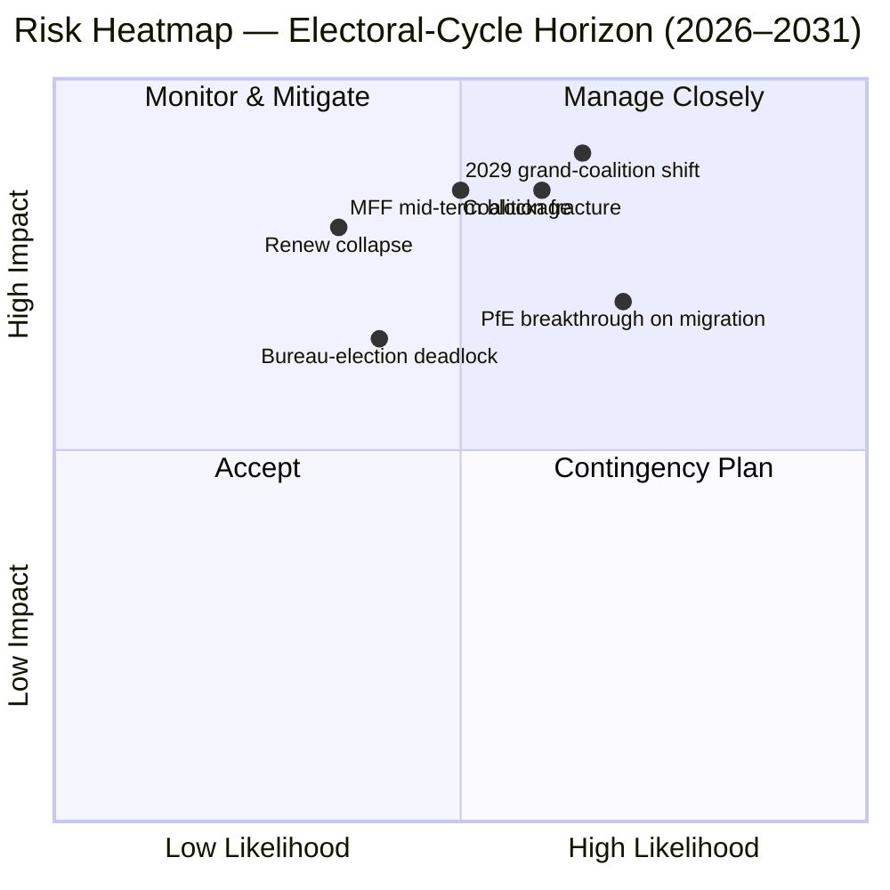

<!-- SPDX-FileCopyrightText: 2026 Hack23 AB -->
<!-- SPDX-License-Identifier: Apache-2.0 -->

# Exekutiv Briefing — EP10 Valcykelöversikt (2024–2029) | 2026-05-11

**Klassificering:** OSINT — Offentliga parlamentariska uppgifter
**Konfidensgrad:** 🟡 Måttlig-Hög (stabilitetspoäng 84/100; data är strukturell, inte röstnivå)
**Körning:** `analysis/daily/2026-05-11/election-cycle/`
**Horisont:** 2026-05-11 → 2031-05-10 (60-månaders valcykelöversikt)
**Genererad:** 2026-05-16 (retrospektiv briefing, inga nya MCP-anrop — sammanfattar körningens egna 25 artefakter)
**Primära källor:** EP MCP `generate_political_landscape`, `analyze_coalition_dynamics`, `early_warning_system`, `compare_political_groups`, `sentiment_tracker`, `get_plenary_sessions` (år=2026), `get_all_generated_stats` (2019–2026).

---

## 🎯 BLUF

Valet 2024 resulterade i EP10 med **717 ledamöter fördelade på nio grupper, fragmenteringsindex 6,58 — den högsta noteringen sedan EP6 (2004–2009)**. Det centristiska EPP+S&D+Renew-blocket innehar **396 mandat (55,2 %)** med en **36-mandats buffert** över tröskelvärdets 361 mandat för absolut majoritet; den bufferten är **mindre än hälften av EP9:s 86-mandatsmarginal**, varför en enstaka nationell delegationsavvikelse nu på ett meningsfullt sätt förändrar fil-för-fil-majoritetsaritmetiken. Den enda HIGH-allvarlighetsvarningen från `early_warning_system` är `DOMINANT_GROUP_RISK` — EPP:s andel om 25,5 % ger vetobelastning i varje smal centristisk koalition, och **januarits 2027 Byråval är det första planerade testet** på om den belastningen betalas i portföljer (status quo) eller i policykoncessionerna (högerledning). Polariseringsindex 0,22 är väl under gränsen 0,40 för stormkoalitionsbrytning, varför den underliggande aritmetiken fortfarande fungerar; den operationella risken är **mellantermsjustering** snarare än kollaps. **Sex rubriker** (J1–J6) ramar in cykeln: centristisk majoritet håller till Q4 2026 (Mycket sannolikt, 18-månaders horisont), PfE övertar Renew under EP10 genom överlåtelser (Jämna chanser, 36 månader), Venezuela-majoritet (EPP+ECR+PfE = 349 mandat) åberopas på ≥3 återkallelseärenden innan mid-2027 (Sannolikt, 14 månader), 2029 producerar ingen enkoalitionsmajoritet (Sannolikt, 49 månader).

---

## 🧭 3 Decisions This Brief Supports

| # | Beslut | Vem beslutar | Tidsfrist | Bevis |
|:-:|--------|--------------|:---------:|-------|
| 1 | **Piskapstrategi för 2027 Byråval** — säkrar EPP mellantermspresidentskapet på en portföljbyte med S&D, eller kräver det policykoncessionerna (migration / jordbruk)? | Konferensen för ordföranden; EPP/S&D/Renew-gruppenledare | Jan 2027 (≤ 9 månader) | R-3 i `risk-scoring/risk-matrix.md` (Sannolikhet Jämna chanser × Påverkan M-H → poäng 8); J6 (mellantermsjustering Sannolikt) |
| 2 | **MFF 2028+ mellantermsgranskning förhandlingsmandat** — hur mycket försvar / Ukraina / rättsstatighetskonditionalitet är icke-förhandlingsbar för den centristiska majoriteten? | BUDG-ledning, COREPER, Kommissionens VPs | H2 2026 → mid-2027 | R-5 (Sannolikt × Mycket högt → poäng 16, den enskilt högsta risken i registret); `intelligence/economic-context.md` |
| 3 | **Gruppdisciplinövervakning på Venezuela-majoritetsbanan** — vilka ärenden (migration, jordbruk, klimatåtertagning) riskerar ett EPP+ECR+PfE enkel-majoritetsseger när deltagandet sjunker under 95 %? | Gruppsekretariat; skuggskildrare i Greens / Renew | löpande, 12-månaders bevakning | R-2 (Jämna chanser × Hög → poäng 9); J3 (Sannolikt, 14 månader); `intelligence/coalition-dynamics.md` |

Varje beslut är bundet till en risregistreringsrad i `risk-scoring/risk-matrix.md` och ett WEP-bandsöverläggande i `intelligence/synthesis-summary.md` så att resonemanget är falsifierbart.

---

## 📰 60-Second Read

- 🔴 **Buffert halverad:** centriskt EPP+S&D+Renew-block sjönk från 86 mandat överskott i EP9 till **36 mandat överskott i EP10** (`generate_political_landscape`, A1).
- 🟠 **Fragmenteringstopp:** index **6,58 — högst sedan EP6** (2004–2009); `compare_political_groups` visar en **12,6 % ökning i per-fil ändringsräkningar** jämfört med EP9.
- 🟢 **Stabilitet fortfarande funktionell:** `early_warning_system` returnerar poäng **84/100, MEDIUM övergripande risk**; polarisering **0,22 ≪ 0,40 brytningströskel**.
- 🟡 **Enda HIGH-allvarlighetsvarning:** `DOMINANT_GROUP_RISK` på EPP:s 25,5 % andel — koncentrerad belastning, inte kammarkollaps.
- 🔵 **Venezuela-majoritet beväpnad:** EPP+ECR+PfE = **349 mandat (48,7 %)** — 12 kort om absolut majoritet men **vinner vid enkel-majoritetssomröstningar när närvaron sjunker under 95 %**; redan aktiverad på ≥4 migrations-/jordbruksärenden sedan invigningen.
- 🟣 **Vänstervinge strukturellt kort:** S&D+Greens/EFA+The Left = **234 mandat (32,6 %)** — kan inte besegra en Grönt Avtal-återtagning utan Renew-avvikelse eller frånvaro-drivna dynamiker.
- 🩷 **Renew-komprimering:** 102 → 77 mandat (**−24,5 %**) är den näst mest konsekventa strukturella förändringen av 2024 och förutsättningen för bufferthalveringen.
- ⚪ **Tvingande funktioner H2 2026 → Q1 2027:** (a) Byråval jan 2027; (b) MFF 2028+ mellantermsgranskning; (c) Kommissionens Arbetsprogram 2026 leveranspuls (~18 OLP-ärenden/kvartal till 2027).

---

## 🗂️ Headline Judgements (from `intelligence/synthesis-summary.md`)

| # | Bedömning | WEP-band | Konfidensgrad | Horisont |
|:-:|-----------|----------|:-------------:|:--------:|
| J1 | Centrisk EPP+S&D+Renew behåller en fungerande majoritet på ≥70 % av OLP-ärenden till Q4 2026 | **Mycket sannolikt** | Måttlig-Hög | 18 månader |
| J2 | PfE övertar Renew som tredje största grupp under EP10 (via överlåtelser, inte val) | Jämna chanser | Måttlig | 36 månader |
| J3 | Venezuela-majoritet (EPP+ECR+PfE) åberopas på ≥3 migrations-/jordbruks-/klimatåtertagningsärenden före mid-2027 | **Sannolikt** | Måttlig | 14 månader |
| J4 | 2029 val producerar ingen enkoalitionsmajoritet om 361+; tvingar ett förnyat stormkoalitionsavtal | **Sannolikt** | Måttlig | 49 månader |
| J5 | ≥1 nuvarande grupp (ESN eller ett NI-kluster) misslyckas att återformas efter 2029 val | Jämna chanser | Måttlig | 53 månader |
| J6 | Mellantermsjustering (gruppsekretariat av ≥10 ledamöter) sker 2027 kring Byråvalet | **Sannolikt** | Måttlig | 9 månader |

Bevis som stödjer J1–J6 hämtas från Stage-A MCP-fångsterna listade i denna briefings rubrik; full kedja i `intelligence/synthesis-summary.md` och `intelligence/coalition-dynamics.md`.

---

## ⚠️ Risk Snapshot

**Tre bästa kvantifierade risker** (från `risk-scoring/risk-matrix.md`-registret, rangordnade efter poäng):

| ID | Risk | L | I | Poäng | Utlösare som skulle avancera den | Ägare |
|:--:|------|:-:|:-:|:-----:|----------------------------------|-------|
| **R-5** | MFF 2028+ mellantermsgranskning misslyckas till mid-2027 | Sannolikt | Mycket hög | **16** | Rådsdeadlock om nettobetalarkonvolut; försvarsuppfyllning olöst | BUDG / Kommissionens VPs |
| **R-7** | 2029 val producerar 7+ gruppers kammare utan centristisk majoritet | Sannolikt | Mycket hög | **16** | PfE konsoliderar ECR nationella delegationer förevals | Tvärgående ledare |
| **R-1** | Centristkoalition förlorar fungerande majoritet på ett flaggskepp OLP-ärende | Sannolikt | Hög | **12** | Nationell delegationsavvikelse (esp. Renew Iberian or French bloc) | EPP/S&D/Renew-ledare |

R-6 (nationell delegationsavvikelse om rättsstatighetskonditionalitet, poäng 12) befinner sig i samma band och är den mest sannolika konkreta aktiveraren av R-1.

---

## 🔮 Top Forward Triggers

Från `extended/forward-indicators.md` och körningens scenariogrenarna (`intelligence/scenario-forecast.md` S1–S7):

1. **Januaritis 2027 Byråval** — om EPP säkrar presidentskapet utan en publicerad kostnad i utskottsstolar till S&D och Renew, eskalera `DOMINANT_GROUP_RISK` från HIGH-allvarlighetsvarning till aktiv R-3 deadlock.
2. **MFF 2028+ förhandlingsmandatosmaning** (mål H2 2026 → mid-2027) — misslyckande att nå ett centriskt BUDG-mandat till slut-Q1 2027 avancerar R-5 från gul till röd och matar Scenario 6 (Stormkoalitionsomslutning).
3. **Tre namngivna ärenden att bevaka för Venezuela-majoritetsaktivering under de nästa 14 månaderna:** varje migrationsprocedur-plenum där Renew Iberisk eller Franskt delegationsdeltagande sjunker under 90 %; CAP-förenklings-uppföljningar; och nästa post-2025 klimatåtertagningscykel. J3 (Sannolikt) verifieras eller falsifieras av dessa.
4. **PfE-gruppsöverföringövervakning** — `compare_political_groups` flaggar redan PfE som den strukturella förändringen med mest utrymme att växa; en polsk eller italiensk ECR-delegationsöverföring om ≥10 ledamöter är den operationella snubbeltråden för J2 och J6.

Det obligatoriska **Scenario 7 (Fördragskris / strukturell brott)**-grenen befinner sig i den långa svansen: kandidatutlösare per körningen är (a) utvidgningsfördragsrevision UA/MD, (b) passerelleförlängning till utrikespolitik / finanspolitik, (c) artikel 7-eskalation angående Ungern, (d) mellantermesval från Rådsdeadlock, eller (e) MFF-sammanbrott i preliminära tolvtedelar. Ingen befinner sig på ett 12-månaders horisont.

---

## 🛡️ Source-Quality Assessment

- **A1 / A2-ankare:** gruppssammansättning, fragmenteringsindex, plenumkalender, flertermsgenomflöde — dessa är den **strukturella ryggraden** i briefingen och är Admiralty A1–A2 (EP Open Data Portal).
- **B3-förbehåll:** `sentiment_tracker`-polarisering (0,22) är en **mandatsandels institutionell positioneringsproxy, inte rullanrop-kohesion** — per-ledamots röstdata exponeras ännu inte av EP API:et. Måttlig konfidensgraden för J3 / J4 / J6 återspeglar detta.
- **A6 (kan inte bedömas):** `monitor_legislative_pipeline` returnerade 0 procedurer och `network_analysis` returnerade 50 noder / 0 kanter; båda är **uppströmspipelineförseningar**, inte analytiska misslyckanden. Nätverksanalys-egonätverk och pipelineflaskhalsdetektering är uppskjutna tills EP API:et exponerar dessa data.
- **F6 (misslyckades):** World Bank EU-landskoder (`EUU` / `EU`) misslyckades båda i denna körning; briefingen förlitar sig inte på WB-makrokontext.
- **IMF SDMX 3.0:** inte efterfrågad i denna valcykelöverläggnigskörning; om MFF-gransknings makrokontext blir operationellt nödvändig, kör en IMF WEO-sond innan R-5 ompoängsätts.

Nettoförtroendegrad: **Måttlig-Hög på strukturell aritmetik** (J1, R-1, R-5, R-7), **Måttlig på beteendemässiga bedömningar** (J2, J3, J4, J6) tills per-ledamots kohesionsdata exponeras av EP API:et.

---

## 🧭 ACH Competing-Hypothesis Note

Två konkurrerande tolkningar av samma aritmetik spåras i `extended/historical-parallels.md`:

- **H1 — "EP10 är EP9 minus Renew."** Bufferten är mindre men koalitionsreceptet är oförändrat; mellantermens Byråval ger ett portföljbyte; 2029 returnerar ett liknande avtal med en något större högerflank. Scenarier 1 och 6 i `intelligence/scenario-forecast.md`.
- **H2 — "EP10 är det första PfE-vändande parlamentet."** Venezuela-majoriteten aktiveras på mer än tre ärenden; en EPP nationell delegation rör sig till att piska med ECR om migration; ett 2027 Byråval blir det offentliga vändningsögonblicket. Scenarier 2 och 4.

Den nuvarande bevisbasen — stabilitetspoäng 84, polarisering 0,22, fragmentering 6,58, EPP-disciplin hålls — **gynnar H1 (Mycket sannolikt)** till Q4 2026 men **falsifierar inte H2** på ett 14-till-36-månaders horisont. Briefingen spårar därför båda snarare än att förbinda sig till en.

---

## 📎 Run Artifacts (Read-Before-Decide)

| Lager | Artefakt | Varför |
|-------|----------|--------|
| Artikel | `article.md` | Offentlig berättelse; 9 906 rader som täcker alla sex bedömningarna |
| Syntes | `intelligence/synthesis-summary.md` | BLUF + WEP-tabell + Admiralty-gradering (auktoritativ) |
| Koalition | `intelligence/coalition-dynamics.md` | Venezuela-majoritetaritmetik; EP9 → EP10 buffertdelta |
| Riskregister | `risk-scoring/risk-matrix.md` | R-1 → R-10 med L × I × Poäng |
| Kvantitativ SWOT | `risk-scoring/quantitative-swot.md` | Strukturella styrkor vs. bufferterosion |
| Scenarier | `intelligence/scenario-forecast.md` S1–S7 (Fördragskris = S7) | Sannolikhetsviktade grenar |
| Indikatorer | `extended/forward-indicators.md` | Snubbeltrådskalender till 2029 |
| Termbåge | `intelligence/term-arc.md`, `mandate-fulfilment-scorecard.md`, `presidency-trio-context.md` | Byråvalsekvensering |
| Mandatprognos | `intelligence/seat-projection.md` | 2029-prognos under H1 vs. H2 |
| Tillförlitlighet | `intelligence/mcp-reliability-audit.md` | A6 / F6-rader förklarade |
| Självgranskning | `intelligence/methodology-reflection.md` | Steg 10.5-stängning |

---

**Dokumentkontroll**
- **Mallreferens:** `analysis/templates/executive-brief.md`
- **Artefaktsökväg:** `analysis/daily/2026-05-11/election-cycle/executive-brief.md`
- **Klassificering:** Offentlig
- **Retrospektiv:** Denna briefing är post-hoc — skriven 2026-05-16 från körningens engagerade artefakter; **inga nya MCP-anrop gjordes**. Alla bedömningar omformulerar, destillerar och ACH-korskontrollerar vad körningen själv engagerade; inga nya påståenden introduceras.
