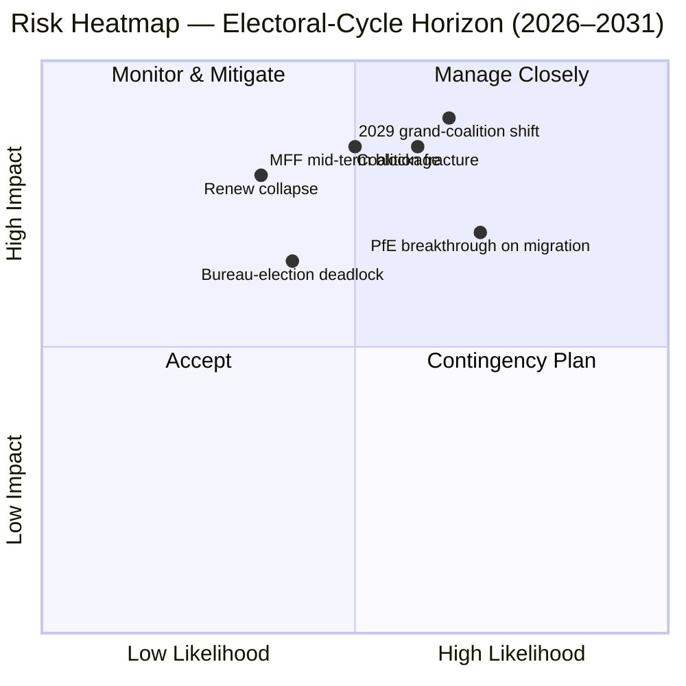

<!-- SPDX-FileCopyrightText: 2026 Hack23 AB -->
<!-- SPDX-License-Identifier: Apache-2.0 -->

# 执行摘要 — EP10 选举周期概览（2024–2029）| 2026-05-11

**分类：** OSINT — 公开议会记录
**信心水平：** 🟡 中高（稳定性评分 84/100；结构性数据，非个别投票数据）
**运行路径：** `analysis/daily/2026-05-11/election-cycle/`
**时间范围：** 2026-05-11 → 2031-05-10（60 个月选举周期概览）
**创建日期：** 2026-05-16（事后简报；无新 MCP 调用 — 汇总本次运行 25 份成果物）
**一手来源：** EP MCP `generate_political_landscape`、`analyze_coalition_dynamics`、`early_warning_system`、`compare_political_groups`、`sentiment_tracker`、`get_plenary_sessions`（year=2026）、`get_all_generated_stats`（2019–2026）。

---

## 🎯 BLUF

2024 年选举产生了 **9 个议会党团、717 名议员的 EP10，碎片化指数 6.58 为 EP6（2004–2009）以来最高值**。中间核心 EPP+S&D+Renew 拥有 **396 席（55.2%）**，超出绝对多数门槛 361 席 **36 席**；但该优势幅度**不足 EP9 时期 86 席的一半**，单一国家代表团的偏离即可实质性地改变逐文件的多数计算。`early_warning_system` 发出的唯一 HIGH 警告是 `DOMINANT_GROUP_RISK` — EPP 25.5% 的席位份额在任何窄幅中间联合政府中赋予其事实上的否决权；**2027 年 1 月议会局选举是首次计划性检验**，将揭示这一影响力究竟用于换取部长职位（现状）还是政策让步（右倾）。极化指数 0.22 远低于大联合崩溃阈值 0.40，核心算术仍然有效；运营风险是**任期中途再平衡**而非崩溃。**六项核心判断**（J1–J6）框定本届议会：中间联合维持至 Q4 2026（几近确定，18 个月），PfE 在 EP10 任期内通过转党超越 Renew（各半，36 个月），"威尼斯多数"（EPP+ECR+PfE = 349 席）在 2027 年中期前在 ≥3 个文件上被援用以推动倒退（可能，14 个月），2029 年选举不会产生单一联合多数（可能，49 个月）。

---

## 🧭 3 Decisions This Brief Supports

| # | 决策 | 决策主体 | 截止日期 | 证据 |
|:-:|-----|---------|:-------:|------|
| 1 | **2027 年议会局选举纪律策略** — EPP 是否通过与 S&D 交换委员会主席职位确保任期中期议长职位，还是要求政策让步（移民/农业）？ | 主席会议；EPP/S&D/Renew 党团领导层 | 2027 年 1 月（≤9 个月） | `risk-scoring/risk-matrix.md` 中的 R-3（各半 × 影响度 M-H → 评分 8）；J6（任期中途再平衡可能） |
| 2 | **任期中期 MFF 2028+ 审查谈判授权** — 中间联合对国防/乌克兰/法治附加条件中的哪些部分不可谈判？ | BUDG 领导层、COREPER、副委员会主席 | 2026 年下半年 → 2027 年中期 | R-5（可能 × 非常高影响度 → 评分 16，风险账本最高分）；`intelligence/economic-context.md` |
| 3 | **"威尼斯多数"路径上的党团纪律监控** — 出席率低于 95% 时，EPP+ECR+PfE 可凭简单多数通过的文件（移民、农业、气候倒退）有哪些？ | 党团秘书处；Greens/Renew 影子报告员 | 持续，12 个月监控 | R-2（各半 × 高影响度 → 评分 9）；J3（可能，14 个月）；`intelligence/coalition-dynamics.md` |

每项决策均与 `risk-scoring/risk-matrix.md` 风险账本中的条目及 `intelligence/synthesis-summary.md` 中的 WEP 评估相关联，确保论据可被证伪。

---

## 📰 60-Second Read

- 🔴 **优势幅度减半：** 中间联合 EPP+S&D+Renew 优势幅度从 EP9 的 86 席降至 EP10 的 **36 席**（`generate_political_landscape`，A1）。
- 🟠 **碎片化峰值：** 指数 **6.58 — EP6（2004–2009）以来最高**；`compare_political_groups` 显示与 EP9 相比**每文件二读修正案增加 12.6%**。
- 🟢 **稳定性仍具功能性：** `early_warning_system` 返回评分 **84/100，整体风险 MEDIUM**；极化 **0.22 ≪ 崩溃阈值 0.40**。
- 🟡 **唯一的 HIGH 警告：** EPP 25.5% 席位份额下的 `DOMINANT_GROUP_RISK` — 集中影响力，而非院内崩溃。
- 🔵 **"威尼斯多数"武器化：** EPP+ECR+PfE = **349 席（48.7%）** — 距绝对多数差 12 席，但**出席率低于 95% 时简单多数投票中获胜**；自成立以来已在 ≥4 个移民/农业文件中发动。
- 🟣 **左翼阵营结构性少数：** S&D+Greens/EFA+The Left = **234 席（32.6%）** — 若无 Renew 分裂或出席率动态，无法阻止《绿色协议》倒退。
- 🩷 **Renew 压力：** 102 → 77 席（**−24.5%**）是 2024 年第二大结构变化，也是优势幅度减半的前提条件。
- ⚪ **强制节点 2026 年下半年 → 2027 年 Q1：**（a）2027 年 1 月议会局选举；（b）任期中期 MFF 2028+ 审查；（c）委员会 2026 年工作方案成果物流量（至 2027 年每季度约 18 个 OLP 文件）。

---

## 🗂️ Headline Judgements (from `intelligence/synthesis-summary.md`)

| # | 判断 | WEP 范围 | 置信度 | 时间轴 |
|:-:|-----|---------|:------:|:------:|
| J1 | 中间 EPP+S&D+Renew 在 Q4 2026 前维持 ≥70% OLP 文件的工作多数 | **几近确定** | 中高 | 18 个月 |
| J2 | PfE 在 EP10 任期内通过转党（非选举）超越 Renew 成为第三大党团 | 各半 | 中等 | 36 个月 |
| J3 | "威尼斯多数"（EPP+ECR+PfE）在 2027 年中期前在 ≥3 个移民/农业/气候倒退文件上被援用 | **可能** | 中等 | 14 个月 |
| J4 | 2029 年选举不会产生单一 361+ 联合多数；将迫使签署更新版大联合章程 | **可能** | 中等 | 49 个月 |
| J5 | 现有 ≥1 个党团（ESN 或 NI 池）未能在 2029 年选举后重组 | 各半 | 中等 | 53 个月 |
| J6 | 任期中途再平衡（≥10 人党团转移）在 2027 年围绕议会局选举发生 | **可能** | 中等 | 9 个月 |

支持 J1–J6 的证据来自本简报顶部记录的 Phase A MCP 抓取；完整证据链见 `intelligence/synthesis-summary.md` 和 `intelligence/coalition-dynamics.md`。

---

## ⚠️ Risk Snapshot

**定量化的前三大风险**（来自 `risk-scoring/risk-matrix.md`，按评分排序）：

| ID | 风险 | 可 | 影 | 评分 | 加速触发因素 | 责任方 |
|:--:|-----|:-:|:-:|:---:|-----------|------|
| **R-5** | 任期中期 MFF 2028+ 审查在 2027 年中期前失败 | 可能 | 非常高 | **16** | 净受款国缴款封套上的理事会僵局；国防强化未解决 | BUDG / 副委员会主席 |
| **R-7** | 2029 年选举产生无中间多数的 7+ 党团议会 | 可能 | 非常高 | **16** | PfE 在选举前整合 ECR 国家代表团 | 跨党派领导人 |
| **R-1** | 中间联合在主要 OLP 文件上失去工作多数 | 可能 | 高 | **12** | 国家代表团偏离（尤其是 Renew 伊比利亚或法国集团） | EPP/S&D/Renew 领导层 |

R-6（法治条件性中的国家代表团偏离，12 分）处于同一范围，是 R-1 中最可实现的触发因素。

---

## 🔮 Top Forward Triggers

来自 `extended/forward-indicators.md` 及本次运行的情景分支（`intelligence/scenario-forecast.md` S1–S7）：

1. **2027 年 1 月议会局选举** — 若 EPP 在未公开对 S&D 和 Renew 支付委员会主席职位成本的情况下确保议长职位，`DOMINANT_GROUP_RISK` 将从 HIGH 警告升级为活跃的 R-3 风险。
2. **MFF 2028+ 谈判授权全体表决**（目标 2026 年下半年 → 2027 年中期）— 若在 2027 年 Q1 末前未能获得中间 BUDG 授权，R-5 将从黄色升至红色，并催化情景 6（大联合重新签署）。
3. **未来 14 个月内为"威尼斯多数"激活指定监控的三个文件：** Renew 伊比利亚或法国集团出席率低于 90% 的任何移民全体会议；CAP 简化后续工作；2025 年后气候倒退周期。J3（可能）将被这些事件证实或证伪。
4. **监控 PfE 党团转移** — `compare_political_groups` 已将 PfE 标记为增长潜力最高的结构变化；ECR 波兰或意大利代表团 ≥10 人的转移是 J2 和 J6 的引线。

强制性**情景 7（条约危机/结构性断裂）**处于长尾：本次运行的候选触发因素为（a）UA/MD 加入条约修订，（b）走廊扩展至外交/财政政策，（c）匈牙利第 7 条升级，（d）理事会僵局导致的任期中期选举，（e）MFF 崩溃进入临时预算。这些均不在 12 个月视野内。

---

## 🛡️ Source-Quality Assessment

- **A1/A2 锚点：** 党团构成、碎片化指数、全体会议日历、多届生产率速率 — 这些是简报的**结构骨架**，Admiralty A1–A2 评级（EP 开放数据门户）。
- **B3 保留：** `sentiment_tracker` 极化（0.22）是**基于席位份额的制度定位代理指标，非名义投票凝聚力** — 议员个别投票数据尚未由 EP API 披露。J3/J4/J6 的中等置信度反映了这一点。
- **A6（无法判断）：** `monitor_legislative_pipeline` 返回 0 个程序，`network_analysis` 返回 50 节点 / 0 边；两者均为**前向流水线延迟**，非分析性失败。自我网络图和瓶颈检测推迟至 EP API 披露数据后进行。
- **F6（失败）：** World Bank EU 国家代码（`EUU` / `EU`）在本次运行中均失败；简报不依赖 WB 宏观经济背景。
- **IMF SDMX 3.0：** 本次选举周期概览运行中未查询；若 MFF 审查的宏观经济背景变得运营必要，在重新评估 R-5 之前进行 IMF WEO 探测。

净置信度：**结构性计算为中高**（J1、R-1、R-5、R-7），**行为判断为中等**（J2、J3、J4、J6）— 直至 EP API 披露议员级凝聚力数据。

---

## 🧭 ACH Competing-Hypothesis Note

`extended/historical-parallels.md` 中追踪了对相同计算的两种竞争性解释：

- **H1 — "EP10 是去掉 Renew 的 EP9"。** 优势幅度更小但联合处方未变；任期中期议会局选举产生职位互换；2029 年以略大右翼集团重新生成类似章程。`intelligence/scenario-forecast.md` 中的情景 1 和 6。
- **H2 — "EP10 是第一个以 PfE 为轴心的议会"。** "威尼斯多数"在三个以上文件中被激活；EPP 国家代表团在移民问题上与 ECR 联动；2027 年议会局选举成为公开的轴心转换时刻。情景 2 和 4。

当前证据基础 — 稳定性评分 84、极化 0.22、碎片化 6.58、EPP 纪律维持 — **支持 H1（几近确定）** 至 Q4 2026，但在 14 至 36 个月视野上**不能证伪 H2**。因此简报同时追踪两者，而非锁定一方。

---

## 📎 Run Artifacts (Read-Before-Decide)

| 层级 | 成果物 | 原因 |
|------|-------|------|
| 文章 | `article.md` | 主要叙述；9,906 行覆盖六项判断 |
| 综合 | `intelligence/synthesis-summary.md` | BLUF + WEP 表格 + Admiralty 评级（可靠） |
| 联合 | `intelligence/coalition-dynamics.md` | "威尼斯多数"计算；EP9 → EP10 优势幅度变化 |
| 风险账本 | `risk-scoring/risk-matrix.md` | R-1 → R-10（含 L × I × 评分） |
| 定量 SWOT | `risk-scoring/quantitative-swot.md` | 结构优势与优势幅度侵蚀对比 |
| 情景 | `intelligence/scenario-forecast.md` S1–S7（条约危机 = S7） | 概率加权分支 |
| 指标 | `extended/forward-indicators.md` | 至 2029 年的触发因素日历 |
| 任期弧 | `intelligence/term-arc.md`、`mandate-fulfilment-scorecard.md`、`presidency-trio-context.md` | 议会局选举顺序 |
| 席位预测 | `intelligence/seat-projection.md` | H1 对 H2 下的 2029 年预测 |
| 可靠性 | `intelligence/mcp-reliability-audit.md` | A6 / F6 行解释 |
| 自我反思 | `intelligence/methodology-reflection.md` | 步骤 10.5 收尾 |

---

**文档追踪**
- **模板参考：** `analysis/templates/executive-brief.md`
- **成果物路径：** `analysis/daily/2026-05-11/election-cycle/executive-brief.md`
- **分类：** 公开
- **事后：** 本简报为事后撰写 — 于 2026-05-16 依据本次运行提交的成果物编写；**未进行任何新的 MCP 调用**。所有判断均为对本次运行自身完成内容的重述、提炼和 ACH 验证；不提出任何新主张。
