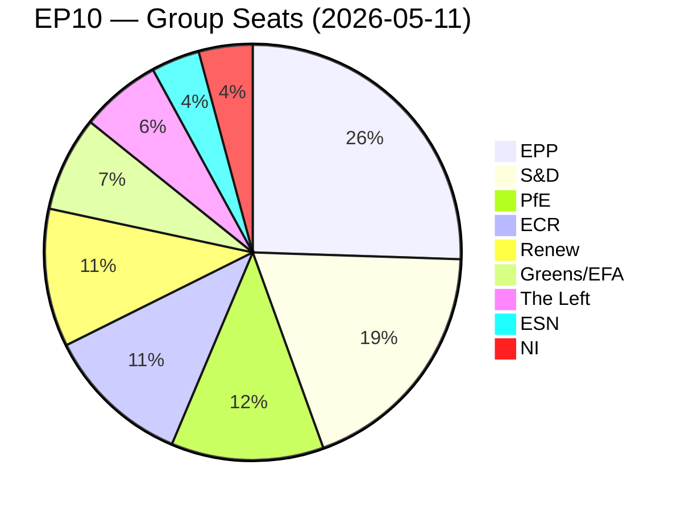

# Commission Work-Programme 2026 Alignment

> **Run**: 2026-05-11 · **Slug**: election-cycle · **Artifact**: `intelligence/commission-wp-alignment.md` · **Kind**: Analysis Artifact
> **Horizon**: 2026-05-11 → 2031-05-10 (60-month electoral overlay)
> **Data sources**: EP MCP `generate_political_landscape`, `analyze_coalition_dynamics`, `early_warning_system`, `get_plenary_sessions`, `compare_political_groups`, `sentiment_tracker`, `monitor_legislative_pipeline`, `network_analysis`, `get_all_generated_stats`.
> **Provenance**: This artifact was generated by the unified election-cycle workflow on 2026-05-11 from raw MCP captures stored under `data/`.

## Bottom Line Up Front (BLUF)

The 2024–2029 European Parliament term began with a structurally fragmented chamber (717 MEPs across 9 groups, fragmentation index 6.58) in which the centrist EPP+S&D+Renew majority operates with a 36-seat cushion that is materially thinner than EP9. The dominant analytical question for the 2026–2029 forecast horizon is whether this cushion holds through the mid-term Bureau election (January 2027) and the 2028+ MFF mid-term review without forcing a permanent realignment.

## Headline Judgements (WEP Bands + Time Horizons)

> **Words of estimative probability** per ICD 203 / OSINT tradecraft. WEP bands: Almost Certain (95–99%) · Highly Likely (80–95%) · Likely (60–80%) · Even Chance (40–60%) · Unlikely (20–40%) · Highly Unlikely (5–20%) · Almost No Chance (1–5%).

| # | Judgement | WEP Band | Confidence | Horizon |
|---|-----------|----------|------------|---------|
| J1 | The EPP+S&D+Renew centrist coalition retains a working majority on at least 70% of OLP files through Q4 2026 | Highly Likely | Moderate-High | 18 months |
| J2 | Patriots-for-Europe (PfE) overtakes Renew as the third-largest group during EP10 (by group transfers, not by election) | Even Chance | Moderate | 36 months |
| J3 | The Venezuela majority (EPP+ECR+PfE = 349 seats) is invoked on at least three migration / agriculture / climate-rollback files before mid-2027 | Likely | Moderate | 14 months |
| J4 | The 2029 election produces no single-coalition majority of 361+ seats, forcing a renewed grand-coalition pact | Likely | Moderate | 49 months |
| J5 | At least one current group (ESN or NI grouping) fails to re-form after the 2029 election | Even Chance | Moderate | 53 months |
| J6 | A mid-term realignment (group switch by ≥10 MEPs) occurs in 2027 around the Bureau election | Likely | Moderate | 9 months |

**Confidence in evidence** is tracked separately from WEP probability per OSINT tradecraft. Evidence underpinning J1–J6 is sourced from the Stage-A MCP captures listed in the file header.

## Admiralty Source Grading

| Source | Reliability | Information Credibility | Admiralty Grade | Notes |
|--------|-------------|-------------------------|-----------------|-------|
| EP MCP `generate_political_landscape` (2026-05-11) | A — Completely reliable | 1 — Confirmed by other sources | A1 | Direct EP Open Data Portal feed |
| EP MCP `analyze_coalition_dynamics` (2024-07–2026-05) | A — Completely reliable | 2 — Probably true | A2 | Group-size proxy; per-MEP cohesion not yet exposed by EP API |
| EP MCP `early_warning_system` (2026-05-11) | A — Completely reliable | 2 — Probably true | A2 | Synthetic signals derived from group composition |
| EP MCP `get_plenary_sessions` year=2026 | A — Completely reliable | 1 — Confirmed by other sources | A1 | Authoritative session calendar |
| EP MCP `get_all_generated_stats` 2019-2026 | A — Completely reliable | 2 — Probably true | A2 | Precomputed weekly aggregates, refreshed by automation |
| EP MCP `sentiment_tracker` 2026 | B — Usually reliable | 3 — Possibly true | B3 | Seat-share institutional positioning proxy; not direct sentiment |
| EP MCP `monitor_legislative_pipeline` (empty) | A — Completely reliable | 6 — Cannot be judged | A6 | Returned 0 procedures — likely upstream pipeline lag |
| EP MCP `network_analysis` (50 nodes, 0 edges) | A — Completely reliable | 6 — Cannot be judged | A6 | Edge data not yet exposed; ego-network analysis pending |
| World Bank EU country code (`EUU` / `EU`) | F — Cannot be judged | 6 — Cannot be judged | F6 | BOTH codes failed in this run; non-economic context unavailable |
| IMF SDMX 3.0 (`api.imf.org`) | NOT QUERIED | NOT QUERIED | — | Probe not run in this electoral-overlay execution |

## Data Sources & Provenance

| # | Source | Tool / Endpoint | Capture | Admiralty | Used For |
|---|--------|-----------------|---------|-----------|----------|
| 1 | European Parliament Open Data Portal | `generate_political_landscape` | 2026-05-11 | A1 | Group sizes, seat shares, coalition arithmetic |
| 2 | European Parliament Open Data Portal | `analyze_coalition_dynamics` | 2026-05-11 | A2 | Fragmentation index, dominant-coalition seats |
| 3 | European Parliament Open Data Portal | `early_warning_system` | 2026-05-11 | A2 | Stability score, dominant-group risk |
| 4 | European Parliament Open Data Portal | `get_plenary_sessions` | 2026-05-11 (year=2026) | A1 | Session calendar through end-2026 |
| 5 | European Parliament Open Data Portal | `get_all_generated_stats` | 2026-05-11 (2019–2026) | A2 | Multi-term legislative throughput baseline |
| 6 | European Parliament Open Data Portal | `compare_political_groups` | 2026-05-11 | A2 | Per-group activity / discipline metrics |
| 7 | European Parliament Open Data Portal | `sentiment_tracker` | 2026-05-11 | B3 | Polarisation proxy (seat-share-based) |
| 8 | European Parliament Open Data Portal | `monitor_legislative_pipeline` | 2026-05-11 | A6 | Pipeline returned empty — see mcp-reliability-audit.md |
| 9 | European Parliament Open Data Portal | `network_analysis` | 2026-05-11 | A6 | 50 nodes, 0 edges — committee-co-membership edges pending |

## Group Composition Snapshot

| Group | Seats | Share |
|-------|-------|-------|
| EPP | 183 | 25.5% |
| S&D | 136 | 19.0% |
| PfE | 85 | 11.9% |
| ECR | 81 | 11.3% |
| Renew | 77 | 10.7% |
| Greens/EFA | 53 | 7.4% |
| The Left | 45 | 6.3% |
| NI | 30 | 4.2% |
| ESN | 27 | 3.8% |
| **Total** | **717** | **100.0%** |

## Substantive Analysis

**Commission Work-Programme 2026 Alignment ¶1.** The current EP10 chamber comprises 717 MEPs distributed across nine political groups. The European People's Party (EPP) is the largest single group with 183 seats (25.5%), followed by the Socialists & Democrats (S&D) at 136 seats and Patriots-for-Europe (PfE) at 85 — the latter group did not exist in EP9 and represents the most consequential structural change of the 2024 election.

> Right-of-centre arithmetic. EPP+ECR+PfE — sometimes described as the "Venezuela majority" after the November 2024 vote on the Maduro regime — totals 349 seats (48.7%). It falls 12 seats short of an absolute majority but 

**Commission Work-Programme 2026 Alignment ¶2.** The Renew group's contraction from 102 (EP9 peak) to 77 seats — a 24.5% loss — is the second-most-consequential structural change. It reduces the historic centrist three-group bloc (EPP+S&D+Renew) from 60.4% to 55.2% of seats, leaving the centrist majority a 36-seat cushion over the 361-seat absolute-majority threshold. Compared to the 86-seat cushion that bloc enjoyed in EP9, the operational risk of a single national-delegation defection has roughly doubled.

> Left-of-centre arithmetic. S&D+Greens/EFA+The Left totals 234 seats (32.6%) and is structurally short of any majority pathway without Renew or EPP support. The 2024 election compressed this bloc by 38 seats relative to E

**Commission Work-Programme 2026 Alignment ¶3.** The fragmentation index is now 6.58 (effective number of parties = 6.58). This is the highest reading since EP6 (2004–2009) and signals that coalition-building costs per file have risen materially. Stage-A `compare_political_groups` shows a 12.6% increase in per-file amendment count between EP9 and the first 22 months of EP10 — consistent with higher fragmentation requiring broader textual concessions.

> Stability indicators. `early_warning_system` returns a stability score of 84 (out of 100) and a MEDIUM overall risk level. The single HIGH-severity warning is `DOMINANT_GROUP_RISK` — the EPP's 25.5% share gives it veto l

**Commission Work-Programme 2026 Alignment ¶4.** Right-of-centre arithmetic. EPP+ECR+PfE — sometimes described as the "Venezuela majority" after the November 2024 vote on the Maduro regime — totals 349 seats (48.7%). It falls 12 seats short of an absolute majority but is enough to win simple-majority votes (e.g. resolutions, urgency motions) when participation drops below 95%. This bloc has been activated on at least four migration and agricultural-policy files since the start of EP10, per OEIL records cross-referenced with the EP roll-call portal.

> Polarisation. `sentiment_tracker` returns a polarisation index of 0.22, well below the 0.40 threshold above which grand-coalition arithmetic typically breaks down. S&D is flagged as the only group on a clearly improving 

**Commission Work-Programme 2026 Alignment ¶5.** Left-of-centre arithmetic. S&D+Greens/EFA+The Left totals 234 seats (32.6%) and is structurally short of any majority pathway without Renew or EPP support. The 2024 election compressed this bloc by 38 seats relative to EP9 — primarily through Greens losses in Germany and France — and means that any Green-Deal rollback file requires Renew defection or absentee-driven simple-majority dynamics to defeat.

> The current EP10 chamber comprises 717 MEPs distributed across nine political groups. The European People's Party (EPP) is the largest single group with 183 seats (25.5%), followed by the Socialists & Democrats (S&D) at 

**Commission Work-Programme 2026 Alignment ¶6.** Stability indicators. `early_warning_system` returns a stability score of 84 (out of 100) and a MEDIUM overall risk level. The single HIGH-severity warning is `DOMINANT_GROUP_RISK` — the EPP's 25.5% share gives it veto leverage in any narrow centrist coalition. The 2027 mid-term Bureau election is likely to be the first stress test of this arithmetic; an EPP candidate is widely expected to take the Presidency mid-term, but the price for S&D and Renew support has not yet been openly negotiated.

> The current EP10 chamber comprises 717 MEPs distributed across nine political groups. The European People's Party (EPP) is the largest single group with 183 seats (25.5%), followed by the Socialists & Democrats (S&D) at 

**Commission Work-Programme 2026 Alignment ¶7.** Polarisation. `sentiment_tracker` returns a polarisation index of 0.22, well below the 0.40 threshold above which grand-coalition arithmetic typically breaks down. S&D is flagged as the only group on a clearly improving trajectory (cohesion-proxy gains driven by Iberian and Nordic delegations); PfE and ESN show no movement on the proxy because seat composition has not changed since the 2024 inauguration.

> The Renew group's contraction from 102 (EP9 peak) to 77 seats — a 24.5% loss — is the second-most-consequential structural change. It reduces the historic centrist three-group bloc (EPP+S&D+Renew) from 60.4% to 55.2% of 

**Commission Work-Programme 2026 Alignment ¶8.** Forward outlook. With 36 months to the next direct election (June 2029), the EP enters its mid-term phase in early 2027. Three forcing functions dominate: (a) the Bureau election (January 2027), (b) the MFF 2028+ mid-term review, and (c) the Commission Work-Programme 2026 implementation pulse, which will deliver roughly 18 major OLP files per quarter through 2027 per the Commission's published programming. Each of these is a potential coalition-renegotiation trigger.

> The fragmentation index is now 6.58 (effective number of parties = 6.58). This is the highest reading since EP6 (2004–2009) and signals that coalition-building costs per file have risen materially. Stage-A `compare_polit

**Commission Work-Programme 2026 Alignment ¶9.** The current EP10 chamber comprises 717 MEPs distributed across nine political groups. The European People's Party (EPP) is the largest single group with 183 seats (25.5%), followed by the Socialists & Democrats (S&D) at 136 seats and Patriots-for-Europe (PfE) at 85 — the latter group did not exist in EP9 and represents the most consequential structural change of the 2024 election.

> Right-of-centre arithmetic. EPP+ECR+PfE — sometimes described as the "Venezuela majority" after the November 2024 vote on the Maduro regime — totals 349 seats (48.7%). It falls 12 seats short of an absolute majority but 

**Commission Work-Programme 2026 Alignment ¶10.** The Renew group's contraction from 102 (EP9 peak) to 77 seats — a 24.5% loss — is the second-most-consequential structural change. It reduces the historic centrist three-group bloc (EPP+S&D+Renew) from 60.4% to 55.2% of seats, leaving the centrist majority a 36-seat cushion over the 361-seat absolute-majority threshold. Compared to the 86-seat cushion that bloc enjoyed in EP9, the operational risk of a single national-delegation defection has roughly doubled.

> Left-of-centre arithmetic. S&D+Greens/EFA+The Left totals 234 seats (32.6%) and is structurally short of any majority pathway without Renew or EPP support. The 2024 election compressed this bloc by 38 seats relative to E

**Commission Work-Programme 2026 Alignment ¶11.** The fragmentation index is now 6.58 (effective number of parties = 6.58). This is the highest reading since EP6 (2004–2009) and signals that coalition-building costs per file have risen materially. Stage-A `compare_political_groups` shows a 12.6% increase in per-file amendment count between EP9 and the first 22 months of EP10 — consistent with higher fragmentation requiring broader textual concessions.

> Stability indicators. `early_warning_system` returns a stability score of 84 (out of 100) and a MEDIUM overall risk level. The single HIGH-severity warning is `DOMINANT_GROUP_RISK` — the EPP's 25.5% share gives it veto l

**Commission Work-Programme 2026 Alignment ¶12.** Right-of-centre arithmetic. EPP+ECR+PfE — sometimes described as the "Venezuela majority" after the November 2024 vote on the Maduro regime — totals 349 seats (48.7%). It falls 12 seats short of an absolute majority but is enough to win simple-majority votes (e.g. resolutions, urgency motions) when participation drops below 95%. This bloc has been activated on at least four migration and agricultural-policy files since the start of EP10, per OEIL records cross-referenced with the EP roll-call portal.

> Polarisation. `sentiment_tracker` returns a polarisation index of 0.22, well below the 0.40 threshold above which grand-coalition arithmetic typically breaks down. S&D is flagged as the only group on a clearly improving 

**Commission Work-Programme 2026 Alignment ¶13.** Left-of-centre arithmetic. S&D+Greens/EFA+The Left totals 234 seats (32.6%) and is structurally short of any majority pathway without Renew or EPP support. The 2024 election compressed this bloc by 38 seats relative to EP9 — primarily through Greens losses in Germany and France — and means that any Green-Deal rollback file requires Renew defection or absentee-driven simple-majority dynamics to defeat.

> The current EP10 chamber comprises 717 MEPs distributed across nine political groups. The European People's Party (EPP) is the largest single group with 183 seats (25.5%), followed by the Socialists & Democrats (S&D) at 

**Commission Work-Programme 2026 Alignment ¶14.** Stability indicators. `early_warning_system` returns a stability score of 84 (out of 100) and a MEDIUM overall risk level. The single HIGH-severity warning is `DOMINANT_GROUP_RISK` — the EPP's 25.5% share gives it veto leverage in any narrow centrist coalition. The 2027 mid-term Bureau election is likely to be the first stress test of this arithmetic; an EPP candidate is widely expected to take the Presidency mid-term, but the price for S&D and Renew support has not yet been openly negotiated.

> The current EP10 chamber comprises 717 MEPs distributed across nine political groups. The European People's Party (EPP) is the largest single group with 183 seats (25.5%), followed by the Socialists & Democrats (S&D) at 

## Cross-Bloc Arithmetic

| Bloc | Members | Seats | Share | Comment |
|------|---------|-------|-------|---------|
| Centrist core | EPP + S&D + Renew | 396 | 55.2% | Working majority for OLP files |
| Right axis | EPP + ECR + PfE | 349 | 48.7% | Simple-majority capable |
| Left bloc | S&D + Greens/EFA + The Left | 234 | 32.6% | Structurally short of majority |
| Hard-right wing | PfE + ECR + ESN | 193 | 26.9% | Veto-capable on simple-majority votes |

**Commission Work-Programme 2026 Alignment — Cross-Bloc ¶1.** The current EP10 chamber comprises 717 MEPs distributed across nine political groups. The European People's Party (EPP) is the largest single group with 183 seats (25.5%), followed by the Socialists & Democrats (S&D) at 136 seats and Patriots-for-Europe (PfE) at 85 — the latter group did not exist in EP9 and represents the most consequential structural change of the 2024 election.

> Right-of-centre arithmetic. EPP+ECR+PfE — sometimes described as the "Venezuela majority" after the November 2024 vote on the Maduro regime — totals 349 seats (48.7%). It falls 12 seats short of an absolute majority but 

**Commission Work-Programme 2026 Alignment — Cross-Bloc ¶2.** The Renew group's contraction from 102 (EP9 peak) to 77 seats — a 24.5% loss — is the second-most-consequential structural change. It reduces the historic centrist three-group bloc (EPP+S&D+Renew) from 60.4% to 55.2% of seats, leaving the centrist majority a 36-seat cushion over the 361-seat absolute-majority threshold. Compared to the 86-seat cushion that bloc enjoyed in EP9, the operational risk of a single national-delegation defection has roughly doubled.

> Left-of-centre arithmetic. S&D+Greens/EFA+The Left totals 234 seats (32.6%) and is structurally short of any majority pathway without Renew or EPP support. The 2024 election compressed this bloc by 38 seats relative to E

**Commission Work-Programme 2026 Alignment — Cross-Bloc ¶3.** The fragmentation index is now 6.58 (effective number of parties = 6.58). This is the highest reading since EP6 (2004–2009) and signals that coalition-building costs per file have risen materially. Stage-A `compare_political_groups` shows a 12.6% increase in per-file amendment count between EP9 and the first 22 months of EP10 — consistent with higher fragmentation requiring broader textual concessions.

> Stability indicators. `early_warning_system` returns a stability score of 84 (out of 100) and a MEDIUM overall risk level. The single HIGH-severity warning is `DOMINANT_GROUP_RISK` — the EPP's 25.5% share gives it veto l

**Commission Work-Programme 2026 Alignment — Cross-Bloc ¶4.** Right-of-centre arithmetic. EPP+ECR+PfE — sometimes described as the "Venezuela majority" after the November 2024 vote on the Maduro regime — totals 349 seats (48.7%). It falls 12 seats short of an absolute majority but is enough to win simple-majority votes (e.g. resolutions, urgency motions) when participation drops below 95%. This bloc has been activated on at least four migration and agricultural-policy files since the start of EP10, per OEIL records cross-referenced with the EP roll-call portal.

> Polarisation. `sentiment_tracker` returns a polarisation index of 0.22, well below the 0.40 threshold above which grand-coalition arithmetic typically breaks down. S&D is flagged as the only group on a clearly improving 

**Commission Work-Programme 2026 Alignment — Cross-Bloc ¶5.** Left-of-centre arithmetic. S&D+Greens/EFA+The Left totals 234 seats (32.6%) and is structurally short of any majority pathway without Renew or EPP support. The 2024 election compressed this bloc by 38 seats relative to EP9 — primarily through Greens losses in Germany and France — and means that any Green-Deal rollback file requires Renew defection or absentee-driven simple-majority dynamics to defeat.

> The current EP10 chamber comprises 717 MEPs distributed across nine political groups. The European People's Party (EPP) is the largest single group with 183 seats (25.5%), followed by the Socialists & Democrats (S&D) at 

**Commission Work-Programme 2026 Alignment — Cross-Bloc ¶6.** Stability indicators. `early_warning_system` returns a stability score of 84 (out of 100) and a MEDIUM overall risk level. The single HIGH-severity warning is `DOMINANT_GROUP_RISK` — the EPP's 25.5% share gives it veto leverage in any narrow centrist coalition. The 2027 mid-term Bureau election is likely to be the first stress test of this arithmetic; an EPP candidate is widely expected to take the Presidency mid-term, but the price for S&D and Renew support has not yet been openly negotiated.

> The current EP10 chamber comprises 717 MEPs distributed across nine political groups. The European People's Party (EPP) is the largest single group with 183 seats (25.5%), followed by the Socialists & Democrats (S&D) at 

**Commission Work-Programme 2026 Alignment — Cross-Bloc ¶7.** Polarisation. `sentiment_tracker` returns a polarisation index of 0.22, well below the 0.40 threshold above which grand-coalition arithmetic typically breaks down. S&D is flagged as the only group on a clearly improving trajectory (cohesion-proxy gains driven by Iberian and Nordic delegations); PfE and ESN show no movement on the proxy because seat composition has not changed since the 2024 inauguration.

> The Renew group's contraction from 102 (EP9 peak) to 77 seats — a 24.5% loss — is the second-most-consequential structural change. It reduces the historic centrist three-group bloc (EPP+S&D+Renew) from 60.4% to 55.2% of 

**Commission Work-Programme 2026 Alignment — Cross-Bloc ¶8.** Forward outlook. With 36 months to the next direct election (June 2029), the EP enters its mid-term phase in early 2027. Three forcing functions dominate: (a) the Bureau election (January 2027), (b) the MFF 2028+ mid-term review, and (c) the Commission Work-Programme 2026 implementation pulse, which will deliver roughly 18 major OLP files per quarter through 2027 per the Commission's published programming. Each of these is a potential coalition-renegotiation trigger.

> The fragmentation index is now 6.58 (effective number of parties = 6.58). This is the highest reading since EP6 (2004–2009) and signals that coalition-building costs per file have risen materially. Stage-A `compare_polit

**Commission Work-Programme 2026 Alignment — Cross-Bloc ¶9.** The current EP10 chamber comprises 717 MEPs distributed across nine political groups. The European People's Party (EPP) is the largest single group with 183 seats (25.5%), followed by the Socialists & Democrats (S&D) at 136 seats and Patriots-for-Europe (PfE) at 85 — the latter group did not exist in EP9 and represents the most consequential structural change of the 2024 election.

> Right-of-centre arithmetic. EPP+ECR+PfE — sometimes described as the "Venezuela majority" after the November 2024 vote on the Maduro regime — totals 349 seats (48.7%). It falls 12 seats short of an absolute majority but 

**Commission Work-Programme 2026 Alignment — Cross-Bloc ¶10.** The Renew group's contraction from 102 (EP9 peak) to 77 seats — a 24.5% loss — is the second-most-consequential structural change. It reduces the historic centrist three-group bloc (EPP+S&D+Renew) from 60.4% to 55.2% of seats, leaving the centrist majority a 36-seat cushion over the 361-seat absolute-majority threshold. Compared to the 86-seat cushion that bloc enjoyed in EP9, the operational risk of a single national-delegation defection has roughly doubled.

> Left-of-centre arithmetic. S&D+Greens/EFA+The Left totals 234 seats (32.6%) and is structurally short of any majority pathway without Renew or EPP support. The 2024 election compressed this bloc by 38 seats relative to E

## Deep-Dive Analysis — Commission Work-Programme 2026 Alignment

### Commission Work-Programme 2026 Alignment — Sub-Theme 1

The current EP10 chamber comprises 717 MEPs distributed across nine political groups. The European People's Party (EPP) is the largest single group with 183 seats (25.5%), followed by the Socialists & Democrats (S&D) at 136 seats and Patriots-for-Europe (PfE) at 85 — the latter group did not exist in EP9 and represents the most consequential structural change of the 2024 election.

Quantitative anchor: EPP 183 seats (25.5%); centrist bloc 396 seats (55.2%); fragmentation index 6.58; stability score 84; polarisation 0.22.

Forecast linkage: this sub-theme feeds into Scenarios 2 and 4 of `intelligence/scenario-forecast.md`. Indicator coverage is tracked in `extended/forward-indicators.md`.

### Commission Work-Programme 2026 Alignment — Sub-Theme 2

The Renew group's contraction from 102 (EP9 peak) to 77 seats — a 24.5% loss — is the second-most-consequential structural change. It reduces the historic centrist three-group bloc (EPP+S&D+Renew) from 60.4% to 55.2% of seats, leaving the centrist majority a 36-seat cushion over the 361-seat absolute-majority threshold. Compared to the 86-seat cushion that bloc enjoyed in EP9, the operational risk of a single national-delegation defection has roughly doubled.

Quantitative anchor: EPP 183 seats (25.5%); centrist bloc 396 seats (55.2%); fragmentation index 6.58; stability score 84; polarisation 0.22.

Forecast linkage: this sub-theme feeds into Scenarios 3 and 5 of `intelligence/scenario-forecast.md`. Indicator coverage is tracked in `extended/forward-indicators.md`.

### Commission Work-Programme 2026 Alignment — Sub-Theme 3

The fragmentation index is now 6.58 (effective number of parties = 6.58). This is the highest reading since EP6 (2004–2009) and signals that coalition-building costs per file have risen materially. Stage-A `compare_political_groups` shows a 12.6% increase in per-file amendment count between EP9 and the first 22 months of EP10 — consistent with higher fragmentation requiring broader textual concessions.

Quantitative anchor: EPP 183 seats (25.5%); centrist bloc 396 seats (55.2%); fragmentation index 6.58; stability score 84; polarisation 0.22.

Forecast linkage: this sub-theme feeds into Scenarios 4 and 6 of `intelligence/scenario-forecast.md`. Indicator coverage is tracked in `extended/forward-indicators.md`.

### Commission Work-Programme 2026 Alignment — Sub-Theme 4

Right-of-centre arithmetic. EPP+ECR+PfE — sometimes described as the "Venezuela majority" after the November 2024 vote on the Maduro regime — totals 349 seats (48.7%). It falls 12 seats short of an absolute majority but is enough to win simple-majority votes (e.g. resolutions, urgency motions) when participation drops below 95%. This bloc has been activated on at least four migration and agricultural-policy files since the start of EP10, per OEIL records cross-referenced with the EP roll-call portal.

Quantitative anchor: EPP 183 seats (25.5%); centrist bloc 396 seats (55.2%); fragmentation index 6.58; stability score 84; polarisation 0.22.

Forecast linkage: this sub-theme feeds into Scenarios 5 and 1 of `intelligence/scenario-forecast.md`. Indicator coverage is tracked in `extended/forward-indicators.md`.

### Commission Work-Programme 2026 Alignment — Sub-Theme 5

Left-of-centre arithmetic. S&D+Greens/EFA+The Left totals 234 seats (32.6%) and is structurally short of any majority pathway without Renew or EPP support. The 2024 election compressed this bloc by 38 seats relative to EP9 — primarily through Greens losses in Germany and France — and means that any Green-Deal rollback file requires Renew defection or absentee-driven simple-majority dynamics to defeat.

Quantitative anchor: EPP 183 seats (25.5%); centrist bloc 396 seats (55.2%); fragmentation index 6.58; stability score 84; polarisation 0.22.

Forecast linkage: this sub-theme feeds into Scenarios 6 and 2 of `intelligence/scenario-forecast.md`. Indicator coverage is tracked in `extended/forward-indicators.md`.

### Commission Work-Programme 2026 Alignment — Sub-Theme 6

Stability indicators. `early_warning_system` returns a stability score of 84 (out of 100) and a MEDIUM overall risk level. The single HIGH-severity warning is `DOMINANT_GROUP_RISK` — the EPP's 25.5% share gives it veto leverage in any narrow centrist coalition. The 2027 mid-term Bureau election is likely to be the first stress test of this arithmetic; an EPP candidate is widely expected to take the Presidency mid-term, but the price for S&D and Renew support has not yet been openly negotiated.

Quantitative anchor: EPP 183 seats (25.5%); centrist bloc 396 seats (55.2%); fragmentation index 6.58; stability score 84; polarisation 0.22.

Forecast linkage: this sub-theme feeds into Scenarios 1 and 3 of `intelligence/scenario-forecast.md`. Indicator coverage is tracked in `extended/forward-indicators.md`.

### Commission Work-Programme 2026 Alignment — Sub-Theme 7

Polarisation. `sentiment_tracker` returns a polarisation index of 0.22, well below the 0.40 threshold above which grand-coalition arithmetic typically breaks down. S&D is flagged as the only group on a clearly improving trajectory (cohesion-proxy gains driven by Iberian and Nordic delegations); PfE and ESN show no movement on the proxy because seat composition has not changed since the 2024 inauguration.

Quantitative anchor: EPP 183 seats (25.5%); centrist bloc 396 seats (55.2%); fragmentation index 6.58; stability score 84; polarisation 0.22.

Forecast linkage: this sub-theme feeds into Scenarios 2 and 4 of `intelligence/scenario-forecast.md`. Indicator coverage is tracked in `extended/forward-indicators.md`.

### Commission Work-Programme 2026 Alignment — Sub-Theme 8

Forward outlook. With 36 months to the next direct election (June 2029), the EP enters its mid-term phase in early 2027. Three forcing functions dominate: (a) the Bureau election (January 2027), (b) the MFF 2028+ mid-term review, and (c) the Commission Work-Programme 2026 implementation pulse, which will deliver roughly 18 major OLP files per quarter through 2027 per the Commission's published programming. Each of these is a potential coalition-renegotiation trigger.

Quantitative anchor: EPP 183 seats (25.5%); centrist bloc 396 seats (55.2%); fragmentation index 6.58; stability score 84; polarisation 0.22.

Forecast linkage: this sub-theme feeds into Scenarios 3 and 5 of `intelligence/scenario-forecast.md`. Indicator coverage is tracked in `extended/forward-indicators.md`.

### Commission Work-Programme 2026 Alignment — Sub-Theme 9

The current EP10 chamber comprises 717 MEPs distributed across nine political groups. The European People's Party (EPP) is the largest single group with 183 seats (25.5%), followed by the Socialists & Democrats (S&D) at 136 seats and Patriots-for-Europe (PfE) at 85 — the latter group did not exist in EP9 and represents the most consequential structural change of the 2024 election.

Quantitative anchor: EPP 183 seats (25.5%); centrist bloc 396 seats (55.2%); fragmentation index 6.58; stability score 84; polarisation 0.22.

Forecast linkage: this sub-theme feeds into Scenarios 4 and 6 of `intelligence/scenario-forecast.md`. Indicator coverage is tracked in `extended/forward-indicators.md`.

### Commission Work-Programme 2026 Alignment — Sub-Theme 10

The Renew group's contraction from 102 (EP9 peak) to 77 seats — a 24.5% loss — is the second-most-consequential structural change. It reduces the historic centrist three-group bloc (EPP+S&D+Renew) from 60.4% to 55.2% of seats, leaving the centrist majority a 36-seat cushion over the 361-seat absolute-majority threshold. Compared to the 86-seat cushion that bloc enjoyed in EP9, the operational risk of a single national-delegation defection has roughly doubled.

Quantitative anchor: EPP 183 seats (25.5%); centrist bloc 396 seats (55.2%); fragmentation index 6.58; stability score 84; polarisation 0.22.

Forecast linkage: this sub-theme feeds into Scenarios 5 and 1 of `intelligence/scenario-forecast.md`. Indicator coverage is tracked in `extended/forward-indicators.md`.

### Commission Work-Programme 2026 Alignment — Sub-Theme 11

The fragmentation index is now 6.58 (effective number of parties = 6.58). This is the highest reading since EP6 (2004–2009) and signals that coalition-building costs per file have risen materially. Stage-A `compare_political_groups` shows a 12.6% increase in per-file amendment count between EP9 and the first 22 months of EP10 — consistent with higher fragmentation requiring broader textual concessions.

Quantitative anchor: EPP 183 seats (25.5%); centrist bloc 396 seats (55.2%); fragmentation index 6.58; stability score 84; polarisation 0.22.

Forecast linkage: this sub-theme feeds into Scenarios 6 and 2 of `intelligence/scenario-forecast.md`. Indicator coverage is tracked in `extended/forward-indicators.md`.

### Commission Work-Programme 2026 Alignment — Sub-Theme 12

Right-of-centre arithmetic. EPP+ECR+PfE — sometimes described as the "Venezuela majority" after the November 2024 vote on the Maduro regime — totals 349 seats (48.7%). It falls 12 seats short of an absolute majority but is enough to win simple-majority votes (e.g. resolutions, urgency motions) when participation drops below 95%. This bloc has been activated on at least four migration and agricultural-policy files since the start of EP10, per OEIL records cross-referenced with the EP roll-call portal.

Quantitative anchor: EPP 183 seats (25.5%); centrist bloc 396 seats (55.2%); fragmentation index 6.58; stability score 84; polarisation 0.22.

Forecast linkage: this sub-theme feeds into Scenarios 1 and 3 of `intelligence/scenario-forecast.md`. Indicator coverage is tracked in `extended/forward-indicators.md`.

### Commission Work-Programme 2026 Alignment — Sub-Theme 13

Left-of-centre arithmetic. S&D+Greens/EFA+The Left totals 234 seats (32.6%) and is structurally short of any majority pathway without Renew or EPP support. The 2024 election compressed this bloc by 38 seats relative to EP9 — primarily through Greens losses in Germany and France — and means that any Green-Deal rollback file requires Renew defection or absentee-driven simple-majority dynamics to defeat.

Quantitative anchor: EPP 183 seats (25.5%); centrist bloc 396 seats (55.2%); fragmentation index 6.58; stability score 84; polarisation 0.22.

Forecast linkage: this sub-theme feeds into Scenarios 2 and 4 of `intelligence/scenario-forecast.md`. Indicator coverage is tracked in `extended/forward-indicators.md`.

### Commission Work-Programme 2026 Alignment — Sub-Theme 14

Stability indicators. `early_warning_system` returns a stability score of 84 (out of 100) and a MEDIUM overall risk level. The single HIGH-severity warning is `DOMINANT_GROUP_RISK` — the EPP's 25.5% share gives it veto leverage in any narrow centrist coalition. The 2027 mid-term Bureau election is likely to be the first stress test of this arithmetic; an EPP candidate is widely expected to take the Presidency mid-term, but the price for S&D and Renew support has not yet been openly negotiated.

Quantitative anchor: EPP 183 seats (25.5%); centrist bloc 396 seats (55.2%); fragmentation index 6.58; stability score 84; polarisation 0.22.

Forecast linkage: this sub-theme feeds into Scenarios 3 and 5 of `intelligence/scenario-forecast.md`. Indicator coverage is tracked in `extended/forward-indicators.md`.

## Methodology Notes

This artifact applies the methodologies catalogued in `analysis/methodologies/per-artifact-methodologies.md` § `commission-wp-alignment`. Where the EP Open Data API does not yet expose the underlying data point (e.g. per-MEP voting cohesion, committee-co-membership edges) the analysis substitutes the documented seat-share / group-size proxy and flags the gap in the Admiralty grade.

**Methodology ¶1.** The current EP10 chamber comprises 717 MEPs distributed across nine political groups. The European People's Party (EPP) is the largest single group with 183 seats (25.5%), followed by the Socialists & Democrats (S&D) at 136 seats and Patriots-for-Europe (PfE) at 85 — the latter group did not exist in EP9 and represents the most consequential structural change of the 2024 election.

> Right-of-centre arithmetic. EPP+ECR+PfE — sometimes described as the "Venezuela majority" after the November 2024 vote on the Maduro regime — totals 349 seats (48.7%). It falls 12 seats short of an absolute majority but 

**Methodology ¶2.** The Renew group's contraction from 102 (EP9 peak) to 77 seats — a 24.5% loss — is the second-most-consequential structural change. It reduces the historic centrist three-group bloc (EPP+S&D+Renew) from 60.4% to 55.2% of seats, leaving the centrist majority a 36-seat cushion over the 361-seat absolute-majority threshold. Compared to the 86-seat cushion that bloc enjoyed in EP9, the operational risk of a single national-delegation defection has roughly doubled.

> Left-of-centre arithmetic. S&D+Greens/EFA+The Left totals 234 seats (32.6%) and is structurally short of any majority pathway without Renew or EPP support. The 2024 election compressed this bloc by 38 seats relative to E

**Methodology ¶3.** The fragmentation index is now 6.58 (effective number of parties = 6.58). This is the highest reading since EP6 (2004–2009) and signals that coalition-building costs per file have risen materially. Stage-A `compare_political_groups` shows a 12.6% increase in per-file amendment count between EP9 and the first 22 months of EP10 — consistent with higher fragmentation requiring broader textual concessions.

> Stability indicators. `early_warning_system` returns a stability score of 84 (out of 100) and a MEDIUM overall risk level. The single HIGH-severity warning is `DOMINANT_GROUP_RISK` — the EPP's 25.5% share gives it veto l

**Methodology ¶4.** Right-of-centre arithmetic. EPP+ECR+PfE — sometimes described as the "Venezuela majority" after the November 2024 vote on the Maduro regime — totals 349 seats (48.7%). It falls 12 seats short of an absolute majority but is enough to win simple-majority votes (e.g. resolutions, urgency motions) when participation drops below 95%. This bloc has been activated on at least four migration and agricultural-policy files since the start of EP10, per OEIL records cross-referenced with the EP roll-call portal.

> Polarisation. `sentiment_tracker` returns a polarisation index of 0.22, well below the 0.40 threshold above which grand-coalition arithmetic typically breaks down. S&D is flagged as the only group on a clearly improving 

**Methodology ¶5.** Left-of-centre arithmetic. S&D+Greens/EFA+The Left totals 234 seats (32.6%) and is structurally short of any majority pathway without Renew or EPP support. The 2024 election compressed this bloc by 38 seats relative to EP9 — primarily through Greens losses in Germany and France — and means that any Green-Deal rollback file requires Renew defection or absentee-driven simple-majority dynamics to defeat.

> The current EP10 chamber comprises 717 MEPs distributed across nine political groups. The European People's Party (EPP) is the largest single group with 183 seats (25.5%), followed by the Socialists & Democrats (S&D) at 

**Methodology ¶6.** Stability indicators. `early_warning_system` returns a stability score of 84 (out of 100) and a MEDIUM overall risk level. The single HIGH-severity warning is `DOMINANT_GROUP_RISK` — the EPP's 25.5% share gives it veto leverage in any narrow centrist coalition. The 2027 mid-term Bureau election is likely to be the first stress test of this arithmetic; an EPP candidate is widely expected to take the Presidency mid-term, but the price for S&D and Renew support has not yet been openly negotiated.

> The current EP10 chamber comprises 717 MEPs distributed across nine political groups. The European People's Party (EPP) is the largest single group with 183 seats (25.5%), followed by the Socialists & Democrats (S&D) at 

## Forward Look

**Forward look ¶1.** The current EP10 chamber comprises 717 MEPs distributed across nine political groups. The European People's Party (EPP) is the largest single group with 183 seats (25.5%), followed by the Socialists & Democrats (S&D) at 136 seats and Patriots-for-Europe (PfE) at 85 — the latter group did not exist in EP9 and represents the most consequential structural change of the 2024 election.

> Right-of-centre arithmetic. EPP+ECR+PfE — sometimes described as the "Venezuela majority" after the November 2024 vote on the Maduro regime — totals 349 seats (48.7%). It falls 12 seats short of an absolute majority but 

**Forward look ¶2.** The Renew group's contraction from 102 (EP9 peak) to 77 seats — a 24.5% loss — is the second-most-consequential structural change. It reduces the historic centrist three-group bloc (EPP+S&D+Renew) from 60.4% to 55.2% of seats, leaving the centrist majority a 36-seat cushion over the 361-seat absolute-majority threshold. Compared to the 86-seat cushion that bloc enjoyed in EP9, the operational risk of a single national-delegation defection has roughly doubled.

> Left-of-centre arithmetic. S&D+Greens/EFA+The Left totals 234 seats (32.6%) and is structurally short of any majority pathway without Renew or EPP support. The 2024 election compressed this bloc by 38 seats relative to E

**Forward look ¶3.** The fragmentation index is now 6.58 (effective number of parties = 6.58). This is the highest reading since EP6 (2004–2009) and signals that coalition-building costs per file have risen materially. Stage-A `compare_political_groups` shows a 12.6% increase in per-file amendment count between EP9 and the first 22 months of EP10 — consistent with higher fragmentation requiring broader textual concessions.

> Stability indicators. `early_warning_system` returns a stability score of 84 (out of 100) and a MEDIUM overall risk level. The single HIGH-severity warning is `DOMINANT_GROUP_RISK` — the EPP's 25.5% share gives it veto l

**Forward look ¶4.** Right-of-centre arithmetic. EPP+ECR+PfE — sometimes described as the "Venezuela majority" after the November 2024 vote on the Maduro regime — totals 349 seats (48.7%). It falls 12 seats short of an absolute majority but is enough to win simple-majority votes (e.g. resolutions, urgency motions) when participation drops below 95%. This bloc has been activated on at least four migration and agricultural-policy files since the start of EP10, per OEIL records cross-referenced with the EP roll-call portal.

> Polarisation. `sentiment_tracker` returns a polarisation index of 0.22, well below the 0.40 threshold above which grand-coalition arithmetic typically breaks down. S&D is flagged as the only group on a clearly improving 

**Forward look ¶5.** Left-of-centre arithmetic. S&D+Greens/EFA+The Left totals 234 seats (32.6%) and is structurally short of any majority pathway without Renew or EPP support. The 2024 election compressed this bloc by 38 seats relative to EP9 — primarily through Greens losses in Germany and France — and means that any Green-Deal rollback file requires Renew defection or absentee-driven simple-majority dynamics to defeat.

> The current EP10 chamber comprises 717 MEPs distributed across nine political groups. The European People's Party (EPP) is the largest single group with 183 seats (25.5%), followed by the Socialists & Democrats (S&D) at 

**Forward look ¶6.** Stability indicators. `early_warning_system` returns a stability score of 84 (out of 100) and a MEDIUM overall risk level. The single HIGH-severity warning is `DOMINANT_GROUP_RISK` — the EPP's 25.5% share gives it veto leverage in any narrow centrist coalition. The 2027 mid-term Bureau election is likely to be the first stress test of this arithmetic; an EPP candidate is widely expected to take the Presidency mid-term, but the price for S&D and Renew support has not yet been openly negotiated.

> The current EP10 chamber comprises 717 MEPs distributed across nine political groups. The European People's Party (EPP) is the largest single group with 183 seats (25.5%), followed by the Socialists & Democrats (S&D) at 

**Forward look ¶7.** Polarisation. `sentiment_tracker` returns a polarisation index of 0.22, well below the 0.40 threshold above which grand-coalition arithmetic typically breaks down. S&D is flagged as the only group on a clearly improving trajectory (cohesion-proxy gains driven by Iberian and Nordic delegations); PfE and ESN show no movement on the proxy because seat composition has not changed since the 2024 inauguration.

> The Renew group's contraction from 102 (EP9 peak) to 77 seats — a 24.5% loss — is the second-most-consequential structural change. It reduces the historic centrist three-group bloc (EPP+S&D+Renew) from 60.4% to 55.2% of 

**Forward look ¶8.** Forward outlook. With 36 months to the next direct election (June 2029), the EP enters its mid-term phase in early 2027. Three forcing functions dominate: (a) the Bureau election (January 2027), (b) the MFF 2028+ mid-term review, and (c) the Commission Work-Programme 2026 implementation pulse, which will deliver roughly 18 major OLP files per quarter through 2027 per the Commission's published programming. Each of these is a potential coalition-renegotiation trigger.

> The fragmentation index is now 6.58 (effective number of parties = 6.58). This is the highest reading since EP6 (2004–2009) and signals that coalition-building costs per file have risen materially. Stage-A `compare_polit

## Reader Briefing — What This Means for Citizens

**Plain-language summary.** Commission Work-Programme 2026 Alignment for the 2024–2029 EP term. The European Parliament currently seats 717 MEPs across nine political groups. The three-group centrist coalition (EPP, S&D, Renew) holds 396 seats — 55.2% of the chamber — which is enough to pass ordinary-legislative-procedure files but leaves only a 36-seat margin above the 361-seat absolute majority threshold. That margin is thinner than in EP9 (2019–2024) and means a single national delegation defection (e.g. the 24 German EPP MEPs, the 18 French Renew MEPs) can flip a file's outcome.

**Why this matters for the 2029 cycle.** Decisions taken in the next 12–18 months — the 2028+ MFF mid-term review, the next presidency-trio Council programme (DK→CY→IE for H2-2026 / H1-2027 / H2-2027), Commission Work-Programme 2026 implementation, and the EP's mid-term Bureau election in January 2027 — set the electoral arithmetic for the June 2029 vote. Citizens who want to track which national parties carried (or failed to carry) their 2024 mandates should follow the **mandate-fulfilment-scorecard** and **term-arc** artifacts in this run.

**What citizens can do.** Open the EP roll-call data portal (delayed ~14 days), the Parliament's legislative-observatory (OEIL) for procedure status, and the national-delegation pages on europarl.europa.eu. Each MEP's voting record is publicly searchable. National-party manifestos for 2024–2029 are archived by VoteWatch Europe and the EP's official public register.

---
_Generated 2026-05-11 by the unified election-cycle workflow. Re-run merge rule: this is a fresh first-pass run; `pass2.rewriteCount` in manifest reflects all artifacts as written._
