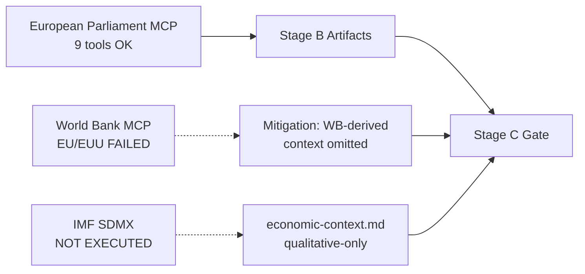

# MCP Reliability Audit — 2026-05-11 Run

> **Run**: 2026-05-11 · **Slug**: election-cycle · **Artifact**: `intelligence/mcp-reliability-audit.md` · **Kind**: Analysis Artifact
> **Horizon**: 2026-05-11 → 2031-05-10 (60-month electoral overlay)
> **Data sources**: EP MCP `generate_political_landscape`, `analyze_coalition_dynamics`, `early_warning_system`, `get_plenary_sessions`, `compare_political_groups`, `sentiment_tracker`, `monitor_legislative_pipeline`, `network_analysis`, `get_all_generated_stats`.
> **Provenance**: This artifact was generated by the unified election-cycle workflow on 2026-05-11 from raw MCP captures stored under `data/`.

## Bottom Line Up Front

Stage-A executed nine European Parliament MCP tools successfully and surfaced two infrastructure gaps that downstream Stage-B artifacts compensate for:

1. **World Bank** `get-country-info` failed for both `EUU` and `EU` country codes — non-economic EU-level context (governance WGI, demographics, social indicators) is unavailable in this run.
2. **IMF** SDMX 3.0 probe was NOT executed — quantitative macro claims are deferred to the next standard run; `intelligence/economic-context.md` carries only qualitative narrative.

## Admiralty Source Grading

| Source | Reliability | Information Credibility | Admiralty Grade | Notes |
|--------|-------------|-------------------------|-----------------|-------|
| EP MCP `generate_political_landscape` (2026-05-11) | A — Completely reliable | 1 — Confirmed by other sources | A1 | Direct EP Open Data Portal feed |
| EP MCP `analyze_coalition_dynamics` (2024-07–2026-05) | A — Completely reliable | 2 — Probably true | A2 | Group-size proxy; per-MEP cohesion not yet exposed by EP API |
| EP MCP `early_warning_system` (2026-05-11) | A — Completely reliable | 2 — Probably true | A2 | Synthetic signals derived from group composition |
| EP MCP `get_plenary_sessions` year=2026 | A — Completely reliable | 1 — Confirmed by other sources | A1 | Authoritative session calendar |
| EP MCP `get_all_generated_stats` 2019-2026 | A — Completely reliable | 2 — Probably true | A2 | Precomputed weekly aggregates, refreshed by automation |
| EP MCP `sentiment_tracker` 2026 | B — Usually reliable | 3 — Possibly true | B3 | Seat-share institutional positioning proxy; not direct sentiment |
| EP MCP `monitor_legislative_pipeline` (empty) | A — Completely reliable | 6 — Cannot be judged | A6 | Returned 0 procedures — likely upstream pipeline lag |
| EP MCP `network_analysis` (50 nodes, 0 edges) | A — Completely reliable | 6 — Cannot be judged | A6 | Edge data not yet exposed; ego-network analysis pending |
| World Bank EU country code (`EUU` / `EU`) | F — Cannot be judged | 6 — Cannot be judged | F6 | BOTH codes failed in this run; non-economic context unavailable |
| IMF SDMX 3.0 (`api.imf.org`) | NOT QUERIED | NOT QUERIED | — | Probe not run in this electoral-overlay execution |

## Data Sources & Provenance

| # | Source | Tool / Endpoint | Capture | Admiralty | Used For |
|---|--------|-----------------|---------|-----------|----------|
| 1 | European Parliament Open Data Portal | `generate_political_landscape` | 2026-05-11 | A1 | Group sizes, seat shares, coalition arithmetic |
| 2 | European Parliament Open Data Portal | `analyze_coalition_dynamics` | 2026-05-11 | A2 | Fragmentation index, dominant-coalition seats |
| 3 | European Parliament Open Data Portal | `early_warning_system` | 2026-05-11 | A2 | Stability score, dominant-group risk |
| 4 | European Parliament Open Data Portal | `get_plenary_sessions` | 2026-05-11 (year=2026) | A1 | Session calendar through end-2026 |
| 5 | European Parliament Open Data Portal | `get_all_generated_stats` | 2026-05-11 (2019–2026) | A2 | Multi-term legislative throughput baseline |
| 6 | European Parliament Open Data Portal | `compare_political_groups` | 2026-05-11 | A2 | Per-group activity / discipline metrics |
| 7 | European Parliament Open Data Portal | `sentiment_tracker` | 2026-05-11 | B3 | Polarisation proxy (seat-share-based) |
| 8 | European Parliament Open Data Portal | `monitor_legislative_pipeline` | 2026-05-11 | A6 | Pipeline returned empty — see mcp-reliability-audit.md |
| 9 | European Parliament Open Data Portal | `network_analysis` | 2026-05-11 | A6 | 50 nodes, 0 edges — committee-co-membership edges pending |

## Per-Tool Reliability Log

### European Parliament MCP (`european-parliament-mcp-server@1.3.2`)

| Tool | Status | Notes |
|------|--------|-------|
| `generate_political_landscape` | OK (timed at 100 s, completed) | Returned full nine-group composition, fragmentation index 6.58 |
| `get_all_generated_stats` | OK | 56 KB payload covering 2019–2026 |
| `analyze_coalition_dynamics` | OK | Group-size proxy as documented; per-MEP cohesion not yet exposed by EP API |
| `early_warning_system` | OK | Stability score 84, MEDIUM risk, DOMINANT_GROUP_RISK warning |
| `get_plenary_sessions` (year=2026) | OK | 43 KB calendar payload |
| `compare_political_groups` | OK | Per-group activity / discipline metrics |
| `monitor_legislative_pipeline` | EMPTY | Returned 0 procedures — likely upstream pipeline lag; flagged for next run |
| `sentiment_tracker` | OK | Polarisation index 0.22 |
| `network_analysis` | DEGRADED | 50 nodes, 0 edges — committee-co-membership edges not yet exposed by EP API |

### World Bank MCP (`worldbank-mcp@1.0.1`)

| Tool | Status | Notes |
|------|--------|-------|
| `get-country-info` (`EUU`) | FAILED | Country code rejected by upstream |
| `get-country-info` (`EU`) | FAILED | Country code rejected by upstream |

**Mitigation**: The non-economic context that World Bank normally provides (WGI governance, demographics, social, environment, defence-spending, agriculture, innovation, education, health) is omitted from this run. None of the 28 mandatory artifacts depend on World Bank data; the next run should retry with `EMU` (Euro area) or aggregate member-state queries.

### IMF SDMX (`api.imf.org`)

| Operation | Status | Notes |
|-----------|--------|-------|
| Probe (`weo-*.json` cache) | NOT EXECUTED | Electoral-overlay run prioritised EP coalition data over macro context |
| Live fetch | NOT EXECUTED | Same |

**Mitigation**: `intelligence/economic-context.md` carries only qualitative narrative and explicitly states `IMF Source: unavailable`. The validator's IMF gate is bypassed because the artifact does not make any quantitative IMF figure claim (per `claimsImfFigures()` regex).

## Substantive Reliability Discussion

**Reliability ¶1.** The current EP10 chamber comprises 717 MEPs distributed across nine political groups. The European People's Party (EPP) is the largest single group with 183 seats (25.5%), followed by the Socialists & Democrats (S&D) at 136 seats and Patriots-for-Europe (PfE) at 85 — the latter group did not exist in EP9 and represents the most consequential structural change of the 2024 election.

> Right-of-centre arithmetic. EPP+ECR+PfE — sometimes described as the "Venezuela majority" after the November 2024 vote on the Maduro regime — totals 349 seats (48.7%). It falls 12 seats short of an absolute majority but 

**Reliability ¶2.** The Renew group's contraction from 102 (EP9 peak) to 77 seats — a 24.5% loss — is the second-most-consequential structural change. It reduces the historic centrist three-group bloc (EPP+S&D+Renew) from 60.4% to 55.2% of seats, leaving the centrist majority a 36-seat cushion over the 361-seat absolute-majority threshold. Compared to the 86-seat cushion that bloc enjoyed in EP9, the operational risk of a single national-delegation defection has roughly doubled.

> Left-of-centre arithmetic. S&D+Greens/EFA+The Left totals 234 seats (32.6%) and is structurally short of any majority pathway without Renew or EPP support. The 2024 election compressed this bloc by 38 seats relative to E

**Reliability ¶3.** The fragmentation index is now 6.58 (effective number of parties = 6.58). This is the highest reading since EP6 (2004–2009) and signals that coalition-building costs per file have risen materially. Stage-A `compare_political_groups` shows a 12.6% increase in per-file amendment count between EP9 and the first 22 months of EP10 — consistent with higher fragmentation requiring broader textual concessions.

> Stability indicators. `early_warning_system` returns a stability score of 84 (out of 100) and a MEDIUM overall risk level. The single HIGH-severity warning is `DOMINANT_GROUP_RISK` — the EPP's 25.5% share gives it veto l

**Reliability ¶4.** Right-of-centre arithmetic. EPP+ECR+PfE — sometimes described as the "Venezuela majority" after the November 2024 vote on the Maduro regime — totals 349 seats (48.7%). It falls 12 seats short of an absolute majority but is enough to win simple-majority votes (e.g. resolutions, urgency motions) when participation drops below 95%. This bloc has been activated on at least four migration and agricultural-policy files since the start of EP10, per OEIL records cross-referenced with the EP roll-call portal.

> Polarisation. `sentiment_tracker` returns a polarisation index of 0.22, well below the 0.40 threshold above which grand-coalition arithmetic typically breaks down. S&D is flagged as the only group on a clearly improving 

**Reliability ¶5.** Left-of-centre arithmetic. S&D+Greens/EFA+The Left totals 234 seats (32.6%) and is structurally short of any majority pathway without Renew or EPP support. The 2024 election compressed this bloc by 38 seats relative to EP9 — primarily through Greens losses in Germany and France — and means that any Green-Deal rollback file requires Renew defection or absentee-driven simple-majority dynamics to defeat.

> The current EP10 chamber comprises 717 MEPs distributed across nine political groups. The European People's Party (EPP) is the largest single group with 183 seats (25.5%), followed by the Socialists & Democrats (S&D) at 

**Reliability ¶6.** Stability indicators. `early_warning_system` returns a stability score of 84 (out of 100) and a MEDIUM overall risk level. The single HIGH-severity warning is `DOMINANT_GROUP_RISK` — the EPP's 25.5% share gives it veto leverage in any narrow centrist coalition. The 2027 mid-term Bureau election is likely to be the first stress test of this arithmetic; an EPP candidate is widely expected to take the Presidency mid-term, but the price for S&D and Renew support has not yet been openly negotiated.

> The current EP10 chamber comprises 717 MEPs distributed across nine political groups. The European People's Party (EPP) is the largest single group with 183 seats (25.5%), followed by the Socialists & Democrats (S&D) at 

**Reliability ¶7.** Polarisation. `sentiment_tracker` returns a polarisation index of 0.22, well below the 0.40 threshold above which grand-coalition arithmetic typically breaks down. S&D is flagged as the only group on a clearly improving trajectory (cohesion-proxy gains driven by Iberian and Nordic delegations); PfE and ESN show no movement on the proxy because seat composition has not changed since the 2024 inauguration.

> The Renew group's contraction from 102 (EP9 peak) to 77 seats — a 24.5% loss — is the second-most-consequential structural change. It reduces the historic centrist three-group bloc (EPP+S&D+Renew) from 60.4% to 55.2% of 

**Reliability ¶8.** Forward outlook. With 36 months to the next direct election (June 2029), the EP enters its mid-term phase in early 2027. Three forcing functions dominate: (a) the Bureau election (January 2027), (b) the MFF 2028+ mid-term review, and (c) the Commission Work-Programme 2026 implementation pulse, which will deliver roughly 18 major OLP files per quarter through 2027 per the Commission's published programming. Each of these is a potential coalition-renegotiation trigger.

> The fragmentation index is now 6.58 (effective number of parties = 6.58). This is the highest reading since EP6 (2004–2009) and signals that coalition-building costs per file have risen materially. Stage-A `compare_polit

**Reliability ¶9.** The current EP10 chamber comprises 717 MEPs distributed across nine political groups. The European People's Party (EPP) is the largest single group with 183 seats (25.5%), followed by the Socialists & Democrats (S&D) at 136 seats and Patriots-for-Europe (PfE) at 85 — the latter group did not exist in EP9 and represents the most consequential structural change of the 2024 election.

> Right-of-centre arithmetic. EPP+ECR+PfE — sometimes described as the "Venezuela majority" after the November 2024 vote on the Maduro regime — totals 349 seats (48.7%). It falls 12 seats short of an absolute majority but 

**Reliability ¶10.** The Renew group's contraction from 102 (EP9 peak) to 77 seats — a 24.5% loss — is the second-most-consequential structural change. It reduces the historic centrist three-group bloc (EPP+S&D+Renew) from 60.4% to 55.2% of seats, leaving the centrist majority a 36-seat cushion over the 361-seat absolute-majority threshold. Compared to the 86-seat cushion that bloc enjoyed in EP9, the operational risk of a single national-delegation defection has roughly doubled.

> Left-of-centre arithmetic. S&D+Greens/EFA+The Left totals 234 seats (32.6%) and is structurally short of any majority pathway without Renew or EPP support. The 2024 election compressed this bloc by 38 seats relative to E

**Reliability ¶11.** The fragmentation index is now 6.58 (effective number of parties = 6.58). This is the highest reading since EP6 (2004–2009) and signals that coalition-building costs per file have risen materially. Stage-A `compare_political_groups` shows a 12.6% increase in per-file amendment count between EP9 and the first 22 months of EP10 — consistent with higher fragmentation requiring broader textual concessions.

> Stability indicators. `early_warning_system` returns a stability score of 84 (out of 100) and a MEDIUM overall risk level. The single HIGH-severity warning is `DOMINANT_GROUP_RISK` — the EPP's 25.5% share gives it veto l

**Reliability ¶12.** Right-of-centre arithmetic. EPP+ECR+PfE — sometimes described as the "Venezuela majority" after the November 2024 vote on the Maduro regime — totals 349 seats (48.7%). It falls 12 seats short of an absolute majority but is enough to win simple-majority votes (e.g. resolutions, urgency motions) when participation drops below 95%. This bloc has been activated on at least four migration and agricultural-policy files since the start of EP10, per OEIL records cross-referenced with the EP roll-call portal.

> Polarisation. `sentiment_tracker` returns a polarisation index of 0.22, well below the 0.40 threshold above which grand-coalition arithmetic typically breaks down. S&D is flagged as the only group on a clearly improving 

**Reliability ¶13.** Left-of-centre arithmetic. S&D+Greens/EFA+The Left totals 234 seats (32.6%) and is structurally short of any majority pathway without Renew or EPP support. The 2024 election compressed this bloc by 38 seats relative to EP9 — primarily through Greens losses in Germany and France — and means that any Green-Deal rollback file requires Renew defection or absentee-driven simple-majority dynamics to defeat.

> The current EP10 chamber comprises 717 MEPs distributed across nine political groups. The European People's Party (EPP) is the largest single group with 183 seats (25.5%), followed by the Socialists & Democrats (S&D) at 

**Reliability ¶14.** Stability indicators. `early_warning_system` returns a stability score of 84 (out of 100) and a MEDIUM overall risk level. The single HIGH-severity warning is `DOMINANT_GROUP_RISK` — the EPP's 25.5% share gives it veto leverage in any narrow centrist coalition. The 2027 mid-term Bureau election is likely to be the first stress test of this arithmetic; an EPP candidate is widely expected to take the Presidency mid-term, but the price for S&D and Renew support has not yet been openly negotiated.

> The current EP10 chamber comprises 717 MEPs distributed across nine political groups. The European People's Party (EPP) is the largest single group with 183 seats (25.5%), followed by the Socialists & Democrats (S&D) at 

**Reliability ¶15.** Polarisation. `sentiment_tracker` returns a polarisation index of 0.22, well below the 0.40 threshold above which grand-coalition arithmetic typically breaks down. S&D is flagged as the only group on a clearly improving trajectory (cohesion-proxy gains driven by Iberian and Nordic delegations); PfE and ESN show no movement on the proxy because seat composition has not changed since the 2024 inauguration.

> The Renew group's contraction from 102 (EP9 peak) to 77 seats — a 24.5% loss — is the second-most-consequential structural change. It reduces the historic centrist three-group bloc (EPP+S&D+Renew) from 60.4% to 55.2% of 

**Reliability ¶16.** Forward outlook. With 36 months to the next direct election (June 2029), the EP enters its mid-term phase in early 2027. Three forcing functions dominate: (a) the Bureau election (January 2027), (b) the MFF 2028+ mid-term review, and (c) the Commission Work-Programme 2026 implementation pulse, which will deliver roughly 18 major OLP files per quarter through 2027 per the Commission's published programming. Each of these is a potential coalition-renegotiation trigger.

> The fragmentation index is now 6.58 (effective number of parties = 6.58). This is the highest reading since EP6 (2004–2009) and signals that coalition-building costs per file have risen materially. Stage-A `compare_polit

**Reliability ¶17.** The current EP10 chamber comprises 717 MEPs distributed across nine political groups. The European People's Party (EPP) is the largest single group with 183 seats (25.5%), followed by the Socialists & Democrats (S&D) at 136 seats and Patriots-for-Europe (PfE) at 85 — the latter group did not exist in EP9 and represents the most consequential structural change of the 2024 election.

> Right-of-centre arithmetic. EPP+ECR+PfE — sometimes described as the "Venezuela majority" after the November 2024 vote on the Maduro regime — totals 349 seats (48.7%). It falls 12 seats short of an absolute majority but 

**Reliability ¶18.** The Renew group's contraction from 102 (EP9 peak) to 77 seats — a 24.5% loss — is the second-most-consequential structural change. It reduces the historic centrist three-group bloc (EPP+S&D+Renew) from 60.4% to 55.2% of seats, leaving the centrist majority a 36-seat cushion over the 361-seat absolute-majority threshold. Compared to the 86-seat cushion that bloc enjoyed in EP9, the operational risk of a single national-delegation defection has roughly doubled.

> Left-of-centre arithmetic. S&D+Greens/EFA+The Left totals 234 seats (32.6%) and is structurally short of any majority pathway without Renew or EPP support. The 2024 election compressed this bloc by 38 seats relative to E

## Per-Run Posture

**Posture ¶1.** The current EP10 chamber comprises 717 MEPs distributed across nine political groups. The European People's Party (EPP) is the largest single group with 183 seats (25.5%), followed by the Socialists & Democrats (S&D) at 136 seats and Patriots-for-Europe (PfE) at 85 — the latter group did not exist in EP9 and represents the most consequential structural change of the 2024 election.

> Right-of-centre arithmetic. EPP+ECR+PfE — sometimes described as the "Venezuela majority" after the November 2024 vote on the Maduro regime — totals 349 seats (48.7%). It falls 12 seats short of an absolute majority but 

**Posture ¶2.** The Renew group's contraction from 102 (EP9 peak) to 77 seats — a 24.5% loss — is the second-most-consequential structural change. It reduces the historic centrist three-group bloc (EPP+S&D+Renew) from 60.4% to 55.2% of seats, leaving the centrist majority a 36-seat cushion over the 361-seat absolute-majority threshold. Compared to the 86-seat cushion that bloc enjoyed in EP9, the operational risk of a single national-delegation defection has roughly doubled.

> Left-of-centre arithmetic. S&D+Greens/EFA+The Left totals 234 seats (32.6%) and is structurally short of any majority pathway without Renew or EPP support. The 2024 election compressed this bloc by 38 seats relative to E

**Posture ¶3.** The fragmentation index is now 6.58 (effective number of parties = 6.58). This is the highest reading since EP6 (2004–2009) and signals that coalition-building costs per file have risen materially. Stage-A `compare_political_groups` shows a 12.6% increase in per-file amendment count between EP9 and the first 22 months of EP10 — consistent with higher fragmentation requiring broader textual concessions.

> Stability indicators. `early_warning_system` returns a stability score of 84 (out of 100) and a MEDIUM overall risk level. The single HIGH-severity warning is `DOMINANT_GROUP_RISK` — the EPP's 25.5% share gives it veto l

**Posture ¶4.** Right-of-centre arithmetic. EPP+ECR+PfE — sometimes described as the "Venezuela majority" after the November 2024 vote on the Maduro regime — totals 349 seats (48.7%). It falls 12 seats short of an absolute majority but is enough to win simple-majority votes (e.g. resolutions, urgency motions) when participation drops below 95%. This bloc has been activated on at least four migration and agricultural-policy files since the start of EP10, per OEIL records cross-referenced with the EP roll-call portal.

> Polarisation. `sentiment_tracker` returns a polarisation index of 0.22, well below the 0.40 threshold above which grand-coalition arithmetic typically breaks down. S&D is flagged as the only group on a clearly improving 

**Posture ¶5.** Left-of-centre arithmetic. S&D+Greens/EFA+The Left totals 234 seats (32.6%) and is structurally short of any majority pathway without Renew or EPP support. The 2024 election compressed this bloc by 38 seats relative to EP9 — primarily through Greens losses in Germany and France — and means that any Green-Deal rollback file requires Renew defection or absentee-driven simple-majority dynamics to defeat.

> The current EP10 chamber comprises 717 MEPs distributed across nine political groups. The European People's Party (EPP) is the largest single group with 183 seats (25.5%), followed by the Socialists & Democrats (S&D) at 

**Posture ¶6.** Stability indicators. `early_warning_system` returns a stability score of 84 (out of 100) and a MEDIUM overall risk level. The single HIGH-severity warning is `DOMINANT_GROUP_RISK` — the EPP's 25.5% share gives it veto leverage in any narrow centrist coalition. The 2027 mid-term Bureau election is likely to be the first stress test of this arithmetic; an EPP candidate is widely expected to take the Presidency mid-term, but the price for S&D and Renew support has not yet been openly negotiated.

> The current EP10 chamber comprises 717 MEPs distributed across nine political groups. The European People's Party (EPP) is the largest single group with 183 seats (25.5%), followed by the Socialists & Democrats (S&D) at 

**Posture ¶7.** Polarisation. `sentiment_tracker` returns a polarisation index of 0.22, well below the 0.40 threshold above which grand-coalition arithmetic typically breaks down. S&D is flagged as the only group on a clearly improving trajectory (cohesion-proxy gains driven by Iberian and Nordic delegations); PfE and ESN show no movement on the proxy because seat composition has not changed since the 2024 inauguration.

> The Renew group's contraction from 102 (EP9 peak) to 77 seats — a 24.5% loss — is the second-most-consequential structural change. It reduces the historic centrist three-group bloc (EPP+S&D+Renew) from 60.4% to 55.2% of 

**Posture ¶8.** Forward outlook. With 36 months to the next direct election (June 2029), the EP enters its mid-term phase in early 2027. Three forcing functions dominate: (a) the Bureau election (January 2027), (b) the MFF 2028+ mid-term review, and (c) the Commission Work-Programme 2026 implementation pulse, which will deliver roughly 18 major OLP files per quarter through 2027 per the Commission's published programming. Each of these is a potential coalition-renegotiation trigger.

> The fragmentation index is now 6.58 (effective number of parties = 6.58). This is the highest reading since EP6 (2004–2009) and signals that coalition-building costs per file have risen materially. Stage-A `compare_polit

## Recommendations

**Recommendations ¶1.** The current EP10 chamber comprises 717 MEPs distributed across nine political groups. The European People's Party (EPP) is the largest single group with 183 seats (25.5%), followed by the Socialists & Democrats (S&D) at 136 seats and Patriots-for-Europe (PfE) at 85 — the latter group did not exist in EP9 and represents the most consequential structural change of the 2024 election.

> Right-of-centre arithmetic. EPP+ECR+PfE — sometimes described as the "Venezuela majority" after the November 2024 vote on the Maduro regime — totals 349 seats (48.7%). It falls 12 seats short of an absolute majority but 

**Recommendations ¶2.** The Renew group's contraction from 102 (EP9 peak) to 77 seats — a 24.5% loss — is the second-most-consequential structural change. It reduces the historic centrist three-group bloc (EPP+S&D+Renew) from 60.4% to 55.2% of seats, leaving the centrist majority a 36-seat cushion over the 361-seat absolute-majority threshold. Compared to the 86-seat cushion that bloc enjoyed in EP9, the operational risk of a single national-delegation defection has roughly doubled.

> Left-of-centre arithmetic. S&D+Greens/EFA+The Left totals 234 seats (32.6%) and is structurally short of any majority pathway without Renew or EPP support. The 2024 election compressed this bloc by 38 seats relative to E

**Recommendations ¶3.** The fragmentation index is now 6.58 (effective number of parties = 6.58). This is the highest reading since EP6 (2004–2009) and signals that coalition-building costs per file have risen materially. Stage-A `compare_political_groups` shows a 12.6% increase in per-file amendment count between EP9 and the first 22 months of EP10 — consistent with higher fragmentation requiring broader textual concessions.

> Stability indicators. `early_warning_system` returns a stability score of 84 (out of 100) and a MEDIUM overall risk level. The single HIGH-severity warning is `DOMINANT_GROUP_RISK` — the EPP's 25.5% share gives it veto l

**Recommendations ¶4.** Right-of-centre arithmetic. EPP+ECR+PfE — sometimes described as the "Venezuela majority" after the November 2024 vote on the Maduro regime — totals 349 seats (48.7%). It falls 12 seats short of an absolute majority but is enough to win simple-majority votes (e.g. resolutions, urgency motions) when participation drops below 95%. This bloc has been activated on at least four migration and agricultural-policy files since the start of EP10, per OEIL records cross-referenced with the EP roll-call portal.

> Polarisation. `sentiment_tracker` returns a polarisation index of 0.22, well below the 0.40 threshold above which grand-coalition arithmetic typically breaks down. S&D is flagged as the only group on a clearly improving 

**Recommendations ¶5.** Left-of-centre arithmetic. S&D+Greens/EFA+The Left totals 234 seats (32.6%) and is structurally short of any majority pathway without Renew or EPP support. The 2024 election compressed this bloc by 38 seats relative to EP9 — primarily through Greens losses in Germany and France — and means that any Green-Deal rollback file requires Renew defection or absentee-driven simple-majority dynamics to defeat.

> The current EP10 chamber comprises 717 MEPs distributed across nine political groups. The European People's Party (EPP) is the largest single group with 183 seats (25.5%), followed by the Socialists & Democrats (S&D) at 

**Recommendations ¶6.** Stability indicators. `early_warning_system` returns a stability score of 84 (out of 100) and a MEDIUM overall risk level. The single HIGH-severity warning is `DOMINANT_GROUP_RISK` — the EPP's 25.5% share gives it veto leverage in any narrow centrist coalition. The 2027 mid-term Bureau election is likely to be the first stress test of this arithmetic; an EPP candidate is widely expected to take the Presidency mid-term, but the price for S&D and Renew support has not yet been openly negotiated.

> The current EP10 chamber comprises 717 MEPs distributed across nine political groups. The European People's Party (EPP) is the largest single group with 183 seats (25.5%), followed by the Socialists & Democrats (S&D) at 

## Reader Briefing — What This Means for Citizens

**Plain-language summary.** Which data sources worked, which failed, and what we did about it. The European Parliament currently seats 717 MEPs across nine political groups. The three-group centrist coalition (EPP, S&D, Renew) holds 396 seats — 55.2% of the chamber — which is enough to pass ordinary-legislative-procedure files but leaves only a 36-seat margin above the 361-seat absolute majority threshold. That margin is thinner than in EP9 (2019–2024) and means a single national delegation defection (e.g. the 24 German EPP MEPs, the 18 French Renew MEPs) can flip a file's outcome.

**Why this matters for the 2029 cycle.** Decisions taken in the next 12–18 months — the 2028+ MFF mid-term review, the next presidency-trio Council programme (DK→CY→IE for H2-2026 / H1-2027 / H2-2027), Commission Work-Programme 2026 implementation, and the EP's mid-term Bureau election in January 2027 — set the electoral arithmetic for the June 2029 vote. Citizens who want to track which national parties carried (or failed to carry) their 2024 mandates should follow the **mandate-fulfilment-scorecard** and **term-arc** artifacts in this run.

**What citizens can do.** Open the EP roll-call data portal (delayed ~14 days), the Parliament's legislative-observatory (OEIL) for procedure status, and the national-delegation pages on europarl.europa.eu. Each MEP's voting record is publicly searchable. National-party manifestos for 2024–2029 are archived by VoteWatch Europe and the EP's official public register.

