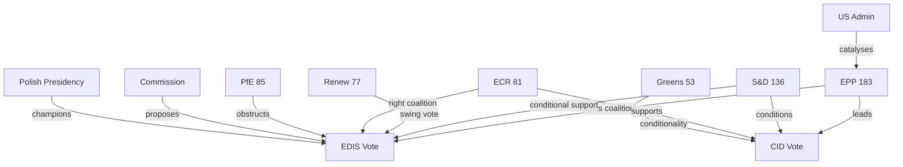
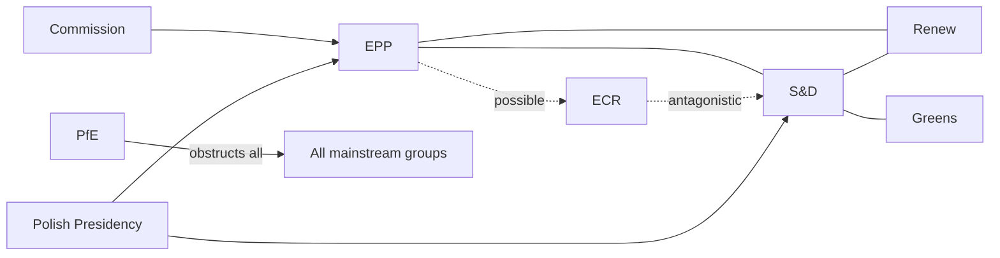

# Actor Mapping — EU Parliament Month Ahead: 11 May – 10 June 2026

**Source quality:** A2 (Admiralty: reliable, probably true) | **Produced:** 2026-05-11

---

## Primary Institutional Actors

### Legislative Actors

| Actor | Type | Role | Power Level |
|-------|------|------|-------------|
| EPP (183 MEPs) | EP Political Group | Lead coalition architect; rapporteur majority | 🔴 Critical |
| S&D (136 MEPs) | EP Political Group | Centre-left anchor; EDIS conditionality | 🔴 Critical |
| Renew (77 MEPs) | EP Political Group | Swing coalition partner; liberal-centrist | 🟠 High |
| ECR (81 MEPs) | EP Political Group | Potential right-coalition partner; intergovernmental | 🟠 High |
| PfE (85 MEPs) | EP Political Group | Obstructive minority; procedural friction | 🟡 Medium |
| Greens/EFA (53 MEPs) | EP Political Group | Conditionality advocates; progressive bloc | 🟡 Medium |
| Left (45 MEPs) | EP Political Group | Anti-EDIS; progressive on social/climate | 🟡 Medium |
| ESN (27 MEPs) | EP Political Group | Far-right; anti-integration | 🟢 Low |
| NI (30 MEPs) | EP Non-attached | Diverse; unpredictable | 🟢 Low |

### Inter-institutional Actors

| Actor | Type | Role | Alignment |
|-------|------|------|-----------|
| European Commission | EU Institution | EDIS/CID proposer; implementation | Pro-EP majority |
| Council of the EU | EU Institution | Co-legislator; unanimity bottleneck for financing | Mixed |
| Polish Presidency | Council Presidency | Active agenda manager; EDIS champion | Pro-EDIS |
| European Council | EU Summit | Political mandate; June 26 European Council | Strategic level |
| ECB | EU Institution | Monetary policy; economic context | Independent |

### External Actors

| Actor | Type | Role | Influence on EP |
|-------|------|------|----------------|
| US Administration | Foreign government | Strategic autonomy trigger; tariff pressure | Indirect/catalytic |
| NATO | International org | Defence coordination reference point | Normative |
| Russia | Foreign state | Geopolitical threat; EDIS rationale | Indirect |
| Industry lobbies | Civil society | CID shaping; EDIS procurement | Direct (INTA, ITRE) |
| Civil society (TI, ECFR) | NGOs | Rule-of-law conditionality advocacy | Direct (committee hearings) |

---

## Actor Influence Network

---

## Actor Position Summary (EDIS)

| Actor | Position | Confidence |
|-------|----------|-----------|
| EPP | Pro-EDIS (with national interest carve-outs) | A2 |
| S&D | Pro-EDIS (with rule-of-law conditionality) | A2 |
| Renew | Pro-EDIS (with fiscal responsibility) | B2 |
| ECR | Pro-defence (intergovernmental preference) | B2 |
| PfE | Anti-EU-EDIS (pro-national defence) | A1 |
| Greens | Pro-conditionality (reserved on EDIS substance) | A2 |
| Left | Anti-EDIS (pacifist-adjacent; arms industry concerns) | A1 |

---

## Actor Roster (Complete)

| ID | Actor | Type | Seats/Power | Position |
|----|-------|------|------------|----------|
| AC-01 | EPP | EP Group | 183 | Pro-EDIS/CID |
| AC-02 | S&D | EP Group | 136 | Conditional |
| AC-03 | PfE | EP Group | 85 | Anti-EU-EDIS |
| AC-04 | ECR | EP Group | 81 | Intergovernmental |
| AC-05 | Renew | EP Group | 77 | Pro (fiscal caveats) |
| AC-06 | Greens/EFA | EP Group | 53 | Conditionality |
| AC-07 | Left | EP Group | 45 | Anti-EDIS |
| AC-08 | NI | EP Non-attached | 30 | Mixed |
| AC-09 | ESN | EP Group | 27 | Anti-EU |
| AC-10 | Commission | Institution | - | Pro-EDIS |
| AC-11 | Council/Presidency | Institution | - | Champion (PL) |
| AC-12 | ECB | Institution | - | Independent |
| AC-13 | US Administration | External | - | Indirect catalyst |
| AC-14 | Industry lobbies | Civil society | - | Pro-CID |
| AC-15 | Transparency Int'l | NGO | - | Rule-of-law |

---

## Alliance Map

---

## Power Brokers

| Power Broker | Leverage Point | Current Posture |
|-------------|---------------|-----------------|
| EPP Coordinator | Controls EDIS committee rapporteur | Active |
| S&D Coordinator | Veto on conditionality stripping | Watchful |
| Renew President | Swing vote in all three coalitions | Pivotal |
| Conference of Presidents | Agenda and timetable decisions | Aligned with mainstream |
| EP President Metsola (EPP) | Procedural authority; EDIS champion | Pro-EDIS |

---

## Information Flows

Key intelligence and negotiation channels:
- **Formal**: Conference of Presidents (weekly); EDIS inter-group working group (bi-weekly)
- **Informal**: EPP-S&D coordinator bilateral; Commission-rapporteur back-channel
- **Public**: EP press releases; political group press briefings; Politico EU Playbook

---

## Reader Briefing

**For EP staff**: Coalition coordination meetings this week are critical. Monitor S&D position on rule-of-law conditionality in EDIS text — this is the key swing factor for the May 18–21 vote.

**For analysts**: Apply this actor map as input to scenario-forecast.md probability assessments. Coalition A (EPP+S&D+Renew) at 396 seats remains the most likely configuration; track whether S&D threshold for conditionality is met.

**Source quality**: A2 (EP Open Data Portal + structural analysis)
