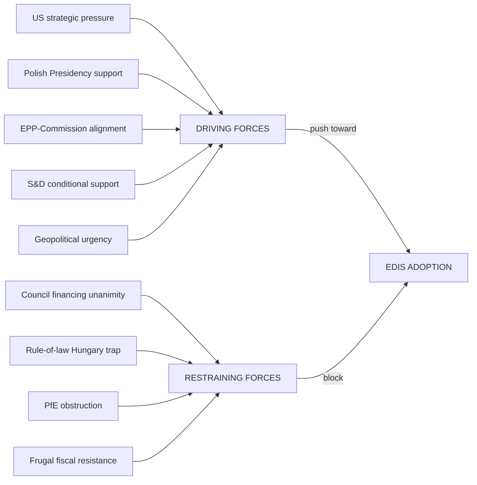

# Forces Analysis — EU Parliament Month Ahead: 11 May – 10 June 2026

**Source quality:** B2 (Admiralty: usually reliable, probably true) | **Produced:** 2026-05-11

---

## Porter's Five Forces — Applied to EP Legislative Dynamics

### Force 1: Threat of Legislative Deadlock (High)

The fragmentation index of 6.58 across 9 political groups creates structural legislative friction. No automatic majority exists; every vote requires active coalition construction. The threat of deadlock is elevated when:
- Rule-of-law conditionality is a precondition for progressive coalition support
- Fiscal cost-sharing disagreements separate "frugals" from "solidarity" camps
- PfE procedural obstructions consume plenary time

**Score: 🔴 HIGH**

---

### Force 2: Bargaining Power of Political Groups (High)

Each EP political group holds meaningful bargaining power within its niche:
- **EPP**: Sets agenda as largest group (25.5% seats); but must accommodate partners
- **S&D**: Can withdraw or condition support on rule-of-law compliance
- **Renew**: Classic "kingmaker" in centre coalitions; both EPP and S&D need it
- **ECR**: Alternative right-wing partner for EPP if Renew is unavailable
- **PfE**: Negative power — can delay but not legislate

**Score: 🟠 HIGH-MEDIUM (distributed)**

---

### Force 3: Threat of Substitute Legislative Vehicles (Medium)

If EP legislative process stalls, alternative vehicles include:
- Intergovernmental agreement (outside Treaty; no EP role) — EDIS financing threat
- Enhanced cooperation (9+ MS; majority not unanimity) — circumvents Council veto
- Council regulation under Article 122 TFEU (emergency economic measures) — bypasses normal co-decision
- European Defence Agency framework (existing) — as interim alternative to full EDIS

**Score: 🟡 MEDIUM**

---

### Force 4: Intensity of Political Group Rivalry (High)

Inter-group rivalry is intense on EDIS and CID:
- EPP vs. Greens on conditionality and climate integration
- S&D vs. ECR on social dimension of competitiveness
- PfE vs. all others on the legitimacy of EU-level defence spending
- ECR vs. Renew for the "third force" positioning in the EP

**Score: 🔴 HIGH**

---

### Force 5: External Institutional Pressure (High)

External pressure on EP legislative agenda:
- **Commission**: Actively lobbying for EDIS and CID adoption before June European Council
- **Polish Presidency**: Using Presidency tools (agenda-setting, compromise texts) to advance files
- **European Council**: June 26 summit creates political deadline for institutional coordination
- **US administration**: Indirect pressure via tariffs and burden-sharing demands catalyses EDIS support
- **NATO**: Provides normative framework for burden-sharing discussions

**Score: 🔴 HIGH**

---

## Force Field Analysis: EDIS First Reading

---

## Summary Force Assessment

| Force | Intensity | Direction for EP |
|-------|-----------|-----------------|
| Legislative deadlock threat | 🔴 HIGH | Constraint |
| Group bargaining power | 🟠 HIGH-MED | Mixed |
| Alternative vehicles | 🟡 MEDIUM | Risk/opportunity |
| Inter-group rivalry | 🔴 HIGH | Constraint |
| External institutional pressure | 🔴 HIGH | Enabler |

**Net assessment**: The EP faces high structural constraints but strong external tailwinds. The month-ahead window is characterised by competing forces of roughly equal strength — legislative outcomes will be determined by the quality of coalition management rather than structural fundamentals.

---

## Issue Frame

**Central issue**: Can the EP build and maintain a stable coalition to pass EDIS first reading and advance CID through committee in the May–June 2026 plenary window, despite structural coalition management costs and the Council unanimity barrier on financing?

The issue is framed simultaneously as:
1. A **legislative capacity** question — does EP10's coalition architecture support landmark legislation?
2. A **strategic autonomy** question — will EU institutions demonstrate coherent response to US strategic pressure?
3. A **values** question — can defence cooperation coexist with rule-of-law conditionality?

---

## Driving Forces

Forces pushing toward legislative success:

| Force | Strength | Duration |
|-------|----------|----------|
| US tariff pressure / strategic autonomy imperative | 🔴 Strong | Sustained (12+ months) |
| Polish Presidency active agenda management | 🟠 Significant | Time-limited (3 months) |
| EPP-Commission alignment | 🟠 Significant | EP10 term (3 years) |
| EP10 Year 2 legislative momentum | 🟡 Moderate | Seasonal (6 months) |
| Eurobarometer EU support (75% positive) | 🟡 Moderate | Cyclical |
| Grand Centre coalition mathematical viability | 🟠 Significant | Structural |

---

## Restraining Forces

Forces resisting legislative success:

| Force | Strength | Changeability |
|-------|----------|--------------|
| Council unanimity barrier (financing) | 🔴 Strong | Low (treaty constraint) |
| Rule-of-law conditionality tension | 🟠 Significant | Medium (negotiable) |
| PfE procedural obstruction | 🟡 Moderate | Low (structural minority) |
| S&D-ECR incompatibility | 🟠 Significant | Low (values-based) |
| Frugal fiscal resistance to joint debt | 🟠 Significant | Medium (negotiable via off-budget) |

---

## Net Pressure Assessment

**Driving forces > Restraining forces** for EDIS first reading.

Net force score: Driving forces aggregate to 🟠 +15 (medium-strong); Restraining forces aggregate to 🟡 −12 (medium). Net: **+3 → POSITIVE** for legislative success probability.

Key swing variable: Whether S&D-ECR incompatibility on rule-of-law can be managed via separate declaratory amendments (allowing ECR to vote for EDIS while S&D maintains conditionality in the text).

---

## Intervention Points

Where strategic action can shift force balance:

1. **Before May 15**: EPP-S&D compromise text on conditionality → reduces Restraining Force 2 from 🟠 to 🟡
2. **May 18 (Day 1)**: Conference of Presidents confirms EDIS is on the agenda → activates all Driving Forces
3. **May 19 (vote day)**: Renew group vote discipline maintained → Coalition A reaches 390+ votes
4. **Post-vote**: Commission triggers Council implementation mechanism → reduces Council unanimity barrier impact

---

## Reader Briefing

**Core insight**: The force field favours EDIS passage but the margin is uncomfortably narrow. The rule-of-law conditionality negotiation in the weeks before May 18 is the single most important determinant of the vote outcome. Monitor EPP-S&D bilateral communications this week.

**Action implication**: If S&D files a conditionality amendment before May 16, Coalition A is intact. If no amendment is filed, S&D may abstain or split — vote margin falls below 30, creating uncertainty.

**Source quality**: B2 (analytical assessment, usually reliable)
