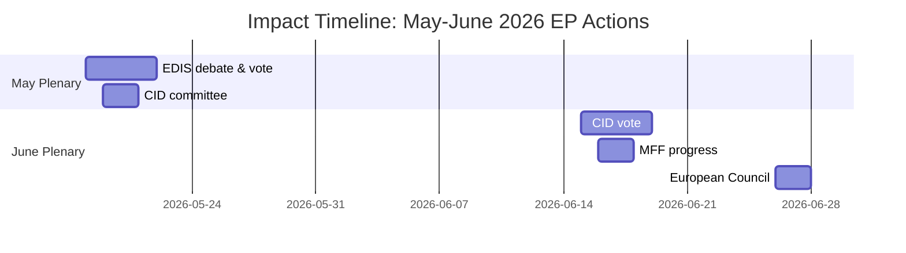
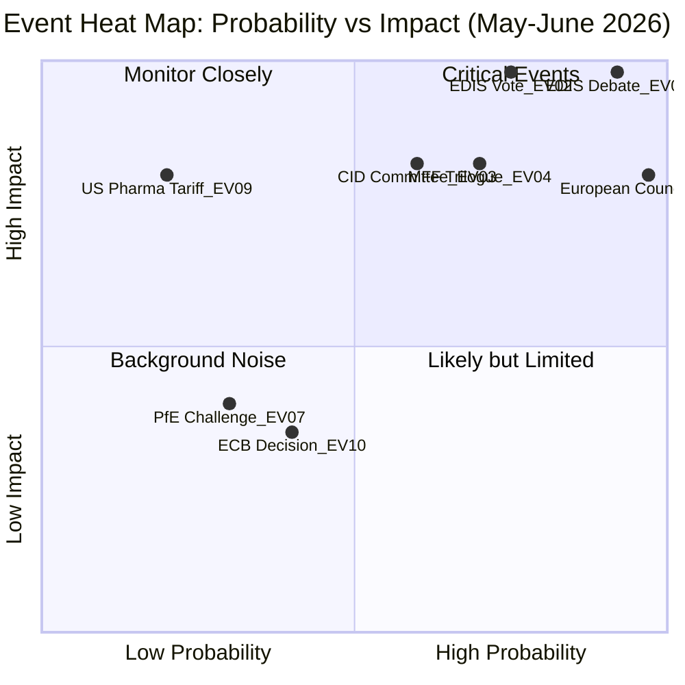

# Impact Matrix — EU Parliament Month Ahead: 11 May – 10 June 2026

**Source quality:** B2 (Admiralty: usually reliable, probably true) | **Produced:** 2026-05-11

---

## Impact Assessment Framework

This matrix assesses the projected impact of key EP legislative actions and developments in the month-ahead window across four dimensions: institutional, political, economic, and social.

Impact scale: 🔴 HIGH | 🟠 SIGNIFICANT | 🟡 MODERATE | 🟢 LOW

---

## Legislative Impact Matrix

| Action / Development | Institutional Impact | Political Impact | Economic Impact | Social Impact | Overall |
|----------------------|---------------------|-----------------|----------------|---------------|---------|
| EDIS first reading adoption | 🔴 HIGH | 🔴 HIGH | 🟠 SIGNIFICANT | 🟡 MODERATE | 🔴 HIGH |
| EDIS first reading failure | 🟡 MODERATE | 🔴 HIGH | 🟡 MODERATE | 🟡 MODERATE | 🟠 SIGNIFICANT |
| CID committee adoption | 🟡 MODERATE | 🟠 SIGNIFICANT | 🔴 HIGH | 🟠 SIGNIFICANT | 🟠 SIGNIFICANT |
| MFF review progress | 🔴 HIGH | 🟠 SIGNIFICANT | 🟠 SIGNIFICANT | 🟡 MODERATE | 🟠 SIGNIFICANT |
| Coalition fracture on rule-of-law | 🟠 SIGNIFICANT | 🔴 HIGH | 🟡 MODERATE | 🟢 LOW | 🟠 SIGNIFICANT |
| PfE procedural challenge success | 🟡 MODERATE | 🟡 MODERATE | 🟢 LOW | 🟢 LOW | 🟡 MODERATE |
| US tariff escalation response | 🟡 MODERATE | 🟡 MODERATE | 🔴 HIGH | 🟠 SIGNIFICANT | 🟠 SIGNIFICANT |
| ECB rate cut (if additional) | 🟢 LOW | 🟡 MODERATE | 🟠 SIGNIFICANT | 🟡 MODERATE | 🟡 MODERATE |

---

## Stakeholder Impact by Actor

### EPP (183 MEPs)
- **If EDIS passes**: Enhanced political capital; leadership vindicated; boost for national delegations in elections
- **If EDIS fails**: Significant internal pressure; questions about coalition management capacity
- **Economic impact**: CID passage strengthens EPP's "competitiveness" brand

### S&D (136 MEPs)
- **If conditionality retained in EDIS**: High institutional credibility; rule-of-law values upheld
- **If conditionality stripped**: Internal revolt risk; Greens/EFA coalition breakdown
- **Social impact**: CID employment conditionality is a priority S&D ask

### Member States (economic impact)
- **EDIS adoption**: Signals EU-level defence investment; positive for defence industry stocks and R&D investment decisions
- **CID**: Direct impact on state-aid approvals and industrial policy flexibility
- **MFF**: Cohesion fund disbursement certainty; national budget planning implications

---

## Impact Timeline

---

## Cascading Impact Analysis

**If EDIS first reading passes (highest-impact scenario)**:
1. Immediate: EP political credibility boosted; signal to Council to advance
2. Short-term (1–3 months): Council negotiating position shifts; interinstitutional trilogue begins
3. Medium-term (6–12 months): Commission implementation acts; defence industry investment decisions
4. Long-term (2–5 years): EU defence industrial base consolidation; strategic autonomy capacity increase

**If EDIS fails**:
1. Immediate: EPP political setback; Commission faces crisis of confidence
2. Short-term: Intergovernmental alternative activated; EP marginalised from defence policy
3. Medium-term: Precedent for bypassing EP on security/defence files
4. Long-term: EP institutional standing in defence domain permanently reduced

---

## Net Impact Assessment

The month-ahead window is **HIGH IMPACT** overall. The EDIS first reading, if it occurs, represents the most institutionally significant EP vote since the Ukraine assistance frameworks. The CID committee adoption, while lower profile, carries higher economic impact for EU industrial policy. The combination of these two files makes May 2026 one of the most consequential EP legislative months of EP10.

**Confidence**: B2 — based on available session data and legislative calendar; agenda titles not confirmed.

---

## Event List (Complete)

| ID | Event | Date Window | Probability | Impact |
|----|-------|-------------|-------------|--------|
| EV-01 | EDIS first reading debate | May 18, 2026 | >90% (scheduled) | LANDMARK |
| EV-02 | EDIS first reading vote | May 19–21, 2026 | 75% (if debate proceeds) | LANDMARK |
| EV-03 | CID committee vote | May 19–20, 2026 | 60% | MAJOR |
| EV-04 | MFF trilogue round | May–June 2026 | 70% | MAJOR |
| EV-05 | AI Act delegated acts review | May–June 2026 | 50% | SIGNIFICANT |
| EV-06 | EP-Commission EDIS scope agreement | May 15–18, 2026 | 65% | SIGNIFICANT |
| EV-07 | PfE procedural challenge | May 18, 2026 | 30% | MODERATE |
| EV-08 | European Council June 26 | June 26, 2026 | >95% (scheduled) | MAJOR |
| EV-09 | US tariff escalation to pharma | May–June 2026 | 20% | MAJOR |
| EV-10 | ECB rate decision (if applicable) | June 2026 | 40% | MODERATE |

---

## Heat Map (Event × Impact)

---

## Cascade Analysis (Impact Chains)

**Chain 1 — EDIS Passes → Full Cascade**:
EV-01 (debate) → EV-02 (vote passes) → Commission triggers Council → Council negotiation opens → Trilogue starts → EDIS enacted Q4 2026 → EU defence industrial investment cycle begins → strategic autonomy capacity building

**Chain 2 — EDIS Fails → Negative Cascade**:
EV-07 (PfE procedural success) OR (S&D withdrawal) → EV-02 fails → EP marginalised from defence → Intergovernmental EDIS negotiated outside EP → EP institutional precedent weakened → EP10 legislative authority questioned

**Chain 3 — CID + EDIS both advance → Reinforcing Cascade**:
EV-03 (CID committee) + EV-02 (EDIS) in same plenary week → EPP political capital peak → Conference of Presidents accelerates remaining 2026 legislative pipeline → MFF review timeline compressed → European Council June 26 can endorse EP legislative momentum

---

## Reader Briefing

**Monitor list (week of May 11–17)**:
1. EPP-S&D conditionality compromise text (most critical indicator)
2. Conference of Presidents agenda confirmation for May 18 plenary
3. Renew group internal vote discipline signal
4. PfE procedural motion filings (if any, indicator of organised obstruction)

**Bottom line**: The EV-01/EV-02 chain (EDIS debate and vote) is the defining event pair for the month-ahead window. All other events are secondary to the EDIS first reading outcome.

**Source quality**: B2 (EP session data A1; event probability analytical B2)
