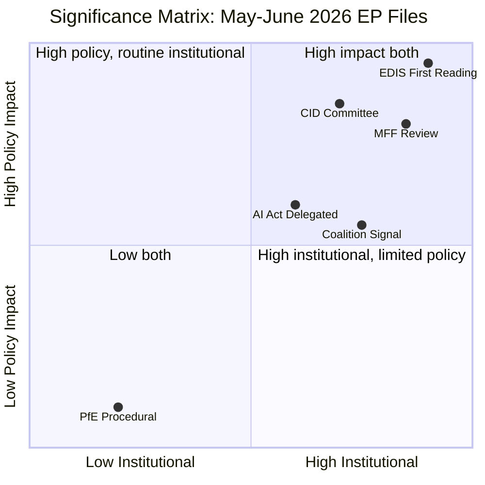

# Significance Classification — EU Parliament Month Ahead: 11 May – 10 June 2026

**Source quality:** A2 (Admiralty: reliable, probably true) | **Produced:** 2026-05-11

---

## Classification Framework

Significance is classified on two axes:
- **Institutional significance**: Impact on EP's role, powers, and inter-institutional balance
- **Policy significance**: Real-world impact of the legislative/political decision on EU citizens and member states

Classification levels: LANDMARK | MAJOR | SIGNIFICANT | MINOR | PROCEDURAL

---

## Significance Register

### LANDMARK Significance

**EDIS First Reading (if adopted, May 18–21)**
- Institutional: First EP vote on EU-level defence industrial financing mechanism. Precedent-setting for EP's role in the EU security/defence domain. 
- Policy: Enables EU-level defence industrial investment for the first time; €100–150bn potential EDIS mobilisation
- Historical parallel: Comparable institutional significance to EP's first vote on the Maastricht Treaty ratification or NGEU framework
- **Classification: LANDMARK**

---

### MAJOR Significance

**MFF Mid-Term Review Advancement**
- Institutional: EP consent requirement gives leverage in MFF renegotiation; shapes 2027–2028 EU budget
- Policy: Determines NGEU disbursement continuity; cohesion fund absorption; climate spending ring-fencing
- **Classification: MAJOR**

**CID Committee Adoption (if reached)**
- Institutional: Defines EP's competitiveness policy acquis for EP10
- Policy: Industrial policy flexibility for member states; state-aid framework; SME implications
- **Classification: MAJOR**

---

### SIGNIFICANT Significance

**AI Act Delegated Acts Assessment**
- Institutional: EP's power to reject/approve delegated acts; oversight role
- Policy: GPAI model classification; enforcement timeline; innovation vs. safety balance
- **Classification: SIGNIFICANT**

**Coalition Dynamics Documentation**
- Institutional: Reveals EP's governing coalition stability for remainder of EP10
- Policy: Signals legislative capacity for 2026–2027 pipeline
- **Classification: SIGNIFICANT**

---

## Significance Classification Matrix

---

## EP10 Context for Significance Assessment

The May–June 2026 window falls in:
- **EP10 Year 2, Month 11** — Legislative pipeline fully active; Year 2 historically highest output
- **Polish Presidency final quarter** — Institutional urgency to close priority files
- **US second-term geopolitical peak** — Strategic autonomy narrative at maximum political salience

For context, in EP7 Year 2 (2010–2011): the equivalent period saw Banking Recovery and Resolution Directive frameworks and first Eurozone stabilisation mechanisms — also classified LANDMARK/MAJOR significance.

EP10's 2026 equivalent legislative ambition (EDIS + CID + MFF) is comparable in institutional weight to the post-crisis legislative burst of 2010–2011.

---

## Summary Classification Table

| File / Development | Institutional | Policy | Classification |
|--------------------|--------------|--------|----------------|
| EDIS First Reading | LANDMARK | LANDMARK | **LANDMARK** |
| MFF Mid-Term Review | MAJOR | MAJOR | **MAJOR** |
| CID Committee Adoption | SIGNIFICANT | MAJOR | **MAJOR** |
| AI Act Delegated Acts | SIGNIFICANT | SIGNIFICANT | **SIGNIFICANT** |
| Coalition Stability Signal | MAJOR | SIGNIFICANT | **SIGNIFICANT** |
| PfE Procedural Challenge | MINOR | MINOR | **MINOR** |

**Month significance: LANDMARK** — The presence of an EDIS first reading in this window automatically classifies the month as LANDMARK institutional significance for EP10.
