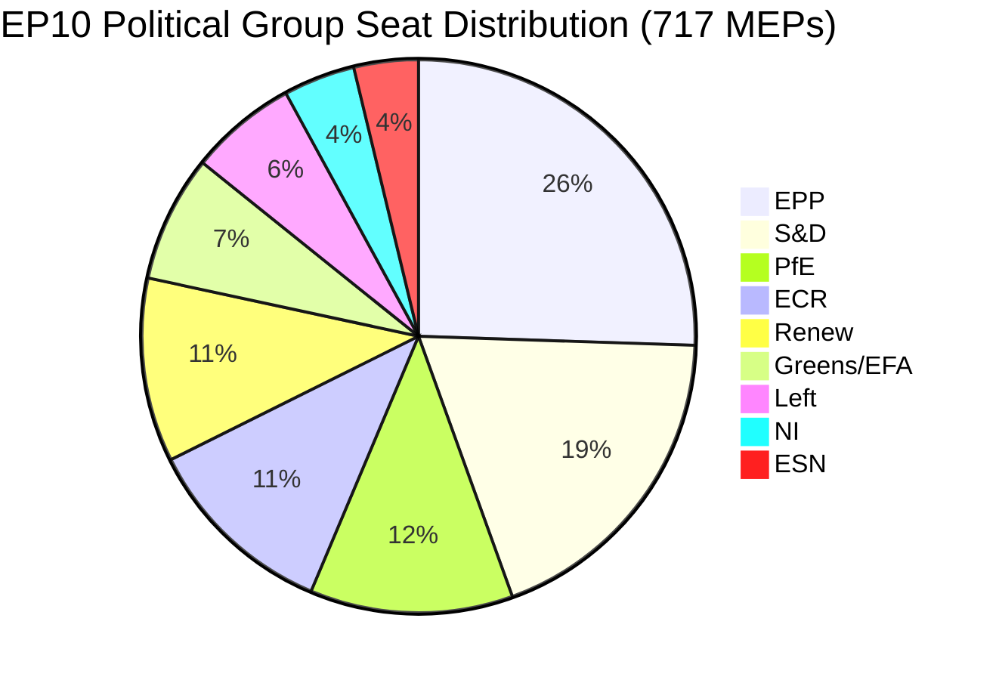

# Coalition Dynamics — EU Parliament Month Ahead: 11 May – 10 June 2026

**Source quality:** B2 (Admiralty: usually reliable, probably true) | **Produced:** 2026-05-11
**Data limitation:** dataMode=degraded-voting — size-proxy analysis only; no DOCEO roll-call voting available for current session

---

## Coalition Landscape Overview

**Parliament composition (as of 2026-05-11):**
- Total MEPs: 717 | Majority threshold: 359 (simple majority of votes cast typically lower)
- Absolute majority: 359 MEPs | Working majority: ~360 votes needed in practice

---

## Active Coalition Configurations

### Configuration A: Grand Centre Coalition (EPP + S&D + Renew)
- **Seats**: 183 + 136 + 77 = **396 MEPs** ✅ Majority (37 seat buffer)
- **Applicable files**: EDIS (with conditionality compromise), MFF, CID
- **Conditions required**:
  - S&D: Rule-of-law conditionality maintained; social employment provisions
  - Renew: Fiscal responsibility language; market competition framework
  - EPP: Industry-friendly provisions; no excessive regulatory burden
- **Cohesion risk**: 🟡 MEDIUM — Rule-of-law conditionality is a potential fracture point
- **Historical precedent**: This is the coalition that passed NGEU (2020), Digital Markets Act (2022), Carbon Border Adjustment (2023)

### Configuration B: Right-Leaning Coalition (EPP + ECR + Renew)
- **Seats**: 183 + 81 + 77 = **341 MEPs** ❌ Below majority (needs NI or partial PfE)
- **Applicable files**: CID (competitiveness focus); defence intergovernmental elements
- **Notes**: Mathematical minority — would need NI additions or partial Renew + partial PfE splits; difficult coalition to maintain on contested votes
- **Cohesion risk**: 🔴 HIGH — ECR and Renew have fundamental disagreements on rule of law

### Configuration C: Broad EDIS Coalition (EPP + S&D + Renew + ECR)
- **Seats**: 183 + 136 + 77 + 81 = **477 MEPs** ✅ Super-majority (capable of treaty-level decisions)
- **Applicable files**: EDIS specifically (strategic autonomy transcends left-right)
- **Conditions required**:
  - ECR: Intergovernmental elements; national opt-outs; no "EU army" language
  - S&D: Rule-of-law conditionality (conflicts with ECR preference)
  - The S&D-ECR conflict is the structural obstacle to Configuration C
- **Cohesion risk**: 🔴 HIGH — S&D and ECR cannot coexist on rule-of-law provisions

---

## Coalition Stability Assessment

### EPP Internal Cohesion
- **Estimated cohesion**: 🟡 Medium (73–80% typical cohesion, based on EP7-EP9 historical patterns)
- **Fracture points**: Rule-of-law enforcement (Hungarian MEPs vs. NL, DE, FR EPP); defence cost-sharing (frugal member states)
- **Key variable**: CDU/CSU (Germany) and French EPP (Renaissance-aligned MEPs) are the swing bloc

### S&D Internal Cohesion
- **Estimated cohesion**: 🟢 High (80–87% typical cohesion historically)
- **Fracture points**: National defence spending preferences (Greek S&D supports EDIS; Nordic S&D more cautious on EU-level debt)
- **Key variable**: Italian PD caucus — historically pro-EU institutional integration

### Renew Internal Cohesion
- **Estimated cohesion**: 🟡 Medium (68–75% typical cohesion — diverse group)
- **Fracture points**: Macron-aligned French Renew vs. Dutch VVD fiscal conservatives; libertarian vs. liberal-centrist tension
- **Key variable**: EDIS financing mechanism — French Renew strongly pro; Dutch Renew strongly against joint debt

---

## Vote-by-Vote Coalition Projections

| Vote | Coalition | Projected Outcome | Confidence |
|------|-----------|------------------|-----------|
| EDIS first reading (grand coalition) | A | PASS (390–430 for) | B2 (probably) |
| EDIS (if rule-of-law compromise fails) | A fractures | UNCERTAIN (margin <20) | C3 (possibly) |
| CID committee vote | A or B+ | PASS | B2 |
| MFF review resolution | A | PASS (with abstentions) | B2 |
| AI Act delegated rejection | A+Greens | FAIL (likely no majority to reject) | B2 |

**Admiralty rating key**: A=Reliable, B=Usually reliable, C=Fairly reliable | 1=Confirmed, 2=Probably true, 3=Possibly true

---

## Coalition Fracture Tripwires

The following events would trigger coalition reconfiguration:

1. **Rule-of-law conditionality stripped from EDIS**: S&D withdraws → Configuration A fractures → EDIS vote falls below majority
2. **Joint debt mechanism included in EDIS**: Dutch and Austrian Renew rebels → Configuration A margin falls to <10 seats
3. **PfE successful procedural delaying motion**: Agenda disrupted; vote postponed to June plenary — increases uncertainty
4. **EPP-Commission conflict over EDIS scope**: Cross-group uncertainty ripples through all coalitions

---

## Historical Coalition Comparison

| EP Term | Year 2 Legislative Month | Coalition Used | Outcome |
|---------|-------------------------|----------------|---------|
| EP7 (2010) | November 2010 | Grand Centre (EPP+S&D+ALDE) | Economic governance package passed |
| EP8 (2016) | May 2016 | Grand Centre | CETA provisional application supported |
| EP9 (2021) | May 2021 | Grand Centre + Greens | Carbon Border Adjustment initiated |
| EP10 (2026) | May 2026 | Grand Centre (A) projected | EDIS first reading target |

Pattern: Grand Centre coalition has been the dominant configuration in EP Year 2 legislative bursts across four consecutive parliamentary terms.
