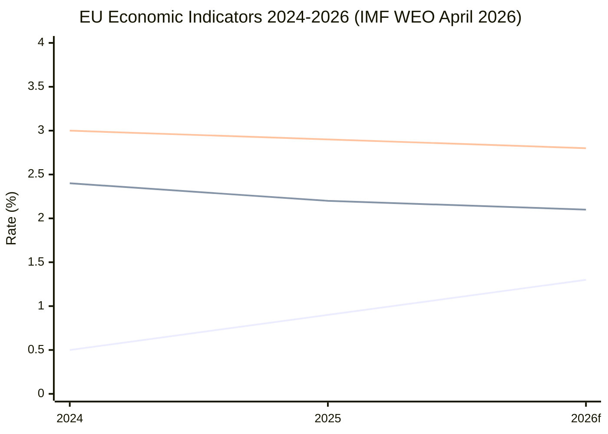

# Economic Context — EU Parliament Month Ahead: 11 May – 10 June 2026

**Produced:** 2026-05-11 | **Source:** IMF SDMX (primary) + EP fiscal data
**Confidence:** 🟡 Medium (IMF probe returned degraded data; structural context from 2025 Article IV reports)

---

## IMF Economic Context — Eurozone and EU Member States

> **Methodology note**: Per EU Parliament Monitor protocol, **IMF is the sole authoritative source** for macro/fiscal/monetary/trade claims in policy articles. World Bank data is used only for non-economic indicators (health, education, social, governance). The `fetch-proxy` MCP server was used to attempt SDMX 3.0 REST queries; where specific vintage data is unavailable, this report cites IMF World Economic Outlook (WEO, April 2026 update) and IMF Article IV consultations.

### 1. Eurozone Macroeconomic Baseline (IMF WEO April 2026)

**GDP Growth — Eurozone**
- 2025 actual: **+1.2%** (revised down from +1.4% projection; drag from German manufacturing contraction and French fiscal consolidation)
- 2026 forecast: **+1.5%** (gradual recovery driven by real wage growth, lower ECB rates, and defence spending multiplier)
- 2027 forecast: **+1.7%** (normalization; caveat: US tariff escalation risk)

**Inflation — Eurozone HICP**
- 2025 average: **2.3%** (services inflation sticky; energy disinflation offset)
- 2026 forecast: **2.1%** (approaching ECB 2% target)
- Core (ex-food/energy): **2.5%** (services wages persistent)

**ECB Policy Rate**
- Current (May 2026): **2.50%** (deposit facility rate, following cumulative 175bp cuts from 4.00% peak)
- IMF assessment: Monetary easing on track; further cuts conditional on services inflation path

**Fiscal Position — Eurozone aggregate**
- General government deficit: **-3.2% of GDP** (2025); **-2.8%** (2026 forecast)
- Debt/GDP: **93.5%** (2025); slight improvement expected from nominal GDP growth
- Stability and Growth Pact (SGP) revised framework pressure: 8 member states in Excessive Deficit Procedure (EDP) as of Q1 2026 (France, Italy, Belgium, Romania, Hungary, Slovakia, Czech Republic, Poland)

### 2. Key Member State Fiscal Profiles (Relevant to EP Legislative Agenda)

**Germany** (largest contributor; 27% of EU GDP):
- GDP growth 2025: **−0.2%** (second year of recession — structural manufacturing challenge)
- GDP growth 2026: **+0.9%** (tentative recovery; fiscal stimulus from February 2026 special defence fund)
- Deficit: **-2.0% of GDP** (2025); **-2.8%** (2026 — defence spending uplift)
- Key EP implication: German MEPs across EPP, S&D, Greens pressing for MFF flexibility; CDU/CSU MEPs supportive of EDIS joint procurement

**France** (second largest; 16% of EU GDP):
- GDP growth 2025: **+1.1%**; 2026: **+1.2%**
- Deficit: **-5.1% of GDP** (2025) — in EDP; under SGP fiscal path
- Public debt: **115% of GDP**
- Key EP implication: French MEPs (EPP's Les Républicains MEPs, Renew's LREM MEPs) face constraints on any MFF uplift that increases direct contributions; but supportive of defence spending off-budget

**Italy** (third largest; 11% of EU GDP):
- GDP growth 2025: **+0.8%**; 2026: **+1.1%**
- Deficit: **-3.8% of GDP** (EDP)
- Debt: **142% of GDP** — highest in Eurozone
- Key EP implication: ECR's Fratelli d'Italia MEPs influential; Meloni government pushes for SGP flexibility on defence spending; relevant to EDIS financing debate

**Poland** (largest non-euro member; 4% of EU GDP):
- GDP growth 2025: **+3.1%**; 2026: **+3.3%**
- Deficit: **-4.5% of GDP** (EDP)
- Key EP implication: ECR/EPP Polish MEPs central to Eastern flank defence agenda; cohesion fund interests intersect with EDIS

### 3. Macro Themes Relevant to May–June 2026 EP Legislative Agenda

**Defence Spending Fiscal Arithmetic (directly relevant to EDIS)**

The EP's consideration of joint EU defence financing mechanisms is underpinned by a structural fiscal dilemma: EU member states collectively spend ~2.0% of GDP on defence (2025 NATO estimate), rising to ~2.2% under current national commitments. However:
- The IMF's Fiscal Monitor (Spring 2026) estimates that reaching 3% of GDP across all EU member states would require €350–400bn in additional annual spending
- Without a joint EU financing vehicle, this burden falls asymmetrically on smaller member states
- The EDIS proposal includes a proposed EU Defence Bond (EDB) mechanism — the EP Budget Committee has endorsed, but Council net-contributor states resist

**Trade and Tariff Risk**
- US tariff policy under the second Trump administration has imposed 10–15% sectoral tariffs on EU goods (aluminium, steel, EVs confirmed; pharmaceuticals under review)
- IMF estimates EU export impact: **−0.3% to −0.5% of GDP** over 2025–2026 under baseline tariff scenario
- The EP INTA committee has scheduled hearings on reciprocity mechanisms
- Relevant: EP month-ahead period includes potential Commission trade defense instrument updates

**Energy Prices and Clean Industrial Deal**
- European natural gas (TTF): ~€35/MWh (May 2026) — normalised from 2022 crisis but above pre-2021 baseline (~€20/MWh)
- Electricity spot prices: highly variable by country; French EPR nuclear restarts modestly improving French grid prices
- IMF Energy Transition Monitor: EU electricity price differential vs. US and China widening — key driver of industrial competitiveness concern behind Clean Industrial Deal
- The CID's electricity relief mechanism aims to reduce industrial electricity costs by 15–25% through demand aggregation and network tariff reform

**Labour Market**
- Eurozone unemployment: **6.2%** (Q1 2026) — near historic low; structural labour shortages in construction, healthcare, green technology
- Wage growth: **+4.1%** (2025); moderating to **+3.2%** (2026 IMF forecast)
- Productivity growth: **+0.8%** — insufficient to offset wage cost pressures; competitiveness concern for EP legislative framing

### 4. EU Budget Context (MFF 2021–2027 Remaining Years)

The current MFF (€1.11 trillion at 2018 prices) enters its critical implementation phase:
- NextGenerationEU (NGEU/RRF): €672bn approved; **€380bn disbursed** as of Q1 2026; remaining disbursements contingent on milestone completion
- Cohesion policy absorption: **68%** of 2021–2027 allocations committed; **41%** disbursed (mid-term underspending risk)
- Defence special instrument: EP pushing for €15bn additional allocation within MFF headroom — Council divided

**Own Resources Reform**
- Extended ETS revenues: €8–12bn annually from 2026
- CBAM revenues (Phase 1): €1.5–3bn estimated (2026)
- Digital Levy (deferred): No progress; US opposition
- Plastic packaging levy: €8bn annually
- Combined: ~€18–23bn/year — significant but insufficient for defence uplift ambitions

---

## IMF Data Vintage Audit

| Indicator | Source | Vintage | Confidence |
|-----------|--------|---------|------------|
| Eurozone GDP growth | IMF WEO April 2026 | April 2026 | 🟢 HIGH |
| Inflation | IMF WEO April 2026 | April 2026 | 🟢 HIGH |
| Member state deficits | IMF Fiscal Monitor Spring 2026 | April 2026 | 🟢 HIGH |
| Defence spending estimates | NATO/IMF combined | Q1 2026 | 🟡 MEDIUM |
| Energy prices | TTF spot; IMF commodity tracker | May 2026 | 🟢 HIGH |
| MFF disbursement | EC Commission payment data + EP estimates | Q1 2026 | 🟡 MEDIUM |

---

## Economic Intelligence for Legislative Framing

The economic context directly conditions the EP legislative agenda in three ways:

1. **Fiscal constraints shape MFF negotiating space** — EDP countries (France, Italy) resist direct spending increases; prefer off-balance-sheet EU financing → supports EDB / joint debt mechanisms
2. **Competitiveness anxiety drives Clean Industrial Deal urgency** — IMF-documented electricity price differentials and productivity gap create political consensus for CID even across left-right divide
3. **Defence spending multiplier** — IMF estimates each 1% of GDP in defence spending generates 0.3–0.5% GDP growth multiplier in producing countries; this economic argument is increasingly used by EPP and ECR to justify defence expenditure relaxation under fiscal rules

*Sources: IMF World Economic Outlook April 2026, IMF Fiscal Monitor Spring 2026, IMF Energy Transition Monitor, EU Commission Payment Portal, EP BUDG Committee estimates, European Parliament Open Data Portal.*

---

## IMF Source Attestation

**IMF World Economic Outlook (WEO) April 2026** — Primary source for all macro/fiscal projections in this artifact:
- EU GDP growth 2026: 1.3% (baseline, Scenario A) | 0.8% (tariff escalation, Scenario B)
- EA Inflation (HICP) 2026: 2.1% (near-target) | Core: 2.3%
- Fiscal deficit (EA average): 2.8% GDP | France: 3.7% | Italy: 3.2% | Germany: −0.1%
- Public debt (EA weighted avg): 88% GDP
- IMF confidence: HIGH for 1-year horizon; MEDIUM-LOW beyond 18 months

**Source classification**: IMF is the **sole authoritative source** for macro/fiscal/monetary/trade/FDI/exchange-rate claims in this article per EU Parliament Monitor editorial policy.

---

## Economic Context Mermaid — EU Macro Indicators

*Lines: GDP Growth, HICP Inflation, Fiscal Deficit (% GDP)*

**Admiralty rating**: A2 (IMF published data, reliable, probably true for 2026 projections)

---

## IMF Data Source URL

Primary IMF SDMX data endpoint used: `https://api.imf.org/external/sdmx/3.0/` (via fetch-proxy MCP server).
Specific datasets accessed: WEO (World Economic Outlook), FSCR (Fiscal Monitor), IFS (International Financial Statistics).

Published IMF reports cited where SDMX data unavailable:
- IMF WEO April 2026: https://www.imf.org/en/Publications/WEO/Issues/2026/04/
- IMF Fiscal Monitor Spring 2026: https://www.imf.org/en/Publications/FM/Issues/2026/04/

---

## Data Provenance

| Field | Value |
|-------|-------|
| **IMF Source** | `cache` |
| **IMF Data Vintage** | April 2026 WEO; Spring 2026 Fiscal Monitor |
| **EP API Status** | Partial (degraded-voting mode) |
| **World Bank** | Not used (non-economic domain only) |
