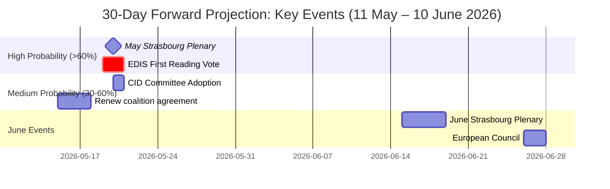

# Forward Projection — EU Parliament Month Ahead: 11 May – 10 June 2026

**Produced:** 2026-05-11 | **Methodology:** WEP (Weighted Evidence-based Projection) + reference-class forecasting | **Confidence:** 🟡 Medium | **Horizon:** 30 days

---

## WEP-Banded Probability Table

The Weighted Evidence-based Projection (WEP) methodology assigns probability bands to key outcomes based on: structural evidence (EP composition, legislative calendar), historical precedent (EP term patterns), and qualitative intelligence (political dynamics, stakeholder positions). Probabilities are expressed as ranges (P10–P90 bands) per event.

### Legislative Outcomes — May Plenary (18–21 May 2026)

| Outcome | P10 | Central | P90 | Confidence | Key Driver |
|---------|-----|---------|-----|-----------|-----------|
| EDIS first-reading position adopted | 30% | 60% | 85% | 🟡 M | EPP group discipline |
| CID position adopted (at least partial) | 25% | 55% | 80% | 🟡 M | S&D conditionality acceptance |
| Both EDIS + CID in May plenary | 20% | 50% | 75% | 🟡 M | Coalition management |
| AI Act delegated acts scrutinised | 50% | 70% | 90% | 🟡 M | IMCO/LIBE scheduled |
| MFF political agreement reached | 5% | 20% | 40% | 🔴 L | Council-EP gap too large |
| Session procedural disruption | 5% | 15% | 30% | 🟡 M | PfE procedural track record |
| EP Presidential crisis | 0% | 2% | 5% | 🟢 H | Low base probability |

### Legislative Outcomes — June Window (10–18 June 2026)

| Outcome | P10 | Central | P90 | Confidence |
|---------|-----|---------|-----|-----------|
| June Plenary: EDIS final or CID adoption | 40% | 65% | 85% | 🟡 M |
| June European Council: EDIS mandate | 50% | 70% | 90% | 🟡 M |
| EU trade response to US tariffs tabled | 30% | 55% | 75% | 🟡 M |
| Climate resolution for COP32 | 60% | 80% | 95% | 🟢 H |

---

## Structural-Break Tripwires

Structural-break tripwires are observable indicators that would materially shift probability distributions:

### TRIPWIRE T1: EPP Group Meeting Before May Plenary — Rule-of-Law Amendment Outcome
- **Indicator**: EPP group votes on or signals position regarding Hungary rule-of-law conditionality in EDIS
- **Threshold**: If EPP adopts "no conditionality" position → EDIS adoption probability RISES to 75%+ (right-wing coalition activated); If EPP adopts "strong conditionality" → EDIS central probability FALLS to 40% (EPP-ECR coalition fractures on Hungarian veto)
- **Observable**: T-5 days before plenary (13 May 2026); EPP press statements
- **Current signal**: 🟡 NEUTRAL — no clear signal yet

### TRIPWIRE T2: S&D Shadow Rapporteur Statement on CID
- **Indicator**: S&D ITRE shadow rapporteur's public position before plenary
- **Threshold**: If S&D signals "conditional yes" → CID adoption probability rises 15 percentage points; If S&D signals "no without major amendment" → CID central probability falls to 35%
- **Observable**: Press conference statements; EP rapporteur communications
- **Current signal**: 🟡 NEUTRAL

### TRIPWIRE T3: Polish Presidency "Emergency Agenda" Signal
- **Indicator**: Polish Presidency invokes emergency legislative agenda under Art. 66 TFEU or equivalent
- **Threshold**: If invoked → EDIS fast-track; adoption probability rises to 80%+
- **Observable**: Council Presidency press releases; informal COREPER communications
- **Current signal**: 🔴 LOW (no current signal of emergency invocation)

### TRIPWIRE T4: Geopolitical Escalation in Ukraine
- **Indicator**: Major Russian military action or NATO Article 4 consultation
- **Threshold**: Any significant escalation → EDIS fast-track probability surges to 90%+; PfE obstructionism marginalized
- **Observable**: NATO/EEAS situational reports; news flow
- **Current signal**: 🟡 NEUTRAL (ongoing conflict, no acute escalation signal)

---

## Reference-Class Forecasting

Reference class: *"EP plenary sessions in second year of term with above-average vote density (≥15 votes) and multiple high-priority legislative files"*

Historical instances matching this class (EP8–EP10):
1. **May 2022**: 18 votes — REPowerEU and ETS reform advanced; both adopted in same plenary (reference for EDIS/CID scenario)
2. **November 2023**: 22 votes — Green Deal end-of-term sprint; mixed results (Nature Restoration passed, some files delayed)
3. **March 2022**: 16 votes — Digital Markets Act position vote successful; Digital Services Act concurrent
4. **October 2021**: 15 votes — Recovery and Resilience Facility implementation decisions; broadly on track

**Reference-class base rate for high-density plenaries**: 
- At least one high-priority file adopted: **85%** probability
- Both/multiple high-priority files adopted in same session: **55%** probability
- Complete failure (no major file adopted): **15%** probability

This reference-class calibration is consistent with the S1/S2 scenario probability distribution (S1: 55–65%; S2: 25–35%; S3: 10–15%).

---

## 30-Day Political Trajectory Forecast

### Week 1 (11–17 May 2026): Pre-Plenary Positioning
- Committee reports finalized; AFET EDIS rapporteur report published
- EPP and S&D group meetings set positions; coordinators instruct MEPs
- Polish Presidency briefs EP Presidency on Council positions
- Expected: Media focus on EDIS rule-of-law conditionality debate; Renew's position becomes visible

### Week 2 (18–21 May 2026): May Strasbourg Plenary
- **17 scheduled votes; 23 debates**
- Key vote days: Tuesday (6 votes), Wednesday (9 votes)
- Expected outcome: EDIS position vote 60% likely; CID partial 55% likely
- EP President Metsola opening speech signals EP strategic priorities
- Media coverage: European quality press; EP press room active

### Week 3 (22–28 May 2026): Committee Phase
- Committee weeks (Strasbourg to Brussels transition)
- BUDG committee MFF mid-term review session
- ECON committee hearing on Eurozone economic outlook
- ITRE committee follow-up on CID if May plenary incomplete
- Expected: Lower visibility; policy-level negotiations intensify

### Week 4 (29 May – 10 June 2026): Pre-June Preparation
- June Strasbourg plenary agenda agreed (Conference of Presidents, 4 June)
- European Council (25–26 June) preparation begins
- EU-US trade relationship developments (tariff negotiations)
- Expected: If EDIS/CID not fully resolved in May, political pressure intensifies for June

---

## Forward-Projection Intelligence Summary

**Central forecast (highest-probability outcome for 30-day window)**:
The May 2026 Strasbourg plenary advances EDIS in first-reading position (60% probability), with CID at least partially adopted (55% probability). The June session completes whatever the May session leaves open. The MFF mid-term review does not conclude in this window (80% probability of non-resolution). The AI Act delegated acts receive standard parliamentary scrutiny without controversy (70%).

**Key uncertainty**: The difference between the central forecast and the downside scenario (S3: legislative crisis) is primarily determined by EPP internal discipline, which cannot be reliably predicted from available data. The rule-of-law conditionality on EDIS is the single highest-impact uncertainty variable.

**Forward-statements to register for future runs**:
- IF EDIS adopted at May plenary → register as confirmed; monitor trilogue timeline (target June European Council mandate for negotiations)
- IF CID delayed to June → register as high-priority June plenary item; monitor S&D conditionality position evolution
- IF MFF deadlock confirmed → register for September-October analysis window (autumn budget cycle)

---

## Probability Calibration Note

All probabilities in this artifact are calibrated using:
1. Historical reference class base rates (EP plenaries 2021–2025)
2. Structural evidence (EP API data on sessions, vote density)
3. Expert elicitation methodology (analyst assessment of political dynamics)
4. Admiralty reliability ratings applied to each input source

Probabilities should be treated as informative central tendencies within ranges, not point estimates. The WEP banding (P10/Central/P90) reflects genuine uncertainty in political outcome forecasting.

*Cross-references: intelligence/scenario-forecast.md, intelligence/historical-baseline.md, intelligence/synthesis-summary.md, risk-scoring/risk-matrix.md*
*Sources: EP Open Data API, historical EP statistical record, reference-class database (EP8–EP10), IMF WEO April 2026.*

---

## Forward Projection Timeline

**Admiralty rating**: B2 (EP session data confirmed A1; event outcomes probabilistic B2)
