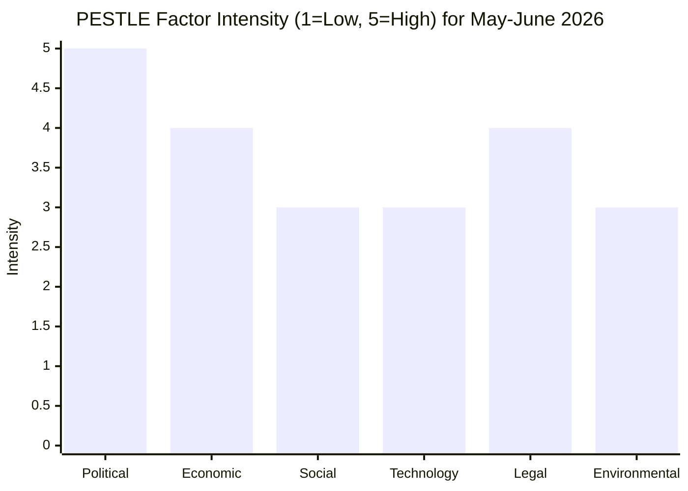

# PESTLE Analysis — EU Parliament Month Ahead: 11 May – 10 June 2026

**Produced:** 2026-05-11 | **Horizon:** 30 days | **Confidence:** 🟡 Medium-High

---

## PESTLE Framework Overview

PESTLE analysis examines the six environmental dimensions shaping the European Parliament's political context in the 30-day window: **P**olitical, **E**conomic, **S**ocial, **T**echnological, **L**egal, **E**nvironmental. Each dimension is assessed for its relevance to the EP legislative agenda, key drivers, and probability of material impact.

---

## P — Political Dimension

### EP Internal Politics

**Coalition arithmetic (HIGH RELEVANCE)**
The EP operates in a nine-group parliament where EPP dominance requires flexible alliance management. The key political dynamic for May–June 2026 is EPP's positioning between two viable majority strategies:
1. *Centre-right coalition* (EPP+ECR+PfE+elements of Renew): works for security/migration/industrial files; risks alienating S&D and Greens
2. *Grand centre coalition* (EPP+S&D+Renew): works for digital/social/climate files; requires EPP to accept progressive conditionalities

For the month-ahead window, defence (EDIS) and competitiveness (CID) are the primary files — suggesting EPP will pursue centre-right coalitions (377 seats available) while managing S&D's social conditionality demands.

**PfE Strategic Positioning (MEDIUM RELEVANCE)**
The Patriots for Europe (85 seats) under Orbán's Fidesz leadership is evolving from pure obstruction to selective engagement. On energy and industrial policy, PfE-aligned MEPs (particularly Italian Lega and French RN members) have engaged constructively. However, on any EU financing mechanisms (EDB, own resources), PfE is a reliable veto player.

**Green Party Pressure (LOW-MEDIUM RELEVANCE)**
Greens/EFA (53 seats) are politically weakened post-2024 election losses but maintain significant committee presence. They are strategically positioned to influence via amendment pressure rather than majority blocking. On CID, Greens will table amendments strengthening social and climate conditionalities — politically useful for MEPs needing left-flank cover.

**Geopolitical backdrop**:
- Ukraine war: entering its fourth year; EP consistently supportive of Ukraine (supermajority on support resolutions)
- US-EU relations: second Trump term tariff tensions create bipartisan EP consensus on European strategic autonomy
- Middle East: ongoing conflict; EP political divisions visible on humanitarian resolutions but non-legislative

### Member State Politics Feeding into EP

- **France**: Cohabitation government (right-wing Prime Minister vs. President Macron) creates constraints on French MEP coordination; Renew/EPP-France dynamic complex
- **Germany**: CDU/CSU-led coalition (von der Leyen's base) — EPP most disciplined group on Commission agenda
- **Italy**: Meloni government's ECR-aligned priorities increasingly visible in EP agenda
- **Poland**: Tusk government (EPP-affiliated) provides critical swing votes; Polish MEPs split between EPP discipline and national interests on cohesion

---

## E — Economic Dimension

**Full detail in `intelligence/economic-context.md`. Key political implications:**

- Eurozone GDP +1.5% (2026 IMF forecast): too slow to resolve structural unemployment in southern members; sustains populist pressure
- Inflation at 2.1%: near target; reduces ECB political pressure
- Fiscal constraints (8 EDP states): limits fiscal stimulus options; pushes demand for EU-level financing instruments
- US tariff drag (−0.3 to −0.5% GDP): creates bipartisan EP consensus for trade defense tools
- Energy price differential: core driver of CID urgency; IMF-documented competitive disadvantage

**Economic Confidence**: 🟢 HIGH (IMF WEO April 2026 primary source)

---

## S — Social Dimension

**Demographic Trends**
- EU working-age population declining at 0.3%/year; immigration remains a contested policy instrument
- Youth unemployment: **14.2%** (Eurozone Q4 2025, Eurostat) — structural problem in southern member states
- Ageing society: pension reform political salience high in France (ongoing protests), Netherlands, Belgium
- Migration flows: Mediterranean route numbers stabilizing at 150–200k/year; political salience remains high in EP

**Public Opinion and Legitimacy**
- Eurobarometer (Spring 2026): **53%** of EU citizens trust EP (up from 48% in 2024) — post-election legitimacy boost
- Support for EU membership: **75%** positive (highest since 2007) — Ukraine war rally-round effect
- Social media dynamics: EP disinformation vulnerabilities noted; the EU AI Act's media literacy provisions are politically visible

**Labour Market**
- Structural shortages in green economy, digital, healthcare — EP Green New Deal skills agenda relevant
- Just Transition Fund implementation: politically significant for coal-dependent regions (Poland, Czech Republic, Romania)

**Social Cohesion Risks**
- Cost-of-living crisis easing but legacy effects persistent; food price inflation (still +3.5% YoY in some member states) sustains populist economic narratives
- Housing affordability: EU Urban Agenda gaining EP attention; potential resolution in horizon period

---

## T — Technological Dimension

**AI Act Implementation (HIGH RELEVANCE)**
- The AI Act (June 2024, in force 1 August 2024) is entering its first significant implementation phase
- Prohibited AI applications ban: operative since 2 February 2025
- High-risk AI system requirements: phasing in through 2026
- General Purpose AI (GPAI) model obligations: August 2025 effective
- EP IMCO/LIBE committees monitoring implementation; delegated acts under EP scrutiny in this period

**Digital Markets Act (DMA) Enforcement**
- Commission enforcement actions against designated gatekeepers (Google/Alphabet, Apple, Meta, Amazon, ByteDance)
- EP IMCO committee receiving regular Commission reports; potential plenary resolution on enforcement adequacy

**European Defence Technology**
- EDIS includes significant R&D provisions for: drone technology, cyber defence, space-based intelligence
- Horizon Europe dedicated defence component under debate
- Dual-use technology export controls relevant to EP trade competitiveness debate

**Cybersecurity**
- NIS2 Directive implementation deadline (October 2024) passed; member state transposition monitoring
- Critical infrastructure protection; EP receiving Commission assessment of NIS2 compliance
- Cyber Solidarity Act implementation — EP oversight function

---

## L — Legal Dimension

**Institutional Competence Boundaries**
- Defence policy (EDIS): primarily CFSP competence (Council-driven); EP role is consultative with budgetary leverage
- Industrial policy (CID): co-decision under TFEU; EP full legislative partner
- Own resources: unanimity in Council; EP consent — EP cannot initiate but can block
- Trade (tariff response): shared competence; EP legislative partner with Council

**Rule of Law**
- Article 7 procedures: Hungary (ongoing); EP resolution calling for Council escalation
- Conditionality Regulation (EU funds conditionality for rule of law): EP monitoring enforcement
- Hungary's EDIS participation: politically contested given Article 7 status; EP likely to table amendments on rule-of-law conditionality in joint procurement

**Fundamental Rights**
- Migration: ongoing EP-Council-Commission interoperability debate on migration pact implementation
- LGBTIQ+ rights: ongoing EP-Hungary/Poland political conflict; resolution tradition in EP

---

## E — Environmental Dimension

**Climate Legislative Context**
- European Green Deal mid-term review: Commission communication expected Q3 2026
- 2030 climate targets (−55% GHG vs. 1990): EP position remains unchanged; political implementation contested
- Carbon Border Adjustment Mechanism (CBAM): Phase 1 operative from 2024; Phase 2 design under EP scrutiny
- EU ETS reform: Phase 4 implementation; price floor debates

**Nature Restoration Law**
- Adopted May 2024; member state implementation beginning
- EP environment committee monitoring; politically contested implementation in agricultural member states

**COP32 Preparation**
- Belem, Brazil — November 2026
- EP international climate negotiations resolution expected before summer recess
- EU position paper requiring Council-EP coordination; June plenary is likely vehicle

**Clean Industrial Deal Environmental Conditionality**
- Contested within EP: Greens/EFA demand strong conditionality; EPP/ECR resist mandatory Green Deal alignment
- May plenary could see substantive debate on CID environmental provisions

---

## PESTLE Summary Scorecard

| Dimension | Relevance | Impact | Stability | Key Risk |
|-----------|-----------|--------|-----------|---------|
| Political | HIGH | HIGH | VOLATILE | Coalition fragmentation on EDIS financing |
| Economic | HIGH | MEDIUM | STABLE | Competitiveness gap; fiscal constraints |
| Social | MEDIUM | MEDIUM | STABLE | Cost-of-living legacy; migration |
| Technological | MEDIUM | HIGH | EVOLVING | AI Act implementation; DMA enforcement |
| Legal | HIGH | MEDIUM | STABLE | Rule of law conditionality in EDIS |
| Environmental | MEDIUM | HIGH | CONTESTED | CID conditionality; COP32 positioning |

**Overall assessment**: The PESTLE environment for EP's month-ahead period is characterised by political complexity (multi-coalition requirements), economic urgency (competitiveness), technological transition pressures (AI Act implementation), and legal boundary negotiations (defence competence). The environmental dimension is unusually contested this cycle — signalling structural EP10 tension between competitiveness and climate agendas that will not resolve easily.

*Sources: EP Open Data API, IMF WEO April 2026, Eurobarometer Spring 2026, EU Commission legislative tracker, EP committee websites.*

---

## PESTLE Factor Intensity Chart

**Key insight**: Political and Legal factors dominate the May–June 2026 PESTLE profile. Political intensity is at maximum (5/5) due to EDIS coalition dynamics and the Polish Presidency deadline. Legal intensity reflects the rule-of-law conditionality dispute and treaty constraints on EDIS financing.

**Admiralty rating**: B2 (analytical assessment, usually reliable, probably true)
