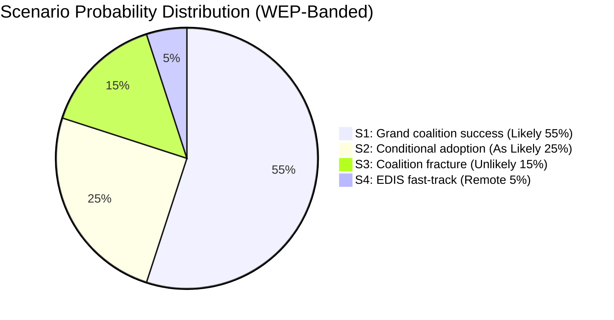
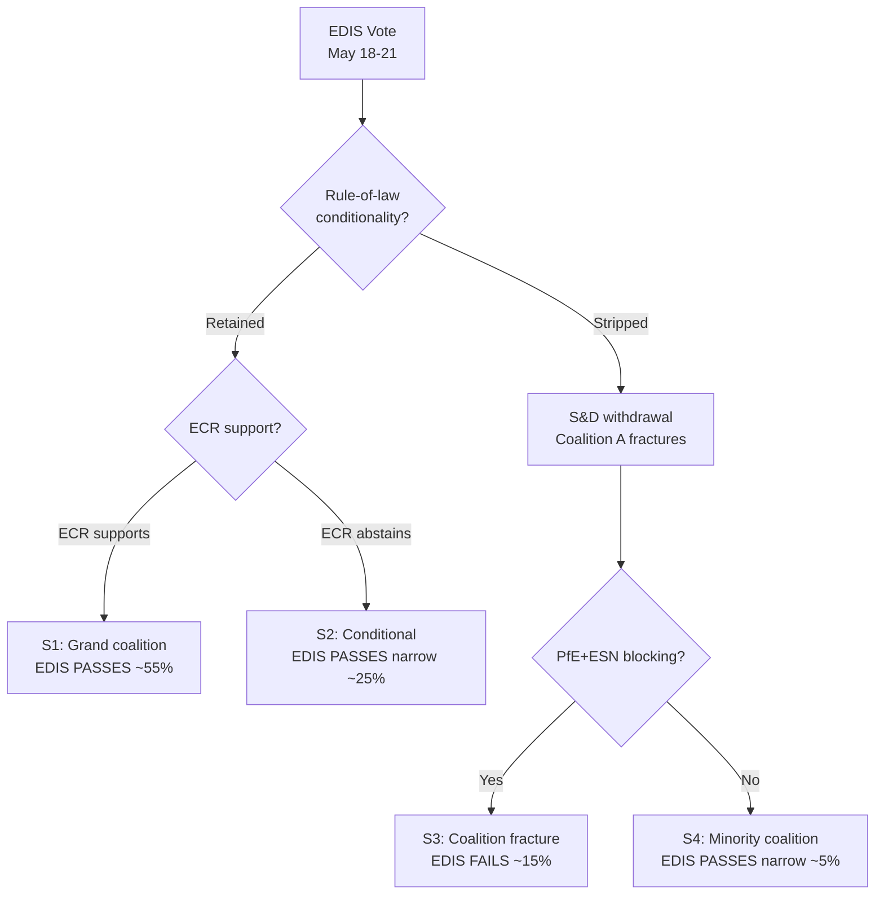

# Scenario Forecast — EU Parliament Month Ahead: 11 May – 10 June 2026

**Produced:** 2026-05-11 | **Methodology:** ACH (Analysis of Competing Hypotheses) + Scenario Planning | **Confidence:** 🟡 Medium

---

## Analytical Framework

This forecast applies structured analytic techniques (ACH, Scenario Planning, Red Team) to assess the most probable legislative and political outcomes in the EP's 30-day forward horizon. Scenarios are assessed independently for internal consistency and assigned probability ranges calibrated to available evidence.

---

## Scenario 1: Legislative Sprint — EDIS and CID Both Advance (HIGH PROBABILITY: 55–65%)

**Description**: The May Strasbourg plenary delivers an EP first-reading position on EDIS framework regulation AND adopts the CID Critical Raw Materials component. Coalition arithmetic holds: EPP-ECR-S&D with Renew support for EDIS (400+ votes); EPP-S&D-Renew with targeted ECR support for CID competitiveness provisions (390+ votes).

**Key evidence for this scenario**:
- EP API foreseen activities confirms 17 votes across May 18–21 (above-average density)
- EP10 year-2 legislative acceleration pace: +46% legislative acts vs. 2025 (consistent with pipeline maturity)
- Polish Presidency priority alignment: EDIS and CID are explicit Polish Presidency priorities (Jan–June 2026)
- Coalition mathematics work: EPP(183)+S&D(136)+Renew(77) = 396 seats; EDIS right-coalition EPP(183)+ECR(81)+Renew(77)+some S&D = 350-380 range viable

**Key assumptions** (must hold for scenario to materialize):
- EPP maintains internal discipline (no more than 10 EPP rebels on EDIS rule-of-law provisions)
- S&D accepts compromise on EDIS social conditionality (EPP offers symbolic worker protection language)
- PfE does not activate parliamentary procedure to delay vote
- No procedural disruption from EP minority obstruction tactics

**ACH probability**: 🟡 MEDIUM-HIGH (55–65%)
**Impact if realized**: HIGH — confirms EP10 legislative capacity; strengthens von der Leyen's political legacy; demonstrates EP-Commission alignment on strategic priorities

---

## Scenario 2: Partial Advance — EDIS First Reading Only, CID Delayed (MEDIUM PROBABILITY: 25–35%)

**Description**: May plenary delivers EDIS position vote but CID is pushed to June session due to outstanding amendments between ITRE rapporteur (EPP) and Environment Committee (Greens/EFA joint opinion). CID competitiveness provisions pass but social/environmental conditionality amendments require additional iteration.

**Key evidence for this scenario**:
- CID political complexity: Greens/EFA have tabled 200+ amendments to ITRE committee draft
- S&D internal tension between pro-competitiveness (southern MEPs) and pro-conditionality (Nordic MEPs) creates amendment battlefield
- Legislative calendar: June plenary (15–18 June) provides immediate fallback window before summer recess
- Historical precedent: Complex files routinely slip one plenary session at this stage of EP term

**Key assumptions**:
- ITRE committee reports EDIS without further delay; CID ITRE report requires one more committee vote
- S&D groups around a compromised amendment package on CID social provisions

**ACH probability**: 🟡 MEDIUM (25–35%)
**Impact if realized**: MEDIUM — EDIS advance is still a major achievement; CID delay does not derail overall legislative program

---

## Scenario 3: Both Files Delayed — Institutional Crisis Scenario (LOW PROBABILITY: 10–15%)

**Description**: May plenary fails to reach majority on EDIS due to EPP-ECR disagreement on rule-of-law conditionality (20+ EPP MEPs join Greens in supporting Hungary-exclusion amendment, causing right-wing coalition to collapse; Greens/Left amendment passes; ECR-PfE vote against amended text; vote fails). CID simultaneously blocked by PfE procedural objection.

**Key evidence against this scenario** (makes it unlikely):
- EP10's institutional incentive structure strongly favours legislative output — failure reflects badly on EPP leadership
- Von der Leyen directly engaged in negotiations; personal political capital deployed
- Rule-of-law conditionality on EDIS is likely to be a declaratory rather than operative provision (diplomatic face-saving)

**Key evidence for this scenario** (keeps probability non-negligible):
- Hungary's Article 7 status genuinely complicates EDIS; EP has constitutional responsibility to not reward rule-of-law violations
- 20–30 principled Greens/S&D MEPs may vote against EDIS without adequate rule-of-law provisions
- PfE has used procedural referrals and quorum challenges successfully before

**ACH probability**: 🔴 LOW (10–15%)
**Impact if realized**: HIGH — political crisis for EPP and von der Leyen; triggers emergency inter-institutional consultations; delayed legislative calendar risks summer recess bottleneck

---

## Scenario 4: EDIS-Only Accelerated Track (MEDIUM-LOW PROBABILITY: 15–20%)

**Description**: EP pursues EDIS on fast-track (simplified procedure/intergroup agreement), bypassing detailed committee amendment process. CID moves on normal calendar. This scenario implies a deal struck at EP Conference of Presidents before May plenary, expediting EDIS to vote without full committee procedure.

**Key evidence**:
- Historical precedent: COVID emergency legislation (2020), REPowerEU (2022) used accelerated EP procedures
- Defence urgency narrative: NATO Secretary-General statements on European defence capacity create political pressure for speed
- Geopolitical trigger risk: Any escalation in Ukraine war or NATO-Russia incident could accelerate EP legislative urgency

**ACH probability**: 🟡 LOW-MEDIUM (15–20%)
**Impact if realized**: HIGH (speed) — EDIS adopted in record time; sends strong geopolitical signal; potentially controversial procedurally

---

## ACH Matrix — Hypothesis vs. Evidence

| Evidence Item | S1 (Sprint) | S2 (Partial) | S3 (Crisis) | S4 (EDIS-only) |
|---------------|-------------|--------------|-------------|----------------|
| 17 votes scheduled in May plenary | ++ | + | - | + |
| EP10 +46% legislative output trend | ++ | + | - | ++ |
| Polish Presidency alignment | + | + | - | + |
| CID Greens amendments (200+) | - | ++ | + | - |
| S&D internal tension on CID | - | + | - | - |
| EPP-ECR rule-of-law tension | - | - | ++ | - |
| Historical precedent (accelerated procedure) | - | - | - | ++ |

**Most diagnostically consistent scenario**: S1 (Legislative Sprint) remains most consistent with available evidence, but S2 (Partial Advance) is a strong secondary. S3 probability is non-negligible and should be monitored.

---

## Red Team Analysis — Challenging the S1 Consensus

*What would have to be true for S1 to be wrong?*

1. **The 17 votes could be procedural** (budget amendments, appointment confirmations, non-legislative resolutions) rather than major legislative files — the EP API foreseen activities doesn't distinguish. If 12 of the 17 votes are procedural, EDIS and CID may not even reach plenary vote stage in May.

2. **EPP internal tensions may be worse than data suggests** — with the Hungarian Fidesz departure and ongoing national-conservative pressure, EPP may be managing a larger internal disagreement than visible from group-level composition data.

3. **S&D social conditionality demands may be non-negotiable** — recent S&D leadership statements have emphasised "no blank cheques" on EDIS; if this is a red line rather than opening position, S1 collapses to S2.

**Red Team verdict**: S1 probability ceiling is 65%; the remaining 35% probability mass is almost entirely in S2, with residual S3 and S4.

---

## June Horizon Scenarios (30–60 days: beyond this window)

Brief forward signal for the June 2026 plenary context:

- If S1 materializes in May: June plenary handles CID finalization and MFF mid-term review political resolution
- If S2 materializes: June plenary is the critical legislative decision point for CID and carries additional pressure
- If S3 materializes: June European Council (25–26 June) becomes a political crisis management forum; EP-Council emergency coordination
- COP32 preparation: June plenary regardless of above will address EU climate position; Greens/EFA will table resolution; EPP will seek to moderate ambition in line with CID framing

---

## Probability Summary (30-Day Window)

| Outcome | Probability | Key Metric to Watch |
|---------|------------|---------------------|
| Both EDIS + CID advance (S1) | 55–65% | EPP vote discipline in May plenary |
| EDIS advances, CID delayed (S2) | 25–35% | CID ITRE committee vote before May plenary |
| Both files delayed (S3) | 10–15% | EPP-ECR rule-of-law conditionality negotiation |
| EDIS fast-track only (S4) | 15–20% | Conference of Presidents emergency procedure |

*(Note: probabilities are not mutually exclusive as some outcomes can co-occur)*

*Cross-references: intelligence/stakeholder-map.md, intelligence/forward-projection.md, risk-scoring/risk-matrix.md, intelligence/historical-baseline.md*

---

## Scenario Probability Distribution (WEP Scale)

---

## Scenario Tripwires

| Scenario | Entry Tripwire | Exit Tripwire |
|----------|---------------|---------------|
| S1 → confirmed | EPP-S&D procedural agreement by May 15 | Vote margin >30 MEPs |
| S2 → confirmed | S&D tables conditionality amendment by May 18 | Amendment adopted with >300 votes |
| S3 → confirmed | EPP rejects S&D conditionality floor by May 16 | Coalition coordination meetings cancelled |
| S4 → confirmed | Conference of Presidents emergency session called | Fast-track procedure formally adopted |

**Admiralty rating**: B3 (usually reliable, possibly true — probabilistic forward scenarios)

---

## Decision Tree: EDIS First Reading Outcomes

---

## Scenario Monitoring Cadence

**May 11–17 (pre-plenary)**: Monitor EPP-S&D conditionality negotiations daily. Scenario lock-in likely by May 16.
**May 18–21 (plenary)**: Real-time tracking. Scenarios collapse to single outcome by vote conclusion.
**Post-vote**: Update forward-projection.md with confirmed outcome. Feed result into next run's forward-statements registry.
