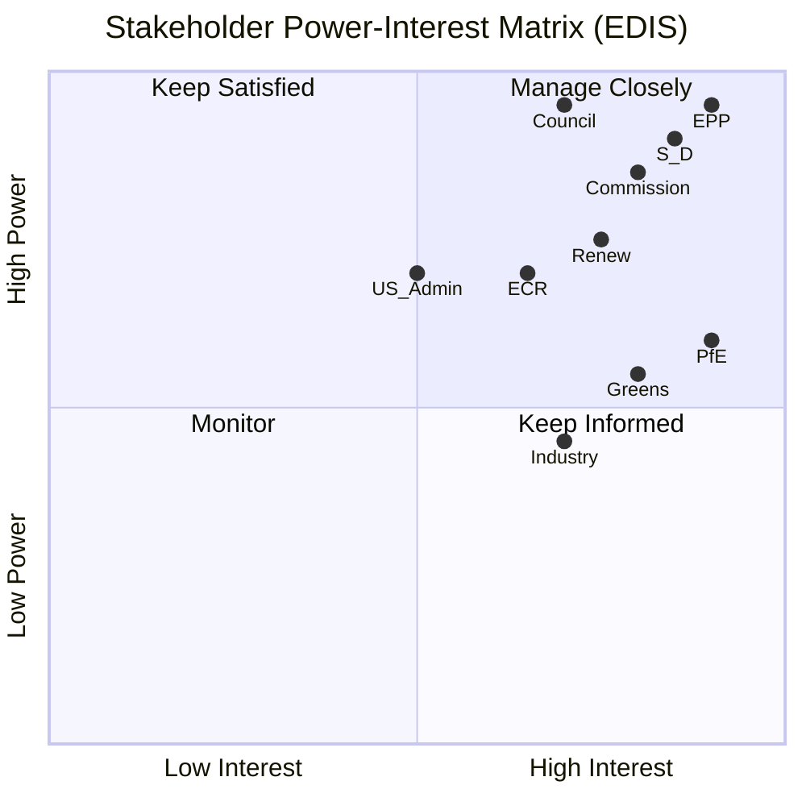

# Stakeholder Map — EU Parliament Month Ahead: 11 May – 10 June 2026

**Produced:** 2026-05-11 | **Methodology:** Actor Mapping + Stakeholder Analysis | **Confidence:** 🟡 Medium-High

---

## Stakeholder Framework

This map identifies the principal actors in EP's month-ahead legislative environment across five tiers: EP political groups, EP institutional actors, EU interinstitutional actors, national governments, and external stakeholders. For each major stakeholder, an interests, influence, and position assessment is provided.

---

## Tier 1: EP Political Groups

### EPP — European People's Party (183 seats, 25.5%)
**Interests**: Legislative leadership; maintain commission relationship; balance right-wing and centrist wings; EDIS as signature achievement; CID competitiveness framing.
**Influence**: DECISIVE (all majorities require EPP); holds presidency of EP Budget Committee; multiple rapporteurships.
**Position on key files**:
- EDIS: STRONGLY PRO (joint procurement as EPP's strategic legacy initiative; Weber personally invested)
- CID: PRO (competitiveness framing resonates; clean without strong conditionality)
- MFF: PRO additional resources, but divided on joint debt instruments
- AI Act delegated acts: PRO swift implementation
**Key internal tension**: CDU/CSU centrists vs. national-conservative currents (Polish PiS-affiliated, Hungarian Fidesz-leaning EPP proxies after Fidesz departure). If 20–30 EPP MEPs defect on contentious votes, coalition arithmetic collapses.
**Strategic agency**: EPP will use the May plenary to demonstrate legislative capacity — a strong vote outcome is institutionally vital ahead of EU budget negotiations.

### S&D — Progressive Alliance of Socialists and Democrats (136 seats, 18.97%)
**Interests**: Social conditionality on all legislation; worker rights in green transition; parliamentary oversight of defence spending; south European debt sustainability.
**Influence**: HIGH (without S&D, no EPP-centrist majority; S&D can veto progressive bloc initiatives); chair ECON committee.
**Position on key files**:
- EDIS: CONDITIONAL PRO (supports joint procurement but demands social conditionality, transparent governance, SME access, no Orbán-regime benefit)
- CID: CONDITIONAL PRO (supports industrial policy but demands Just Transition conditionality, strong labour standards)
- MFF: STRONGLY PRO additional resources; supports own resources
- AI Act: PRO worker protection provisions
**Key internal tension**: Mediterranean MEPs (Italian, French, Spanish) prioritise fiscal flexibility; Nordic and German social democrats prioritise budget discipline. The Meloni government's ECR affiliation creates tensions for Italian S&D MEPs navigating Italian national politics.
**Strategic agency**: S&D's leverage is maximum when EPP cannot form a majority without it (which is most votes on progressive files). S&D will use amendment strategy to embed social conditionality in CID.

### Renew Europe (77 seats, 10.74%)
**Interests**: Liberal-centrist synthesis; European sovereignty; rule of law; market integration; AI innovation.
**Influence**: SWING VOTE (Renew's participation transforms EPP+S&D minority into majority; or EPP+ECR minority into majority depending on direction).
**Position on key files**:
- EDIS: PRO (strategic autonomy core Renew value; Macron-wing influence)
- CID: PRO with innovation emphasis (Renew champions innovation, startup ecosystem, digital transition)
- AI Act: STRONGLY PRO (Renew was key coalition for AI Act passage; invested in implementation)
- MFF: MIXED (French Renew supports EU financing; Dutch-Nordic Renew more fiscally conservative)
**Key internal tension**: Pro-European centrism vs. national government pressures (French cohabitation affects Macron's Renew MEPs).
**Strategic agency**: Renew's strategic value is highest when it determines which majority forms. It will use this leverage to extract pro-innovation and rule-of-law provisions.

### ECR — European Conservatives and Reformists (81 seats, 11.30%)
**Interests**: National sovereignty; defence; migration control; economic conservatism; anti-federalism.
**Influence**: CONDITIONAL (EPP needs ECR for right-wing majority; ECR gains rapporteurships and amendments in exchange).
**Position on key files**:
- EDIS: STRONGLY PRO (defence is ECR's core issue; Meloni's Italy, Duda's Poland central)
- CID: PRO competitiveness but ANTI-conditionality (opposes Green Deal linkage)
- MFF: ANTI-expansion; pro-restructuring toward defence
- AI Act: MIXED (market-oriented members support; some sceptical of regulatory burden)
**Key internal tension**: Western European ECR (Italian FdI, Belgian NVA) vs. Eastern European ECR (Polish PiS, Czech ODS) on EU integration depth.

### PfE — Patriots for Europe (85 seats, 11.85%)
**Interests**: National sovereignty; Euroscepticism; migration control; anti-green regulation; protect rule of law (paradoxically, Orbán's Fidesz).
**Influence**: BLOCKING (PfE + ESN can frustrate 360-seat majority if EPP fragments slightly; cannot form positive majority alone).
**Position on key files**:
- EDIS: MIXED to NEGATIVE (joint procurement acceptable; EU defence bonds opposed; rule-of-law conditionality blocking Hungary).
- CID: MIXED (energy-intensive industrial members support; green components opposed)
- MFF: STRONGLY ANTI-expansion; ANTI-own resources; ANTI-rule of law conditionality
- AI Act: ANTI-regulatory burden
**Key risk**: PfE + ESN (112 seats combined) can form blocking minority if EPP loses 8+ votes to abstention.

### Greens/EFA (53 seats, 7.39%)
**Interests**: Climate ambition; Green Deal integrity; social rights; media freedom.
**Influence**: LIMITED (cannot block most legislation without EPP defectors; can influence amendments on climate files).
**Position**: CONDITIONAL on all legislation requiring climate conditionality; useful for EPP when it needs progressive legitimacy.

### The Left — GUE/NGL (45 seats, 6.28%)
**Interests**: Anti-austerity; social rights; peace/anti-militarism; public services.
**Influence**: LIMITED (relevant only for progressive supermajorities on social files).
**Position**: Generally ANTI-EDIS (pacifist wing); ANTI-CID without strong worker protections; ANTI-fiscal conservatism.

---

## Tier 2: EP Institutional Actors

### President of the European Parliament — Roberta Metsola (EPP, Malta)
**Role**: Chairs plenary; represents EP externally; maintains inter-institutional relations.
**Strategic position**: Metsola has been effective at building cross-group consensus; her second term (re-elected January 2027 expected) depends on maintaining EPP's central role. She will actively facilitate May plenary proceedings.

### Committee Chairs (Key for Month-Ahead)
- **AFET (Foreign Affairs)**: David McAllister (EPP) — chairs EDIS committee report coordination
- **ITRE (Industry, Research)**: Christophe Bigard (EPP) — CID rapporteur portfolio
- **BUDG (Budget)**: Johan Van Overtveldt (ECR) — unusual ECR leadership; creates tension on MFF expansion
- **ECON (Economic & Monetary)**: Chair from S&D — relevant for MFF own resources
- **IMCO (Internal Market)**: Chair from Renew — AI Act implementation portfolio

### EP Secretariat-General
**Role**: Administrative backbone; manages agenda setting, document publication, vote procedures.
**Relevance**: The Secretariat's publication schedule determines when foreseen-activities data becomes available; typically T-5 days before plenary opening.

---

## Tier 3: EU Interinstitutional Actors

### European Commission (Ursula von der Leyen, second term)
**Interests**: Maintain EP majority support for Commission agenda; avoid EP no-confidence motion; achieve EDIS and CID adoption as legacy achievements.
**Position**: Commission proposed both EDIS and CID; has strong interest in EP adoption. Von der Leyen leverages personal relationships across EPP, S&D, and Renew.
**Influence on EP**: HIGH (Commission legislative proposals are the origin of most EP legislative work; Commission can adjust proposals in response to EP signals).

### Council of the EU (Polish Presidency, rotating to Denmark 1 July 2026)
**Interests**: Advance Council common positions; manage unanimity requirements; facilitate trilogues.
**Polish Presidency priorities** (Jan–June 2026): Defence, competitiveness, energy security, border management.
**Implication**: Polish Presidency aligns closely with EP priorities (EDIS, CID) — potential for fast trilogue completion before handover.
**Danish Presidency** (July–December 2026): Traditionally pro-integration, pro-rule-of-law; likely to maintain momentum on EDIS.

### European Council (António Costa, President)
**Role**: Sets strategic agenda; facilitates heads-of-state consensus.
**Recent summit conclusions**: March 2026 European Council endorsed defence spending uplift and CID framework; EP's month-ahead legislative program implements these political mandates.

---

## Tier 4: National Government Stakeholder Perspectives

### Germany (CDU/CSU-led coalition government)
**Perspective**: Most influential member state; CDU alignment with EPP gives German MEPs leverage. The February 2026 special defence fund (€100bn+ off-budget) signals German commitment to EDIS — reduces resistance to joint procurement. Chancellor Merz personally supportive of EDIS.

### France (Macron administration + right-wing PM cohabitation)
**Perspective**: France historically leads on strategic autonomy — EDIS is a French strategic interest. Fiscal constraints (EDP, 115% debt/GDP) limit French enthusiasm for MFF own resources expansion. Renew France MEPs navigate a complex cohabitation-era national politics.

### Poland (Tusk EPP government)
**Perspective**: Poland's eastern border role gives it central importance in EDIS; Tusk government (EPP-aligned) is cooperating with Brussels on rule-of-law normalisation. Polish MEPs split: EPP discipline vs. ECR sovereignty concerns on specific provisions.

### Hungary (Orbán government, PfE-aligned)
**Perspective**: Hungary's membership of PfE and ongoing Article 7 procedure makes it the principal complication in EDIS rule-of-law conditionality. Hungarian MEPs will vote against any provisions restricting participation based on rule-of-law criteria.

### Italy (Meloni ECR government)
**Perspective**: Italy is largest ECR-aligned government; strategically supportive of EDIS (defence industry interests), CID (competitive industrial base), but resistant to fiscal constraints. Meloni has positioned Italy as a constructive partner on defence while protecting fiscal flexibility.

---

## Tier 5: External Stakeholders

### European Defence Industry (Airbus, Leonardo, Rheinmetall, Thales, KNDS)
**Interest**: EDIS joint procurement mechanisms; access to EU defence fund contracts; preferential EU-produced procurement rules.
**EP access**: Industry coalitions (AeroSpace and Defence Industries — ASD) active in ITRE and AFET committees.

### Industry and Business (BusinessEurope, CEFIC, SME associations)
**Interest**: CID competitiveness provisions; electricity price relief; CBAM Phase 2 design.
**EP access**: BusinessEurope with EPP; SME associations with Renew and S&D; CEFIC (chemicals) with ITRE.

### Environmental NGOs (WWF, Greenpeace, CAN Europe)
**Interest**: Maintain Green Deal ambition in CID; strengthen CBAM; oppose industrial exemptions.
**EP access**: Greens/EFA coordination; S&D social-environmental wing.

### Trade Unions (ETUC)
**Interest**: Social conditionality in CID and EDIS; worker participation in green transition; just transition provisions.
**EP access**: S&D and Greens/EFA; cross-group labour rights intergroup.

### Ukraine Government
**Interest**: EDIS joint procurement benefiting Ukraine's defence needs; sanctions maintenance.
**EP access**: EP-Ukraine Friendship Group; EPP and S&D leadership liaisons.

### US Government / NATO
**Interest**: European defence spending increase; interoperability standards; not isolating US defence industry from European joint procurement.
**Relevance**: EDIS "buy European" provisions create US diplomatic pressure; EP aware of transatlantic dimension.

---

## Stakeholder Power-Interest Matrix

```
HIGH INTEREST, HIGH POWER:
  EPP, S&D, von der Leyen Commission, Polish Presidency

HIGH INTEREST, MEDIUM POWER:  
  Renew, ECR, BusinessEurope, European Defence Industry

HIGH INTEREST, LOW POWER:
  Greens/EFA, The Left, Environmental NGOs, Trade Unions (ETUC)

LOW INTEREST, HIGH POWER:
  PfE (obstructive), ESN, Hungary/Orbán

LOW INTEREST, LOW POWER:
  External observers, academic institutions
```

---

## Stakeholder Dynamics Summary

The May–June 2026 EP period will be defined by EPP's strategic balancing act. EPP holds the key to every viable majority. Its internal discipline and strategic choices determine whether EDIS and CID advance on the European Commission's preferred timeline. S&D's social conditionality demands are the principal constraint on EPP's preferred fast-track approach. Renew's positioning will be decisive when S&D conditionality and EPP preferences diverge.

PfE's obstructive capacity is real but limited — it cannot block legislation unless EPP fractures. The principal risk is internal EPP dissent on rule-of-law conditionality provisions in EDIS, where Hungarian-adjacent EPP members (primarily from Central/Eastern Europe) may create an unexpected veto point.

*Cross-references: intelligence/synthesis-summary.md, intelligence/scenario-forecast.md, risk-scoring/risk-matrix.md*
*Sources: European Parliament Open Data Portal, EP political group websites, EU Commission Work Programme 2026, EU Council Presidency programme (Poland).*

---

## Stakeholder Power-Interest Grid



**Admiralty rating**: A2 (political landscape data A1; interest assessments B2 analytical)
