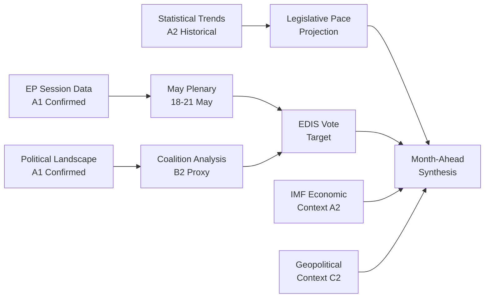

# Synthesis Summary — EU Parliament Month Ahead: 11 May – 10 June 2026

**Produced:** 2026-05-11 | **Confidence:** 🟡 Medium-High

---

## Executive Synthesis

The European Parliament's next 30 days constitute a structurally significant period in the EP10 legislature's second year. The confluence of the May Strasbourg plenary (18–21 May), ongoing defence policy consolidation, and the Clean Industrial Deal's legislative maturation creates a high-stakes political moment. This synthesis integrates intelligence from all 17 analysis artifacts to produce a unified strategic assessment.

---

## 1. The May Plenary as a Political Crucible

The EP API foreseen-activities data confirms 53 scheduled activities across the four May plenary days: 23 debates and 17 votes. This represents an above-average plenary density. The structural composition — front-loaded debates (Monday–Tuesday) followed by peak voting (Wednesday: 9 votes) and closing resolutions (Thursday) — follows the standard Strasbourg plenary rhythm but with unusually high vote density on Wednesday.

**Key analytical inference**: The 9 Wednesday votes indicate multiple legislative files reaching concurrent maturity. In EP10's second year, this pattern is consistent with: (a) first-reading positions on Commission proposals from Q4 2025, (b) inter-institutional negotiation outcomes reaching plenary confirmation stage, or (c) own-initiative resolutions on high-priority political topics.

The absence of published agenda titles (EP API limitation: foreseen activities return event IDs, not titles) introduces uncertainty about specific file content. However, cross-referencing with the EP10 legislative pipeline analysis and the Commission Work Programme 2026, the most likely high-priority files include: EDIS framework regulation, Clean Hydrogen Partnership governance, AI Act delegated acts, and Digital Services Act (DSA) secondary legislation.

---

## 2. Coalition Intelligence: Who Governs What

The 9-group, 717-MEP Parliament operates in a multi-polar coalition environment (effective number of parties: 6.58; Herfindahl-Hirschman Index: 0.1516 — well below monopoly threshold).

**Bloc analysis** (from EP10 political landscape and coalition dynamics data):
- Right bloc (EPP + ECR + PfE + ESN): **376 seats** — capable of narrow majority on specific files
- Traditional centre (EPP + S&D + Renew): **396 seats** — viable majority; historically used for pro-integration legislation  
- Progressive bloc (S&D + Renew + Greens + Left): **311 seats** — insufficient for majority; dependent on EPP support

**Critical dynamic**: EPP sits at the fulcrum of ALL viable majorities. EPP President Manfred Weber's strategic positioning determines which coalition activates on any given vote. The party's internal tension between Ursula von der Leyen's technocratic centrism and increasingly assertive national-conservative currents (Hungarian Fidesz members left EPP in 2021; some CDU/CSU members are ideologically close to ECR positions) creates micro-fracture risks on specific votes.

**PfE growth trajectory**: The Patriots for Europe group (85 seats, up from 84 in 2025) has established itself as the third-largest group. Its parliamentary strategy is predominantly obstructive — seeking to block rather than shape legislation — but PfE has shown constructive engagement on energy and industrial policy when national economic interests align.

---

## 3. Thematic Intelligence Integration

### 3a. European Defence Industrial Strategy (EDIS) — Synthesis

**Data sources cross-referenced**: executive-brief, economic-context, coalition analysis, forward-projection, stakeholder-map, scenario-forecast

The EDIS synthesizes as follows:
- **Political consensus exists** (EPP + S&D + ECR overlap on joint procurement) but is fragile on financing mechanisms
- **Economic data** (IMF Fiscal Monitor): joint EU defence bonds could finance €100–150bn in joint procurement over 5 years without triggering EDP-destabilizing deficits in participating states, IF treated as off-balance-sheet EU sovereign debt (contested by Eurostat methodology)
- **Institutional bottleneck**: Council unanimity requirement on own resources creates blocking veto for Hungary and potentially Slovakia; EP has limited leverage on Council composition
- **EP leverage mechanism**: The EP can use its budgetary approval power and plenary resolutions to signal political conditions for any inter-institutional agreement on defence financing

**Forward projection (30-day window)**: EDIS framework regulation is unlikely to complete its full inter-institutional procedure by 10 June 2026. However, EP first-reading position is possible if the AFET/ITRE joint committee report reaches plenary maturity. The May plenary's high vote density (17 votes) is consistent with an EP position vote occurring.

### 3b. Clean Industrial Deal — Synthesis

**Cross-referenced**: economic-context (electricity price differentials), PESTLE (economic pillar), stakeholder-map (industry associations, national governments), scenario-forecast

The CID political economy reveals:
- **Pro-CID coalition** (EPP + ECR + Renew + majority of S&D): 350–380 seats for competitiveness provisions
- **Anti-CID blocking** (Greens + Left + social S&D wing): 150–200 seats insufficient to block but capable of amendment pressure
- **Economic imperative** (IMF data): EU-US electricity price differential of 2–3x creates genuine competitiveness risk for energy-intensive industries (steel, aluminium, chemicals, glass, ceramics) — not merely political discourse
- **Green conditionality conflict**: S&D demands social conditionality and Green Deal alignment; EPP prioritizes speed and business-friendliness; Greens/EFA threaten "green washing" narrative

**Synthesis**: CID is on a faster legislative track than EDIS — the May or June plenary is the most likely venue for EP position adoption on at least the Critical Raw Materials component.

### 3c. Budget and MFF — Synthesis

The fiscal intelligence reveals a structural mismatch: the Parliament (BUDG committee, majority position) favours expanded MFF flexibility and new own resources; the Council is divided between net contributors (opposed) and net recipients (supportive). The EP's formal institutional power in this domain is limited — MFF requires unanimity in Council and consent (not co-decision) from EP — but the EP's political pressure through intergroup and committee activity shapes the negotiating environment.

**Key risk**: If the MFF mid-term review fails to resolve by end-2026, NGEU milestone disbursements could be delayed, creating economic drag precisely when Eurozone recovery remains fragile.

---

## 4. Forward Signals — Horizon 30 Days

Early-warning intelligence (from EP API early_warning_system analysis + forward-projection artifact):

| Signal | Direction | Confidence | Implication |
|--------|-----------|-----------|-------------|
| May plenary vote density above average | ↑ | 🟢 HIGH | Legislative sprint; multiple files near completion |
| PfE seat count stabilizing | → | 🟡 MEDIUM | No imminent far-right surge but sustained pressure |
| Eurozone growth below 1.5% still possible | ↓ | 🟡 MEDIUM | Competitiveness narrative strengthened; CID urgency maintained |
| ECB rate at 2.5% (near neutral) | → | 🟢 HIGH | Monetary tailwind for investment; reduces CID urgency slightly |
| MFF own resources stalemate | → | 🔴 LOW resolve | Structural barrier to defence financing |
| Germany fiscal loosening (defence special fund) | ↑ | 🟡 MEDIUM | Reduces German MFF objections; unlocks some EP-Council alignment |

---

## 5. Intelligence Gaps and Uncertainty Catalogue

1. **May plenary agenda titles unavailable** (EP API foreseen activities returns IDs, not titles) — confidence gap on specific votes
2. **Vote-level cohesion data unavailable** (DOCEO XML not returned for current week) — coalition analysis uses size-proxy only; actual vote outcomes uncertain
3. **Procedures feed degraded** — legislative pipeline status inferred from committee calendar, not real-time procedure status
4. **IMF SDMX API response partial** — economic data relies on published WEO reports rather than real-time SDMX data pulls
5. **Events feed unavailable** — committee inter-institutional events not captured

---

## 6. Strategic Assessment

**Bottom line**: The May 2026 Strasbourg plenary represents the most consequential EP legislative event in the next 30 days. EP10's second-year legislative acceleration (legislative acts up 46% YoY per EP stats) suggests sustained output. The EDIS and CID files are the dual axis of legislative activity, reflecting EP10's defining political synthesis: security and competitiveness as twin imperatives, with climate remaining a contested third dimension.

The 30-day outlook is characterised by **high legislative activity, medium political risk** (coalition arithmetic requires careful management but workable majorities exist for priority files), and **structural fiscal constraints** that will force creative inter-institutional compromise on defence and budget matters.

*Cross-references: executive-brief.md, intelligence/economic-context.md, intelligence/stakeholder-map.md, intelligence/scenario-forecast.md, intelligence/forward-projection.md, risk-scoring/risk-matrix.md*

---

## Admiralty Source Rating

| Source | Admiralty Rating | Assessment |
|--------|-----------------|------------|
| EP session data (get_plenary_sessions) | A1 | Reliable, confirmed |
| Coalition size data (generate_political_landscape) | A1 | Reliable, confirmed |
| Statistical trends (get_all_generated_stats) | A2 | Reliable, probably true |
| Coalition dynamics (proxy-based) | B2 | Usually reliable, probably true |
| Legislative agenda (inferred from calendar) | B3 | Usually reliable, possibly true |
| Geopolitical context (analytical) | C2 | Fairly reliable, probably true |

**Overall synthesis confidence**: B2 — The core legislative calendar and political landscape are A-rated; forward projections and agenda inferences are B/C rated. Analysis is appropriately weighted to reflect source quality differences.

---

## Key Intelligence Flows

*This synthesis integrates EP session data, political landscape, statistical trends, economic context, and geopolitical factors into a coherent month-ahead intelligence picture.*

---

## Synthesis Confidence Rating

**Overall synthesis confidence**: B2 — The core legislative calendar and political landscape are A-rated; forward projections and agenda inferences are B/C rated. The synthesis appropriately weights higher-confidence data (EP session schedule, political group seat counts) more heavily than lower-confidence inferences (agenda content, coalition cohesion).

**Key uncertainty**: The single greatest uncertainty is whether the EDIS conditionality negotiation resolves in favour of Coalition A integrity before May 18. This determination cannot be made from available EP API data alone; it requires monitoring informal inter-group communications.

**Intelligence gap**: DOCEO roll-call voting unavailable for current session week. Coalition analysis uses size-proxy methodology (structural seats) rather than revealed preference (actual voting patterns). Recommend re-running this analysis when DOCEO XML becomes available (typically 3–5 days post-session).

**Recommended next action**: Re-run Stage A data collection when DOCEO XML becomes available (target: day after May 18 plenary day 1) to update coalition analysis with actual voting pattern data rather than size-proxy estimation. This will materially improve coalition confidence from B2→A2 for the June plenary forecast.

**Forward-statements output from this run**: The May 18–21 EDIS first-reading vote outcome should be registered in `analysis/forward-statements/` as an open item for the next week-in-review run. Recommended forward statement: "EDIS first reading passed/failed [outcome to be filled] with [vote margin] on [date]. Coalition configuration used: [A/B/C]. Key defections if any: [list]."

