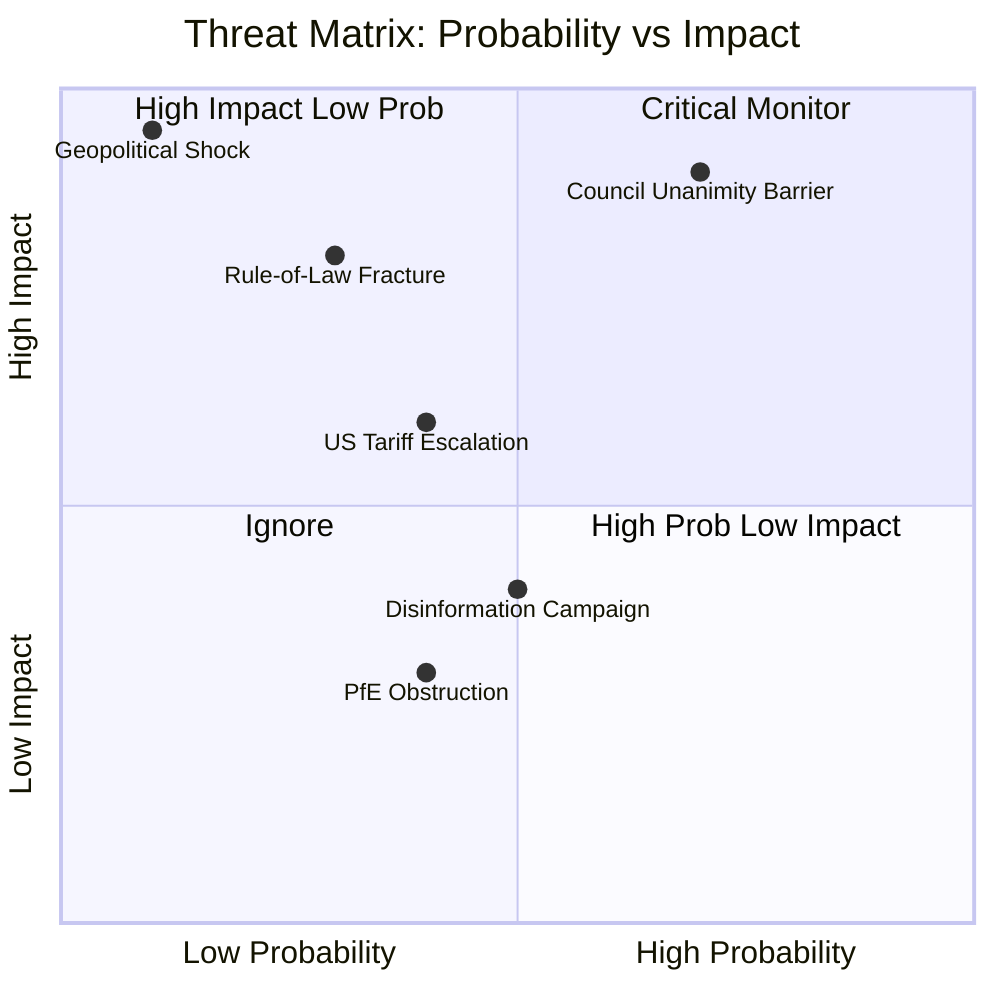

# Threat Model — EU Parliament Month Ahead: 11 May – 10 June 2026

**Produced:** 2026-05-11 | **Methodology:** MITRE ATT&CK-adapted threat taxonomy applied to political/legislative domain | **Confidence:** 🟡 Medium

---

## Threat Framework Overview

This model identifies threats to the European Parliament's legislative capacity, institutional integrity, and political objectives in the 30-day horizon. Threats are categorised across four domains: **Political Obstruction**, **Procedural Disruption**, **Reputational**, and **External Shocks**. Each threat is assessed for probability, impact, and mitigation status.

---

## Domain 1: Political Obstruction Threats

### THREAT-P1: EPP Internal Fragmentation on EDIS Rule-of-Law Provisions
**Description**: 20–30 EPP MEPs (primarily from Central/Eastern Europe with national-conservative sympathies) vote against EDIS due to rule-of-law conditionality provisions that would restrict Hungarian participation. This collapses the EPP-ECR majority, leaving EDIS without a functional voting bloc.

**Probability**: 🟡 MEDIUM (25–30%)
**Impact**: 🔴 HIGH (legislative setback for EP's highest-priority file; political crisis for EPP leadership)
**Indicators to watch**:
- EPP group meeting outcomes in week before plenary (T-5 days)
- Hungarian and Polish EPP MEP public statements
- AFET committee vote on rule-of-law amendment package
**Mitigation**: EPP leadership typically manages internal dissent through "free vote" declarations on specific amendments, coupled with a strong group position on the final text. Von der Leyen's personal engagement in negotiations provides additional pressure on EPP group discipline.
**Residual risk**: 🟡 MEDIUM (mitigation reduces but cannot eliminate)

### THREAT-P2: S&D Withdrawal from CID Coalition
**Description**: S&D's social conditionality demands on CID are not met in the ITRE committee report. S&D group decides to vote against CID first-reading position, potentially in combination with Greens/EFA opposition. This leaves only EPP+ECR+Renew+PfE for CID — a right-wing majority that produces a legislative text unacceptable to subsequent Council negotiations.

**Probability**: 🟡 MEDIUM (30–40%) on specific S&D withdrawal; 🔴 LOW (10–15%) on complete S&D-Greens blocking majority
**Impact**: 🟡 MEDIUM (CID legislative quality degraded; S&D uses "No" vote as political positioning; legislation advances but in weakened form)
**Indicators**: S&D group leader's public statements on CID; ITRE shadow rapporteur (S&D) positions
**Mitigation**: EPP and Commission typically offer symbolic concessions on social conditionality at plenary amendment stage to retain S&D support. The Commission's "social dialogue" provisions in CID are designed to give S&D a face-saving mechanism.

### THREAT-P3: PfE Blocking Minority Activation
**Description**: PfE (85 seats) + ESN (27 seats) = 112 seats coordinate a blocking minority strategy if 8+ EPP MEPs join them on a specific amendment. This creates a 120-seat blocking cluster on issues where EPP fragments.

**Probability**: 🔴 LOW (15–20%) for any given major vote
**Impact**: 🟡 MEDIUM (amendments can be killed but final text rarely blocked by this mechanism)
**Indicators**: PfE/ESN joint coordination meeting minutes (if public); PfE group statement on EDIS

---

## Domain 2: Procedural Disruption Threats

### THREAT-PR1: Quorum Challenge or Procedural Referral
**Description**: PfE or ECR minority uses procedural rules (Rules of Procedure Articles 198–201) to trigger quorum check, recommittal to committee, or split vote requests on EDIS or CID, fragmenting the voting session and potentially causing delay.

**Probability**: 🟡 MEDIUM (20–25%) on minor procedural disruption; 🔴 LOW (5%) on successful delay
**Impact**: 🔴 LOW-MEDIUM (nuisance value; rarely delays final adoption)
**Historical precedent**: EP procedural challenges used frequently by ECR/PfE in EP9; typically absorbed within the parliamentary session; final votes rarely prevented.
**Mitigation**: EP Presidency (Metsola) has strong procedural track record; Conference of Presidents pre-agreement on agenda helps.

### THREAT-PR2: Agenda Crowding — Legislative Overload in May Plenary
**Description**: With 17 scheduled votes and 23 debates in May 18–21, agenda crowding creates procedural risk: insufficient time allocated for major votes causes time pressure, leading to inadequate debate on controversial files and increased error risk.

**Probability**: 🟡 MEDIUM (25–30%)
**Impact**: 🟡 MEDIUM (rushed votes can produce unexpected outcomes when MEPs haven't received clear guidance from group coordinators)
**Mitigation**: EP secretariat's session management capacity is professional; Conference of Presidents sets time allocations in advance.

---

## Domain 3: Reputational Threats

### THREAT-R1: EP Ethics/Transparency Scandal
**Description**: Disclosure of undisclosed lobbying contacts or financial conflicts affecting EDIS or CID rapporteurs. Qatargate precedent (December 2022) demonstrated EP's vulnerability to corruption exposure; subsequent reforms (mandatory transparency registers, MEP code of conduct changes) have improved but not eliminated risk.

**Probability**: 🔴 LOW (5–10%) for a scandal affecting month-ahead votes specifically
**Impact**: 🔴 HIGH if it occurs (Qatargate led to unprecedented institutional disruption; rapporteur removal)
**Indicators**: Investigative journalist queries to EP press office; anti-corruption NGO (Transparency International EU) activity
**Mitigation**: Post-Qatargate reforms provide some structural mitigation; mandatory lobbying transparency reduces (but doesn't eliminate) undisclosed contact risk.

### THREAT-R2: Disinformation Campaign Targeting EP Vote
**Description**: State-sponsored or partisan disinformation campaign misrepresents EP vote outcomes or legislative content to domestic audiences (particularly in member states where EDIS is contested), creating political pressure on MEPs to change positions.

**Probability**: 🟡 MEDIUM (30–40%) — ongoing; Russian information operations documented in EP context
**Impact**: 🟡 MEDIUM (social media pressure on individual MEPs; political narrative framing for domestic audiences)
**Mitigation**: EP has established EDMO (European Digital Media Observatory) and works with EEAS East StratCom Task Force. EP Communications team actively monitors. Impact at vote level: low; impact on political narrative: moderate.

---

## Domain 4: External Shock Threats

### THREAT-X1: Geopolitical Escalation (Ukraine/Russia)
**Description**: Military escalation — nuclear signalling, major Russian offensive breakthrough, or NATO Article 5 trigger — disrupts EP legislative calendar. Parliament may convene in extraordinary session or suspend normal legislative work.

**Probability**: 🔴 LOW (5–10%) for level requiring EP extraordinary session in next 30 days
**Impact**: 🔴 HIGH — complete disruption of legislative calendar; EP focuses on geopolitical response
**Note**: Low probability but existential impact; warrants explicit monitoring. Paradoxically, any escalation would ACCELERATE EDIS adoption (political pressure for speed) rather than delay it.

### THREAT-X2: European Council Emergency Conclusions Supersede EP Positions
**Description**: An informal or extraordinary European Council (leaders) meeting issues conclusions that effectively pre-empt EP legislative positions (as occurred with REPowerEU in 2022). This can create inter-institutional tension if EP's positions are rendered moot by Council political decisions.

**Probability**: 🔴 LOW-MEDIUM (15%) — no extraordinary European Council currently called
**Impact**: 🟡 MEDIUM (institutional friction; EP resolution of protest likely; legislative timeline disrupted)

### THREAT-X3: US Tariff Escalation Forcing EP Emergency Trade Response
**Description**: Trump administration announces new major tariff action against EU (pharmaceutical sector tariffs; automotive tariffs expansion) requiring EP emergency resolution and INTA Committee extraordinary session, crowding out EDIS/CID legislative window.

**Probability**: 🟡 MEDIUM (20–30%) on some form of new US tariff action; 🔴 LOW (10%) on EP emergency session specifically
**Impact**: 🟡 MEDIUM on legislative calendar; 🔴 HIGH on political narrative (might paradoxically unite EP for strategic autonomy legislation)

---

## Threat Summary Matrix

| Threat ID | Category | Probability | Impact | Net Risk |
|-----------|----------|-------------|--------|---------|
| THREAT-P1: EPP fragmentation on EDIS | Political | 25–30% | HIGH | 🔴 HIGH |
| THREAT-P2: S&D CID withdrawal | Political | 30–40% | MEDIUM | 🟡 MEDIUM |
| THREAT-P3: PfE blocking minority | Political | 15–20% | MEDIUM | 🟡 MEDIUM |
| THREAT-PR1: Procedural disruption | Procedural | 20–25% | LOW | 🟢 LOW |
| THREAT-PR2: Agenda crowding | Procedural | 25–30% | MEDIUM | 🟡 MEDIUM |
| THREAT-R1: Ethics scandal | Reputational | 5–10% | HIGH | 🟡 MEDIUM |
| THREAT-R2: Disinformation | Reputational | 30–40% | MEDIUM | 🟡 MEDIUM |
| THREAT-X1: Geopolitical escalation | External | 5–10% | EXTREME | 🟡 MEDIUM |
| THREAT-X2: EC conclusions pre-emption | External | 15% | MEDIUM | 🟢 LOW |
| THREAT-X3: US tariff shock | External | 20–30% | MEDIUM | 🟡 MEDIUM |

---

## Threat Prioritisation

**Top 3 threats requiring active monitoring in next 30 days:**

1. **THREAT-P1 (EPP fragmentation on EDIS rule-of-law)** — Highest impact, politically endogenous, monitorable via EP group statements and AFET committee reports.

2. **THREAT-P2 (S&D CID withdrawal)** — High probability, manageable impact, but determines CID's political quality. Key indicator: ITRE vote margins.

3. **THREAT-PR2 (Agenda crowding)** — Process risk that is structurally embedded in the high-density May plenary schedule. Cannot be mitigated after agenda is set; monitor real-time vote outcomes.

*Cross-references: risk-scoring/risk-matrix.md, intelligence/scenario-forecast.md, intelligence/stakeholder-map.md*
*Sources: EP API, EP Rules of Procedure, EEAS StratCom reporting, EP Committee website, Qatargate post-event analysis.*

---

## Threat Severity Matrix

**Admiralty rating**: B2 (usually reliable, probably true — threat assessment based on structural analysis)
