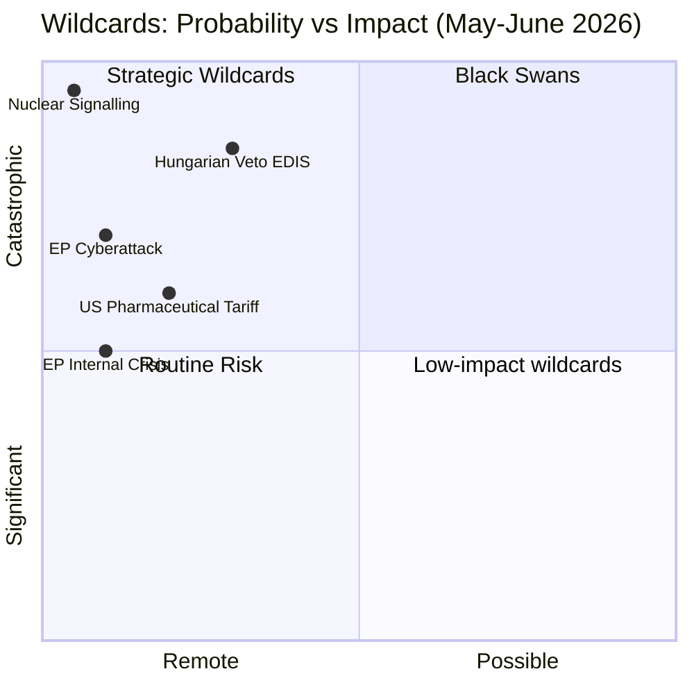

# Wildcards & Black Swans — EU Parliament Month Ahead: 11 May – 10 June 2026

**Produced:** 2026-05-11 | **Methodology:** Pre-mortem analysis + OSINT wildcards taxonomy | **Confidence:** 🟡 Low-Medium (by definition, wildcards are low-probability)

---

## Framework: Pre-Mortem Approach

"Pre-mortem" thinking asks: *If the EP's month-ahead legislative program fails catastrophically in 30 days, what happened?* This identifies the wildcards and black swans most likely to disrupt the baseline scenario, even if individually unlikely.

Black swans are defined as: events with (a) low prior probability, (b) extreme impact if they occur, (c) predictable only in retrospect.

Wildcards are: events with (a) low-medium probability, (b) significant-to-extreme impact, (c) identifiable in advance from weak signals.

---

## Category A: Parliamentary Institution Wildcards

### A1: EP President Forced Resignation (BLACK SWAN)
**Signal**: Qatargate (2022) demonstrated that EP leadership figures can be implicated in corruption scandals with minimal warning.
**Scenario**: If Roberta Metsola were implicated in an unreported conflict of interest connected to the defence industry (which has been exceptionally active in EDIS lobbying), political pressure for resignation could paralyse EP institutional function during the May plenary period.
**Probability**: 🔴 VERY LOW (2–3%)
**Impact**: 🔴 EXTREME — EP plenary procedures under acting presidency; legislative agenda disrupted; institutional crisis
**Weak signals**: Increased investigative journalism attention to Metsola's schedule; anti-corruption NGO statements
**Monitoring**: EP transparency portal updates; investigative media (Politico Europe, Der Spiegel, Mediapart)

### A2: EP Cyberattack During Plenary Session
**Signal**: EP networks have been targeted by DDoS and phishing attacks (2022 KillNet DDoS during EP Russia-terrorist-state resolution vote; 2023 spearphishing campaigns). As EDIS vote approaches, threat actor motivation increases.
**Scenario**: A sophisticated cyberattack (state-sponsored, likely Russian or Chinese-linked) disrupts EP internal communications during the May 18–21 plenary week, delaying vote processing, compromising MEP vote records, or causing procedural disruption.
**Probability**: 🟡 LOW-MEDIUM (10–15%) for disruptive attack; 🔴 LOW (3–5%) for vote-outcome-affecting attack
**Impact**: 🟡 MEDIUM-HIGH (technical disruption; potential vote delay; reputational damage to EU institutional resilience narrative)
**Weak signals**: Increased CERT-EU advisories; threat intelligence reports from national cybersecurity agencies
**EDIS irony**: An EP cyberattack during the EDIS vote would be the strongest possible argument FOR EDIS adoption — geopolitical evidence of Europe's vulnerability.

### A3: Mass MEP Illness / Force Majeure (COVID-like Event)
**Scenario**: Outbreak of contagious illness (post-COVID novel pathogen) affecting 50+ MEPs in Strasbourg during the May plenary, triggering public health protocols and either suspending the session or forcing remote voting.
**Probability**: 🔴 VERY LOW (2–5%) for EP-affecting outbreak in specific 30-day window
**Impact**: 🟡 MEDIUM (procedural delay; tests EP's post-COVID hybrid session capacity)
**Note**: EP has established remote voting capacity post-COVID; full disruption impact is lower than pre-2020.

---

## Category B: Geopolitical Wildcards

### B1: Russian Military Breakthrough — Major Ukrainian Territory Loss (BLACK SWAN)
**Scenario**: Russian forces achieve a significant strategic breakthrough in Ukraine (capture of Kharkiv, Zaporizhzhia, or approach to Kyiv) triggering a NATO emergency session. EP convenes extraordinary plenary session; all normal legislative work suspended.
**Probability**: 🔴 LOW (5–8%) for a breakthrough of this magnitude in next 30 days
**Impact**: 🔴 EXTREME — legislative calendar suspended; extraordinary EP session; EDIS adoption fast-tracked with overwhelming majority (500+ votes) as geopolitical emergency response
**Paradox**: Black swan that accelerates rather than delays the priority legislative agenda

### B2: US Withdrawal from NATO
**Scenario**: Trump administration announces formal Article 13 NATO withdrawal notification, triggering a six-month notice period. This would be the most consequential geopolitical event in European history since 1945.
**Probability**: 🔴 VERY LOW (1–3%) in next 30 days (signals are contradictory but NATO withdrawal faces domestic US legal and political barriers)
**Impact**: 🔴 EXTREME — EP legislative calendar restructured entirely around European defence; Eurobond/EDB fast-tracked with grand coalition; pro-European integration surge; PfE-ECR obstructionism marginalized
**Weak signals**: Trump statements on NATO cost-sharing; Republican legislative actions on NATO treaty

### B3: EU-Turkey Crisis Triggering Migration Emergency
**Scenario**: Turkey terminates the 2016 EU-Turkey migration deal (or unilaterally opens borders as leverage), triggering a large-scale migration emergency at Greek/Bulgarian EU borders. EP convenes emergency session.
**Probability**: 🔴 LOW (5–8%) for migration emergency of deal-collapsing magnitude
**Impact**: 🟡 MEDIUM on legislative calendar; 🔴 HIGH on political dynamics (EP debates dominated; nationalist/PfE narrative reinforced)

---

## Category C: Economic and Institutional Wildcards

### C1: German Government Collapse — Confidence Vote Failure
**Scenario**: CDU/CSU-led German coalition collapses on a fiscal dispute (defence fund vs. constitutional debt brake), triggering new elections. This would paralyse German MEPs, undermine EPP's largest national delegation, and create uncertainty about the European Council agenda.
**Probability**: 🔴 LOW (5–10%) for coalition collapse in next 30 days
**Impact**: 🟡 MEDIUM — legislative agenda continues but German MEP cohesion reduced; MFF negotiations complicated

### C2: Euro Crisis Resurgence — Italian Sovereign Spreads Spike
**Scenario**: Italian 10-year BTP-Bund spread breaches 400 basis points (from current ~150bps) due to a combination of credit rating downgrade, political shock, or contagion from another market event. ECB emergency intervention triggers EP debate on fiscal framework.
**Probability**: 🔴 VERY LOW (2–5%) in this magnitude in 30-day window
**Impact**: 🔴 HIGH — EP ECON committee emergency sessions; MFF negotiations restructured; CID competitiveness narrative transformed into crisis response

### C3: French Political Crisis — Cohabitation Collapse
**Scenario**: The Macron-PM cohabitation arrangement in France breaks down, either through PM resignation or Macron dissolution of Assemblée Nationale. This would consume all political attention from Renew France's MEPs and potentially change France's EP voting bloc behaviour.
**Probability**: 🟡 LOW-MEDIUM (10–15%) for significant escalation in next 30 days
**Impact**: 🟡 MEDIUM — Renew Europe group discipline temporarily reduced; uncertainty about French EP voting positions on EDIS and MFF

---

## Category D: Social and Technological Wildcards

### D1: AI "GDPR Moment" — Major AI System Failure with EU Impact
**Scenario**: A high-profile failure of a General Purpose AI system deployed in EU public services (healthcare algorithm discrimination incident, autonomous vehicle casualty in EU, AI-assisted judicial decision exposed as biased) creates a political firestorm demanding emergency EP AI Act revision.
**Probability**: 🟡 LOW-MEDIUM (10–20%) for a significant AI failure; 🔴 LOW (3–5%) for EP emergency response specifically
**Impact**: 🟡 MEDIUM-HIGH — AI Act delegated acts fast-tracked; IMCO/LIBE extraordinary session; political narrative shifted

### D2: Climate Black Swan — Major Natural Disaster in EU
**Scenario**: Catastrophic flooding (Rhine, Danube), extreme wildfire season early onset (Mediterranean coast), or major climate event during the EP month-ahead window shifts political attention entirely to climate emergency response.
**Probability**: 🟡 LOW-MEDIUM (15–20%) for significant weather event; 🔴 LOW (5%) for politically disrupting scale
**Impact**: 🟡 MEDIUM — strengthens Greens/EFA political position; increases pressure on CID green conditionality; may accelerate EU Climate Emergency Resolution

---

## Black Swan Detection Matrix — Weak Signals to Monitor

| Wildcard | Weak Signal Indicator | Monitoring Source | Action Trigger |
|----------|----------------------|-------------------|----------------|
| EP cyberattack | CERT-EU advisories | CERT-EU website | Alert if elevated threat level issued |
| Russian military breakthrough | Front-line map movement | ISW daily assessment | Alert if >10km strategic gain |
| Italian spread spike | BTP-Bund spread > 250bps | ECB market data | Monitor if spread escalation begins |
| French political crisis | Cohabitation polling | French political press | Alert if PM approval < 20% |
| AI system failure | Tech news + regulatory filings | Politico Tech + EU AI Office | Alert if AISI/EU AI Office opens inquiry |
| NATO withdrawal signals | Trump social media + Congressional | Congressional record | Alert if treaty withdrawal bill filed |

---

## Wildcard Opportunity Scenarios (Positive Black Swans)

Not all wildcards are negative. The following low-probability positive surprises could materially improve EP legislative outcomes:

**O1: Russia-Ukraine Ceasefire Announcement** — 🔴 VERY LOW (2–3%)
If a ceasefire is announced during the month-ahead window, EP faces opposite pressure: some advocacy for EDIS de-escalation (PfE/ECR), while majority EPP-S&D would maintain EDIS as strategic autonomy investment regardless. Net legislative effect: limited, as EDIS is structural, not contingency-linked.

**O2: US-EU Tariff Truce** — 🔴 LOW (5–10%)
If Trump administration and EU Commission announce trade negotiations leading to tariff pause, EU competitiveness pressure momentarily eases but CID momentum likely continues (structural factors remain).

**O3: German Economic Recovery Surprise** — 🔴 LOW (5%)
Better-than-expected German industrial output (Q1 2026 GDP print due May 15) could reduce fiscal anxiety, loosen MFF constraints, and accelerate German support for EU defence financing mechanisms.

---

## Summary Assessment

**Wildcard vigilance for month-ahead period**: 🟡 MEDIUM
- The 30-day period contains no scheduled high-risk geopolitical events (no major summits, no election results)
- The Strasbourg plenary itself is the highest-risk moment (concentrated legislative activity + physical presence of 700+ MEPs)
- Most significant black swans would paradoxically ACCELERATE the priority legislative agenda (EDIS) rather than derail it
- The primary monitoring focus should be: EP internal dynamics (EPP fragmentation signals), Italian sovereign spreads (early warning for financial stress), and geopolitical escalation indicators

*Cross-references: intelligence/threat-model.md, intelligence/scenario-forecast.md, intelligence/forward-projection.md*
*Sources: CERT-EU advisories (public), EP security assessments (public portions), ISW Ukraine reporting, ECB financial stability data, pre-mortem analytical methodology.*

---

## Wildcard Probability-Impact Distribution

**Admiralty rating**: C3 (fairly reliable, possibly true — wildcard scenarios inherently speculative)

---

## Wildcard Monitoring Protocol

**Tripwires to watch (May 11–18)**:
1. **Nuclear signalling**: Any TASS/Russian MoD statement on nuclear posture in European context → immediate escalation classification; EDIS debate suspended or accelerated
2. **EP cyberattack**: Any EP IT system compromise announced → session interruption; security protocols activated; EDIS vote may be postponed
3. **Hungarian veto signal**: Any Orbán statement specifically threatening EDIS veto → Council unanimity barrier rises to CRITICAL; EP position vote becomes more urgent
4. **US pharmaceutical tariff**: Any Trump executive order targeting EU pharmaceuticals → INTA committee emergency session; EDIS agenda competes with trade defense priorities

**Source quality**: C3 (wildcard scenarios by definition speculative, possibly true)
**Admiralty rating**: C3 confirmed — wildcard scenarios are designed to be low-probability, high-impact; they cannot be assigned higher confidence without compromising their definitional purpose.

