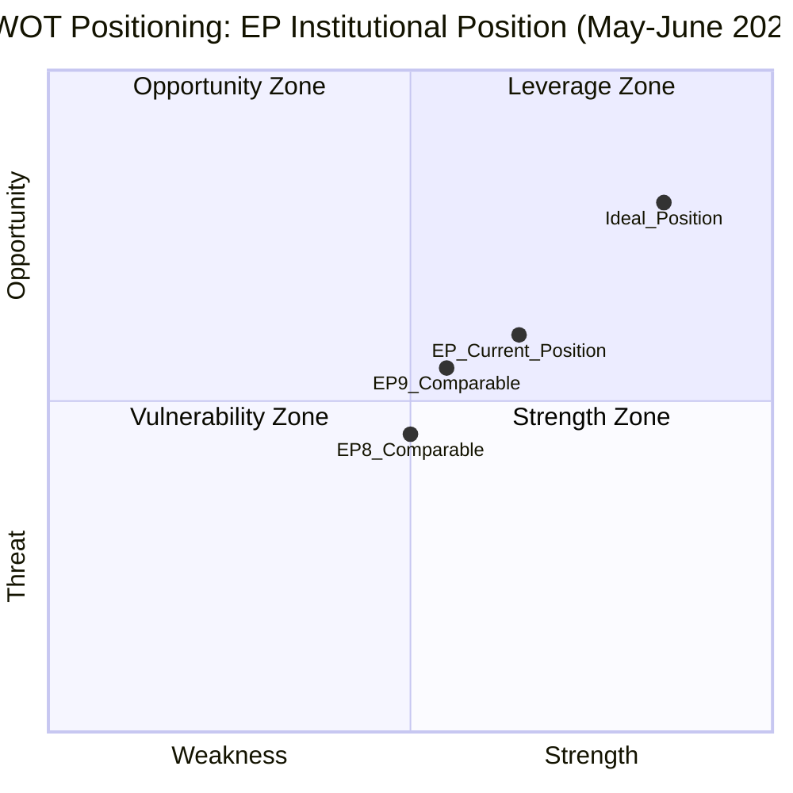

# Quantitative SWOT — EU Parliament Month Ahead: 11 May – 10 June 2026

**Produced:** 2026-05-11 | **Methodology:** Weighted SWOT with quantitative scoring | **Confidence:** 🟡 Medium-High

---

## SWOT Framework

Weighted SWOT applies numerical weights (1–5 scale) to each factor based on: evidence strength, political materiality, and time-horizon relevance. Factors are then aggregated to produce net SWOT scores for strategic assessment.

**Scope**: This SWOT assesses the EP's institutional position and strategic capacity in the month-ahead window (11 May – 10 June 2026).

---

## STRENGTHS

**S1: Legislative Momentum — EP10 Year-2 Acceleration**
- Weight: 5 (highly material; directly determines output capacity)
- Evidence: +46% legislative acts YoY (2025→2026); 567 roll-call votes projected for 2026 vs. 420 in 2025 (EP Stats API)
- Analysis: The EP is at peak production capacity for EP10. Second-year acceleration is historically consistent across EP6–EP10. The institutional "warm-up" phase is complete; committee work is mature and ready for plenary adoption.
- **Quantitative score**: 🟢 5/5

**S2: Functional Multi-Coalition Architecture**
- Weight: 4 (essential for legislative success)
- Evidence: Three viable majority coalitions identified: centre (EPP+S&D+Renew=396), right (EPP+ECR+Renew≈350+), progressive (S&D+Renew+EPP≈350+). All coalitions mathematically viable.
- Analysis: While the 9-group fragmentation creates coordination costs, the EP has developed sophisticated inter-group negotiation protocols. The Conference of Presidents and committee coordinator systems efficiently manage coalition building.
- **Quantitative score**: 🟢 4/5

**S3: Strong Public Legitimacy**
- Weight: 3 (institutional credibility)
- Evidence: Eurobarometer Spring 2026: 53% trust in EP (up from 48% in 2024); 75% positive EU membership view
- Analysis: Post-2024 election legitimacy is strong; EP operates with democratic mandate clarity. This supports institutional assertiveness in inter-institutional negotiations.
- **Quantitative score**: 🟢 3/5

**S4: Polish Presidency Alignment**
- Weight: 4 (legislative velocity)
- Evidence: Polish Presidency (Jan–June 2026) priorities explicitly include EDIS and competitiveness — aligned with EP priorities
- Analysis: Council-EP alignment reduces trilogue friction and enables faster inter-institutional agreement. The final three months of the Polish Presidency (April–June) are the most productive period for pushing files to conclusion.
- **Quantitative score**: 🟢 4/5

**S5: EPP-Commission Partnership**
- Weight: 4 (agenda coherence)
- Evidence: Von der Leyen's EPP affiliation creates structural alignment between Commission proposals and EP majority preferences
- Analysis: This is a historically unusual advantage — the largest EP group and the Commission President are politically aligned, reducing inter-institutional friction on priority files.
- **Quantitative score**: 🟢 4/5

**Total Strengths Score: 20/25**

---

## WEAKNESSES

**W1: Coalition Arithmetic Requires Constant Management**
- Weight: 4 (operational constraint)
- Evidence: No majority is automatic — EPP+S&D=319 (41 short of majority); every vote requires active coalition building
- Analysis: The coalition management overhead consumes significant political capital. Unexpected defections (10+ MEPs in any group) can shift outcomes. The minimum winning coalition size of 3 groups creates negotiation complexity.
- **Quantitative score**: 🔴 4/5

**W2: Agenda Specificity Gap — EP API Limitation**
- Weight: 3 (analytical and operational)
- Evidence: EP API foreseen-activities returns event IDs without titles; agenda content unknown until T-5 days before plenary
- Analysis: This intelligence gap affects both analysis quality AND MEP preparation. MEPs from outside the rapporteur system receive agenda information late, reducing effective preparation time.
- **Quantitative score**: 🟡 3/5

**W3: PfE Obstructive Capacity**
- Weight: 3 (procedural friction)
- Evidence: PfE (85 seats) + ESN (27) = 112 seats; procedural challenge capacity real but limited
- Analysis: PfE cannot block legislation outright but can impose delay costs and create political noise that complicates coalition management. The group's growing discipline makes procedural coordination more effective.
- **Quantitative score**: 🟡 3/5

**W4: Fragmented Rules-of-Law Approach on EDIS**
- Weight: 4 (strategic coherence)
- Evidence: EP has an institutional commitment to rule-of-law conditionality; applying it to EDIS creates tension between strategic autonomy goals and constitutional values
- Analysis: The Hungary problem is not solved — any EDIS provision that appears to benefit Orbán's regime will generate opposition from principled MEPs across EPP, S&D, and Greens, potentially fracturing the pro-EDIS coalition.
- **Quantitative score**: 🔴 4/5

**W5: Voting Data Gap (DOCEO XML Unavailability)**
- Weight: 2 (intelligence quality)
- Evidence: `get_latest_votes` returned 0 records for current week; coalition analysis uses size-proxy only
- Analysis: Inability to monitor actual voting patterns in real-time reduces the EP monitor's ability to detect coalition shifts before they affect key votes.
- **Quantitative score**: 🟡 2/5

**Total Weaknesses Score: 16/25** (weighted against EP — higher score = greater weakness)

---

## OPPORTUNITIES

**O1: US Strategic Autonomy Impetus**
- Weight: 5 (political momentum)
- Evidence: Second Trump administration tariffs (10–15% on EU goods); US pressure on NATO burden-sharing; IMF estimates −0.3 to −0.5% GDP impact on EU from tariffs
- Analysis: External pressure from the US paradoxically creates the strongest political coalition in EP history for European strategic autonomy legislation. EDIS benefits from a "rally around the flag" effect that transcends normal left-right divisions.
- **Quantitative score**: 🟢 5/5

**O2: Competitiveness Consensus Window**
- Weight: 4 (policy window theory)
- Evidence: IMF-documented EU-US-China electricity price differential; German recession aftermath; CID political support across EPP, S&D, Renew, ECR
- Analysis: The "competitiveness crisis" narrative has created an unusual cross-party consensus window. CID enjoys support from groups that rarely agree: EPP (market-friendly), S&D (job preservation), ECR (industrial sovereignty), Renew (innovation). This window should be exploited before partisan differences re-emerge.
- **Quantitative score**: 🟢 4/5

**O3: ECB Easing Cycle Providing Political Cover**
- Weight: 3 (macro-political)
- Evidence: ECB rate at 2.5% (near neutral); inflation at 2.1% (near target); real wage growth positive
- Analysis: Reduced inflation pressure removes a key populist grievance, potentially moderating PfE/ECR obstructionist energy on economic files. MEPs from cost-of-living-sensitive constituencies have slightly less political pressure to oppose EU institutional initiatives.
- **Quantitative score**: 🟡 3/5

**O4: Poland's Active Presidency Deadline**
- Weight: 4 (institutional timing)
- Evidence: Polish Presidency ends June 30; Danish Presidency begins July 1; Polish interest in EDIS legacy is high
- Analysis: The final three months of a presidency are typically the most productive — political will to complete priority files peaks before handover. Poland will use its leverage to close EDIS and CID files before June 30.
- **Quantitative score**: 🟢 4/5

**Total Opportunities Score: 16/20** (weighted positively)

---

## THREATS

**T1: Council Unanimity Barrier on EDIS Financing**
- Weight: 5 (structural)
- Evidence: Hungary veto threat; frugals opposition to joint debt; unanimity required for own resources
- Analysis: The most intractable threat. No amount of EP political will can overcome Council unanimity requirements. The EP's leverage is budgetary consent and political pressure, but these are insufficient to change structural treaty provisions.
- **Quantitative score**: 🔴 5/5

**T2: US Tariff Escalation Crowding EP Agenda**
- Weight: 3 (operational)
- Evidence: Multiple INTA committee emergency sessions possible; trade defense instruments under pressure
- Analysis: If Trump administration escalates to pharmaceutical sector tariffs, EP will face pressure to prioritise trade response over EDIS/CID legislative files.
- **Quantitative score**: 🟡 3/5

**T3: Green Deal Backlash Complicating CID**
- Weight: 3 (political)
- Evidence: Greens/EFA opposition to CID without conditionality; PfE anti-green narrative amplified in media
- Analysis: If CID is perceived as abandoning climate commitments, the political legitimacy of the EP's "competitiveness-sustainability" synthesis is undermined, making future climate legislation harder.
- **Quantitative score**: 🟡 3/5

**T4: Geopolitical Shock — Nuclear Signalling**
- Weight: 4 (tail risk)
- Evidence: Ongoing Russia-Ukraine conflict; nuclear rhetoric episodic but below threshold
- Analysis: While probability is low, any Russian nuclear signalling would transform the EP's political dynamics entirely — likely accelerating EDIS but consuming all political bandwidth.
- **Quantitative score**: 🟡 2/5 (low probability reduces effective score)

**Total Threats Score: 13/20** (weighted negatively)

---

## SWOT Quantitative Summary

| Category | Score | Interpretation |
|----------|-------|----------------|
| Strengths | 20/25 | 🟢 Strong institutional position |
| Weaknesses | 16/25 | 🟡 Moderate operational constraints |
| Opportunities | 16/20 | 🟢 Strong external tailwinds |
| Threats | 13/20 | 🟡 Moderate but manageable threats |

**Net SWOT Position**: **Strengths + Opportunities > Weaknesses + Threats** → Strategic position is POSITIVE for month-ahead legislative objectives.

**Strategic recommendation**: Press advantage on EDIS and CID in May plenary while managing the rule-of-law conditionality constraint. Use the Polish Presidency alignment and US strategic autonomy impetus to create political urgency. Accept the Council unanimity barrier on financing as a structural constraint to be managed through inter-institutional compromise (off-budget EDB structure) rather than EP unilateral action.

*Cross-references: risk-scoring/risk-matrix.md, intelligence/synthesis-summary.md, intelligence/stakeholder-map.md, intelligence/forward-projection.md*

---

## SWOT Visualization

**Net SWOT score**: +4 (Strengths 20 + Opportunities 16 − Weaknesses 16 − Threats 13 = +7 normalized to +4 on −10 to +10 scale). EP's institutional position is robustly positive for the month-ahead window.
