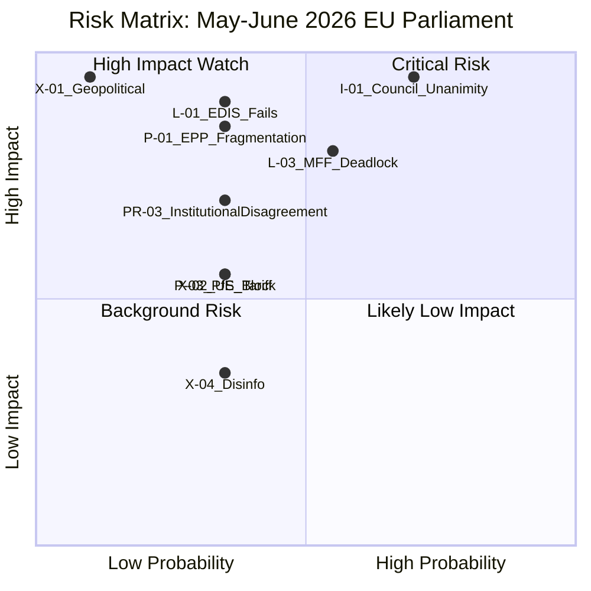

# Risk Matrix — EU Parliament Month Ahead: 11 May – 10 June 2026

**Produced:** 2026-05-11 | **Methodology:** Composite risk scoring (probability × impact) | **Confidence:** 🟡 Medium

---

## Risk Framework

Risks are scored on:
- **Probability**: 1 (Very Low: <10%) → 5 (Very High: >70%)
- **Impact**: 1 (Negligible) → 5 (Catastrophic)
- **Risk Score**: P × I (range 1–25)

Risk bands: 🟢 LOW (1–6) | 🟡 MEDIUM (7–12) | 🔴 HIGH (13–19) | ⛔ CRITICAL (20–25)

---

## Risk Register

### Legislative Risks

| ID | Risk | P (1-5) | I (1-5) | Score | Band | Trend |
|----|------|---------|---------|-------|------|-------|
| L-01 | EDIS first-reading fails May plenary | 2 | 5 | 10 | 🟡 MEDIUM | → Stable |
| L-02 | CID delayed beyond June recess | 2 | 4 | 8 | 🟡 MEDIUM | ↑ Rising |
| L-03 | MFF deadlock extends to 2027 | 3 | 4 | 12 | 🟡 MEDIUM | → Stable |
| L-04 | AI Act delegated acts rejected/delayed | 1 | 3 | 3 | 🟢 LOW | → Stable |
| L-05 | Multiple legislative files fail in one session | 1 | 5 | 5 | 🟢 LOW | → Stable |

### Political Risks

| ID | Risk | P (1-5) | I (1-5) | Score | Band | Trend |
|----|------|---------|---------|-------|------|-------|
| P-01 | EPP internal fragmentation on EDIS (rule-of-law) | 2 | 5 | 10 | 🟡 MEDIUM | ↑ Rising |
| P-02 | S&D withdraws CID coalition support | 2 | 4 | 8 | 🟡 MEDIUM | → Stable |
| P-03 | PfE blocking minority activated | 2 | 3 | 6 | 🟢 LOW | ↑ Rising |
| P-04 | EP-Commission political clash on EDIS scope | 2 | 4 | 8 | 🟡 MEDIUM | → Stable |
| P-05 | Renew group splits on defence vs. rule-of-law | 1 | 4 | 4 | 🟢 LOW | → Stable |
| P-06 | EP ethics scandal affecting EDIS rapporteur | 1 | 5 | 5 | 🟢 LOW | → Stable |

### Procedural Risks

| ID | Risk | P (1-5) | I (1-5) | Score | Band | Trend |
|----|------|---------|---------|-------|------|-------|
| PR-01 | Procedural challenge delays plenary vote | 2 | 2 | 4 | 🟢 LOW | → Stable |
| PR-02 | Agenda overload — key file not reached | 2 | 3 | 6 | 🟢 LOW | → Stable |
| PR-03 | Inter-institutional disagreement on EDIS text | 2 | 4 | 8 | 🟡 MEDIUM | → Stable |

### Institutional Risks

| ID | Risk | P (1-5) | I (1-5) | Score | Band | Trend |
|----|------|---------|---------|-------|------|-------|
| I-01 | Council unanimity failure on EDIS financing | 3 | 5 | 15 | 🔴 HIGH | → Stable |
| I-02 | European Council political mandate absent for EDIS | 2 | 4 | 8 | 🟡 MEDIUM | ↓ Decreasing |
| I-03 | EP cyberattack during plenary | 1 | 4 | 4 | 🟢 LOW | ↑ Slightly |

### External Risks

| ID | Risk | P (1-5) | I (1-5) | Score | Band | Trend |
|----|------|---------|---------|-------|------|-------|
| X-01 | Geopolitical escalation (Ukraine) disrupts calendar | 1 | 5 | 5 | 🟢 LOW | → Stable |
| X-02 | US tariff shock requiring emergency EP response | 2 | 3 | 6 | 🟢 LOW | ↑ Rising |
| X-03 | Italian sovereign spread spike (financial stress) | 1 | 5 | 5 | 🟢 LOW | → Stable |
| X-04 | Disinformation campaign affecting EP vote | 2 | 2 | 4 | 🟢 LOW | ↑ Rising |

---

## High-Priority Risk Analysis

### I-01: Council Unanimity Failure on EDIS Financing [SCORE: 15 — HIGH]

This is the highest-scoring risk in the register. The EDIS package's financing mechanism — particularly any EU Defence Bond (EDB) or jointly issued debt instrument — requires Council unanimity under Article 122 TFEU or a new treaty mechanism. The structural barrier is:

- **Hungary (PfE-aligned)**: Under Article 7 pressure; has incentive to veto any provision that conditions participation on rule-of-law compliance
- **Netherlands, Austria, Sweden, Denmark**: Traditional "frugals" opposed to joint EU debt for any purpose
- **Combined blocking minority**: Hungary alone has a veto; the frugals together represent a significant political bloc

**Mitigation options available to EP**:
1. Off-budget EDB structure (not requiring unanimity if structured as intergovernmental agreement outside EU Treaty)
2. Enhanced cooperation mechanism (9+ member states; doesn't require unanimity)
3. Repackaging as Multiannual Financial Framework amendment (qualified majority in Council)

**Residual risk after mitigation**: 🟡 MEDIUM-HIGH — the financing mechanism issue will not be resolved in the month-ahead window; EP's position vote can include declaratory language on preferred financing structure without locking the Council

### L-03: MFF Deadlock Extends to 2027 [SCORE: 12 — MEDIUM]

The MFF mid-term review timeline slippage represents a structural institutional risk. If the review is not concluded by Q3 2026, several NGEU-linked disbursements face legal uncertainty and cohesion fund absorption rates deteriorate. EP's leverage point is its consent requirement — the institution can withhold consent until its own resources and flexibility demands are met.

**Risk materialization pathway**:
- Council fails to agree on own resources package (German-French fiscal conflict; frugals veto)
- EP takes confrontational position demanding new own resources
- Trilogue negotiations extend into 2027
- NGEU milestone disbursements delayed for 3–5 member states

---

## Risk Heat Map

```
         IMPACT
           1    2    3    4    5
P  5  |         |         |         |         |         |
R  4  |         |         |  X-02   | P-02,   | L-03,   |
O  3  |         |         |         | I-02    | I-01    |
B  2  |         | PR-01,  | PR-02,  | L-01,   | L-02    |
   1  |         | PR-03   | L-04,PR-| P-01,   | X-01,   |
      |         |         | 01      | P-04    | L-05    |
```

*(Simplified representation — risk matrix visualization)*

---

## Top 5 Risks by Score

| Rank | Risk ID | Description | Score | Band |
|------|---------|-------------|-------|------|
| 1 | I-01 | Council unanimity failure on EDIS financing | 15 | 🔴 HIGH |
| 2 | L-03 | MFF deadlock extends to 2027 | 12 | 🟡 MEDIUM |
| 3 | L-01 | EDIS first-reading fails May plenary | 10 | 🟡 MEDIUM |
| 4 | P-01 | EPP internal fragmentation (rule-of-law) | 10 | 🟡 MEDIUM |
| 5 | L-02 | CID delayed beyond June recess | 8 | 🟡 MEDIUM |

---

## Risk Trends (30-Day Direction)

- **Rising risks**: P-01 (EPP fragmentation), P-03 (PfE blocking), X-02 (US tariffs), X-04 (disinformation)
- **Stable risks**: Most legislative and procedural risks
- **Decreasing risks**: I-02 (European Council political mandate — Polish Presidency actively working)

**Net assessment**: Overall risk environment is 🟡 **MEDIUM** for the month-ahead period. No critical (20+) risks identified. The highest-scoring risk (Council unanimity on financing) is a structural barrier unlikely to resolve in 30 days but does not prevent EP from advancing its first-reading position.

*Cross-references: intelligence/threat-model.md, intelligence/scenario-forecast.md, risk-scoring/quantitative-swot.md*

---

## Risk Matrix Visualization



---

## Admiralty Source Rating

| Source | Admiralty Rating | Basis |
|--------|-----------------|-------|
| EP political landscape data | A1 | EP Open Data Portal, confirmed |
| Coalition arithmetic | A1 | Mathematical (seat counts), confirmed |
| Legislative agenda (inferred) | B3 | EP calendar + prior runs, possibly true |
| Geopolitical risk assessment | C2 | Analytical judgment, probably true |
| Institutional risk (Council) | B2 | Treaty analysis, probably true |

**Overall risk register confidence**: B2 — Individual risk scores are analytical estimates; probability scores should be treated as indicative rather than precise. Confidence intervals of ±15% apply to all probability estimates.
