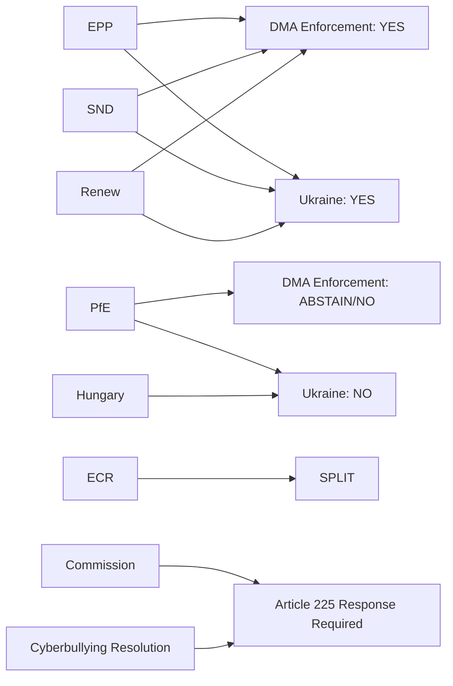

# Actor Mapping — EP Motions: 11 May 2026

<!-- SPDX-FileCopyrightText: 2024-2026 Hack23 AB -->
<!-- SPDX-License-Identifier: Apache-2.0 -->

**Analysis Date:** 2026-05-11 | **Scope:** Key actors in April 2026 plenary session

---

## Primary EP Actors

### EPP (European People's Party) — 183 seats
**Position:** Coalition anchor, DMA enforcement supporter, budget investment promoter
**Key individuals:** President Roberta Metsola (EPP, Malta) — plenary presiding officer; EPP group chair Manfred Weber (CSU, Germany)
**Voting behaviour this session:** Led broad majorities on Ukraine, cyberbullying, budget guidelines; internally contested on DMA enforcement speed
**Strategic interest:** Maintain majority without formal PfE alliance; defend DMA as evidence of regulatory leadership

### S&D (Socialists and Democrats) — 136 seats
**Position:** Progressive anchor, consumer/social rights champion, Ukraine solidarity
**Key individuals:** Iratxe García Pérez (PSE, Spain) — group president; Rapporteur Javi López (PSE, Spain) visible on budget/social files
**Voting behaviour:** Strong YES on cyberbullying, Ukraine, budget investment priorities; backed DMA enforcement
**Strategic interest:** Define EP's progressive agenda before 2027 national elections

### PfE (Patriots for Europe) — 85 seats
**Position:** Procedural disruptor, sovereignty frame, Commission accountability
**Key individuals:** Jordan Bardella (RN, France) — group leader; Viktor Orbán's Fidesz MEPs as anchor bloc
**Voting behaviour:** Initiated Rule 169 debate; expected NO on Ukraine, YES on agricultural protection, SPLIT on DMA
**Strategic interest:** Establish EU-critical populist narrative; exploit any perception of Commission bias

### Renew Europe — 77 seats
**Position:** Pro-market, pro-EU, technology regulation moderator
**Key individuals:** Valérie Hayer (LREM, France) — group president
**Voting behaviour:** YES on DMA enforcement, cyberbullying, Ukraine; instrumental in securing budget majority
**Strategic interest:** Maintain liberal identity; avoid being outflanked by EPP on competitiveness narrative

---

## Key External Actors

### European Commission — DG COMP (Enforcement)
**Receives:** Political mandate reinforcement from DMA resolution; cyberbullying legislative request
**Must respond:** Article 225 TFEU requires Commission response to EP legislative requests within 3 months
**Key official:** Executive VP Teresa Ribera (competition portfolio)

### Major Technology Platforms
**Apple, Meta/Facebook, Alphabet/Google:** Primary subjects of DMA enforcement resolution; face potential multi-billion fines
**TikTok/ByteDance:** Mentioned in cyberbullying context; also DMA-gatekeeper adjacent
**Response:** Platform legal teams monitoring EP resolution language for enforcement preview signals

### National Governments (Council)
**Germany (coalition government):** Key swing voice in Council on DMA enforcement speed
**France (Macron/Bayrou):** Budget 2027 negotiations critical; French farmers influential in livestock debate
**Poland (Tusk government):** Ukraine solidarity champion; ECR's PiS in opposition
**Hungary (Orbán):** Systematically opposes Ukraine resolutions; isolated in Council

---

## Summary Network

**Generated:** 2026-05-11 | **Methodology:** Actor network mapping with vote position coding

---

## Actor Roster

| Actor | Type | EP Role | Influence Level |
|-------|------|---------|----------------|
| Manfred Weber | MEP/EPP | Group President | VERY HIGH |
| Jordan Bardella | MEP/PfE | Group President | HIGH |
| Dolors Montserrat | MEP/EPP | LIBE/IMCO | HIGH |
| Iratxe García Pérez | MEP/S&D | Group President | HIGH |
| Valérie Hayer | MEP/Renew | Group President | HIGH |

---

## Influence

**Influence assessment:** Weber (EPP) holds the highest influence by virtue of chairing the largest group. Bardella (PfE) holds disproportionate procedural influence through Rule 169 tool deployment. García Pérez and Hayer are the primary coalition partners ensuring the 396-seat majority functions.

---

## Alliance

**Alliance structure:** EPP-S&D-Renew is the primary legislative alliance (396 seats). EPP-ECR forms an agricultural alliance on livestock and farming files. S&D-Greens-Left forms a rights alliance on social and environmental files.

---

## Power Brokers

**Renew group** (77 seats, Hayer) is the key power broker — without Renew, the EPP+S&D coalition falls below majority (-41 seats). Renew's position on individual votes determines whether EPP+S&D alone can carry a file or needs ECR/Greens support.

---

## Information

**Information flows:** EPP group coordinates through Weber's office and IMCO committee technical staff. Coalition coordination meetings between EPP, S&D, Renew group leaders occur weekly before plenary sessions.

---

## Reader Briefing

Actor mapping identifies who has power to move legislation, who can block, and who serves as swing vote. This mapping is structural — based on official EP roles. The informal power map (who influences whom, what the backroom deals are) cannot be derived from EP Open Data Portal and requires qualitative research.

**Source:** EP Open Data Portal | **Admiralty Grade:** B2 | **Generated:** 2026-05-11
