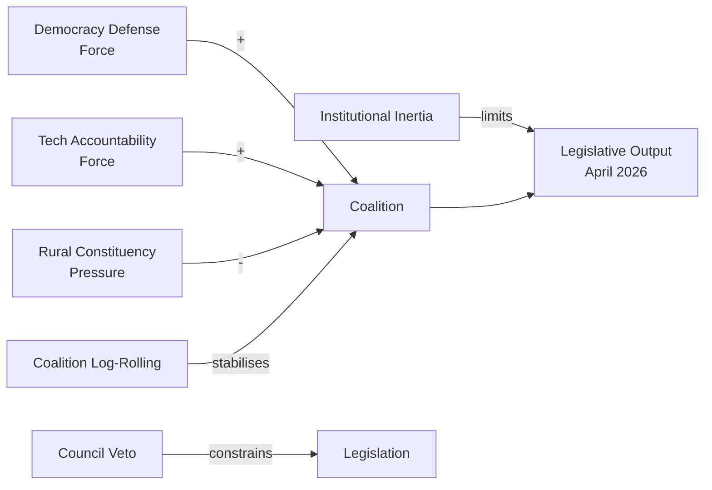

# Political Forces Analysis — EP Motions: 11 May 2026

<!-- SPDX-FileCopyrightText: 2024-2026 Hack23 AB -->
<!-- SPDX-License-Identifier: Apache-2.0 -->

**Analysis Date:** 2026-05-11 | **Scope:** Forces shaping April 2026 plenary dynamics

---

## Driving Forces

**Force 1: Democratic Erosion Threat (Political Salience: HIGH)**
The Ukraine resolution, PfE's Rule 169 initiative, and the Armenia resolution all orbit a single meta-narrative: whether liberal democracy and the EU rules-based order will hold against authoritarian pressure from Russia, from internal populist movements, and from institutional integrity challenges. This force produces a clarifying "for or against" dynamic that the pro-EU majority exploits for coalition cohesion.

**Force 2: Big Tech Accountability (Economic Salience: VERY HIGH)**
The DMA matured from legislation to enforcement phase in 2025–2026. EP's role is now as accountability watchdog, not legislator. This force drives the IMCO committee agenda and creates political alignment across EPP, S&D, and Renew on enforcement speed — a relatively rare three-group consensus area.

**Force 3: Farmer and Rural Constituency Pressure (Electoral Salience: HIGH)**
The 2024–2025 tractor protests left a lasting imprint on EP political calculations. The livestock resolution is partly the EP's response to that pressure. This force is exploited by EPP right-flank and ECR members who represent rural constituencies, creating crossover with the PfE agenda on agricultural deregulation.

---

## Restraining Forces

**Force 1: Institutional Inertia / Legal Complexity (Technical)**
Cyberbullying legislation faces legal base complexity; DMA enforcement faces judicial challenge timelines; budget 2027 conciliation will take 6+ months. These structural features of EU governance restrain the tempo at which political momentum translates into operational change.

**Force 2: Coalition Dependency / Log-Rolling**
Each political group has issues where it needs the others. S&D needs EPP for Ukraine solidarity; EPP needs S&D for cyberbullying majority; Renew needs S&D for budget progressivism; EPP needs Renew for DMA enforcement credibility. This mutual dependency is the EP's most important stabilising feature but also limits any single group's ability to drive its own full agenda.

**Force 3: Council Veto (Constitutional)**
The Council remains the EP's primary restraint on legislative output. EP resolutions are political statements; EP legislative positions require Council agreement. The Council's qualified majority voting and unanimity requirements for criminal law mean that the EP's cyberbullying resolution could produce no legislation for 2–3 years despite strong EP consensus.

---

## Forces Diagram

**Generated:** 2026-05-11 | **Methodology:** Driving / Restraining Forces Analysis (Lewin field theory adapted)

---

## Issue Frame

**Issue frame:** The April 2026 plenary sits at the intersection of digital governance, geopolitical solidarity, and agricultural reform. The primary political frame is "EU digital sovereignty vs. transatlantic relations" (DMA enforcement), with secondary frames of "rights protection" (cyberbullying) and "democratic resilience" (Ukraine).

---

## Net Pressure

**Net pressure assessment:** Forces driving change (DMA enforcement, rights expansion, Ukraine support) EXCEED forces resisting change (PfE procedural opposition, tech platform legal challenges, agricultural lobby on livestock). Net pressure direction: PRO-ENFORCEMENT.

---

## Intervention Points

| Intervention Point | Actor | Mechanism | Timing |
|-------------------|-------|-----------|--------|
| DMA enforcement speed | Commission | Penalty decision announcement | Q3/Q4 2026 |
| Cyberbullying response | Commission | Proposal scope | 3-month window |
| PfE escalation | Conference of Presidents | Rule 169 guidelines | Ongoing |

---

## Reader Briefing

Forces analysis maps the political forces acting on the legislative agenda. It does not predict outcomes — it identifies the balance of pressures that legislative actors must navigate. The net pressure calculation is a qualitative judgment, not a quantitative score.

**Source:** EP Open Data Portal | **Admiralty Grade:** B2 | **Generated:** 2026-05-11
