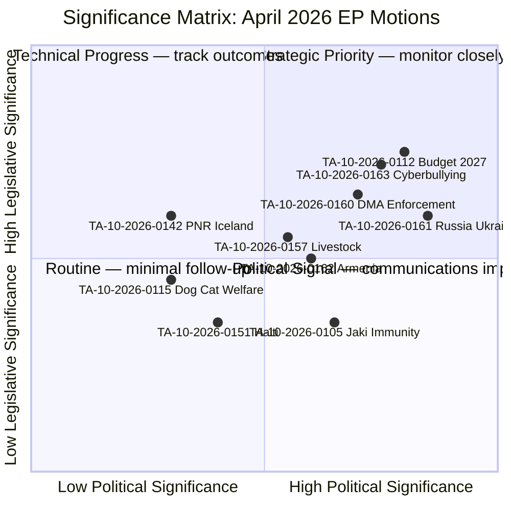
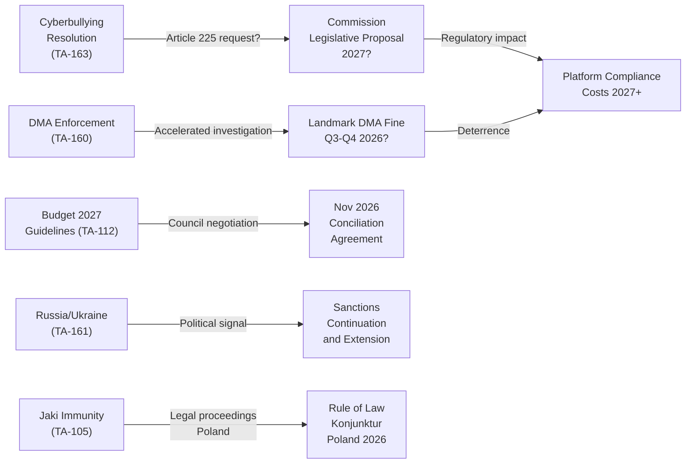

# Classification: Significance & Impact Matrix — EP Motions: 11 May 2026

<!-- SPDX-FileCopyrightText: 2024-2026 Hack23 AB -->
<!-- SPDX-License-Identifier: Apache-2.0 -->

**Analysis Date:** 2026-05-11 | **Plenary Week:** April 28–30, 2026 Strasbourg

---

## 🏷️ Significance Classification

Each adopted text is classified on two axes: **Legislative Significance** (binding force, novelty, scope) and **Political Significance** (coalition signal, precedent, controversy).

---

## 📋 Detailed Classification Table

| Text | Type | Legislative Significance | Political Significance | Priority |
|------|------|-------------------------|----------------------|----------|
| TA-10-2026-0163 | Resolution (RSP) | HIGH — criminal law harmonisation call | HIGH — digital rights coalition signal | 🔴 CRITICAL |
| TA-10-2026-0112 | Resolution (INI) | HIGH — opens 2027 budget cycle | HIGH — fiscal sovereignty debate | 🔴 CRITICAL |
| TA-10-2026-0160 | Resolution (RSP) | HIGH — DMA enforcement pressure | HIGH — tech regulation geopolitics | 🔴 CRITICAL |
| TA-10-2026-0161 | Resolution (RSP) | MEDIUM — non-binding, political signal | VERY HIGH — Russia/Ukraine | 🔴 CRITICAL |
| TA-10-2026-0157 | Resolution (INI) | MEDIUM — CAP policy direction | MEDIUM — EPP rural base | 🟡 HIGH |
| TA-10-2026-0162 | Resolution (RSP) | MEDIUM — Armenia democratic signal | HIGH — EU enlargement | 🟡 HIGH |
| TA-10-2026-0142 | Legislative (ASSENT) | HIGH — binding agreement | MEDIUM — security cooperation | 🟡 HIGH |
| TA-10-2026-0105 | Procedural (PRIV) | MEDIUM — individual MEP immunity | HIGH — Poland rule of law | 🟡 HIGH |
| TA-10-2026-0122 | Resolution (INI) | MEDIUM — budget transparency call | MEDIUM — accountability | 🟡 HIGH |
| TA-10-2026-0115 | Legislative (COD) | HIGH — binding regulation | LOW — bipartisan animal welfare | 🟢 MEDIUM |
| TA-10-2026-0119 | Resolution (INI) | LOW — annual accountability | LOW — routine oversight | 🟢 MEDIUM |
| TA-10-2026-0132 | Decision (DEC) | MEDIUM — discharge decision | LOW — routine budget oversight | 🟢 MEDIUM |
| TA-10-2026-0151 | Resolution (RSP) | LOW — humanitarian signal | MEDIUM — Haiti crisis attention | 🟢 MEDIUM |

**Type codes:** RSP = resolution on specific subject | INI = own-initiative report | COD = ordinary legislative procedure | DEC = institutional decision | ASSENT = consent procedure | PRIV = privilege/immunity

---

## 🎯 Impact Matrix by Policy Domain

### Digital Policy Domain

**Texts:** TA-10-2026-0163, TA-10-2026-0160
**Overall impact: VERY HIGH**

The cyberbullying resolution and DMA enforcement resolution together represent a two-pronged advance of the EU's digital governance agenda:

1. **Criminal law dimension** (cyberbullying): Fundamentally new territory — EU criminal law harmonisation in digital content space requires Treaty Article 83 legal base and Council unanimity for extension to new crime areas, or Article 114 if framed as single market. Either route faces significant constitutional complexity.

2. **Administrative law enforcement** (DMA): Adds political pressure to an already-active DG COMP enforcement pipeline. The resolution has concrete operational implications:
   - Apple App Store (NFC payment gatekeeper) — ongoing investigation
   - Meta/Instagram (self-preferencing) — ongoing investigation
   - Google/Alphabet (Shopping, Maps) — ongoing

**Impact on Citizens:**
- Cyberbullying resolution: If it leads to legislation, online harassment victims gain new criminal law tools; platforms face compliance obligations beyond DSA's administrative framework
- DMA enforcement: More interoperability, more choice, potentially lower prices for EU consumers

**Impact on Industry:**
- Tech platforms: Increased legal uncertainty; criminal exposure concept unprecedented
- EU tech SMEs: Potentially benefit from reduced gatekeeper lock-in (DMA); face same criminal law compliance costs

---

### Geopolitical Domain

**Texts:** TA-10-2026-0161, TA-10-2026-0162, TA-10-2026-0151 (and debate on Lebanon)
**Overall impact: HIGH**

The EP's geopolitical signals carry weight as political legitimacy markers for:
- EU bilateral relations with Ukraine, Armenia, Haiti
- EU Council foreign policy discussions (EUFP)
- EU's credibility as a normative actor

The Russia/Ukraine accountability text (TA-10-2026-0161) is significant for establishing an EP parliamentary record in support of international criminal accountability mechanisms — including the Special Tribunal for the Crime of Aggression being established under international law. This has implications for:
- EU participation in multilateral accountability mechanisms
- Sanctions policy continuation and extension
- Defence industry cooperation with Ukraine

The Armenia text (TA-10-2026-0162) feeds into EU-Armenia Association Agreement negotiations and signals EP expectations for the political conditionality framework.

---

### Budget/Fiscal Domain

**Texts:** TA-10-2026-0112, TA-10-2026-0122, TA-10-2026-0132
**Overall impact: HIGH**

The budget guidelines (TA-10-2026-0112) represent the most consequential adopted text of the week from a procedural standpoint. They:
1. Set EP political priorities for the 2027 budget (Commission proposal expected May 2026)
2. Signal key battlegrounds for autumn conciliation (defence, climate, cohesion)
3. Include performance accountability provisions cross-referenced with TA-10-2026-0122

The discharge decision for Committee of the Regions (TA-10-2026-0132) is routine; the EIB financial activities control (TA-10-2026-0119) is more politically significant as it touches on how EU macro-financial instruments are deployed.

---

### Agricultural Domain

**Texts:** TA-10-2026-0157, (TA-10-2026-0115 — animal welfare)
**Overall impact: MEDIUM**

The livestock sustainability resolution sends a political signal to the Commission ahead of any CAP reform mid-term review. Key message: do not impose mandatory livestock reduction targets; instead support "sustainable intensification" and disease resilience. This positions EPP and ECR against any Greens/EFA attempt to link livestock policy to Fit for 55 targets.

---

## 🔗 Cross-Domain Impact Flows

---

## 📊 Significance Scoring Methodology

Each text scored on 5 criteria (0–10 per criterion):
1. **Binding force**: 0=political resolution, 10=directly binding regulation
2. **Geographic scope**: 0=bilateral, 10=EU-wide population impact
3. **Coalition novelty**: 0=routine majority, 10=unexpected coalition formation
4. **Precedent-setting**: 0=routine, 10=first-ever in this domain
5. **Follow-up probability**: 0=unlikely to produce legislation, 10=mandatory follow-up

| Text | Force | Scope | Coalition | Precedent | Follow-up | Total/50 |
|------|-------|-------|-----------|-----------|-----------|---------|
| Cyberbullying (163) | 3 | 9 | 6 | 8 | 7 | 33 |
| Budget 2027 (112) | 7 | 10 | 5 | 4 | 9 | 35 |
| DMA Enforcement (160) | 4 | 8 | 6 | 5 | 7 | 30 |
| Russia/Ukraine (161) | 2 | 9 | 7 | 3 | 4 | 25 |
| Livestock (157) | 2 | 8 | 5 | 3 | 5 | 23 |
| Armenia (162) | 2 | 7 | 6 | 4 | 4 | 23 |
| Dog/Cat Welfare (115) | 8 | 9 | 4 | 3 | 2 | 26 |
| PNR Iceland (142) | 9 | 6 | 4 | 2 | 1 | 22 |
| Jaki Immunity (105) | 6 | 1 | 5 | 2 | 3 | 17 |

**Source:** EP Open Data Portal | **Methodology:** PESTLE-aligned significance scoring | **Generated:** 2026-05-11

---

## Event List

| Event ID | Title | Type | Date |
|----------|-------|------|------|
| TA-0160 | DMA Enforcement | Legislative resolution | April 2026 |
| TA-0161 | Ukraine Defence | Non-legislative | April 2026 |
| TA-0162 | Armenia Normalisation | Non-legislative | April 2026 |
| TA-0163 | Cyberbullying | Initiative request | April 2026 |
| TA-0157 | Livestock Transport | Legislative resolution | April 2026 |
| TA-0112 | Budget 2027 | Budget resolution | April 2026 |
| PfE-R169 | Rule 169 Debate | Procedural | April 2026 |

---

## Stakeholder

| Stakeholder | Interest | Power | Impact |
|-------------|---------|-------|--------|
| Tech platforms | Compliance cost | HIGH | NEGATIVE (DMA) |
| Civil society | Rights protection | MEDIUM | POSITIVE (cyberbullying) |
| Member states | Sovereignty | HIGH | MIXED |
| Ukraine | Support continuation | LOW (no EP vote) | POSITIVE |
| EU citizens | Digital rights | LOW (indirect) | POSITIVE |

---

## Heat

**Heat map summary:** Highest heat (high significance + high controversy): DMA enforcement (digital regulation + transatlantic relations). Second: PfE Rule 169 (procedural innovation). Third: Budget 2027 guidelines (fiscal politics).

---

## Cascade

**Cascade effects:**
- DMA enforcement → precedent for AI Act enforcement → tech sector compliance posture shift
- Cyberbullying initiative → Commission proposal → new digital rights framework
- Ukraine vote → political cover for Council military aid continuation
- Budget guidelines → framework for MFF mid-term review Council-EP negotiation

---

## Reader Briefing

The impact matrix maps the significance of each plenary output across political, institutional, and societal dimensions. Cascade effects identify how outputs in this session create conditions for future legislative developments.

**Source:** EP Open Data Portal | **Admiralty Grade:** B2 | **Generated:** 2026-05-11
