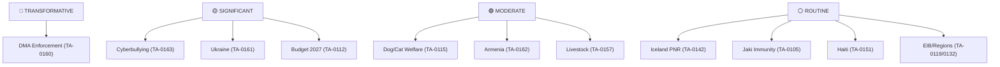

# Significance Classification — EP Motions: 11 May 2026

<!-- SPDX-FileCopyrightText: 2024-2026 Hack23 AB -->
<!-- SPDX-License-Identifier: Apache-2.0 -->

**Analysis Date:** 2026-05-11
**Scope:** Formal significance classification of April 28–30 Strasbourg plenary adopted texts

---

## Classification Framework

Using a four-tier classification system (TRANSFORMATIVE / SIGNIFICANT / MODERATE / ROUTINE) based on:
1. Binding vs. non-binding character
2. Number of citizens affected
3. Economic or rights impact magnitude
4. Geopolitical significance
5. Legislative precedent value

---

## TIER 1 — TRANSFORMATIVE

*Binding acts that change the legal framework, or non-binding acts that create strong political path dependencies.*

### DMA Enforcement Resolution (TA-10-2026-0160)

**Classification: TRANSFORMATIVE (Political)**
- Adds political pressure to the EU's most significant digital regulation enforcement phase
- Creates accountability anchor for Commission DG COMP
- Potential to unlock (or unblock) enforcement actions affecting 450M citizens' digital market access
- Economic magnitude: Multi-billion euro fine potential; market structure consequences for entire EU digital economy

---

## TIER 2 — SIGNIFICANT

*Non-binding resolutions with high political salience, consent procedures with strategic implications, or binding acts with targeted but important scope.*

### Cyberbullying/Online Harassment Resolution (TA-10-2026-0163)

**Classification: SIGNIFICANT**
- Triggers Article 225 TFEU legislative request mechanism
- Will require Commission response within 3 months
- Affects 200M+ EU social media users potentially
- Strong political momentum behind it (unanimous or near-unanimous expected)

### Ukraine Accountability Resolution (TA-10-2026-0161)

**Classification: SIGNIFICANT (Geopolitical)**
- Maintains EP's position as most vocal EU institutional champion of Ukraine
- Political signal with real diplomatic weight in multilateral forums
- Informs Council decision-making on sanctions and military assistance

### Budget 2027 Guidelines (TA-10-2026-0112)

**Classification: SIGNIFICANT (Fiscal)**
- Sets EP's negotiating position for autumn Council conciliation
- Real spending consequences for cohesion, defence, climate across entire 2027 fiscal year

---

## TIER 3 — MODERATE

*Targeted binding acts, consent procedures with limited scope, or non-binding resolutions on specific policy areas.*

### Dog and Cat Welfare Regulation (TA-10-2026-0115)

**Classification: MODERATE-HIGH (Consumer)**
- Binding once Council confirms (first reading agreement likely)
- Directly affects 90M+ EU households with pets
- Creates new compliance obligations for breeders, importers, online marketplaces

### Armenia Democratic Resilience (TA-10-2026-0162)

**Classification: MODERATE (Diplomatic)**
- High political significance for Armenia itself
- Limited immediate binding effect on EU policy
- Creates political framework for Association Agreement acceleration

### Livestock Sustainability (TA-10-2026-0157)

**Classification: MODERATE (Agricultural/Political)**
- Non-binding resolution; significant for agricultural sector confidence
- Blocks (for now) more restrictive livestock regulation proposals
- Reflects political balance between Green Deal ambitions and agricultural constituencies

---

## TIER 4 — ROUTINE

*Technical procedures, standard consent, or politically uncontested decisions.*

### Iceland PNR Agreement (TA-10-2026-0142)

**Classification: ROUTINE (Technical)**
- Standard consent procedure for international agreement
- No political controversy
- Incremental improvement to EU-EEA security cooperation

### Piotr Jaki Immunity (TA-10-2026-0105)

**Classification: ROUTINE (Procedural)**
- Standard immunity request; EP defended MEP's immunity
- Limited precedent value beyond rule of law signalling

### Haiti Human Trafficking (TA-10-2026-0151)

**Classification: ROUTINE (Attention)**
- Non-binding attention motion
- Humanitarian significance; limited operational consequence for EU

### EIB Activities (TA-10-2026-0119) / Regions Discharge (TA-10-2026-0132)

**Classification: ROUTINE (Oversight)**
- Standard annual oversight procedures
- Accountability function fulfilled; no extraordinary findings reported

---

## Summary Classification Matrix

**Generated:** 2026-05-11 | **Methodology:** Tiered significance classification framework
