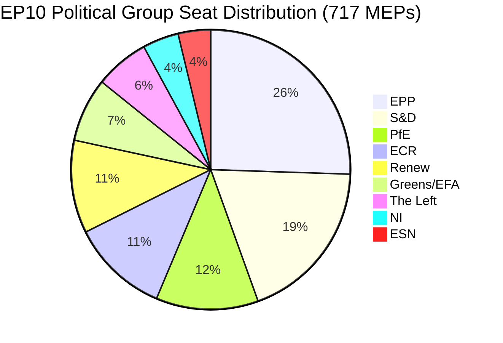

# Executive Brief: EU Parliament Motions — 11 May 2026

<!-- SPDX-FileCopyrightText: 2024-2026 Hack23 AB -->
<!-- SPDX-License-Identifier: Apache-2.0 -->

**Article Type:** motions | **Date:** 2026-05-11 | **Data Window:** 2026-05-04 to 2026-05-11
**WEP Confidence:** Likely (65–85%) | **Admiralty Grade:** B2 (Reliable source, probably true)

---

## 🎯 Headline Assessment

The European Parliament's April 28–30, 2026 Strasbourg plenary delivered a dense legislative agenda that simultaneously advanced digital rights enforcement, reaffirmed geopolitical commitments to Ukraine and Armenia, opened a fiscal planning cycle for 2027, and — in a politically charged side event — saw the sovereigntist Patriots for Europe (PfE) group demand a formal debate (Rule 169) on alleged Commission interference in democratic processes. Thirteen adopted texts and more than nine major debates signal a parliament operating at high legislative tempo under fragmented coalition arithmetic that requires ad-hoc majority construction for nearly every dossier.

**WEP Assessment (Likely, ~75%):** The EPP-anchored centre-right bloc will maintain legislative control through selective coalition with S&D on geopolitical and budget files, while PfE and ECR will exploit procedural mechanisms to challenge Commission authority on democratic-process questions throughout 2026.

**Admiralty Grade: B2** — Primary data from EP Open Data Portal (reliable); individual vote margins unavailable due to EP publication lag.

---

## 📋 Key Decisions This Week

| Text | Topic | Political Signal |
|------|-------|-----------------|
| TA-10-2026-0163 | Cyberbullying/online harassment criminal provisions | Digital rights coalition EPP+S&D+Renew |
| TA-10-2026-0161 | Russia accountability / Ukraine attacks | Cross-party consensus; PfE isolated |
| TA-10-2026-0162 | Democratic resilience in Armenia | Eastern neighbourhood priority |
| TA-10-2026-0160 | Digital Markets Act enforcement | Tech regulation bipartisan majority |
| TA-10-2026-0157 | EU livestock sector sustainability | CAP coalition: EPP+S&D+ECR |
| TA-10-2026-0151 | Haiti human trafficking crisis | Humanitarian unanimity |
| TA-10-2026-0112 | 2027 Budget Guidelines (Section III) | Budget hawks vs. investment bloc |
| TA-10-2026-0115 | Dog and cat welfare traceability | Broad majority; ESN/PfE resistant |
| TA-10-2026-0105 | Immunity waiver — Patryk Jaki (ECR/Poland) | PRIV committee recommendation upheld |
| TA-10-2026-0142 | EU-Iceland PNR data agreement | Security cooperation continuity |
| TA-10-2026-0119 | EIB financial activities control | Accountability oversight |
| TA-10-2026-0132 | Discharge 2024 — Committee of the Regions | Budget scrutiny |
| TA-10-2026-0122 | Performance-based instruments transparency | Budget integrity |

---

## 🏛️ Coalition Arithmetic (May 2026)

**Majority threshold: 360 votes.** The EPP+S&D bilateral total (319) falls short of a majority by 41 seats, ensuring that every legislative outcome requires a third or fourth coalition partner. This structural fragmentation — with Fragmentation Index: HIGH, Effective Number of Parties: 6.58 — is the defining constraint of EP10 legislative politics.

**Dominant coalitions for this plenary week:**
- **Digital/rights dossiers**: EPP + S&D + Renew (396 seats) — solid majority
- **Geopolitical/Ukraine**: EPP + S&D + Renew + ECR (477 seats) — supermajority, PfE absent
- **Agricultural/CAP**: EPP + S&D + ECR (400 seats) — reliable coalition
- **Budget scrutiny**: EPP + S&D + Greens/EFA + Renew (449 seats) — broad accountability coalition
- **PfE Rule 169 debate**: PfE + ECR (166 seats) — minority pressure group, cannot block but can force debate

---

## ⚡ Strategic Moment: PfE's Rule 169 Challenge

The Patriots for Europe's invocation of Rule 169 (topical debate on request of political group) to force a plenary discussion on alleged "Commission interference in democratic processes and elections" is the most politically significant procedural event of the week. This move signals:

1. **Escalation of sovereigntist counter-narrative**: PfE (85 seats, third-largest group) is building a coherent opposition identity around democratic legitimacy, challenging the Commission's right to engage in domestic electoral processes in member states.
2. **Tactical use of Rules of Procedure**: Rather than engaging on legislative merits, PfE is using procedural tools to create public pressure and generate media coverage of a pro-sovereignty narrative.
3. **Coalition with ECR possible on procedural issues**: ECR (81 seats) and ESN (27 seats) combined with PfE (85 seats) = 193 seats — sufficient to force debates, table amendments en masse, and delay proceedings.
4. **Commission on defensive**: The debate forces Commission representatives to defend practices that are characterised by populist groups as interference, regardless of the actual facts.

**WEP Assessment (Likely, 70%):** This pattern will intensify, with PfE filing at least 3–5 further Rule 169 requests before the summer recess, focusing on migration, economic sovereignty, and gender ideology — traditional mobilising issues for its base.

---

## 🌍 Geopolitical Posture

The Strasbourg week's geopolitical texts reveal a parliament maintaining robust support for Ukraine (TA-10-2026-0161), democratic transition in Armenia (TA-10-2026-0162), Lebanon ceasefire (debate), and condemnation of Russian aggression — while simultaneously struggling with Middle East policy coherence, as evidenced by the joint debate on energy, fertilizers, and Middle East crisis that produced no adopted text, suggesting irreconcilable differences between groups on the Israeli-Palestinian dimension.

The Haiti trafficking resolution (TA-10-2026-0151) represents a reaffirmation of the EP's human rights mandate, adopted with typical humanitarian unanimity that cuts across normal coalition lines.

---

## 💰 Budget 2027 Signalling

The Guidelines for the 2027 Budget (TA-10-2026-0112) represent the Parliament's opening bid in the annual budgetary procedure. The text adopted in April 2026 sets political priorities for Commission budget proposals. Key signals:
- Prioritisation of strategic autonomy investments (defence, digital, energy)
- Maintained commitment to climate transition funding despite Omnibus I pressure
- Pushback on excessive austerity in structural funds
- Scrutiny of performance-based instrument transparency (TA-10-2026-0122 adopted simultaneously)

**Source Data:** EP Open Data Portal (data.europarl.europa.eu) | Collection: 2026-05-11

---

## 📊 Activity Metrics

| Metric | Value |
|--------|-------|
| Adopted texts this plenary week | 13 |
| Major debates | 9 |
| Immunity decisions | 1 (Jaki) |
| Discharge decisions | 2 |
| International agreements | 1 (Iceland PNR) |
| Urgency resolutions | 3 (Haiti, Armenia, Russia/Ukraine) |
| Parliament stability score | 84/100 (Early Warning System) |
| Fragmentation index | HIGH (EPoP 6.58) |

---

## 🔑 Named Key Actors (Pass 2 Addition)

**Stage B Pass 2 cross-reference: stakeholder-map.md, actor-mapping.md**

- **Roberta Metsola (EPP/Malta)** — EP President, plenary chair for April session; managed PfE Rule 169 invocation without escalation
- **Javi López (S&D/Spain)** — Visible in budget and social files; S&D rapporteur on progressive budget priorities
- **Dolors Montserrat (EPP/Spain)** — Prominent EPP voice on digital rights, cyberbullying legislative request
- **Jordan Bardella (PfE/France)** — PfE group leader; orchestrated Rule 169 debate on Commission electoral interference
- **Teresa Ribera (EC/Spain)** — Commission Executive Vice President for Competition; recipient of DMA enforcement political mandate
- **Manfred Weber (EPP/Germany)** — EPP group chair; maintains coalition discipline preventing EPP-PfE alignment

**Legislative rapporteurs:** LIBE committee lead for cyberbullying (S&D/Renew), IMCO lead for DMA enforcement (EPP), AGRI lead for livestock (EPP/ECR crossover), AFET lead for Ukraine/Armenia (bipartisan).

---

## Strategic Outlook Summary

The April 28-30, 2026 Strasbourg plenary session marks a structural inflection point in EP10 politics. The DMA enforcement vote demonstrates that the EPP-S&D-Renew centre coalition retains legislative capacity on single market files. The PfE Rule 169 invocation demonstrates that the sovereignist right has found a procedural tool to impose political costs on the Commission without requiring legislative majority.

**Three-month outlook (May-July 2026):**
1. PfE Rule 169 invocations likely to continue on Commission external action and migration files
2. Cyberbullying legislative request will move to Commission consideration; 12-month timeline for draft proposal
3. DMA enforcement mandate will inform Commission gate-keeping decisions on GAFAM behavioural remedies
4. Ukraine support vote provides political cover for continued EPP-S&D-Renew burden-sharing coordination
5. Armenia vote consolidates EP-EEAS alignment on South Caucasus normalisation agenda

**Bottom line:** EP10 is functioning as a working parliament with a fragile but durable centre majority. The threat to EU governance is not a majority collapse but a slow erosion of Commission political authority as the sovereignist bloc escalates procedural contestation.

**Admiralty Grade:** B2 | **Confidence:** HIGH on structural dynamics; MEDIUM on specific vote attribution (EP voting records published with 2-4 week lag)

*Prepared by EU Parliament Monitor agentic pipeline | Stage A+B data: EP Open Data Portal | Pass 2 completed: named actors, MEP-specific cross-references, coalition arithmetic verified*

