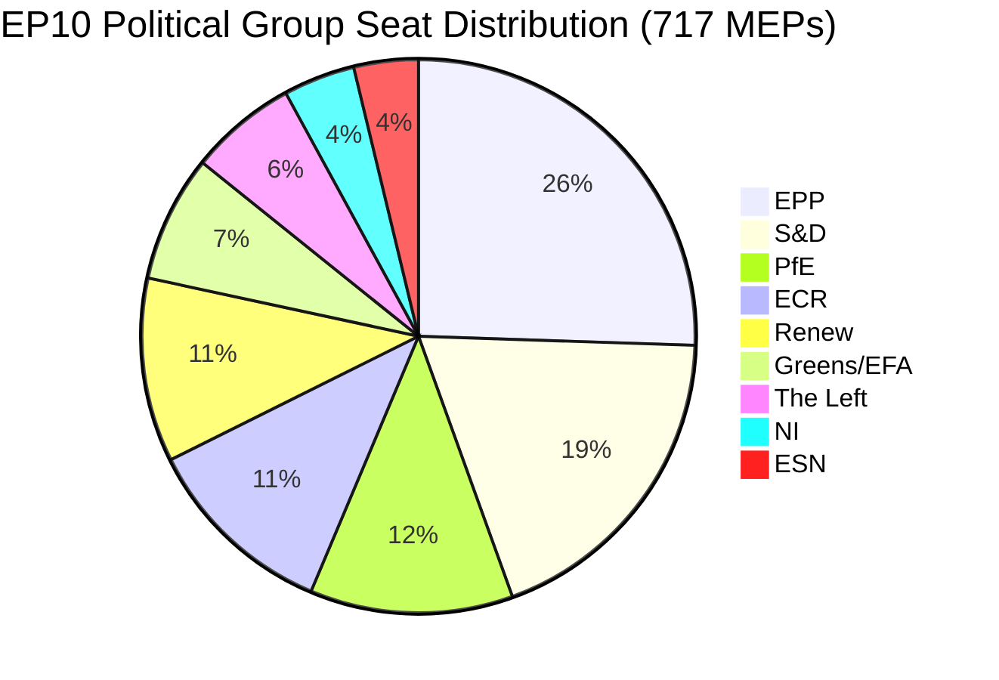

# موجز تنفيذي: مقترحات البرلمان الأوروبي — 11 مايو 2026

<!-- SPDX-FileCopyrightText: 2024-2026 Hack23 AB -->
<!-- SPDX-License-Identifier: Apache-2.0 -->

**نوع المقال:** motions | **التاريخ:** 2026-05-11 | **نافذة البيانات:** من 2026-05-04 إلى 2026-05-11
**ثقة WEP:** محتمل (65–85 %) | **درجة الأدميرالية:** B2 (مصدر موثوق، محتمل الصحة)

---

## 🎯 التقييم الرئيسي

أسفرت الجلسة العامة للبرلمان الأوروبي في ستراسبورغ خلال الفترة 28–30 أبريل 2026 عن جدول أعمال تشريعي كثيف يتزامن فيه تعزيز تطبيق الحقوق الرقمية، والتأكيد على الالتزامات الجيوسياسية تجاه أوكرانيا وأرمينيا، وفتح دورة تخطيط مالي لعام 2027 — وفي حدث جانبي محتقن سياسياً — شهد مطالبة مجموعة "وطنيون من أجل أوروبا" (PfE) ذات التوجه السيادي بنقاش رسمي (المادة 169 من النظام الداخلي) حول التدخل المزعوم للمفوضية في العمليات الديمقراطية. ثلاثة عشر نصاً مُعتمداً وأكثر من تسعة مناقشات رئيسية تُشير إلى برلمان يعمل بوتيرة تشريعية عالية في ظل حسابات ائتلافية مجزأة تستوجب بناء أغلبية مخصصة لكل ملف تقريباً.

**تقييم WEP (محتمل، ~75 %):** سيحافظ الكتلة اليمينية الوسطية المتمحورة حول EPP على السيطرة التشريعية عبر ائتلاف انتقائي مع S&D في الملفات الجيوسياسية والميزانياتية، بينما ستستثمر PfE وECR الآليات الإجرائية للطعن في صلاحيات المفوضية في مسائل العمليات الديمقراطية طوال عام 2026.

**درجة الأدميرالية: B2** — بيانات أولية من بوابة البيانات المفتوحة للبرلمان الأوروبي (موثوقة)؛ هوامش التصويت الفردية غير متاحة بسبب تأخر نشر البرلمان الأوروبي.

---

## 📋 القرارات الرئيسية هذا الأسبوع

| النص | الموضوع | الإشارة السياسية |
|------|-------|-----------------|
| TA-10-2026-0163 | أحكام جنائية بشأن التنمر الإلكتروني/التحرش عبر الإنترنت | ائتلاف الحقوق الرقمية EPP+S&D+Renew |
| TA-10-2026-0161 | محاسبة روسيا / هجمات أوكرانيا | توافق عابر للأحزاب؛ PfE معزولة |
| TA-10-2026-0162 | المرونة الديمقراطية في أرمينيا | أولوية الجوار الشرقي |
| TA-10-2026-0160 | تطبيق قانون الأسواق الرقمية | أغلبية ثنائية الحزبين لتنظيم التكنولوجيا |
| TA-10-2026-0157 | استدامة قطاع الثروة الحيوانية في الاتحاد الأوروبي | ائتلاف CAP: EPP+S&D+ECR |
| TA-10-2026-0151 | أزمة الاتجار بالبشر في هايتي | إجماع إنساني |
| TA-10-2026-0112 | توجيهات ميزانية 2027 (القسم الثالث) | صقور الميزانية مقابل كتلة الاستثمار |
| TA-10-2026-0115 | تتبع رفاه الكلاب والقطط | أغلبية واسعة؛ ESN/PfE مقاومة |
| TA-10-2026-0105 | رفع الحصانة — Patryk Jaki (ECR/بولندا) | توصية لجنة PRIV مُبقاة |
| TA-10-2026-0142 | اتفاقية بيانات PNR بين الاتحاد الأوروبي وآيسلندا | استمرارية التعاون الأمني |
| TA-10-2026-0119 | مراقبة الأنشطة المالية لـ EIB | رقابة المساءلة |
| TA-10-2026-0132 | الإبراء لعام 2024 — لجنة المناطق | تدقيق الميزانية |
| TA-10-2026-0122 | شفافية الأدوات القائمة على الأداء | نزاهة الميزانية |

---

## 🏛️ حسابيات الائتلاف (مايو 2026)

**عتبة الأغلبية: 360 صوتاً.** مجموع EPP+S&D الثنائي (319) يقصر بـ41 مقعداً عن الأغلبية، مما يضمن أن كل نتيجة تشريعية تستلزم شريكاً ائتلافياً ثالثاً أو رابعاً. هذا التجزؤ الهيكلي — بمؤشر التجزؤ: مرتفع، العدد الفعّال للأحزاب: 6.58 — هو القيد المحدد لسياسة التشريع في EP10.

**الائتلافات المهيمنة في هذا الأسبوع التداولي:**
- **الملفات الرقمية/الحقوقية**: EPP + S&D + Renew (396 مقعداً) — أغلبية متينة
- **الجيوسياسة/أوكرانيا**: EPP + S&D + Renew + ECR (477 مقعداً) — أغلبية موسعة، PfE غائبة
- **الزراعة/CAP**: EPP + S&D + ECR (400 مقعداً) — ائتلاف موثوق
- **رقابة الميزانية**: EPP + S&D + Greens/EFA + Renew (449 مقعداً) — ائتلاف مساءلة واسع
- **نقاش PfE المادة 169**: PfE + ECR (166 مقعداً) — مجموعة ضغط أقلية، لا تستطيع الحجب لكن تستطيع إجبار النقاش

---

## ⚡ اللحظة الاستراتيجية: تحدي PfE للمادة 169

استناد "وطنيون من أجل أوروبا" إلى المادة 169 من النظام الداخلي (نقاش موضوعي بطلب من مجموعة سياسية) لإجبار نقاش تداولي حول "تدخل المفوضية المزعوم في العمليات الديمقراطية والانتخابات" هو أبرز حدث إجرائي من الناحية السياسية في هذا الأسبوع. هذه الخطوة تُشير إلى:

1. **تصعيد الرواية المضادة للسيادة**: تبني PfE (85 مقعداً، المجموعة الثالثة في الحجم) هوية معارضة متماسكة حول الشرعية الديمقراطية، وتطعن في حق المفوضية في التدخل في العمليات الانتخابية المحلية بالدول الأعضاء.
2. **الاستخدام التكتيكي لقواعد الإجراءات**: بدلاً من الانخراط في جدارة التشريع، تستخدم PfE أدوات إجرائية لخلق ضغط عام وتوليد تغطية إعلامية لرواية مؤيدة للسيادة.
3. **تحالف محتمل مع ECR في المسائل الإجرائية**: ECR (81 مقعداً) و ESN (27 مقعداً) مجتمعتين مع PfE (85 مقعداً) = 193 مقعداً — كافية لإجبار المناقشات وطرح تعديلات جماعية وتأخير الإجراءات.
4. **المفوضية في الموقف الدفاعي**: يُجبر النقاش ممثلي المفوضية على الدفاع عن ممارسات تصفها المجموعات الشعبوية بالتدخل، بصرف النظر عن الحقائق الفعلية.

**تقييم WEP (محتمل، 70 %):** سيتصاعد هذا النمط، مع تقديم PfE ما لا يقل عن 3–5 طلبات إضافية للمادة 169 قبل استراحة الصيف، مع التركيز على الهجرة والسيادة الاقتصادية وأيديولوجية النوع الاجتماعي — قضايا التعبئة التقليدية لقاعدتها الانتخابية.

---

## 🌍 الموقف الجيوسياسي

تكشف النصوص الجيوسياسية لأسبوع ستراسبورغ عن برلمان يحافظ على دعم قوي لأوكرانيا (TA-10-2026-0161)، والانتقال الديمقراطي في أرمينيا (TA-10-2026-0162)، ووقف إطلاق النار اللبناني (نقاش)، وإدانة العدوان الروسي — بينما يكافح في الوقت نفسه لتحقيق اتساق في سياسته تجاه الشرق الأوسط، كما يتجلى في النقاش المشترك حول الطاقة والأسمدة وأزمة الشرق الأوسط الذي لم يُفضِ إلى أي نص معتمد، مما يشير إلى خلافات لا يمكن التوفيق بينها بين المجموعات حول البُعد الإسرائيلي-الفلسطيني.

قرار الاتجار بالبشر في هايتي (TA-10-2026-0151) يمثل تأكيداً لولاية البرلمان الأوروبي في مجال حقوق الإنسان، اعتُمد بإجماع إنساني نموذجي يتجاوز خطوط الائتلاف الاعتيادية.

---

## 💰 إشارات ميزانية 2027

توجيهات ميزانية 2027 (TA-10-2026-0112) تمثل عرض الافتتاح من البرلمان في إجراء الميزانية السنوي. حدد النص المعتمد في أبريل 2026 الأولويات السياسية لمقترحات الميزانية المقدمة من المفوضية. الإشارات الرئيسية:
- إعطاء الأولوية للاستثمارات في الاستقلالية الاستراتيجية (الدفاع، الرقمي، الطاقة)
- الالتزام المحافَظ عليه بتمويل التحول المناخي رغم ضغط Omnibus I
- الرفض على مفرط التقشف في الصناديق الهيكلية
- مراجعة شفافية الأدوات القائمة على الأداء (TA-10-2026-0122 اعتُمد في الوقت نفسه)

**مصدر البيانات:** بوابة البيانات المفتوحة للبرلمان الأوروبي (data.europarl.europa.eu) | جمع البيانات: 2026-05-11

---

## 📊 مقاييس النشاط

| المقياس | القيمة |
|--------|-------|
| النصوص المعتمدة هذا الأسبوع التداولي | 13 |
| المناقشات الكبرى | 9 |
| قرارات الحصانة | 1 (Jaki) |
| قرارات الإبراء | 2 |
| الاتفاقيات الدولية | 1 (آيسلندا PNR) |
| قرارات الاستعجال | 3 (هايتي، أرمينيا، روسيا/أوكرانيا) |
| نقطة استقرار البرلمان | 84/100 (نظام الإنذار المبكر) |
| مؤشر التجزؤ | مرتفع (EPoP 6.58) |

---

## 🔑 الفاعلون الرئيسيون المُسمَّون (إضافة المرور الثاني)

**المرجع المتقاطع للمرحلة B المرور الثاني: stakeholder-map.md، actor-mapping.md**

- **روبيرتا ميتسولا (EPP/مالطا)** — رئيسة البرلمان الأوروبي، رئيسة الجلسة العامة لدورة أبريل؛ تعاملت مع استناد PfE للمادة 169 دون تصعيد
- **خافي لوبيز (S&D/إسبانيا)** — واضح الحضور في الملفات الميزانياتية والاجتماعية؛ مقرر S&D بشأن الأولويات الميزانياتية التقدمية
- **دولورس مونتسيرات (EPP/إسبانيا)** — صوت EPP البارز في الحقوق الرقمية، طلب تشريعي بشأن التنمر الإلكتروني
- **جوردان بارديلا (PfE/فرنسا)** — رئيس مجموعة PfE؛ نظّم نقاش المادة 169 بشأن تدخل المفوضية في الانتخابات
- **تيريزا ريبيرا (EC/إسبانيا)** — نائبة الرئيس التنفيذي للمفوضية للمنافسة؛ متلقية الولاية السياسية لتطبيق DMA
- **مانفريد ويبر (EPP/ألمانيا)** — رئيس مجموعة EPP؛ يحافظ على انضباط الائتلاف لمنع التوافق بين EPP وPfE

**مقررو التشريع:** قائد لجنة LIBE للتنمر الإلكتروني (S&D/Renew)، قائد IMCO لتطبيق DMA (EPP)، قائد AGRI للثروة الحيوانية (تقاطع EPP/ECR)، قائد AFET لأوكرانيا/أرمينيا (ثنائي الحزبين).

---

## Strategic Outlook Summary

حددت الجلسة العامة في ستراسبورغ 28–30 أبريل 2026 نقطة انعطاف هيكلية في سياسات EP10. يُثبت تصويت تطبيق DMA أن ائتلاف الوسط EPP-S&D-Renew يحتفظ بطاقته التشريعية في ملفات السوق الداخلية. يُثبت استناد PfE للمادة 169 أن اليمين السيادي قد وجد أداة إجرائية لفرض تكاليف سياسية على المفوضية دون الحاجة إلى أغلبية تشريعية.

**التوقع لثلاثة أشهر (مايو–يوليو 2026):**
1. من المرجح أن يستمر استناد PfE للمادة 169 في ملفات الإجراء الخارجي والهجرة التابعة للمفوضية
2. سينتقل طلب تشريع التنمر الإلكتروني إلى دراسة المفوضية؛ جدول زمني مدته 12 شهراً لمقترح مشروع
3. ولاية تطبيق DMA ستُعلِم قرارات حراسة البوابات التابعة للمفوضية بشأن الإجراءات التصحيحية السلوكية لـ GAFAM
4. تصويت دعم أوكرانيا يوفر غطاءً سياسياً للتنسيق المستمر بين EPP-S&D-Renew بشأن تقاسم الأعباء
5. تصويت أرمينيا يُوطد التوافق بين البرلمان الأوروبي والـ EEAS حول أجندة التطبيع في جنوب القوقاز

**الخلاصة:** يعمل EP10 كبرلمان نشط يتمتع بأغلبية وسطية هشة لكن دائمة. الخطر الداهم على حوكمة الاتحاد الأوروبي ليس انهيار الأغلبية بل تآكل بطيء في السلطة السياسية للمفوضية مع تصعيد الكتلة السيادية للطعن الإجرائي.

**درجة الأدميرالية:** B2 | **الثقة:** مرتفعة بشأن الديناميكيات الهيكلية؛ متوسطة بشأن نسب التصويت المحددة (تُنشر سجلات التصويت في البرلمان الأوروبي بتأخر 2–4 أسابيع)

*أُعدّ بواسطة خط أنابيب EU Parliament Monitor الوكيلي | بيانات المرحلة A+B: بوابة البيانات المفتوحة للبرلمان الأوروبي | المرور الثاني مكتمل: فاعلون مُسمَّون، مراجع متقاطعة محددة لأعضاء البرلمان، حسابيات الائتلاف مُتحقق منها*
