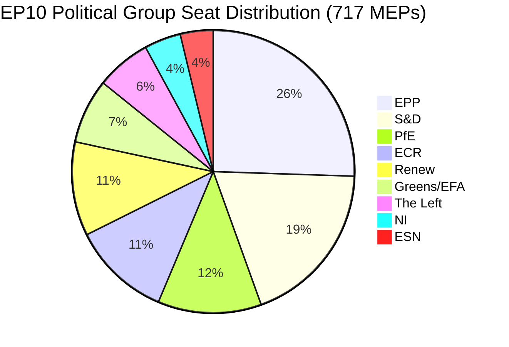

# Eksekutiv orienteringsskrivelse: EU-Parlamentets motioner — 11. maj 2026

<!-- SPDX-FileCopyrightText: 2024-2026 Hack23 AB -->
<!-- SPDX-License-Identifier: Apache-2.0 -->

**Artikeltype:** motions | **Dato:** 2026-05-11 | **Datavindue:** 2026-05-04 til 2026-05-11
**WEP-tillid:** Sandsynlig (65–85 %) | **Admiralitetsgrad:** B2 (Pålidelig kilde, sandsynligvis sand)

---

## 🎯 Rubrikvurdering

Europa-Parlamentets plenarsession i Strasbourg den 28.–30. april 2026 leverede en tæt lovgivningsdagsorden, der samtidigt fremrykkede håndhævelsen af digitale rettigheder, bekræftede geopolitiske forpligtelser over for Ukraine og Armenien, åbnede en fiskal planlægningscyklus for 2027 og — i en politisk ladet sidebegivenhed — så den suverænitetsvenlige Patriots for Europe (PfE)-gruppe kræve en formel debat (Forretningsordenens artikel 169) om påstået Kommissionsindblanding i demokratiske processer. Tretten vedtagne tekster og mere end ni større debatter signalerer et parlament i høj lovgivningstakt under fragmenteret koalitionsaritektur, der kræver ad hoc-majoritetsopbygning for næsten hvert eneste sagsområde.

**WEP-vurdering (Sandsynlig, ~75 %):** Den EPP-forankrede centrum-højrefløj vil opretholde lovgivningskontrol gennem selektiv koalition med S&D om geopolitiske og budgetrelaterede sager, mens PfE og ECR vil udnytte proceduremæssige mekanismer til at udfordre Kommissionens autoritet i spørgsmål om demokratiske processer i løbet af 2026.

**Admiralitetsgrad: B2** — Primærdata fra EP's åbne dataportal (pålidelig); individuelle afstemningsmarginaler utilgængelige på grund af EP's publiceringsforsinkelse.

---

## 📋 Vigtige beslutninger denne uge

| Tekst | Emne | Politisk signal |
|------|-------|-----------------|
| TA-10-2026-0163 | Strafferetlige bestemmelser om nætmobning/chikane online | Koalition for digitale rettigheder EPP+S&D+Renew |
| TA-10-2026-0161 | Ruslands ansvar / Ukraine-angreb | Tværpolitisk konsensus; PfE isoleret |
| TA-10-2026-0162 | Demokratisk modstandskraft i Armenien | Østlige naboskabsprioritet |
| TA-10-2026-0160 | Håndhævelse af forordningen om digitale markeder | Teknologiregulering med bipartisan majoritet |
| TA-10-2026-0157 | Bæredygtighed i EU's husdyrsektor | CAP-koalition: EPP+S&D+ECR |
| TA-10-2026-0151 | Krise med menneskehandel i Haiti | Humanitær enstemmighed |
| TA-10-2026-0112 | Retningslinjer for budget 2027 (afsnit III) | Budgethøge mod investeringsblokken |
| TA-10-2026-0115 | Sporbarhed for hunde- og kattevelfærd | Bred majoritet; ESN/PfE modstandsdygtige |
| TA-10-2026-0105 | Ophævelse af immunitet — Patryk Jaki (ECR/Polen) | PRIV-udvalgets henstilling opretholdt |
| TA-10-2026-0142 | EU-Island PNR-dataaftale | Kontinuitet i sikkerhedssamarbejdet |
| TA-10-2026-0119 | Kontrol af EIB's finansielle aktiviteter | Ansvarligheds-oversight |
| TA-10-2026-0132 | Decharge 2024 — Regionsudvalget | Budgetrevision |
| TA-10-2026-0122 | Transparens i resultatbaserede instrumenter | Budgetintegritet |

---

## 🏛️ Koalitionsaritektur (maj 2026)

**Majoritetstærskel: 360 stemmer.** EPP+S&D's bilaterale samletotal (319) er 41 mandater under en majoritet, hvilket sikrer, at hvert lovgivningsresultat kræver en tredje eller fjerde koalitionspartner. Denne strukturelle fragmentering — med Fragmenteringsindeks: HØJ, Effektivt antal partier: 6,58 — er den afgørende begrænsning for EP10's lovgivningspolitik.

**Dominerende koalitioner denne plenarmødeuge:**
- **Digitale/rettighedssager**: EPP + S&D + Renew (396 mandater) — solid majoritet
- **Geopolitik/Ukraine**: EPP + S&D + Renew + ECR (477 mandater) — supermajoritet, PfE fraværende
- **Landbrug/CAP**: EPP + S&D + ECR (400 mandater) — pålidelig koalition
- **Budgetrevision**: EPP + S&D + Greens/EFA + Renew (449 mandater) — bred ansvarligheds-koalition
- **PfE's artikel 169-debat**: PfE + ECR (166 mandater) — minoritetspressgruppe, kan ikke blokere men kan tvinge debat

---

## ⚡ Strategisk øjeblik: PfE's artikel 169-udfordring

Patriots for Europes påberåbelse af artikel 169 i Forretningsordenen (aktuel debat på politisk gruppes begæring) for at fremtvinge en plenardiskussion om påstået "Kommissionsindblanding i demokratiske processer og valg" er ugens politisk mest betydningsfulde proceduremæssige begivenhed. Dette skridt signalerer:

1. **Eskalering af suverænitets-modfortællingen**: PfE (85 mandater, tredjestørste gruppe) opbygger en sammenhængende oppositionsidentitet omkring demokratisk legitimitet og udfordrer Kommissionens ret til at engagere sig i indenlandske valprocesser i medlemsstaterne.
2. **Taktisk brug af Forretningsordenens regler**: I stedet for at engagere sig i lovgivningsmæssige fortjenester bruger PfE proceduremidler til at skabe offentligt pres og generere mediedækning af en pro-suverænitetsfortælling.
3. **Koalition med ECR mulig i proceduremæssige spørgsmål**: ECR (81 mandater) og ESN (27 mandater) kombineret med PfE (85 mandater) = 193 mandater — tilstrækkeligt til at tvinge debatter, stille masseamendmenter og forsinke procedurer.
4. **Kommissionen i defensiven**: Debatten tvinger Kommissionens repræsentanter til at forsvare praksisser, som populistiske grupper karakteriserer som indblanding, uanset de faktiske omstændigheder.

**WEP-vurdering (Sandsynlig, 70 %):** Dette mønster vil intensiveres, idet PfE indgiver mindst 3–5 yderligere artikel 169-anmodninger inden sommerferien med fokus på migration, økonomisk suverænitet og kønsteologi — traditionelle mobiliseringsemner for dets vælgerbasis.

---

## 🌍 Geopolitisk holdning

Strasbourguggets geopolitiske tekster afslører et parlament, der opretholder robust støtte til Ukraine (TA-10-2026-0161), demokratisk transition i Armenien (TA-10-2026-0162), libanesisk våbenhvile (debat) og fordømmelse af russisk aggression — mens det samtidigt kæmper med koherensproblemer i Mellemøstpolitikken, som det fremgår af den fælles debat om energi, gødning og Mellemøstenkrisen, der ikke producerede nogen vedtaget tekst, hvilket antyder uforenelige meningsforskelle mellem grupperne om den israelsk-palæstinensiske dimension.

Haiti-trafficking-resolutionen (TA-10-2026-0151) repræsenterer en bekræftelse af EP's mandat for menneskerettigheder, vedtaget med typisk humanitær enstemmighed, der skærer på tværs af normale koalitionslinjer.

---

## 💰 Budgetsignalering 2027

Retningslinjerne for budget 2027 (TA-10-2026-0112) repræsenterer Parlamentets åbningsbud i den årlige budgetprocedure. Teksten vedtaget i april 2026 fastlægger politiske prioriteter for Kommissionens budgetforslag. Vigtige signaler:
- Prioritering af investeringer i strategisk autonomi (forsvar, digitalt, energi)
- Opretholdt engagement for klimaomstillingfinansering trods Omnibus I-pres
- Modstand mod overdreven stramhed i strukturfondene
- Gennemgang af transparens i resultatbaserede instrumenter (TA-10-2026-0122 vedtaget samtidigt)

**Kildedata:** EP's åbne dataportal (data.europarl.europa.eu) | Indsamling: 2026-05-11

---

## 📊 Aktivitetsmålinger

| Metrik | Værdi |
|--------|-------|
| Vedtagne tekster denne plenarmødeuge | 13 |
| Større debatter | 9 |
| Immunitetsafgørelser | 1 (Jaki) |
| Dechargeafgørelser | 2 |
| Internationale aftaler | 1 (Island PNR) |
| Hasteafgørelser | 3 (Haiti, Armenien, Rusland/Ukraine) |
| Parlamentets stabilitetsscore | 84/100 (tidlig advarselssystem) |
| Fragmenteringsindeks | HØJ (EPoP 6,58) |

---

## 🔑 Nævnte nøgleaktører (Pass 2-tilføjelse)

**Fase B Pass 2 krydsreference: stakeholder-map.md, actor-mapping.md**

- **Roberta Metsola (EPP/Malta)** — EP-formand, plenarleder for aprils session; håndterede PfE's artikel 169-påberåbelse uden eskalering
- **Javi López (S&D/Spanien)** — Synlig i budget- og sociale sager; S&D's ordfører om progressive budgetprioriteter
- **Dolors Montserrat (EPP/Spanien)** — Fremtrædende EPP-stemme om digitale rettigheder, lovgivningsbegæring om nætmobning
- **Jordan Bardella (PfE/Frankrig)** — PfE's gruppeformand; orkestrerede artikel 169-debatten om Kommissionens valgindblanding
- **Teresa Ribera (EC/Spanien)** — Kommissionens udøvende næstformand for konkurrence; modtager af det politiske mandat for DMA-håndhævelse
- **Manfred Weber (EPP/Tyskland)** — EPP's gruppeformand; opretholder koalitionsdisciplin og forhindrer EPP-PfE-tilpasning

**Lovgivningsordførere:** LIBE-udvalgets leder for nætmobning (S&D/Renew), IMCO-leder for DMA-håndhævelse (EPP), AGRI-leder for husdyr (EPP/ECR-kryds), AFET-leder for Ukraine/Armenien (topartistisk).

---

## Strategic Outlook Summary

Plenarsessionen i Strasbourg den 28.–30. april 2026 markerer et strukturelt vendepunkt i EP10's politik. DMA-håndhævelsesafstemningen viser, at EPP-S&D-Renew-centrumkoalitionen bevarer lovgivningskapacitet på det indre markeds-sagsområder. PfE's artikel 169-påberåbelse viser, at den suverænitetsvenlige højrefløj har fundet et proceduremiddel til at pålægge Kommissionen politiske omkostninger uden at kræve lovgivningsmæssig majoritet.

**Tremånedsudsigt (maj–juli 2026):**
1. PfE's artikel 169-påberåbelser vil sandsynligvis fortsætte på Kommissionens eksterne handlinger og migrationssager
2. Lovgivningsbegæringen om nætmobning overgår til Kommissionens behandling; 12-måneders tidslinje for udkast til forslag
3. DMA-håndhævelsesmandatet vil informere Kommissionens gate-keeping-beslutninger om GAFAM's adfærdsmæssige afhjælpninger
4. Ukraine-støtteafstemningen giver politisk dækning for fortsatt EPP-S&D-Renew-koordinering om byrdedeling
5. Armenien-afstemningen konsoliderer EP-EEAS-tilpasningen om normaliseringsdagsordenen i det sydlige Kaukasus

**Bundlinje:** EP10 fungerer som et fungerende parlament med en skrøbelig men holdbar centermajoritet. Truslen mod EU's styring er ikke et majoritetssammenbrud men en langsom erosion af Kommissionens politiske autoritet, efterhånden som det suverænitetsvenlige blok eskalerer procedurekontestation.

**Admiralitetsgrad:** B2 | **Tillid:** HØJ for strukturelle dynamikker; MIDDEL for specifik afstemningsfordeling (EP's afstemningsregistre offentliggøres med 2–4 ugers forsinkelse)

*Udarbejdet af EU Parliament Monitor agentic pipeline | Fase A+B-data: EP's åbne dataportal | Pass 2 afsluttet: navngivne aktører, MEP-specifikke krydsreferencer, koalitionsaritektur verificeret*
