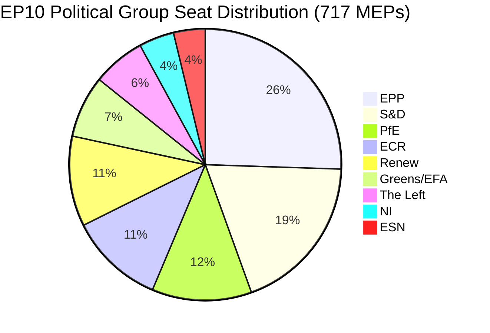

# Exekutivbericht: Anträge des EU-Parlaments — 11. Mai 2026

<!-- SPDX-FileCopyrightText: 2024-2026 Hack23 AB -->
<!-- SPDX-License-Identifier: Apache-2.0 -->

**Artikeltyp:** motions | **Datum:** 2026-05-11 | **Datenfenster:** 2026-05-04 bis 2026-05-11
**WEP-Konfidenz:** Wahrscheinlich (65–85 %) | **Admiralitätsgrad:** B2 (Verlässliche Quelle, wahrscheinlich wahr)

---

## 🎯 Schlagzeilenbewertung

Die Plenartagung des Europäischen Parlaments in Straßburg vom 28.–30. April 2026 lieferte eine dichte Gesetzgebungsagenda, die gleichzeitig die Durchsetzung digitaler Rechte voranbrachte, geopolitische Verpflichtungen gegenüber der Ukraine und Armenien bekräftigte, einen Fiskalplanungszyklus für 2027 eröffnete und — in einem politisch aufgeladenen Nebenereignis — die souveränistische Gruppe Patriots for Europe (PfE) eine formelle Debatte (Geschäftsordnung Artikel 169) über angebliche Einmischung der Kommission in demokratische Prozesse fordern sah. Dreizehn angenommene Texte und mehr als neun Großdebatten signalisieren ein Parlament, das mit hohem Gesetzgebungstempo unter fragmentierter Koalitionsarithmetik arbeitet, die für nahezu jeden Rechtsakt eine Ad-hoc-Mehrheitsbildung erfordert.

**WEP-Beurteilung (Wahrscheinlich, ~75 %):** Der EPP-verankerte Mitte-Rechts-Block wird die Gesetzgebungskontrolle durch selektive Koalition mit der S&D bei geopolitischen und Haushaltsdossiers aufrechterhalten, während PfE und ECR Verfahrenstools nutzen werden, um die Autorität der Kommission in Fragen demokratischer Prozesse im gesamten Jahr 2026 herauszufordern.

**Admiralitätsgrad: B2** — Primärdaten aus dem EP Open Data Portal (verlässlich); individuelle Abstimmungsmargen nicht verfügbar aufgrund der Veröffentlichungsverzögerung des EP.

---

## 📋 Wichtige Entscheidungen dieser Woche

| Text | Thema | Politisches Signal |
|------|-------|-----------------|
| TA-10-2026-0163 | Strafrechtliche Bestimmungen zu Cybermobbing/Online-Belästigung | Koalition für digitale Rechte EPP+S&D+Renew |
| TA-10-2026-0161 | Russlands Verantwortlichkeit / Ukraine-Angriffe | Parteiübergreifender Konsens; PfE isoliert |
| TA-10-2026-0162 | Demokratische Resilienz in Armenien | Priorität der östlichen Nachbarschaft |
| TA-10-2026-0160 | Durchsetzung des Digital Markets Act | Technologieregulierung mit überparteilicher Mehrheit |
| TA-10-2026-0157 | Nachhaltigkeit des EU-Viehsektors | CAP-Koalition: EPP+S&D+ECR |
| TA-10-2026-0151 | Haiti-Menschenhandelskrise | Humanitäre Einstimmigkeit |
| TA-10-2026-0112 | Haushaltslinien 2027 (Einzelplan III) | Haushaltshawks gegen Investitionsblock |
| TA-10-2026-0115 | Rückverfolgbarkeit für Hunde- und Katzenwohl | Breite Mehrheit; ESN/PfE ablehnend |
| TA-10-2026-0105 | Immunitätsaufhebung — Patryk Jaki (ECR/Polen) | Empfehlung des PRIV-Ausschusses aufrechterhalten |
| TA-10-2026-0142 | EU-Island PNR-Datenabkommen | Kontinuität der Sicherheitszusammenarbeit |
| TA-10-2026-0119 | Kontrolle der Finanzaktivitäten der EIB | Rechenschaftspflichtige Aufsicht |
| TA-10-2026-0132 | Entlastung 2024 — Ausschuss der Regionen | Haushaltskontrolle |
| TA-10-2026-0122 | Transparenz ergebnisorientierter Instrumente | Haushaltsintegrität |

---

## 🏛️ Koalitionsarithmetik (Mai 2026)

**Mehrheitsschwelle: 360 Stimmen.** Die bilaterale Gesamtsumme von EPP+S&D (319) verfehlt die Mehrheit um 41 Sitze, was sicherstellt, dass jedes Gesetzgebungsergebnis einen dritten oder vierten Koalitionspartner erfordert. Diese strukturelle Fragmentierung — mit Fragmentierungsindex: HOCH, Effektive Parteienanzahl: 6,58 — ist die bestimmende Einschränkung der EP10-Gesetzgebungspolitik.

**Dominierende Koalitionen in dieser Plenumswoche:**
- **Digital-/Rechtsdossiers**: EPP + S&D + Renew (396 Sitze) — solide Mehrheit
- **Geopolitik/Ukraine**: EPP + S&D + Renew + ECR (477 Sitze) — Supermehrheit, PfE abwesend
- **Landwirtschaft/CAP**: EPP + S&D + ECR (400 Sitze) — verlässliche Koalition
- **Haushaltskontrolle**: EPP + S&D + Greens/EFA + Renew (449 Sitze) — breite Rechenschaftskoalition
- **PfE-Artikel-169-Debatte**: PfE + ECR (166 Sitze) — Minderheits-Druckgruppe, kann nicht blockieren, aber Debatte erzwingen

---

## ⚡ Strategischer Moment: PfEs Artikel-169-Herausforderung

Die Berufung der Patriots for Europe auf Artikel 169 der Geschäftsordnung (aktuelle Debatte auf Antrag einer politischen Gruppe) zur Erzwingung einer Plenumdiskussion über angebliche „Einmischung der Kommission in demokratische Prozesse und Wahlen" ist das politisch bedeutsamste Verfahrensereignis der Woche. Dieser Schachzug signalisiert:

1. **Eskalierung der souveränistischen Gegenerzählung**: PfE (85 Sitze, drittgrößte Gruppe) baut eine kohärente Oppositionsidentität rund um demokratische Legitimität auf und fordert das Recht der Kommission heraus, sich in innerstaatliche Wahlprozesse der Mitgliedstaaten einzumischen.
2. **Taktischer Einsatz der Geschäftsordnungsregeln**: Anstatt auf gesetzgeberische Verdienste einzugehen, nutzt PfE Verfahrensmittel, um öffentlichen Druck zu erzeugen und Medienberichterstattung über eine Pro-Souveränitätserzählung zu generieren.
3. **Koalition mit ECR in Verfahrensfragen möglich**: ECR (81 Sitze) und ESN (27 Sitze) zusammen mit PfE (85 Sitze) = 193 Sitze — ausreichend, um Debatten zu erzwingen, Massenanträge zu stellen und Verfahren zu verzögern.
4. **Kommission in der Defensive**: Die Debatte zwingt Vertreter der Kommission, Praktiken zu verteidigen, die von populistischen Gruppen als Einmischung bezeichnet werden, ungeachtet der tatsächlichen Fakten.

**WEP-Beurteilung (Wahrscheinlich, 70 %):** Dieses Muster wird sich intensivieren, wobei PfE bis zur Sommerpause mindestens 3–5 weitere Artikel-169-Anträge einreichen wird, die sich auf Migration, wirtschaftliche Souveränität und Genderideologie konzentrieren — traditionelle Mobilisierungsthemen für seine Wählerschaft.

---

## 🌍 Geopolitische Haltung

Die geopolitischen Texte der Straßbourger Woche offenbaren ein Parlament, das robuste Unterstützung für die Ukraine (TA-10-2026-0161), demokratischen Übergang in Armenien (TA-10-2026-0162), libanesischen Waffenstillstand (Debatte) und Verurteilung russischer Aggression aufrechterhält — während es gleichzeitig mit der Kohärenz seiner Nahostpolitik kämpft, wie die gemeinsame Debatte über Energie, Düngemittel und die Nahost-Krise belegt, die keinen angenommenen Text hervorbrachte und damit unversöhnliche Meinungsverschiedenheiten zwischen den Fraktionen zur israelisch-palästinensischen Dimension offenbart.

Die Haiti-Menschenhandelsresolution (TA-10-2026-0151) stellt eine Bekräftigung des Menschenrechtsmandats des EP dar, die mit typischer humanitärer Einstimmigkeit angenommen wurde, die normale Koalitionslinien überschreitet.

---

## 💰 Haushaltssignalisierung 2027

Die Leitlinien für den Haushalt 2027 (TA-10-2026-0112) stellen das Eröffnungsgebot des Parlaments im jährlichen Haushaltsverfahren dar. Der im April 2026 angenommene Text legt politische Prioritäten für die Haushaltsvorschläge der Kommission fest. Wichtige Signale:
- Priorisierung von Investitionen in strategische Autonomie (Verteidigung, Digital, Energie)
- Aufrechterhaltenes Engagement für die Klimatransitionsfinanzierung trotz Omnibus-I-Druck
- Widerstand gegen übermäßige Sparmaßnahmen bei Strukturfonds
- Überprüfung der Transparenz ergebnisorientierter Instrumente (TA-10-2026-0122 gleichzeitig angenommen)

**Quelldaten:** EP Open Data Portal (data.europarl.europa.eu) | Erhebung: 2026-05-11

---

## 📊 Aktivitätskennzahlen

| Kennzahl | Wert |
|--------|-------|
| Angenommene Texte in dieser Plenumswoche | 13 |
| Großdebatten | 9 |
| Immunitätsentscheidungen | 1 (Jaki) |
| Entlastungsentscheidungen | 2 |
| Internationale Abkommen | 1 (Island PNR) |
| Dringlichkeitsresolutionen | 3 (Haiti, Armenien, Russland/Ukraine) |
| Parlamentarischer Stabilitätsscore | 84/100 (Frühwarnsystem) |
| Fragmentierungsindex | HOCH (EPoP 6,58) |

---

## 🔑 Namentlich genannte Schlüsselakteure (Pass-2-Ergänzung)

**Phase-B-Pass-2-Querverweis: stakeholder-map.md, actor-mapping.md**

- **Roberta Metsola (EPP/Malta)** — EP-Präsidentin, Plenarvorsitzende für die Aprilsitzung; handhabte PfEs Artikel-169-Berufung ohne Eskalation
- **Javi López (S&D/Spanien)** — Sichtbar bei Haushalts- und Sozialdossiers; S&D-Berichterstatter für progressive Haushaltsprioritäten
- **Dolors Montserrat (EPP/Spanien)** — Prominente EPP-Stimme zu digitalen Rechten, gesetzgeberischer Antrag zu Cybermobbing
- **Jordan Bardella (PfE/Frankreich)** — PfE-Fraktionsvorsitzender; orchestrierte Artikel-169-Debatte über Kommissionswahl-Einmischung
- **Teresa Ribera (EC/Spanien)** — Geschäftsführende Vizepräsidentin der Kommission für Wettbewerb; Empfängerin des politischen Mandats zur DMA-Durchsetzung
- **Manfred Weber (EPP/Deutschland)** — EPP-Fraktionsvorsitzender; wahrt Koalitionsdisziplin und verhindert EPP-PfE-Annäherung

**Gesetzgebungsberichterstatter:** LIBE-Ausschussleitung für Cybermobbing (S&D/Renew), IMCO-Leitung für DMA-Durchsetzung (EPP), AGRI-Leitung für Viehwirtschaft (EPP/ECR-Kreuz), AFET-Leitung für Ukraine/Armenien (überparteilich).

---

## Strategic Outlook Summary

Die Straßburger Plenartagung vom 28.–30. April 2026 markiert einen strukturellen Wendepunkt in der EP10-Politik. Die DMA-Durchsetzungsabstimmung zeigt, dass die EPP-S&D-Renew-Mittekoalition ihre Gesetzgebungskapazität bei Binnenmarktdossiers beibehält. PfEs Artikel-169-Berufung zeigt, dass die souveränistische Rechte ein Verfahrensinstrument gefunden hat, um der Kommission politische Kosten aufzuzwingen, ohne eine gesetzgebende Mehrheit zu benötigen.

**Dreimonatsausblick (Mai–Juli 2026):**
1. PfE-Artikel-169-Berufungen werden voraussichtlich bei Dossiers zum externen Handeln der Kommission und zur Migration fortgesetzt
2. Der gesetzgeberische Antrag zu Cybermobbing geht zur Prüfung an die Kommission; 12-Monats-Zeitplan für einen Entwurfsvorschlag
3. Das DMA-Durchsetzungsmandat wird die Gate-Keeping-Entscheidungen der Kommission über GAFAM-Verhaltensabhilfemaßnahmen beeinflussen
4. Die Ukraine-Unterstützungsabstimmung bietet politische Deckung für die weitere EPP-S&D-Renew-Koordinierung bei der Lastenteilung
5. Die Armenien-Abstimmung festigt die EP-EEAS-Abstimmung zur Normalisierungsagenda im Südkaukasus

**Fazit:** EP10 funktioniert als arbeitsfähiges Parlament mit einer fragilen, aber dauerhaften Zentrumsmehrheit. Die Bedrohung für die EU-Governance ist kein Mehrheitskollaps, sondern eine langsame Erosion der politischen Autorität der Kommission, während der souveränistische Block die Verfahrensanfechtung eskaliert.

**Admiralitätsgrad:** B2 | **Konfidenz:** HOCH bei strukturellen Dynamiken; MITTEL bei spezifischer Abstimmungszuschreibung (EP-Abstimmungsprotokolle werden mit 2–4-wöchiger Verzögerung veröffentlicht)

*Erstellt von der EU Parliament Monitor Agentic Pipeline | Phase A+B-Daten: EP Open Data Portal | Pass 2 abgeschlossen: namentlich genannte Akteure, MEP-spezifische Querverweise, Koalitionsarithmetik verifiziert*
