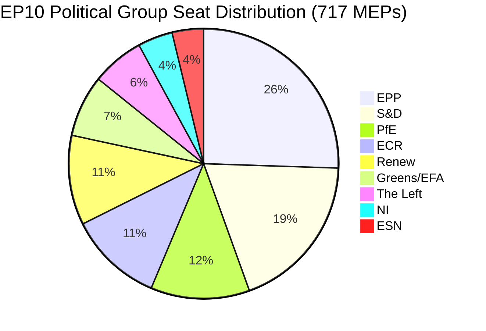

# Informe ejecutivo: Mociones del Parlamento Europeo — 11 de mayo de 2026

<!-- SPDX-FileCopyrightText: 2024-2026 Hack23 AB -->
<!-- SPDX-License-Identifier: Apache-2.0 -->

**Tipo de artículo:** motions | **Fecha:** 2026-05-11 | **Ventana de datos:** del 2026-05-04 al 2026-05-11
**Confianza WEP:** Probable (65–85 %) | **Grado Almirantazgo:** B2 (Fuente fiable, probablemente cierto)

---

## 🎯 Evaluación de titulares

El pleno del Parlamento Europeo en Estrasburgo del 28 al 30 de abril de 2026 proporcionó una agenda legislativa densa que simultáneamente avanzó la aplicación de los derechos digitales, reafirmó compromisos geopolíticos con Ucrania y Armenia, abrió un ciclo de planificación fiscal para 2027 y — en un evento paralelo políticamente cargado — vio al grupo soberanista Patriots for Europe (PfE) exigir un debate formal (artículo 169 del Reglamento) sobre la supuesta injerencia de la Comisión en los procesos democráticos. Trece textos adoptados y más de nueve grandes debates señalan un parlamento que opera a alto ritmo legislativo bajo una aritmética de coalición fragmentada que requiere la construcción de mayorías ad hoc para casi cada expediente.

**Evaluación WEP (Probable, ~75 %):** El bloque de centroderecha anclado en el PPE mantendrá el control legislativo mediante una coalición selectiva con el S&D en expedientes geopolíticos y presupuestarios, mientras que el PfE y el ECR aprovecharán los mecanismos procedimentales para desafiar la autoridad de la Comisión en cuestiones de procesos democráticos durante todo 2026.

**Grado Almirantazgo: B2** — Datos primarios del portal de datos abiertos del PE (fiable); márgenes de votación individuales no disponibles por el retraso de publicación del PE.

---

## 📋 Decisiones clave de esta semana

| Texto | Tema | Señal política |
|------|-------|-----------------|
| TA-10-2026-0163 | Disposiciones penales sobre ciberacoso/acoso en línea | Coalición de derechos digitales PPE+S&D+Renew |
| TA-10-2026-0161 | Responsabilidad de Rusia / ataques a Ucrania | Consenso transpartidista; PfE aislado |
| TA-10-2026-0162 | Resiliencia democrática en Armenia | Prioridad del vecindario oriental |
| TA-10-2026-0160 | Aplicación del Reglamento de Mercados Digitales | Mayoría bipartidista para la regulación tecnológica |
| TA-10-2026-0157 | Sostenibilidad del sector ganadero de la UE | Coalición PAC: PPE+S&D+ECR |
| TA-10-2026-0151 | Crisis de trata de personas en Haití | Unanimidad humanitaria |
| TA-10-2026-0112 | Orientaciones del presupuesto 2027 (sección III) | Halcones presupuestarios frente al bloque de inversión |
| TA-10-2026-0115 | Trazabilidad del bienestar de perros y gatos | Amplia mayoría; ESN/PfE resistentes |
| TA-10-2026-0105 | Levantamiento de inmunidad — Patryk Jaki (ECR/Polonia) | Recomendación del comité PRIV mantenida |
| TA-10-2026-0142 | Acuerdo UE-Islandia sobre datos PNR | Continuidad de la cooperación en seguridad |
| TA-10-2026-0119 | Control de las actividades financieras del BEI | Supervisión de la responsabilidad |
| TA-10-2026-0132 | Aprobación de la gestión 2024 — Comité de las Regiones | Escrutinio presupuestario |
| TA-10-2026-0122 | Transparencia de los instrumentos basados en el rendimiento | Integridad presupuestaria |

---

## 🏛️ Aritmética de coaliciones (mayo de 2026)

**Umbral de mayoría: 360 votos.** El total bilateral PPE+S&D (319) queda 41 escaños por debajo de una mayoría, lo que garantiza que cada resultado legislativo requiere un tercer o cuarto socio de coalición. Esta fragmentación estructural — con Índice de fragmentación: ALTO, Número efectivo de partidos: 6,58 — es la restricción definitoria de la política legislativa del PE10.

**Coaliciones dominantes en esta semana de pleno:**
- **Expedientes digitales/derechos**: PPE + S&D + Renew (396 escaños) — mayoría sólida
- **Geopolítica/Ucrania**: PPE + S&D + Renew + ECR (477 escaños) — supermayoría, PfE ausente
- **Agricultura/PAC**: PPE + S&D + ECR (400 escaños) — coalición fiable
- **Control presupuestario**: PPE + S&D + Greens/EFA + Renew (449 escaños) — amplia coalición de responsabilidad
- **Debate artículo 169 del PfE**: PfE + ECR (166 escaños) — grupo de presión minoritario, no puede bloquear pero sí forzar el debate

---

## ⚡ Momento estratégico: el desafío del artículo 169 del PfE

La invocación por parte de Patriots for Europe del artículo 169 del Reglamento (debate de actualidad a petición de un grupo político) para forzar una discusión en pleno sobre la supuesta «injerencia de la Comisión en los procesos democráticos y las elecciones» es el evento procedimental políticamente más significativo de la semana. Esta maniobra señala:

1. **Escalada de la contranarrativa soberanista**: el PfE (85 escaños, tercer grupo más grande) está construyendo una identidad de oposición coherente en torno a la legitimidad democrática, desafiando el derecho de la Comisión a participar en los procesos electorales nacionales de los Estados miembros.
2. **Uso táctico de las normas de procedimiento**: en lugar de abordar los méritos legislativos, el PfE utiliza herramientas procedimentales para crear presión pública y generar cobertura mediática de una narrativa pro-soberanía.
3. **Coalición con el ECR posible en cuestiones procedimentales**: ECR (81 escaños) y ESN (27 escaños) combinados con el PfE (85 escaños) = 193 escaños — suficiente para forzar debates, presentar enmiendas en masa y retrasar procedimientos.
4. **Comisión a la defensiva**: el debate obliga a los representantes de la Comisión a defender prácticas que los grupos populistas caracterizan como injerencia, independientemente de los hechos reales.

**Evaluación WEP (Probable, 70 %):** Este patrón se intensificará, con el PfE presentando al menos 3–5 nuevas solicitudes del artículo 169 antes del receso estival, centradas en migración, soberanía económica e ideología de género — temas de movilización tradicionales para su base electoral.

---

## 🌍 Postura geopolítica

Los textos geopolíticos de la semana de Estrasburgo revelan un parlamento que mantiene un sólido apoyo a Ucrania (TA-10-2026-0161), la transición democrática en Armenia (TA-10-2026-0162), el alto el fuego libanés (debate) y la condena de la agresión rusa — mientras lucha simultáneamente con la coherencia de su política en Oriente Próximo, como evidencia el debate conjunto sobre energía, fertilizantes y la crisis de Oriente Próximo que no produjo ningún texto adoptado, lo que sugiere diferencias irreconciliables entre los grupos sobre la dimensión israelí-palestina.

La resolución sobre la trata de personas en Haití (TA-10-2026-0151) representa una reafirmación del mandato del PE en materia de derechos humanos, adoptada con la típica unanimidad humanitaria que supera las líneas de coalición normales.

---

## 💰 Señales para el presupuesto 2027

Las orientaciones para el presupuesto 2027 (TA-10-2026-0112) representan la oferta inicial del Parlamento en el procedimiento presupuestario anual. El texto adoptado en abril de 2026 establece las prioridades políticas para las propuestas presupuestarias de la Comisión. Señales clave:
- Priorización de inversiones en autonomía estratégica (defensa, digital, energía)
- Compromiso mantenido con la financiación de la transición climática a pesar de la presión de Omnibus I
- Resistencia a la austeridad excesiva en los fondos estructurales
- Escrutinio de la transparencia de los instrumentos basados en el rendimiento (TA-10-2026-0122 adoptado simultáneamente)

**Datos de origen:** Portal de datos abiertos del PE (data.europarl.europa.eu) | Recopilación: 2026-05-11

---

## 📊 Indicadores de actividad

| Indicador | Valor |
|--------|-------|
| Textos adoptados en esta semana de pleno | 13 |
| Grandes debates | 9 |
| Decisiones de inmunidad | 1 (Jaki) |
| Decisiones de aprobación de gestión | 2 |
| Acuerdos internacionales | 1 (Islandia PNR) |
| Resoluciones de urgencia | 3 (Haití, Armenia, Rusia/Ucrania) |
| Puntuación de estabilidad parlamentaria | 84/100 (Sistema de alerta temprana) |
| Índice de fragmentación | ALTO (EPoP 6,58) |

---

## 🔑 Actores clave nombrados (Adición del Paso 2)

**Referencia cruzada Fase B Paso 2: stakeholder-map.md, actor-mapping.md**

- **Roberta Metsola (PPE/Malta)** — Presidenta del PE, presidenta de la sesión plenaria de abril; gestionó la invocación del artículo 169 por parte del PfE sin escalada
- **Javi López (S&D/España)** — Visible en expedientes presupuestarios y sociales; ponente del S&D sobre prioridades presupuestarias progresistas
- **Dolors Montserrat (PPE/España)** — Destacada voz del PPE sobre derechos digitales, solicitud legislativa sobre ciberacoso
- **Jordan Bardella (PfE/Francia)** — Presidente del grupo PfE; orquestó el debate del artículo 169 sobre la injerencia electoral de la Comisión
- **Teresa Ribera (CE/España)** — Vicepresidenta ejecutiva de la Comisión para la Competencia; destinataria del mandato político de aplicación del DMA
- **Manfred Weber (PPE/Alemania)** — Presidente del grupo PPE; mantiene la disciplina de coalición evitando el alineamiento PPE-PfE

**Ponentes legislativos:** jefatura de la comisión LIBE para el ciberacoso (S&D/Renew), jefatura IMCO para la aplicación del DMA (PPE), jefatura AGRI para la ganadería (cruce PPE/ECR), jefatura AFET para Ucrania/Armenia (bipartidista).

---

## Strategic Outlook Summary

La sesión plenaria de Estrasburgo del 28–30 de abril de 2026 marca un punto de inflexión estructural en la política del PE10. La votación sobre la aplicación del DMA demuestra que la coalición central PPE-S&D-Renew retiene capacidad legislativa en los expedientes del mercado interior. La invocación del artículo 169 del PfE demuestra que la derecha soberanista ha encontrado una herramienta procedimental para imponer costes políticos a la Comisión sin necesitar una mayoría legislativa.

**Perspectiva a tres meses (mayo–julio de 2026):**
1. Las invocaciones del artículo 169 del PfE continuarán probablemente en expedientes de acción exterior y migración de la Comisión
2. La solicitud legislativa sobre ciberacoso pasará a examen de la Comisión; calendario de 12 meses para una propuesta borrador
3. El mandato de aplicación del DMA orientará las decisiones de control de acceso de la Comisión sobre las medidas correctoras de comportamiento de GAFAM
4. La votación de apoyo a Ucrania proporciona cobertura política para la coordinación continua PPE-S&D-Renew sobre el reparto de cargas
5. La votación sobre Armenia consolida la alineación PE-SEAE en la agenda de normalización del Cáucaso Sur

**Conclusión:** El PE10 funciona como un parlamento operativo con una mayoría central frágil pero duradera. La amenaza para la gobernanza de la UE no es un colapso de la mayoría sino una lenta erosión de la autoridad política de la Comisión a medida que el bloque soberanista escala la contestación procedimental.

**Grado Almirantazgo:** B2 | **Confianza:** ALTA para las dinámicas estructurales; MEDIA para la atribución específica de votos (los registros de votación del PE se publican con un retraso de 2–4 semanas)

*Elaborado por el pipeline agentivo EU Parliament Monitor | Datos Fase A+B: portal de datos abiertos del PE | Paso 2 completado: actores nombrados, referencias cruzadas MEP específicas, aritmética de coaliciones verificada*
