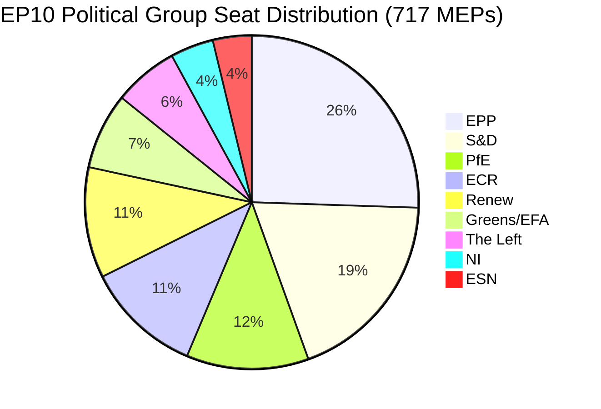

# Toimeenpaneva tiivistelmä: EU-parlamentin aloitteet — 11. toukokuuta 2026

<!-- SPDX-FileCopyrightText: 2024-2026 Hack23 AB -->
<!-- SPDX-License-Identifier: Apache-2.0 -->

**Artikkelityyppi:** motions | **Päivämäärä:** 2026-05-11 | **Tietoikkuna:** 2026-05-04–2026-05-11
**WEP-luottamus:** Todennäköinen (65–85 %) | **Amiraaliluokka:** B2 (Luotettava lähde, todennäköisesti totta)

---

## 🎯 Otsikkoarviointi

Euroopan parlamentin täysistunto Strasbourgissa 28.–30. huhtikuuta 2026 tuotti tiiviin lainsäädäntöohjelman, joka samanaikaisesti edisti digitaalisten oikeuksien täytäntöönpanoa, vahvisti geopoliittisia sitoumuksia Ukrainaa ja Armeniaa kohtaan, avasi finanssisuunnittelun syklin vuodelle 2027 ja — poliittisesti ladatussa sivutapahtumassa — näki suverenistisen Patriots for Europe (PfE) -ryhmän vaativan muodollista keskustelua (työjärjestyksen 169 artikla) komission väitetystä puuttumisesta demokraattisiin prosesseihin. Kolmetoista hyväksyttyä tekstiä ja yli yhdeksän suurta keskustelua viestivät parlamentista, joka toimii korkealla lainsäädäntövauhdilla fragmentoituneessa koalitioaritmetiikassa, joka edellyttää ad hoc -enemmistön rakentamista lähes jokaisessa asiakokonaisuudessa.

**WEP-arviointi (Todennäköinen, ~75 %):** EPP-ankkuroitu keskusta-oikeistolohko ylläpitää lainsäädäntöhallintaa valikoivalla koalitiolla S&D:n kanssa geopoliittisissa ja budjettitiedostoissa, kun taas PfE ja ECR hyödyntävät menettelyllisiä mekanismeja haastamaan komission auktoriteettia demokraattisia prosesseja koskevissa kysymyksissä koko vuoden 2026 ajan.

**Amiraaliluokka: B2** — Ensisijainen data EU-parlamentin avoimesta tietoportaalista (luotettava); yksittäisiä äänestysmarginaleja ei saatavilla EP:n julkaisuViiveen vuoksi.

---

## 📋 Viikon tärkeimmät päätökset

| Teksti | Aihe | Poliittinen signaali |
|------|-------|-----------------|
| TA-10-2026-0163 | Verkkokiusaamisen/onlinehäirinnän rikosoikeudelliset säännökset | Digitaalisten oikeuksien koalitio EPP+S&D+Renew |
| TA-10-2026-0161 | Venäjän vastuullistaminen / Ukraina-hyökkäykset | Poikkipuolueinen konsensus; PfE eristetty |
| TA-10-2026-0162 | Demokraattinen kestävyys Armeniassa | Itäinen naapurustopriorititeetti |
| TA-10-2026-0160 | Digimarkkinasäädöksen täytäntöönpano | Teknologiasääntelyn kaksijakoinen enemmistö |
| TA-10-2026-0157 | EU:n kotieläinsektorin kestävyys | CAP-koalitio: EPP+S&D+ECR |
| TA-10-2026-0151 | Haitin ihmiskauppakriisi | Humanitaarinen yksimielisyys |
| TA-10-2026-0112 | Vuoden 2027 talousarvion suuntaviivat (osasto III) | Budjettihaukat versus investointilohko |
| TA-10-2026-0115 | Koirien ja kissojen hyvinvoinnin jäljitettävyys | Laaja enemmistö; ESN/PfE vastustavia |
| TA-10-2026-0105 | Koskemattomuuden pidättäminen — Patryk Jaki (ECR/Puola) | PRIV-valiokunnan suositus ylläpidetty |
| TA-10-2026-0142 | EU-Islanti PNR-dataa koskeva sopimus | Turvallisuusyhteistyön jatkuvuus |
| TA-10-2026-0119 | EIB:n rahoitustoiminnan valvonta | Vastuullisuusvalvonta |
| TA-10-2026-0132 | Vastuuvapaus 2024 — Alueiden komitea | Budjettiskrutiiniu |
| TA-10-2026-0122 | Tulosperusteisten instrumenttien avoimuus | Budjetti-integriteetti |

---

## 🏛️ Koalitioaritmetiikka (toukokuu 2026)

**Enemmistökynnys: 360 ääntä.** EPP+S&D:n kahdenvälinen kokonaissumma (319) jää 41 paikkaa alle enemmistön, mikä varmistaa, että jokainen lainsäädäntötulos vaatii kolmannen tai neljännen koaliopartnerin. Tämä rakenteellinen pirstoutuminen — Pirstoutumisindeksi: KORKEA, Tehokas puolueiden lukumäärä: 6,58 — on EP10:n lainsäädäntöpolitiikan määräävä rajoitus.

**Hallitsevat koalitiot tällä täysistuntoviikolla:**
- **Digitaaliset/oikeusasiat**: EPP + S&D + Renew (396 paikkaa) — vahva enemmistö
- **Geopolitiikka/Ukraina**: EPP + S&D + Renew + ECR (477 paikkaa) — superenemmistö, PfE poissa
- **Maatalous/CAP**: EPP + S&D + ECR (400 paikkaa) — luotettava koalitio
- **Budjettivalvonta**: EPP + S&D + Greens/EFA + Renew (449 paikkaa) — laaja vastuullisuuskoalitio
- **PfE:n sääntö 169 -debatti**: PfE + ECR (166 paikkaa) — vähemmistöpaineistoryhmä, ei voi estää mutta voi pakottaa debaatin

---

## ⚡ Strateginen hetki: PfE:n sääntö 169 -haaste

Patriots for Europen vetoaminen työjärjestyksen 169 artiklaan (ajankohtainen keskustelu poliittisen ryhmän pyynnöstä) täysistuntokeskustelun pakottamiseksi väitetystä "komission puuttumisesta demokraattisiin prosesseihin ja vaaleihin" on viikon poliittisesti merkittävin menettelytapahtuma. Tämä siirto viestii:

1. **Suverenistisen vastakertomuksen eskalointi**: PfE (85 paikkaa, kolmanneksi suurin ryhmä) rakentaa yhtenäistä oppositioidentiteettiä demokraattisen legitimiteetin ympärille haastamalla komission oikeuden puuttua jäsenvaltioiden kotimaisiin vaaliprosesseihin.
2. **Taktinen työjärjestyksen sääntöjen hyödyntäminen**: Sen sijaan, että PfE sitoutuisi lainsäädännöllisiin ansioihin, se käyttää menettelyllisiä välineitä luodakseen julkista painetta ja saadakseen medianäkyvyyttä pro-suvereniteetti-kertomuselle.
3. **Koalitio ECR:n kanssa mahdollinen menettelykysymyksissä**: ECR (81 paikkaa) ja ESN (27 paikkaa) yhdistettynä PfE:hen (85 paikkaa) = 193 paikkaa — riittävästi pakottaakseen debatteja, jättääkseen massiivisia tarkistuksia ja viivyttääkseen menettelyjä.
4. **Komissio puolustusasemassa**: Debatti pakottaa komission edustajat puolustamaan käytäntöjä, joita populistiset ryhmät luonnehtivat puuttumiseksi tosiasiallisista olosuhteista riippumatta.

**WEP-arviointi (Todennäköinen, 70 %):** Tämä malli voimistuu, PfE:n jättäessä vähintään 3–5 lisää 169 artiklan pyyntöä ennen kesälomaa, keskittyen maahanmuuttoon, taloudelliseen suvereniteettiin ja sukupuoliaatteeseen — perinteisiin mobilisointikysymyksiin kannattajakunnalleen.

---

## 🌍 Geopoliittinen asemointi

Strasbourgin viikon geopoliittiset tekstit paljastavat parlamentin, joka ylläpitää vahvaa tukea Ukrainalle (TA-10-2026-0161), demokraattiselle siirtymälle Armeniassa (TA-10-2026-0162), Libanonin tulitauolle (keskustelu) ja Venäjän aggression tuomitsemiselle — kampaillen samalla Lähi-idän politiikan johdonmukaisuuden kanssa, kuten käy ilmi energiaa, lannoitteita ja Lähi-idän kriisiä koskevasta yhteisestä keskustelusta, joka ei tuottanut hyväksyttyä tekstiä, mikä viittaa yhteensopimattomiin näkemyseroihin ryhmien välillä israelilais-palestiinalaisen ulottuvuuden suhteen.

Haitin ihmiskaupparesoluutio (TA-10-2026-0151) edustaa EU-parlamentin ihmisoikeusvaltuuden vahvistamista, hyväksyttynä tyypillisellä humanitaarisella yksimielisyydellä, joka ylittää normaalit koalitiorajat.

---

## 💰 Budjetti-2027-signalointi

Vuoden 2027 talousarvion suuntaviivat (TA-10-2026-0112) edustavat parlamentin avauspuheenvuoroa vuotuisessa talousarviomenettelyssä. Huhtikuussa 2026 hyväksytty teksti asettaa poliittiset prioriteetit komission budjettiehostuksille. Tärkeimmät signaalit:
- Strategisen autonomian investointien priorisointi (puolustus, digitaalinen, energia)
- Ilmastotransformaatiorahoituksen ylläpidetty sitoutuminen Omnibus I -paineesta huolimatta
- Vastustus liialliselle säästöpolitiikalle rakennerahastoissa
- Tulosperusteisten instrumenttien avoimuuden tarkastelu (TA-10-2026-0122 hyväksyttiin samanaikaisesti)

**Lähdedata:** EP:n avoin tietoportaali (data.europarl.europa.eu) | Kokoelma: 2026-05-11

---

## 📊 Toimintamittarit

| Mittari | Arvo |
|--------|-------|
| Hyväksytyt tekstit tällä täysistuntoviikolla | 13 |
| Suuria debatteja | 9 |
| Koskemattomuuspäätökset | 1 (Jaki) |
| Vastuuvapauspäätökset | 2 |
| Kansainväliset sopimukset | 1 (Islanti PNR) |
| Kiireelliset päätöslauselmat | 3 (Haiti, Armenia, Venäjä/Ukraina) |
| Parlamentin vakauspisteet | 84/100 (varhainen varoitusjärjestelmä) |
| Pirstoutumisindeksi | KORKEA (EPoP 6,58) |

---

## 🔑 Nimetyt avaintoimijat (Pass 2 -lisäys)

**Vaihe B Pass 2 -ristiviitta: stakeholder-map.md, actor-mapping.md**

- **Roberta Metsola (EPP/Malta)** — EP:n puhemies, huhtikuun istunnon täysistuntokoordinaattori; käsitteli PfE:n sääntö 169 -vetoamisen ilman eskalaatiota
- **Javi López (S&D/Espanja)** — Näkyvä budjetti- ja sosiaaliasioissa; S&D:n esittelijä progressiivisissa budjettiprioriteeteissa
- **Dolors Montserrat (EPP/Espanja)** — Näkyvä EPP-ääni digitaalisissa oikeuksissa, verkkokiusaamisen lainsäädäntöpyyntö
- **Jordan Bardella (PfE/Ranska)** — PfE:n ryhmänjohtaja; järjesti sääntö 169 -debatin komission vaalipuuttumisesta
- **Teresa Ribera (EC/Espanja)** — Komission kilpailusta vastaava varapuheenjohtaja; DMA-täytäntöönpanon poliittisen mandaatin vastaanottaja
- **Manfred Weber (EPP/Saksa)** — EPP:n ryhmänpuheenjohtaja; ylläpitää koalitioitsekuria estäen EPP-PfE-yhteensovittamisen

**Lainsäädäntöesittelijät:** LIBE-valiokunnan vetäjä verkkokiusaamisessa (S&D/Renew), IMCO-vetäjä DMA-täytäntöönpanossa (EPP), AGRI-vetäjä kotieläimissä (EPP/ECR-risteys), AFET-vetäjä Ukrainalle/Armenialle (kaksipuolueinen).

---

## Strategic Outlook Summary

Strasbourgin täysistunto 28.–30. huhtikuuta 2026 merkitsee rakenteellista käännekohtaa EP10-politiikassa. DMA-täytäntöönpanoäänestys osoittaa, että EPP-S&D-Renew-keskeiskoalitio säilyttää lainsäädäntökapasiteettinsa sisämarkkinatiedostoissa. PfE:n sääntö 169 -vetoaminen osoittaa, että suverenistinen oikeisto on löytänyt menettelyllisen välineen, jolla se voi asettaa komissiolle poliittisia kustannuksia vaatimatta lainsäädännöllistä enemmistöä.

**Kolmen kuukauden näkymät (toukokuu–heinäkuu 2026):**
1. PfE:n sääntö 169 -vetoamiset jatkuvat todennäköisesti komission ulkoisia toimia ja maahanmuuttoasioita koskevissa tiedostoissa
2. Verkkokiusaamista koskeva lainsäädäntöpyyntö siirtyy komission käsittelyyn; 12 kuukauden aikataulu luonnosehdotukselle
3. DMA-täytäntöönpanon mandaatti ohjaa komission portinvartijapäätöksiä GAFAM:n käyttäytymiskorjauksissa
4. Ukrainan tuki-äänestys tarjoaa poliittista suojaa jatkuvalle EPP-S&D-Renew-koordinoinnille taakanjaoissa
5. Armenian äänestys vahvistaa EP-EEAS-yhteensovittamista Etelä-Kaukasuksen normalisoitumisagendassa

**Johtopäätös:** EP10 toimii toimivana parlamenttina, jolla on hauras mutta kestävä keskeinen enemmistö. Uhka EU:n hallinnalle ei ole enemmistön romahtaminen vaan komission poliittisen auktoriteetin hidas eroosio, kun suverenistinen lohko eskaloituu menettelytavalliseen kiistanalaistamiseen.

**Amiraaliluokka:** B2 | **Luottamus:** KORKEA rakenteellisille dynamiikoille; KESKISUURI tietylle äänestysjakaumalle (EP:n äänestyspöytäkirjat julkaistaan 2–4 viikon viiveellä)

*Laatinut EU Parliament Monitor agentic pipeline | Vaihe A+B-data: EP:n avoin tietoportaali | Pass 2 valmis: nimetyt toimijat, MEP-spesifiset ristiviiitat, koalitioaritmetiikka vahvistettu*
