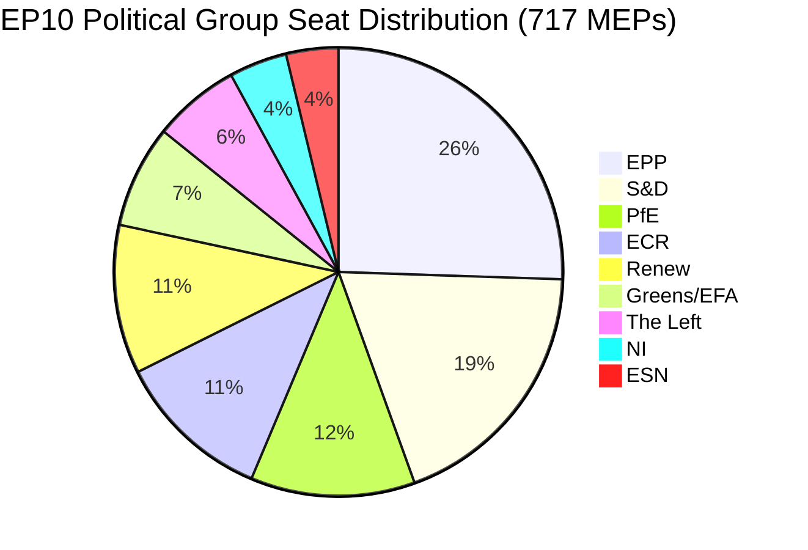

# Synthèse exécutive : Motions du Parlement européen — 11 mai 2026

<!-- SPDX-FileCopyrightText: 2024-2026 Hack23 AB -->
<!-- SPDX-License-Identifier: Apache-2.0 -->

**Type d'article :** motions | **Date :** 2026-05-11 | **Fenêtre de données :** du 2026-05-04 au 2026-05-11
**Confiance WEP :** Probable (65–85 %) | **Grade Amirauté :** B2 (Source fiable, probablement vrai)

---

## 🎯 Évaluation des titres

La session plénière du Parlement européen à Strasbourg du 28 au 30 avril 2026 a produit un agenda législatif dense qui, simultanément, a fait avancer l'application des droits numériques, réaffirmé les engagements géopolitiques envers l'Ukraine et l'Arménie, ouvert un cycle de planification budgétaire pour 2027 et — dans un événement parallèle politiquement chargé — a vu le groupe souverainiste Patriots for Europe (PfE) exiger un débat formel (article 169 du règlement intérieur) sur l'ingérence présumée de la Commission dans les processus démocratiques. Treize textes adoptés et plus de neuf grands débats signalent un parlement fonctionnant à un rythme législatif élevé sous une arithmétique de coalition fragmentée qui exige une construction de majorité ad hoc pour presque chaque dossier.

**Évaluation WEP (Probable, ~75 %) :** Le bloc centre-droit ancré autour du PPE maintiendra le contrôle législatif grâce à une coalition sélective avec le S&D sur les dossiers géopolitiques et budgétaires, tandis que le PfE et l'ECR exploiteront les mécanismes procéduraux pour contester l'autorité de la Commission sur les questions de processus démocratiques tout au long de 2026.

**Grade Amirauté : B2** — Données primaires du portail de données ouvertes du PE (fiable) ; marges de vote individuelles indisponibles en raison du délai de publication du PE.

---

## 📋 Décisions clés de la semaine

| Texte | Sujet | Signal politique |
|------|-------|-----------------|
| TA-10-2026-0163 | Dispositions pénales relatives au cyberharcèlement/harcèlement en ligne | Coalition pour les droits numériques PPE+S&D+Renew |
| TA-10-2026-0161 | Responsabilité de la Russie / attaques contre l'Ukraine | Consensus transpartisan ; PfE isolé |
| TA-10-2026-0162 | Résilience démocratique en Arménie | Priorité du voisinage oriental |
| TA-10-2026-0160 | Application du règlement sur les marchés numériques | Majorité bipartisane pour la régulation technologique |
| TA-10-2026-0157 | Durabilité du secteur de l'élevage de l'UE | Coalition PAC : PPE+S&D+ECR |
| TA-10-2026-0151 | Crise de traite des êtres humains en Haïti | Unanimité humanitaire |
| TA-10-2026-0112 | Orientations du budget 2027 (section III) | Faucons budgétaires contre bloc d'investissement |
| TA-10-2026-0115 | Traçabilité du bien-être des chiens et chats | Large majorité ; ESN/PfE résistants |
| TA-10-2026-0105 | Levée d'immunité — Patryk Jaki (ECR/Pologne) | Recommandation de la commission PRIV maintenue |
| TA-10-2026-0142 | Accord UE-Islande sur les données PNR | Continuité de la coopération sécuritaire |
| TA-10-2026-0119 | Contrôle des activités financières de la BEI | Contrôle de la responsabilité |
| TA-10-2026-0132 | Décharge 2024 — Comité des régions | Contrôle budgétaire |
| TA-10-2026-0122 | Transparence des instruments fondés sur la performance | Intégrité budgétaire |

---

## 🏛️ Arithmétique des coalitions (mai 2026)

**Seuil de majorité : 360 voix.** Le total bilatéral PPE+S&D (319) est inférieur de 41 sièges à une majorité, ce qui garantit que chaque résultat législatif nécessite un troisième ou quatrième partenaire de coalition. Cette fragmentation structurelle — avec Indice de fragmentation : ÉLEVÉ, Nombre effectif de partis : 6,58 — est la contrainte définissante de la politique législative du PE10.

**Coalitions dominantes lors de cette semaine de plénière :**
- **Dossiers numériques/droits** : PPE + S&D + Renew (396 sièges) — majorité solide
- **Géopolitique/Ukraine** : PPE + S&D + Renew + ECR (477 sièges) — supermajorité, PfE absent
- **Agriculture/PAC** : PPE + S&D + ECR (400 sièges) — coalition fiable
- **Contrôle budgétaire** : PPE + S&D + Greens/EFA + Renew (449 sièges) — large coalition de responsabilité
- **Débat article 169 du PfE** : PfE + ECR (166 sièges) — groupe de pression minoritaire, ne peut pas bloquer mais peut forcer le débat

---

## ⚡ Moment stratégique : le défi de l'article 169 du PfE

Le recours par Patriots for Europe à l'article 169 du règlement intérieur (débat d'actualité à la demande d'un groupe politique) pour forcer une discussion plénière sur la prétendue « ingérence de la Commission dans les processus démocratiques et les élections » est l'événement procédural politiquement le plus significatif de la semaine. Ce mouvement signale :

1. **Escalade du contre-récit souverainiste** : le PfE (85 sièges, troisième plus grand groupe) construit une identité d'opposition cohérente autour de la légitimité démocratique, contestant le droit de la Commission à s'immiscer dans les processus électoraux nationaux des États membres.
2. **Utilisation tactique des règles de procédure** : plutôt que de s'engager sur le fond législatif, le PfE utilise des outils procéduraux pour créer une pression publique et générer une couverture médiatique d'un récit pro-souveraineté.
3. **Coalition avec l'ECR possible sur les questions procédurales** : ECR (81 sièges) et ESN (27 sièges) combinés avec le PfE (85 sièges) = 193 sièges — suffisant pour forcer des débats, déposer des amendements en masse et retarder les procédures.
4. **Commission sur la défensive** : le débat oblige les représentants de la Commission à défendre des pratiques que les groupes populistes qualifient d'ingérence, indépendamment des faits réels.

**Évaluation WEP (Probable, 70 %) :** Ce schéma va s'intensifier, avec le PfE déposant au moins 3–5 nouvelles demandes d'article 169 avant la pause estivale, se concentrant sur la migration, la souveraineté économique et l'idéologie du genre — thèmes de mobilisation traditionnels pour sa base électorale.

---

## 🌍 Posture géopolitique

Les textes géopolitiques de la semaine de Strasbourg révèlent un parlement maintenant un soutien robuste à l'Ukraine (TA-10-2026-0161), à la transition démocratique en Arménie (TA-10-2026-0162), au cessez-le-feu libanais (débat) et à la condamnation de l'agression russe — tout en luttant pour la cohérence de sa politique au Moyen-Orient, comme en témoigne le débat conjoint sur l'énergie, les engrais et la crise au Moyen-Orient qui n'a produit aucun texte adopté, suggérant des divergences irréconciliables entre les groupes sur la dimension israélo-palestinienne.

La résolution sur la traite des personnes en Haïti (TA-10-2026-0151) représente une réaffirmation du mandat du PE en matière de droits de l'homme, adoptée avec une unanimité humanitaire typique qui dépasse les lignes de coalition normales.

---

## 💰 Signaux pour le budget 2027

Les orientations du budget 2027 (TA-10-2026-0112) constituent l'offre d'ouverture du Parlement dans la procédure budgétaire annuelle. Le texte adopté en avril 2026 établit les priorités politiques pour les propositions budgétaires de la Commission. Signaux clés :
- Priorisation des investissements dans l'autonomie stratégique (défense, numérique, énergie)
- Engagement maintenu en faveur du financement de la transition climatique malgré la pression d'Omnibus I
- Résistance à l'austérité excessive dans les fonds structurels
- Examen de la transparence des instruments fondés sur la performance (TA-10-2026-0122 adopté simultanément)

**Données sources :** Portail de données ouvertes du PE (data.europarl.europa.eu) | Collecte : 2026-05-11

---

## 📊 Indicateurs d'activité

| Indicateur | Valeur |
|--------|-------|
| Textes adoptés lors de cette semaine de plénière | 13 |
| Grands débats | 9 |
| Décisions d'immunité | 1 (Jaki) |
| Décisions de décharge | 2 |
| Accords internationaux | 1 (Islande PNR) |
| Résolutions d'urgence | 3 (Haïti, Arménie, Russie/Ukraine) |
| Score de stabilité parlementaire | 84/100 (Système d'alerte précoce) |
| Indice de fragmentation | ÉLEVÉ (EPoP 6,58) |

---

## 🔑 Acteurs clés nommément cités (Ajout Pass 2)

**Référence croisée Phase B Pass 2 : stakeholder-map.md, actor-mapping.md**

- **Roberta Metsola (PPE/Malte)** — Présidente du PE, présidente de séance plénière pour la session d'avril ; a géré le recours à l'article 169 du PfE sans escalade
- **Javi López (S&D/Espagne)** — Visible dans les dossiers budgétaires et sociaux ; rapporteur S&D sur les priorités budgétaires progressistes
- **Dolors Montserrat (PPE/Espagne)** — Voix PPE de premier plan sur les droits numériques, demande législative sur le cyberharcèlement
- **Jordan Bardella (PfE/France)** — Président du groupe PfE ; a orchestré le débat article 169 sur l'ingérence électorale de la Commission
- **Teresa Ribera (CE/Espagne)** — Vice-présidente exécutive de la Commission pour la concurrence ; destinataire du mandat politique d'application du DMA
- **Manfred Weber (PPE/Allemagne)** — Président du groupe PPE ; maintient la discipline de coalition empêchant l'alignement PPE-PfE

**Rapporteurs législatifs :** chef de la commission LIBE pour le cyberharcèlement (S&D/Renew), chef IMCO pour l'application du DMA (PPE), chef AGRI pour l'élevage (PPE/ECR croisé), chef AFET pour l'Ukraine/Arménie (bipartisan).

---

## Strategic Outlook Summary

La session plénière de Strasbourg du 28–30 avril 2026 marque un point d'inflexion structurel dans la politique du PE10. Le vote sur l'application du DMA démontre que la coalition centrale PPE-S&D-Renew conserve sa capacité législative sur les dossiers du marché intérieur. Le recours à l'article 169 du PfE démontre que la droite souverainiste a trouvé un outil procédural pour imposer des coûts politiques à la Commission sans nécessiter de majorité législative.

**Perspectives à trois mois (mai–juillet 2026) :**
1. Les recours à l'article 169 du PfE continueront probablement sur les dossiers d'action externe et de migration de la Commission
2. La demande législative sur le cyberharcèlement sera transmise à la Commission pour examen ; calendrier de 12 mois pour un projet de proposition
3. Le mandat d'application du DMA influencera les décisions de garde-barrière de la Commission sur les mesures correctives comportementales de GAFAM
4. Le vote de soutien à l'Ukraine offre une couverture politique pour la coordination continue PPE-S&D-Renew sur le partage du fardeau
5. Le vote sur l'Arménie consolide l'alignement PE-SEAE sur l'agenda de normalisation du Caucase du Sud

**Conclusion :** Le PE10 fonctionne comme un parlement opérationnel avec une majorité centrale fragile mais durable. La menace pour la gouvernance de l'UE n'est pas un effondrement de la majorité mais une lente érosion de l'autorité politique de la Commission à mesure que le bloc souverainiste escalade la contestation procédurale.

**Grade Amirauté :** B2 | **Confiance :** ÉLEVÉE sur les dynamiques structurelles ; MOYENNE sur l'attribution spécifique des votes (les registres de vote du PE sont publiés avec un délai de 2–4 semaines)

*Préparé par le pipeline agentique EU Parliament Monitor | Données Phase A+B : portail de données ouvertes du PE | Pass 2 terminé : acteurs nommément cités, références croisées MEP spécifiques, arithmétique des coalitions vérifiée*
