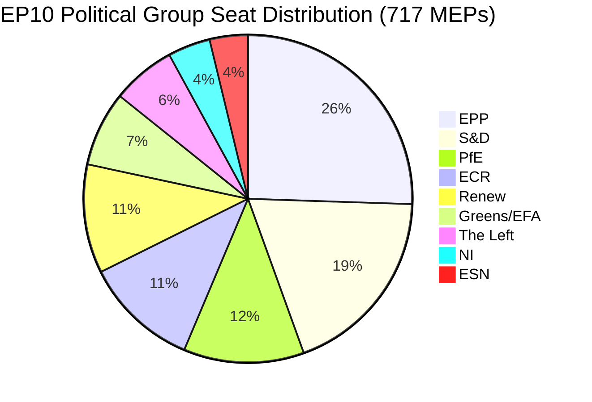

# תדריך מנהלים: הצעות הפרלמנט האירופי — 11 במאי 2026

<!-- SPDX-FileCopyrightText: 2024-2026 Hack23 AB -->
<!-- SPDX-License-Identifier: Apache-2.0 -->

**סוג המאמר:** motions | **תאריך:** 2026-05-11 | **חלון הנתונים:** 2026-05-04 עד 2026-05-11
**אמינות WEP:** סביר (65–85 %) | **דרגת אדמירליות:** B2 (מקור אמין, כנראה נכון)

---

## 🎯 הערכת כותרות

מליאת הפרלמנט האירופי בשטרסבורג בין ה-28 ל-30 באפריל 2026 הניבה סדר יום חקיקתי צפוף שקידם בו-זמנית את אכיפת הזכויות הדיגיטליות, חידש את ההתחייבויות הגיאופוליטיות כלפי אוקראינה וארמניה, פתח מחזור תכנון פיסקלי לשנת 2027 ו— באירוע לוואי מוטען פוליטית — ראה את קבוצת "הפטריוטים לאירופה" (PfE) בעלת האוריינטציה הסובראניסטית דורשת דיון רשמי (סעיף 169 לתקנון) בדבר ההתערבות הנטענת של הנציבות בתהליכים דמוקרטיים. שלושה עשר טקסטים שאומצו ויותר מתשעה דיונים גדולים מסמנים פרלמנט הפועל בקצב חקיקתי גבוה תחת אריתמטיקה קואליציונית מפוצלת המחייבת בניית רוב אד-הוק לכמעט כל תיק.

**הערכת WEP (סביר, ~75 %):** הגוש ימין-המרכז המעוגן ב-EPP ישמור על שליטה חקיקתית באמצעות קואליציה סלקטיבית עם S&D בתיקים גיאופוליטיים ותקציביים, בעוד PfE וECR יסתמכו על מנגנונים נוהליים לאתגר את סמכות הנציבות בשאלות הנוגעות לתהליכים דמוקרטיים לאורך שנת 2026.

**דרגת אדמירליות: B2** — נתונים ראשוניים מפורטל הנתונים הפתוח של הפרלמנט האירופי (אמין); שולי הצבעה בודדים אינם זמינים עקב עיכוב הפרסום של הפרלמנט האירופי.

---

## 📋 החלטות מרכזיות השבוע

| טקסט | נושא | אות פוליטי |
|------|-------|-----------------|
| TA-10-2026-0163 | הוראות פליליות בנוגע לאלימות ברשת/הטרדה מקוונת | קואליציית זכויות דיגיטליות EPP+S&D+Renew |
| TA-10-2026-0161 | אחריות רוסיה / התקפות על אוקראינה | קונצנזוס בין-מפלגתי; PfE מבודדת |
| TA-10-2026-0162 | עמידות דמוקרטית בארמניה | עדיפות שכנות מזרחית |
| TA-10-2026-0160 | אכיפת חוק השווקים הדיגיטליים | רוב דו-מפלגתי לרגולציית טכנולוגיה |
| TA-10-2026-0157 | קיימות מגזר הבקר באיחוד האירופי | קואליציית CAP: EPP+S&D+ECR |
| TA-10-2026-0151 | משבר סחר בבני אדם בהאיטי | פה אחד הומניטרי |
| TA-10-2026-0112 | קווים מנחים לתקציב 2027 (סעיף III) | נשרי תקציב מול גוש השקעות |
| TA-10-2026-0115 | מעקב אחר רווחת כלבים וחתולים | רוב רחב; ESN/PfE עמידים |
| TA-10-2026-0105 | הסרת חסינות — Patryk Jaki (ECR/פולין) | המלצת ועדת PRIV נשמרה |
| TA-10-2026-0142 | הסכם נתוני PNR בין האיחוד האירופי לאיסלנד | המשכיות שיתוף הפעולה הביטחוני |
| TA-10-2026-0119 | בקרה על פעילויות פיננסיות של EIB | פיקוח אחריותי |
| TA-10-2026-0132 | אישור 2024 — ועדת האזורים | בדיקת תקציב |
| TA-10-2026-0122 | שקיפות מכשירים מבוססי ביצועים | יושרה תקציבית |

---

## 🏛️ אריתמטיקה קואליציונית (מאי 2026)

**סף הרוב: 360 קולות.** הסכום הדו-צדדי של EPP+S&D (319) נופל ב-41 מושבים מתחת לרוב, מה שמבטיח שכל תוצאה חקיקתית מחייבת שותף קואליציוני שלישי או רביעי. פיצול מבני זה — עם מדד פיצול: גבוה, מספר מפלגות יעיל: 6.58 — הוא המגבלה המגדירה של הפוליטיקה החקיקתית של EP10.

**קואליציות דומיננטיות בשבוע המליאה הזה:**
- **תיקים דיגיטליים/זכויות**: EPP + S&D + Renew (396 מושבים) — רוב יציב
- **גיאופוליטיקה/אוקראינה**: EPP + S&D + Renew + ECR (477 מושבים) — על-רוב, PfE נעדרת
- **חקלאות/CAP**: EPP + S&D + ECR (400 מושבים) — קואליציה אמינה
- **ביקורת תקציב**: EPP + S&D + Greens/EFA + Renew (449 מושבים) — קואליציית אחריות רחבה
- **דיון PfE סעיף 169**: PfE + ECR (166 מושבים) — קבוצת לחץ מיעוט, לא יכולה לחסום אך יכולה לכפות דיון

---

## ⚡ רגע אסטרטגי: האתגר של PfE לסעיף 169

הסתמכות "הפטריוטים לאירופה" על סעיף 169 לתקנון (דיון נושאי לבקשת קבוצה פוליטית) כדי לכפות דיון במליאה על ה"התערבות הנטענת של הנציבות בתהליכים דמוקרטיים ובחירות" היא האירוע הנוהלי המשמעותי ביותר מבחינה פוליטית של השבוע. מהלך זה מסמן:

1. **הסלמת הנרטיב הנגדי הסובראניסטי**: PfE (85 מושבים, הקבוצה השלישית בגודלה) בונה זהות אופוזיציה קוהרנטית סביב לגיטימיות דמוקרטית, מאתגרת את זכות הנציבות לעסוק בתהליכים בחירתיים מקומיים במדינות החברות.
2. **שימוש טקטי בכללי הנוהל**: במקום לעסוק בכשרון חקיקתי, PfE משתמשת בכלים נוהליים כדי ליצור לחץ ציבורי וליצור סיקור תקשורתי של נרטיב פרו-ריבונות.
3. **קואליציה אפשרית עם ECR בנושאים נוהליים**: ECR (81 מושבים) ו-ESN (27 מושבים) יחד עם PfE (85 מושבים) = 193 מושבים — מספיק לכפות דיונים, להגיש תיקונים המוניים ולעכב הליכים.
4. **הנציבות בעמדת הגנה**: הדיון מכריח נציגי הנציבות להגן על שיטות שקבוצות פופוליסטיות מאפיינות כהתערבות, ללא קשר לעובדות המציאותיות.

**הערכת WEP (סביר, 70 %):** דפוס זה יתגבר, כאשר PfE תגיש לפחות 3–5 בקשות נוספות לסעיף 169 לפני ההפסקה הקיצית, תוך התמקדות בהגירה, ריבונות כלכלית ואידיאולוגיית מגדר — נושאי גיוס מסורתיים לבסיסה הבוחר.

---

## 🌍 עמדה גיאופוליטית

הטקסטים הגיאופוליטיים של שבוע שטרסבורג חושפים פרלמנט המקיים תמיכה אמינה באוקראינה (TA-10-2026-0161), מעבר דמוקרטי בארמניה (TA-10-2026-0162), הפסקת אש לבנונית (דיון) וגינוי התוקפנות הרוסית — תוך כדי מאבק על עקביות מדיניותו במזרח התיכון, כפי שמעידה הדיון המשותף על אנרגיה, דשנים ומשבר המזרח התיכון שלא הפיק כל טקסט מאומץ, מה שמצביע על חילוקי דעות בלתי פתירים בין הקבוצות על הממד הישראלי-פלסטיני.

החלטת סחר בבני האדם בהאיטי (TA-10-2026-0151) מייצגת אישרור של מנדט זכויות האדם של הפרלמנט האירופי, שאומץ בפה אחד הומניטרי טיפוסי החוצה קווי קואליציה נורמליים.

---

## 💰 אותות תקציב 2027

הקווים המנחים לתקציב 2027 (TA-10-2026-0112) מייצגים את הצעת הפתיחה של הפרלמנט בנוהל התקציבי השנתי. הטקסט שאומץ באפריל 2026 קובע עדיפויות פוליטיות להצעות התקציב של הנציבות. אותות מרכזיים:
- תעדוף השקעות באוטונומיה אסטרטגית (הגנה, דיגיטל, אנרגיה)
- שמירה על המחויבות למימון מעבר אקלים למרות לחץ Omnibus I
- התנגדות לקיצוצים מוגזמים בקרנות מבניות
- בדיקת שקיפות מכשירים מבוססי ביצועים (TA-10-2026-0122 אומץ בו-זמנית)

**נתוני מקור:** פורטל הנתונים הפתוח של הפרלמנט האירופי (data.europarl.europa.eu) | איסוף: 2026-05-11

---

## 📊 מדדי פעילות

| מדד | ערך |
|--------|-------|
| טקסטים מאומצים בשבוע מליאה זה | 13 |
| דיונים גדולים | 9 |
| החלטות חסינות | 1 (Jaki) |
| החלטות אישור | 2 |
| הסכמים בינלאומיים | 1 (איסלנד PNR) |
| החלטות דחיפות | 3 (האיטי, ארמניה, רוסיה/אוקראינה) |
| ציון יציבות פרלמנטרית | 84/100 (מערכת אזהרה מוקדמת) |
| מדד פיצול | גבוה (EPoP 6.58) |

---

## 🔑 שחקנים מרכזיים ששמם נזכר (תוספת Pass 2)

**הפניה צולבת שלב B Pass 2: stakeholder-map.md, actor-mapping.md**

- **רובּרטה מצולה (EPP/מלטה)** — נשיאת הפרלמנט האירופי, יו"ר המליאה לדיון אפריל; טיפלה בהסתמכות PfE על סעיף 169 ללא הסלמה
- **חאבי לופז (S&D/ספרד)** — נוכח בתיקי תקציב וסוציאל; מדווח S&D בנושא עדיפויות תקציביות פרוגרסיביות
- **דולורס מונטסראט (EPP/ספרד)** — קול EPP בולט בזכויות דיגיטליות, בקשה חקיקתית בנושא אלימות ברשת
- **ז'ורדן בארדלה (PfE/צרפת)** — מנהיג קבוצת PfE; תיזמר את דיון סעיף 169 על התערבות הנציבות בבחירות
- **טרזה ריברה (EC/ספרד)** — סגנית הנשיא הביצועית של הנציבות לתחרות; מקבלת המנדט הפוליטי לאכיפת DMA
- **מנפרד וובר (EPP/גרמניה)** — יו"ר קבוצת EPP; שומר על משמעת קואליציה המונעת יישור EPP-PfE

**מדווחים חקיקתיים:** ראשות ועדת LIBE לאלימות ברשת (S&D/Renew), ראשות IMCO לאכיפת DMA (EPP), ראשות AGRI לבקר (EPP/ECR הצלבה), ראשות AFET לאוקראינה/ארמניה (דו-מפלגתי).

---

## Strategic Outlook Summary

מליאת שטרסבורג בין ה-28 ל-30 באפריל 2026 מסמנת נקודת מפנה מבנית בפוליטיקה של EP10. הצבעת אכיפת DMA מוכיחה שקואליציית המרכז EPP-S&D-Renew שומרת על כושר חקיקתי בתיקי השוק הפנימי. הסתמכות PfE על סעיף 169 מוכיחה שהימין הסובראניסטי מצא כלי נוהלי להטיל עלויות פוליטיות על הנציבות ללא צורך ברוב חקיקתי.

**תחזית לשלושה חודשים (מאי–יולי 2026):**
1. הסתמכויות PfE על סעיף 169 צפויות להמשיך בתיקי פעולה חיצונית והגירה של הנציבות
2. הבקשה החקיקתית בנושא אלימות ברשת תעבור לדיון הנציבות; לוח זמנים של 12 חודשים לטיוטת הצעה
3. מנדט אכיפת DMA יעצב את החלטות שמירת השער של הנציבות בנוגע לתרופות ההתנהגותיות של GAFAM
4. הצבעת תמיכה באוקראינה מספקת כיסוי פוליטי לתיאום המתמשך של EPP-S&D-Renew על חלוקת נטל
5. הצבעת ארמניה מגבשת יישור הפרלמנט האירופי-EEAS על סדר היום לנורמליזציה בקווקז הדרומי

**שורה תחתונה:** EP10 פועל כפרלמנט עובד עם רוב מרכזי שביר אך עמיד. האיום על ממשל האיחוד האירופי אינו קריסת הרוב אלא שחיקה איטית של סמכות הנציבות הפוליטית כאשר הגוש הסובראניסטי מסלים את הערעור הנוהלי.

**דרגת אדמירליות:** B2 | **אמינות:** גבוהה בדינמיקות מבניות; בינונית בנסיבת הצבעה ספציפית (רשומות ההצבעה של הפרלמנט האירופי מפורסמות עם עיכוב של 2–4 שבועות)

*הוכן על ידי צינור הסוכן EU Parliament Monitor | נתוני שלב A+B: פורטל הנתונים הפתוח של הפרלמנט האירופי | Pass 2 הושלם: שחקנים ששמם נזכר, הפניות צולבות ספציפיות לחברי פרלמנט, אריתמטיקה קואליציונית מאומתת*
