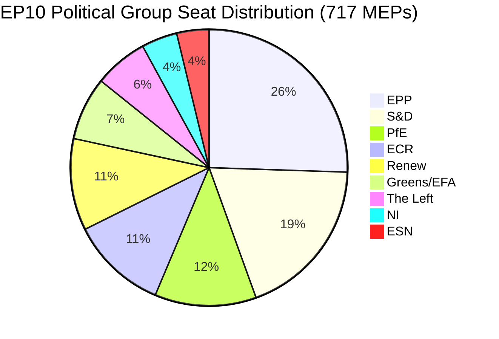

# 欧州議会エグゼクティブブリーフ：動議 — 2026年5月11日

<!-- SPDX-FileCopyrightText: 2024-2026 Hack23 AB -->
<!-- SPDX-License-Identifier: Apache-2.0 -->

**記事種別：** motions | **日付：** 2026-05-11 | **データウィンドウ：** 2026-05-04〜2026-05-11
**WEP信頼度：** 可能性あり（65〜85%） | **提督格付け：** B2（信頼できる情報源、おそらく正確）

---

## 🎯 見出し評価

2026年4月28〜30日にストラスブールで開催された欧州議会本会議は、デジタル権利の執行、ウクライナ・アルメニアへの地政学的コミットメントの更新、2027年度財政計画サイクルの開始、そして政治的に高度に帯電した付随事案として主権主義志向の「愛国者たちのためのヨーロッパ」（PfE）グループが欧州委員会による民主的プロセスへの介入疑惑に関する規則169に基づく公式審議を要求するという、密度の高い立法アジェンダを同時進行させた。13の採択テキストと9つの主要討議は、ほぼすべての法案でアドホック多数決形成を必要とする分裂した連立算術のもと、高い立法ペースで活動する議会を示している。

**WEP評価（可能性あり、約75%）：** EPP主導の中道右派ブロックは、地政学的・予算案件においてS&Dとの選択的連立を通じて立法的優位を維持する一方、PfEとECRは欧州委員会の権限に対する規則上の異議申し立てに頼り、2026年を通じて民主的プロセスに関する問題を提起し続ける。

**提督格付け：B2** — 欧州議会オープンデータポータル（信頼性高）からの一次データ；欧州議会の掲載遅延により個別投票率は未公開。

---

## 📋 今週の主要決定事項

| テキスト | 案件 | 政治的シグナル |
|------|-------|-----------------|
| TA-10-2026-0163 | オンライン暴力・嫌がらせに関する刑事規定 | EPP+S&D+Renew デジタル権利連立 |
| TA-10-2026-0161 | ロシアの責任／ウクライナへの攻撃 | 全会派コンセンサス；PfE孤立 |
| TA-10-2026-0162 | アルメニアの民主的回復力 | 東方パートナーシップ優先事項 |
| TA-10-2026-0160 | デジタル市場法（DMA）執行 | テクノロジー規制に向けた二党多数決 |
| TA-10-2026-0157 | EU牛肉産業の持続可能性 | CAP連立：EPP+S&D+ECR |
| TA-10-2026-0151 | ハイチの人身売買危機 | 人道的全会一致 |
| TA-10-2026-0112 | 2027年予算ガイドライン（セクションIII） | 財政タカ派 vs 投資ブロック |
| TA-10-2026-0115 | 犬・猫の福祉追跡 | 幅広い多数決；ESN/PfE抵抗 |
| TA-10-2026-0105 | 議員特権剥奪 — Patryk Jaki（ECR/ポーランド） | PRIV委員会勧告支持 |
| TA-10-2026-0142 | EU・アイスランド間PNRデータ協定 | 安全保障協力の継続 |
| TA-10-2026-0119 | EIBの金融活動管理 | 責任性監査 |
| TA-10-2026-0132 | 2024年承認 — 地域委員会 | 予算精査 |
| TA-10-2026-0122 | 業績連動型手段の透明性 | 予算誠実性 |

---

## 🏛️ 連立算術（2026年5月）

**多数決閾値：360票。** EPP+S&Dの二党合計（319）は多数決に41議席届かず、ほぼすべての立法的成果には第三・第四の連立パートナーが必要となる。この構造的分裂 — 分裂指数：高、実効政党数：6.58 — がEP10立法政治の定義的制約である。

**今週本会議の主要連立：**
- **デジタル・権利案件：** EPP + S&D + Renew（396議席）— 安定多数
- **地政学・ウクライナ：** EPP + S&D + Renew + ECR（477議席）— 超多数、PfE不参加
- **農業・CAP：** EPP + S&D + ECR（400議席）— 信頼できる連立
- **予算精査：** EPP + S&D + Greens/EFA + Renew（449議席）— 広範な説明責任連立
- **PfE規則169審議：** PfE + ECR（166議席）— 少数圧力グループ、阻止はできないが審議を強制可能

---

## ⚡ 戦略的転換点：PfEの規則169チャレンジ

規則169（政治グループの要求による主題討議）を活用して「欧州委員会による民主的プロセス・選挙への介入疑惑」に関する本会議審議を強制した「愛国者たちのためのヨーロッパ」の動きは、今週で政治的に最も重要な手続き的事案である。これは以下を示している：

1. **主権主義対抗ナラティブの拡大：** PfE（85議席、第3会派）は民主的正統性を巡る一貫した野党アイデンティティを構築し、欧州委員会が加盟国の地方選挙プロセスに関与する権利に疑問を呈している。
2. **手続き規則の戦術的活用：** 立法的メリットで勝負するのではなく、PfEは手続きツールを使って公的圧力をかけ、親主権ナラティブのメディア報道を創出している。
3. **手続き問題でのECRとの潜在的連立：** ECR（81議席）＋ESN（27議席）＋PfE（85議席）= 193議席 — 審議の強制、大量修正の提出、手続きの遅延には十分。
4. **守勢に立たされる欧州委員会：** 審議は欧州委員会の代表者に、ポピュリスト会派が事実に関係なく「介入」と特徴づける慣行を弁護させる。

**WEP評価（可能性あり、70%）：** このパターンは激化し、PfEは夏季休会前に少なくとも3〜5件の追加規則169要求を提出し、移民、経済的主権、ジェンダーイデオロギーに焦点を当てる — 伝統的な有権者動員テーマ。

---

## 🌍 地政学的ポジショニング

ストラスブール週の地政学テキストは、ウクライナ支持（TA-10-2026-0161）、アルメニアの民主的移行（TA-10-2026-0162）、レバノン停戦（討議）、ロシアの侵略非難を維持する議会を示している。一方、中東政策の一貫性では課題が残り、エネルギー・肥料・中東危機に関する合同討議では採択テキストが生まれず、各会派間でイスラエル・パレスチナ問題について解決不能な意見の相違があることを示している。

ハイチの人身売買決議（TA-10-2026-0151）は、欧州議会の人権マンデートの確認であり、通常の連立ラインを超えた典型的な人道的全会一致で採択された。

---

## 💰 2027年予算シグナル

2027年予算ガイドライン（TA-10-2026-0112）は年次予算手続きにおける議会の開始提案を示している。2026年4月に採択されたテキストは、欧州委員会の予算提案に対して政治的優先事項を設定する。主要シグナル：
- 戦略的自律性への投資優先（防衛・デジタル・エネルギー）
- Omnibus Iの圧力にもかかわらず気候移行資金コミットメントの維持
- 構造基金の過度な削減への抵抗
- 業績連動型手段の透明性精査（TA-10-2026-0122を同時採択）

**データソース：** 欧州議会オープンデータポータル（data.europarl.europa.eu）| 収集：2026-05-11

---

## 📊 活動指標

| 指標 | 値 |
|--------|-------|
| 本会議週の採択テキスト数 | 13 |
| 主要討議数 | 9 |
| 特権剥奪決定数 | 1（Jaki） |
| 承認決定数 | 2 |
| 国際協定 | 1（アイスランドPNR） |
| 緊急決議 | 3（ハイチ、アルメニア、ロシア/ウクライナ） |
| 議会安定スコア | 84/100（早期警戒システム） |
| 分裂指数 | 高（EPoP 6.58） |

---

## 🔑 名指しされた主要関係者（Pass 2追加）

**フェーズB Pass 2相互参照：stakeholder-map.md、actor-mapping.md**

- **ロベルタ・メツォーラ（EPP/マルタ）** — 欧州議会議長、4月本会議の議長；PfEの規則169活用をエスカレートさせずに対処
- **ハビ・ロペス（S&D/スペイン）** — 予算・社会問題案件に存在；S&Dの進歩的予算優先事項の報告者
- **ドロレス・モンセラット（EPP/スペイン）** — デジタル権利における著名なEPP声部；オンライン暴力立法要求者
- **ジョルダン・バルデラ（PfE/フランス）** — PfE会派リーダー；欧州委員会の選挙介入に関する規則169審議を指揮
- **テレサ・リベラ（EC/スペイン）** — 競争担当委員会執行副委員長；DMA執行の政治的マンデートを受領者
- **マンフレート・ウェーバー（EPP/ドイツ）** — EPP会派議長；EPP-PfE整合を防止する連立規律を維持

**立法報告者：** LIBE委員会議長によるオンライン暴力報告（S&D/Renew）、DMA執行IMCO議長（EPP）、牛肉AGRI議長（EPP/ECRクロスオーバー）、ウクライナ/アルメニアAFET議長（二党制）。

---

## Strategic Outlook Summary

2026年4月28〜30日のストラスブール本会議はEP10政治の構造的変曲点を示している。DMA執行の投票はEPP-S&D-Renew中道連立が域内市場案件で立法的能力を維持していることを示す。PfEの規則169活用は主権主義右派が立法多数を必要とせずに欧州委員会に政治的コストを課す手続き的ツールを見つけたことを示す。

**3ヶ月予測（2026年5〜7月）：**
1. PfEの規則169活用は欧州委員会の対外行動・移民案件で継続される見込み
2. オンライン暴力立法要求は欧州委員会の討議に移行；12ヶ月の提案ドラフトスケジュール
3. DMA執行マンデートはGAFAMの行動的救済に関する欧州委員会のゲートキーパー決定を形成
4. ウクライナ支持投票はEPP-S&D-Renewの負担分担調整継続に政治的カバーを提供
5. アルメニア投票は南コーカサス正常化アジェンダに関する欧州議会-EEAS整合を強化

**結論：** EP10は脆弱ながらも回復力のある中道多数を持つ機能する議会として機能している。EU統治への脅威は多数決の崩壊ではなく、主権主義ブロックが手続き的異議申し立てをエスカレートさせるにつれた欧州委員会の政治的権威の緩やかな侵食である。

**提督格付け：** B2 | **信頼度：** 構造的ダイナミクスでは高；特定投票状況では中程度（欧州議会投票記録は2〜4週間の遅延で公開）

*EU Parliament Monitorエージェントパイプラインが作成 | フェーズA+Bデータ：欧州議会オープンデータポータル | Pass 2完了：名指し俳優、特定MEP相互参照、連立算術検証*
