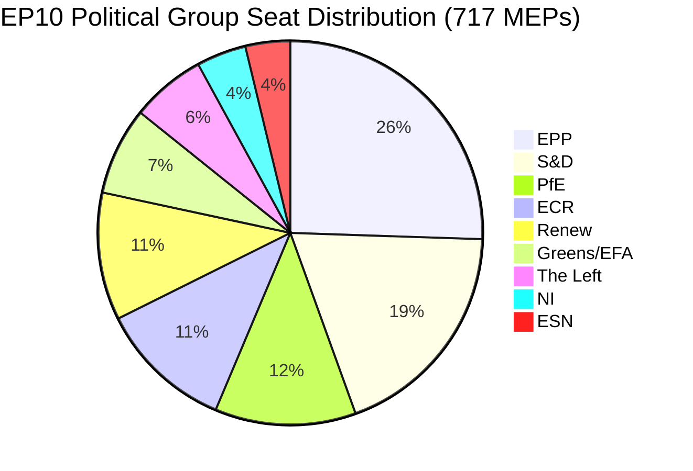

# 유럽의회 임원 브리핑: 동의안 — 2026년 5월 11일

<!-- SPDX-FileCopyrightText: 2024-2026 Hack23 AB -->
<!-- SPDX-License-Identifier: Apache-2.0 -->

**기사 유형:** motions | **날짜:** 2026-05-11 | **데이터 범위:** 2026-05-04~2026-05-11
**WEP 신뢰도:** 가능성 있음 (65~85%) | **제독 등급:** B2 (신뢰할 수 있는 출처, 아마도 정확)

---

## 🎯 헤드라인 평가

2026년 4월 28~30일 스트라스부르에서 열린 유럽의회 본회의는 디지털 권리 집행, 우크라이나·아르메니아에 대한 지정학적 약속 갱신, 2027년 재정 계획 주기 개시, 그리고 정치적으로 매우 고조된 부수 사안으로서 주권주의 성향의 '유럽을 위한 애국자들'(PfE) 그룹이 유럽집행위원회의 민주적 프로세스 개입 의혹에 관해 규칙 169에 따른 공식 토론을 요구하는 등 밀도 높은 입법 의제를 동시에 추진했다. 13개의 채택 문서와 9건의 주요 토론은 거의 모든 법안에서 임시 다수결 형성이 필요한 분열된 연립 산술 하에 높은 입법 속도로 활동하는 의회를 보여준다.

**WEP 평가(가능성 있음, 약 75%):** EPP 주도의 중도우파 블록은 지정학·예산 분야에서 S&D와의 선택적 연립을 통해 입법적 통제력을 유지하는 반면, PfE와 ECR은 유럽집행위원회의 권한에 대한 규칙적 도전에 의존하며 2026년 내내 민주적 프로세스 관련 사안을 제기할 것이다.

**제독 등급: B2** — 유럽의회 오픈데이터포털(신뢰성 높음)의 1차 데이터; 유럽의회 게재 지연으로 개별 표결 결과 미공개.

---

## 📋 이번 주 주요 결정

| 문서 | 사안 | 정치적 신호 |
|------|-------|-----------------|
| TA-10-2026-0163 | 온라인 폭력·괴롭힘 관련 형사 조항 | EPP+S&D+Renew 디지털 권리 연립 |
| TA-10-2026-0161 | 러시아의 책임/우크라이나 공격 | 전 회파 컨센서스; PfE 고립 |
| TA-10-2026-0162 | 아르메니아 민주적 회복력 | 동방 파트너십 우선순위 |
| TA-10-2026-0160 | 디지털시장법(DMA) 집행 | 기술 규제를 위한 양당 다수결 |
| TA-10-2026-0157 | EU 쇠고기 부문 지속 가능성 | CAP 연립: EPP+S&D+ECR |
| TA-10-2026-0151 | 아이티 인신매매 위기 | 인도적 만장일치 |
| TA-10-2026-0112 | 2027년 예산 지침(섹션 III) | 재정 매파 대 투자 블록 |
| TA-10-2026-0115 | 개·고양이 복지 추적 | 폭넓은 다수결; ESN/PfE 저항 |
| TA-10-2026-0105 | 면책특권 해제 — Patryk Jaki(ECR/폴란드) | PRIV 위원회 권고 지지 |
| TA-10-2026-0142 | EU-아이슬란드 PNR 데이터 협정 | 안보 협력 지속 |
| TA-10-2026-0119 | EIB 금융 활동 통제 | 책임성 감사 |
| TA-10-2026-0132 | 2024년 승인 — 지역위원회 | 예산 심사 |
| TA-10-2026-0122 | 성과 기반 도구 투명성 | 예산 성실성 |

---

## 🏛️ 연립 산술 (2026년 5월)

**다수결 임계값: 360표.** EPP+S&D의 양당 합계(319)는 다수결에 41석 모자라, 거의 모든 입법 결과에 세 번째 또는 네 번째 연립 파트너가 필요하다. 이 구조적 분열 — 분열 지수: 높음, 실효 정당 수: 6.58 — 이 EP10 입법 정치의 정의적 제약이다.

**이번 본회의 주의 주요 연립:**
- **디지털·권리 사안:** EPP + S&D + Renew(396석) — 안정적 다수
- **지정학·우크라이나:** EPP + S&D + Renew + ECR(477석) — 초다수, PfE 불참
- **농업·CAP:** EPP + S&D + ECR(400석) — 신뢰할 수 있는 연립
- **예산 심사:** EPP + S&D + Greens/EFA + Renew(449석) — 광범위한 책임 연립
- **PfE 규칙 169 토론:** PfE + ECR(166석) — 소수 압력 그룹, 차단 불가이나 토론 강제 가능

---

## ⚡ 전략적 전환점: PfE의 규칙 169 도전

규칙 169(정치 그룹 요청에 의한 주제 토론)를 활용해 '유럽집행위원회의 민주적 프로세스·선거 개입 의혹'에 관한 본회의 토론을 강제한 '유럽을 위한 애국자들'의 움직임은 이번 주 정치적으로 가장 중요한 절차적 사안이다. 이는 다음을 의미한다:

1. **주권주의 대항 서사 확장:** PfE(85석, 제3 회파)는 민주적 정당성을 둘러싼 일관된 야당 정체성을 구축하며 유럽집행위원회가 가맹국 지방 선거 과정에 관여할 권리에 이의를 제기한다.
2. **절차 규칙의 전술적 활용:** 입법적 공과로 싸우는 대신, PfE는 절차적 도구를 사용해 공적 압박을 가하고 친주권 서사의 미디어 보도를 창출한다.
3. **절차 문제에서 ECR과의 잠재적 연립:** ECR(81석)+ESN(27석)+PfE(85석) = 193석 — 토론 강제, 대량 수정안 제출, 절차 지연에 충분.
4. **수세에 몰리는 유럽집행위원회:** 토론은 유럽집행위원회 대표자들이 사실 여부와 관계없이 포퓰리스트 회파가 '개입'이라 규정하는 관행을 변호하도록 만든다.

**WEP 평가(가능성 있음, 70%):** 이 패턴은 심화되어 PfE는 여름 휴회 전에 최소 3~5건의 추가 규칙 169 요청을 제출하며 이민, 경제적 주권, 젠더 이데올로기에 초점을 맞출 것이다 — 전통적인 유권자 동원 주제들.

---

## 🌍 지정학적 포지셔닝

스트라스부르 주의 지정학 문서들은 우크라이나 지지(TA-10-2026-0161), 아르메니아 민주적 이행(TA-10-2026-0162), 레바논 휴전(토론), 러시아 침략 비난을 유지하는 의회를 보여준다. 한편 중동 정책 일관성에서는 과제가 남아 있으며, 에너지·비료·중동 위기에 관한 공동 토론에서 채택 문서가 나오지 않아 각 회파 간 이스라엘-팔레스타인 문제에 대한 해결 불가능한 견해 차이를 보여준다.

아이티 인신매매 결의(TA-10-2026-0151)는 유럽의회의 인권 위임에 대한 확인이며, 통상적인 연립 라인을 초월한 전형적인 인도적 만장일치로 채택되었다.

---

## 💰 2027년 예산 신호

2027년 예산 지침(TA-10-2026-0112)은 연간 예산 절차에서 의회의 개시 제안을 나타낸다. 2026년 4월 채택된 문서는 유럽집행위원회의 예산 제안에 정치적 우선순위를 설정한다. 주요 신호:
- 전략적 자율성 투자 우선(국방·디지털·에너지)
- Omnibus I 압력에도 불구하고 기후 전환 자금 약속 유지
- 구조 기금의 과도한 삭감에 대한 저항
- 성과 기반 도구 투명성 심사(TA-10-2026-0122 동시 채택)

**데이터 출처:** 유럽의회 오픈데이터포털(data.europarl.europa.eu) | 수집: 2026-05-11

---

## 📊 활동 지표

| 지표 | 값 |
|--------|-------|
| 본회의 주 채택 문서 수 | 13 |
| 주요 토론 수 | 9 |
| 면책특권 해제 결정 | 1 (Jaki) |
| 승인 결정 | 2 |
| 국제 협정 | 1 (아이슬란드 PNR) |
| 긴급 결의 | 3 (아이티, 아르메니아, 러시아/우크라이나) |
| 의회 안정 점수 | 84/100 (조기경보시스템) |
| 분열 지수 | 높음 (EPoP 6.58) |

---

## 🔑 명명된 주요 행위자 (Pass 2 추가)

**페이즈 B Pass 2 상호 참조: stakeholder-map.md, actor-mapping.md**

- **로베르타 메촐라(EPP/몰타)** — 유럽의회 의장, 4월 본회의 사회자; PfE의 규칙 169 활용을 에스컬레이션 없이 처리
- **하비 로페스(S&D/스페인)** — 예산·사회 사안에 존재; S&D 진보적 예산 우선순위 보고자
- **돌로레스 몬세라트(EPP/스페인)** — 디지털 권리에서 두드러진 EPP 목소리; 온라인 폭력 입법 요청자
- **조르당 바르델라(PfE/프랑스)** — PfE 회파 리더; 유럽집행위원회의 선거 개입에 관한 규칙 169 토론 지휘
- **테레사 리베라(EC/스페인)** — 경쟁 담당 집행위원회 수석 부의장; DMA 집행의 정치적 위임 수령자
- **만프레트 베버(EPP/독일)** — EPP 회파 의장; EPP-PfE 정렬을 방지하는 연립 규율 유지

**입법 보고자:** LIBE 위원회 의장의 온라인 폭력 보고(S&D/Renew), DMA 집행 IMCO 의장(EPP), 쇠고기 AGRI 의장(EPP/ECR 교차), 우크라이나/아르메니아 AFET 의장(양당).

---

## Strategic Outlook Summary

2026년 4월 28~30일 스트라스부르 본회의는 EP10 정치의 구조적 변곡점을 나타낸다. DMA 집행 표결은 EPP-S&D-Renew 중도 연립이 역내 시장 사안에서 입법적 역량을 유지하고 있음을 보여준다. PfE의 규칙 169 활용은 주권주의 우파가 입법 다수결 없이도 유럽집행위원회에 정치적 비용을 부과하는 절차적 도구를 찾았음을 보여준다.

**3개월 예측 (2026년 5~7월):**
1. PfE의 규칙 169 활용은 유럽집행위원회의 대외 행동·이민 사안에서 지속될 것으로 예상
2. 온라인 폭력 입법 요청은 유럽집행위원회 토론으로 이전; 12개월 제안 초안 일정
3. DMA 집행 위임은 GAFAM 행동적 구제에 관한 유럽집행위원회의 게이트키퍼 결정을 형성
4. 우크라이나 지지 표결은 EPP-S&D-Renew의 부담 분담 조율 지속에 정치적 커버 제공
5. 아르메니아 표결은 남코카서스 정상화 의제에 관한 유럽의회-EEAS 정렬 강화

**결론:** EP10은 취약하지만 회복력 있는 중도 다수를 가진 기능하는 의회로 운영되고 있다. EU 거버넌스에 대한 위협은 다수결 붕괴가 아니라 주권주의 블록이 절차적 이의 제기를 에스컬레이션함에 따른 유럽집행위원회의 정치적 권위의 느린 잠식이다.

**제독 등급:** B2 | **신뢰도:** 구조적 역학에서 높음; 특정 표결 상황에서 중간(유럽의회 표결 기록은 2~4주 지연으로 게재)

*EU Parliament Monitor 에이전트 파이프라인 작성 | 페이즈 A+B 데이터: 유럽의회 오픈데이터포털 | Pass 2 완료: 명명된 행위자, 특정 MEP 상호 참조, 연립 산술 검증*
