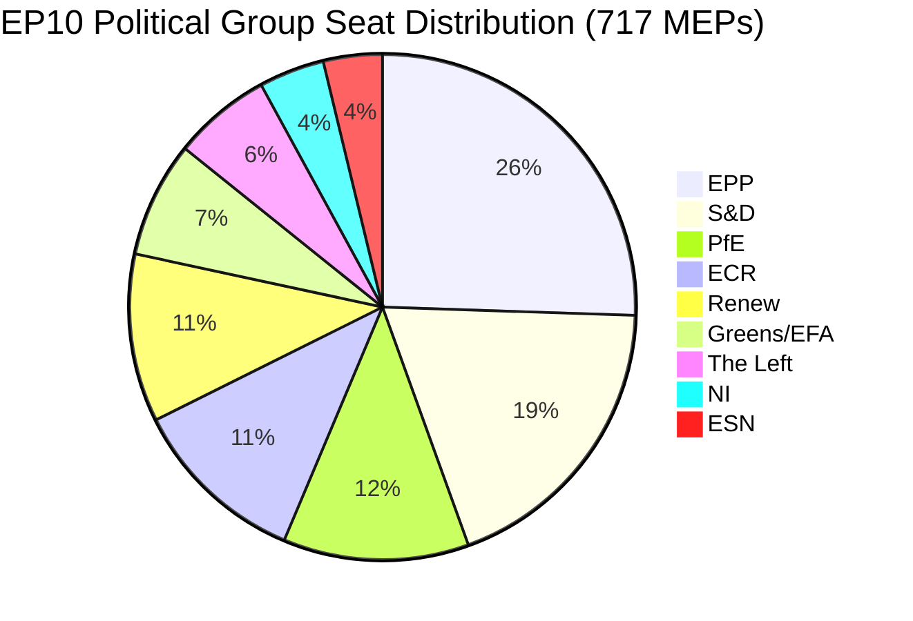

# Uitvoerende briefing: EU-Parlementsmotieven — 11 mei 2026

<!-- SPDX-FileCopyrightText: 2024-2026 Hack23 AB -->
<!-- SPDX-License-Identifier: Apache-2.0 -->

**Artikeltype:** motions | **Datum:** 2026-05-11 | **Datavenster:** 2026-05-04 tot 2026-05-11
**WEP-betrouwbaarheid:** Waarschijnlijk (65–85 %) | **Admiraliteitsgraad:** B2 (Betrouwbare bron, waarschijnlijk waar)

---

## 🎯 Kopbeoordeling

De plenaire vergadering van het Europees Parlement in Straatsburg op 28–30 april 2026 leverde een dichte wetgevingsagenda die tegelijkertijd de handhaving van digitale rechten vooruitbracht, geopolitieke verbintenissen met Oekraïne en Armenië herbevestigde, een fiscale planningscyclus voor 2027 opende en — in een politiek beladen nevengebeurtenis — de soevereinistische Patriots for Europe (PfE)-groep een formeel debat (artikel 169 van het Reglement) zag eisen over vermeende inmenging van de Commissie in democratische processen. Dertien aangenomen teksten en meer dan negen grote debatten signaleren een parlement dat met een hoog wetgevingstempo opereert onder gefragmenteerde coalitie-aritmetiek die voor bijna elk dossier ad-hoc-meerheidsvorming vereist.

**WEP-beoordeling (Waarschijnlijk, ~75 %):** Het EPP-verankerde centrum-rechtsblok zal de wetgevingscontrole handhaven door een selectieve coalitie met S&D op geopolitieke en begrotingsdossiers, terwijl PfE en ECR procedurele mechanismen zullen benutten om de autoriteit van de Commissie op het gebied van democratische processen gedurende 2026 te betwisten.

**Admiraliteitsgraad: B2** — Primaire gegevens van het EP Open Data Portal (betrouwbaar); individuele stemmingsmarges niet beschikbaar vanwege de publicatievertraging van het EP.

---

## 📋 Belangrijke besluiten deze week

| Tekst | Onderwerp | Politiek signaal |
|------|-------|-----------------|
| TA-10-2026-0163 | Strafrechtelijke bepalingen inzake cyberpesten/online intimidatie | Coalitie voor digitale rechten EPP+S&D+Renew |
| TA-10-2026-0161 | Aansprakelijkheid Rusland / aanvallen op Oekraïne | Transpartijdige consensus; PfE geïsoleerd |
| TA-10-2026-0162 | Democratische veerkracht in Armenië | Prioriteit van het oostelijk nabuurschap |
| TA-10-2026-0160 | Handhaving van de Digitalemarktenverordening | Bipartijdige meerderheid voor technologieregulering |
| TA-10-2026-0157 | Duurzaamheid van de EU-veehouderijsector | GLB-coalitie: EPP+S&D+ECR |
| TA-10-2026-0151 | Crisis van mensenhandel in Haïti | Humanitaire eensgezindheid |
| TA-10-2026-0112 | Begrotingsrichtsnoeren 2027 (afdeling III) | Begrotingshaviken versus investeringsblok |
| TA-10-2026-0115 | Traceerbaarheid voor welzijn van honden en katten | Brede meerderheid; ESN/PfE resistent |
| TA-10-2026-0105 | Opheffing immuniteit — Patryk Jaki (ECR/Polen) | Aanbeveling van de PRIV-commissie gehandhaafd |
| TA-10-2026-0142 | EU-IJsland PNR-gegevensovereenkomst | Continuïteit van veiligheidssamenwerking |
| TA-10-2026-0119 | Controle van de financiële activiteiten van de EIB | Verantwoordingstoezicht |
| TA-10-2026-0132 | Kwijting 2024 — Comité van de Regio's | Begrotingscontrole |
| TA-10-2026-0122 | Transparantie van op prestaties gebaseerde instrumenten | Begrotingsintegriteit |

---

## 🏛️ Coalitie-aritmetiek (mei 2026)

**Meerderheidsdrempel: 360 stemmen.** Het bilaterale totaal van EPP+S&D (319) valt 41 zetels onder een meerderheid, waardoor elk wetgevingsresultaat een derde of vierde coalitiegenoot vereist. Deze structurele fragmentatie — met Fragmentatieindex: HOOG, Effectief aantal partijen: 6,58 — is de bepalende beperking van de EP10-wetgevingspolitiek.

**Dominante coalities in deze plenaire week:**
- **Digitale/rechtendossiers**: EPP + S&D + Renew (396 zetels) — solide meerderheid
- **Geopolitiek/Oekraïne**: EPP + S&D + Renew + ECR (477 zetels) — supermeerderheid, PfE afwezig
- **Landbouw/GLB**: EPP + S&D + ECR (400 zetels) — betrouwbare coalitie
- **Begrotingscontrole**: EPP + S&D + Greens/EFA + Renew (449 zetels) — brede verantwoordingscoalitie
- **PfE-artikel-169-debat**: PfE + ECR (166 zetels) — minderheidsdrukgroep, kan niet blokkeren maar kan debat afdwingen

---

## ⚡ Strategisch moment: de artikel-169-uitdaging van PfE

Het beroep van Patriots for Europe op artikel 169 van het Reglement (actueel debat op verzoek van een politieke groep) om een plenaire discussie af te dwingen over vermeende "inmenging van de Commissie in democratische processen en verkiezingen" is het politiek meest significante procedurele evenement van de week. Deze zet signaleert:

1. **Escalatie van het soevereinistische tegenverhaal**: PfE (85 zetels, derde grootste groep) bouwt een coherente oppositie-identiteit op rondom democratische legitimiteit en betwist het recht van de Commissie om zich te mengen in nationale verkiezingsprocessen van lidstaten.
2. **Tactisch gebruik van de Reglementsregels**: In plaats van in te gaan op wetgevende verdiensten gebruikt PfE procedurele instrumenten om publieke druk te creëren en media-aandacht voor een pro-soevereiniteitsnarratief te genereren.
3. **Coalitie met ECR mogelijk in procedurele kwesties**: ECR (81 zetels) en ESN (27 zetels) gecombineerd met PfE (85 zetels) = 193 zetels — voldoende om debatten af te dwingen, massale amendementen in te dienen en procedures te vertragen.
4. **Commissie in de verdediging**: Het debat dwingt vertegenwoordigers van de Commissie om praktijken te verdedigen die populistische groepen als inmenging kwalificeren, ongeacht de feitelijke omstandigheden.

**WEP-beoordeling (Waarschijnlijk, 70 %):** Dit patroon zal zich intensiveren, waarbij PfE voor het zomerreces ten minste 3–5 verdere artikel-169-verzoeken zal indienen, gericht op migratie, economische soevereiniteit en genderideologie — traditionele mobilisatiethema's voor zijn kiezersaanhang.

---

## 🌍 Geopolitieke houding

De geopolitieke teksten van de Straatsburgweek onthullen een parlement dat robuuste steun handhaaft voor Oekraïne (TA-10-2026-0161), democratische transitie in Armenië (TA-10-2026-0162), Libanees staakt-het-vuren (debat) en veroordeling van Russische agressie — terwijl het tegelijkertijd worstelt met de samenhang van het Midden-Oostenbeleid, zoals blijkt uit het gemeenschappelijk debat over energie, meststoffen en de Midden-Oostencrisis dat geen aangenomen tekst opleverde, wat suggereert dat onverenigbare meningsverschillen bestaan tussen groepen over de Israëlisch-Palestijnse dimensie.

De Haïtiaanse mensenhandelresolutie (TA-10-2026-0151) vertegenwoordigt een herbevestiging van het mensenrechtsmandaat van het EP, aangenomen met de typische humanitaire eensgezindheid die normale coalitiegrenzen overschrijdt.

---

## 💰 Begrotingssignalering 2027

De richtsnoeren voor de begroting 2027 (TA-10-2026-0112) vertegenwoordigen het openingsbod van het Parlement in de jaarlijkse begrotingsprocedure. De in april 2026 aangenomen tekst stelt politieke prioriteiten voor de begrotingsvoorstellen van de Commissie. Belangrijke signalen:
- Prioritering van investeringen in strategische autonomie (defensie, digitaal, energie)
- Gehandhaafd engagement voor klimaattransitie-financiering ondanks Omnibus I-druk
- Verzet tegen buitensporige bezuinigingen in de structuurfondsen
- Controle van de transparantie van op prestaties gebaseerde instrumenten (TA-10-2026-0122 gelijktijdig aangenomen)

**Brongegevens:** EP Open Data Portal (data.europarl.europa.eu) | Verzameling: 2026-05-11

---

## 📊 Activiteitsmetrieken

| Metriek | Waarde |
|--------|-------|
| Aangenomen teksten in deze plenaire week | 13 |
| Grote debatten | 9 |
| Immuniteitsbeslissingen | 1 (Jaki) |
| Kwijtingsbeslissingen | 2 |
| Internationale overeenkomsten | 1 (IJsland PNR) |
| Urgentieresoluties | 3 (Haïti, Armenië, Rusland/Oekraïne) |
| Parlementaire stabiliteitsscore | 84/100 (vroegwaarschuwingssysteem) |
| Fragmentatieindex | HOOG (EPoP 6,58) |

---

## 🔑 Met name genoemde sleutelactoren (Toevoeging Pass 2)

**Fase B Pass 2 kruisreferentie: stakeholder-map.md, actor-mapping.md**

- **Roberta Metsola (EPP/Malta)** — EP-voorzitter, plenaire voorzitter voor de aprilsessie; beheerde de invocatie van artikel 169 door PfE zonder escalatie
- **Javi López (S&D/Spanje)** — Zichtbaar in begrotings- en socialdossiers; S&D-rapporteur voor progressieve begrotingsprioriteiten
- **Dolors Montserrat (EPP/Spanje)** — Prominente EPP-stem over digitale rechten, wetgevingsverzoek inzake cyberpesten
- **Jordan Bardella (PfE/Frankrijk)** — PfE-groepsleider; orkestreerde het artikel-169-debat over de verkiezingsinmenging van de Commissie
- **Teresa Ribera (EC/Spanje)** — Uitvoerend vicevoorzitter van de Commissie voor Mededinging; ontvanger van het politieke mandaat voor DMA-handhaving
- **Manfred Weber (EPP/Duitsland)** — EPP-fractievoorzitter; handhaaft coalitiediscipline die EPP-PfE-afstemming verhindert

**Wetgevingsrapporteurs:** LIBE-commissie hoofd voor cyberpesten (S&D/Renew), IMCO-hoofd voor DMA-handhaving (EPP), AGRI-hoofd voor veehouderij (EPP/ECR-kruising), AFET-hoofd voor Oekraïne/Armenië (bipartijdig).

---

## Strategic Outlook Summary

De plenaire vergadering in Straatsburg van 28–30 april 2026 markeert een structureel buigpunt in de EP10-politiek. De stemming over DMA-handhaving toont aan dat de EPP-S&D-Renew-centrumcoalitie wetgevingscapaciteit behoudt op interne marktdossiers. De invocatie van artikel 169 door PfE toont aan dat de soevereinistische rechterflank een procedureel instrument heeft gevonden om de Commissie politieke kosten op te leggen zonder een wetgevende meerderheid te vereisen.

**Driemandsvooruitzicht (mei–juli 2026):**
1. PfE-artikel-169-invocaties zullen waarschijnlijk doorgaan op dossiers over extern optreden en migratie van de Commissie
2. Het wetgevingsverzoek inzake cyberpesten gaat naar de Commissie voor behandeling; 12-maanden tijdlijn voor een conceptvoorstel
3. Het DMA-handhavingsmandat zal de gate-keeping-beslissingen van de Commissie over gedragsmaatregelen van GAFAM beïnvloeden
4. De Oekraïne-stemstemming biedt politieke dekking voor de voortgezette EPP-S&D-Renew-coördinatie over lastenverdeling
5. De Armenië-stemming consolideert de EP-EDEO-afstemming op de normaliseringsagenda voor de Zuidelijke Kaukasus

**Conclusie:** EP10 functioneert als een werkend parlement met een fragiele maar duurzame centrummeerderheld. De bedreiging voor de EU-governance is geen meerderheidsinstorting maar een langzame erosie van de politieke autoriteit van de Commissie naarmate het soevereinistische blok de procedurele betwisting escaleert.

**Admiraliteitsgraad:** B2 | **Betrouwbaarheid:** HOOG voor structurele dynamieken; GEMIDDELD voor specifieke stemtoewijzing (EP-stemregisters worden gepubliceerd met 2–4 weken vertraging)

*Opgesteld door de EU Parliament Monitor agentic pipeline | Fase A+B-gegevens: EP Open Data Portal | Pass 2 voltooid: met name genoemde actoren, MEP-specifieke kruisreferenties, coalitie-aritmetiek geverifieerd*
