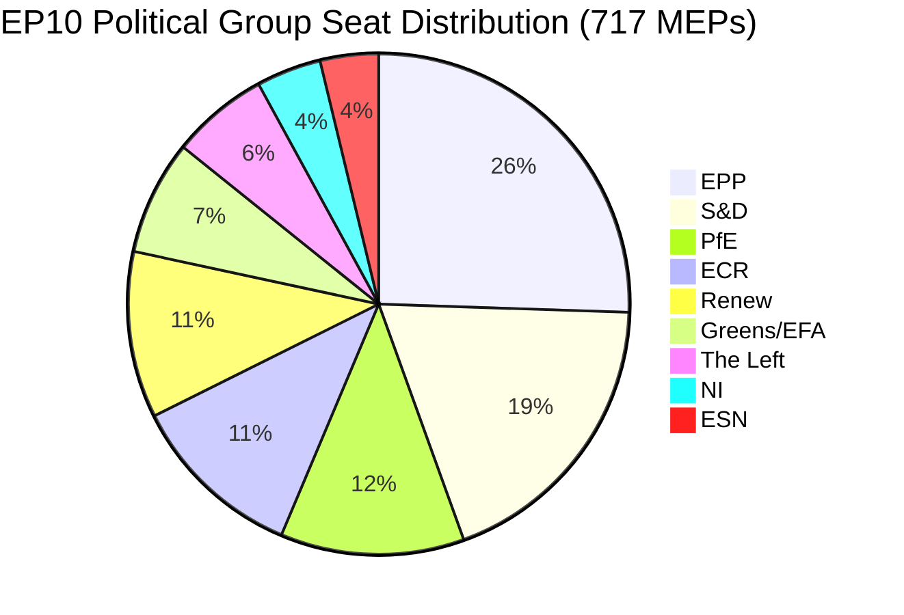

# Utøvende orientering: EUs parlamentariske motioner — 11. mai 2026

<!-- SPDX-FileCopyrightText: 2024-2026 Hack23 AB -->
<!-- SPDX-License-Identifier: Apache-2.0 -->

**Artikkeltype:** motions | **Dato:** 2026-05-11 | **Datavindu:** 2026-05-04 til 2026-05-11
**WEP-konfidens:** Sannsynlig (65–85 %) | **Admiralitetsgrad:** B2 (Pålitelig kilde, sannsynligvis sant)

---

## 🎯 Rubrikkvurdering

Europaparlamentets plenarsesjon i Strasbourg 28.–30. april 2026 leverte en tett lovgivningsagenda som samtidig fremmet håndheving av digitale rettigheter, bekreftet geopolitiske forpliktelser overfor Ukraina og Armenia, åpnet en fiskal planleggingssyklus for 2027 og — i en politisk ladet sidebegivenhet — så den suverenistiske Patriots for Europe (PfE)-gruppen kreve en formell debatt (Reglementets artikkel 169) om påstått Kommisjonsinnblanding i demokratiske prosesser. Tretten vedtatte tekster og mer enn ni store debatter signaliserer et parlament i høy lovgivningstakt under fragmentert koalisjonsaritmetikk som krever ad hoc-majoritetskonstruksjon for nesten hvert eneste saksområde.

**WEP-vurdering (Sannsynlig, ~75 %):** Det EPP-forankrede sentrum-høyreblokket vil opprettholde lovgivningskontroll gjennom selektiv koalisjon med S&D om geopolitiske og budsjettsaker, mens PfE og ECR vil utnytte prosedyremekanismer for å utfordre Kommisjonens autoritet i spørsmål om demokratiske prosesser gjennom hele 2026.

**Admiralitetsgrad: B2** — Primærdata fra EPs åpne dataportal (pålitelig); individuelle stemmeandeler utilgjengelige på grunn av EPs publiseringsforsinkelse.

---

## 📋 Viktige beslutninger denne uken

| Tekst | Emne | Politisk signal |
|------|-------|-----------------|
| TA-10-2026-0163 | Strafferettslige bestemmelser om nettmobbing/trakassering online | Koalisjon for digitale rettigheter EPP+S&D+Renew |
| TA-10-2026-0161 | Russlands ansvarliggjøring / Ukraina-angrep | Tverrpolitisk konsensus; PfE isolert |
| TA-10-2026-0162 | Demokratisk motstandskraft i Armenia | Prioritet for østlig nabolag |
| TA-10-2026-0160 | Håndheving av loven om digitale markeder | Topartistisk majoritet for teknologiregulering |
| TA-10-2026-0157 | Bærekraft i EUs husdyrsektor | CAP-koalisjon: EPP+S&D+ECR |
| TA-10-2026-0151 | Krise med menneskehandel i Haiti | Humanitær enstemmighet |
| TA-10-2026-0112 | Retningslinjer for budsjettet 2027 (seksjon III) | Budsjetthøker mot investeringsblokken |
| TA-10-2026-0115 | Sporbarhet for hunde- og kattevelferd | Bred majoritet; ESN/PfE motstandsdyktige |
| TA-10-2026-0105 | Oppheving av immunitet — Patryk Jaki (ECR/Polen) | PRIV-komiteens anbefaling opprettholdt |
| TA-10-2026-0142 | EU-Island PNR-dataavtale | Kontinuitet i sikkerhetssamarbeidet |
| TA-10-2026-0119 | Kontroll av EIBs finansielle aktiviteter | Ansvarlighetsoversyn |
| TA-10-2026-0132 | Ansvarsfrihet 2024 — Regionkomiteen | Budsjettgranskning |
| TA-10-2026-0122 | Transparens i resultatbaserte instrumenter | Budsjettintegritet |

---

## 🏛️ Koalisjonsaritmetikk (mai 2026)

**Majoritetsterskelen: 360 stemmer.** EPP+S&Ds bilaterale totalsum (319) er 41 mandater under en majoritet, noe som sikrer at hvert lovgivningsresultat krever en tredje eller fjerde koalisjonspartner. Denne strukturelle fragmenteringen — med Fragmenteringsindeks: HØY, Effektivt antall partier: 6,58 — er den avgjørende begrensningen for EP10s lovgivningspolitikk.

**Dominerende koalisjoner denne plenarmøteuken:**
- **Digitale/rettighetssaker**: EPP + S&D + Renew (396 mandater) — solid majoritet
- **Geopolitikk/Ukraina**: EPP + S&D + Renew + ECR (477 mandater) — supermajoritet, PfE fraværende
- **Landbruk/CAP**: EPP + S&D + ECR (400 mandater) — pålitelig koalisjon
- **Budsjettgranskning**: EPP + S&D + Greens/EFA + Renew (449 mandater) — bred ansvarlighetskoalisjon
- **PfE-regel 169-debatt**: PfE + ECR (166 mandater) — minoritetspressgruppe, kan ikke blokkere men kan tvinge debatt

---

## ⚡ Strategisk øyeblikk: PfEs regel 169-utfordring

Patriots for Europes påberopelse av reglementets artikkel 169 (aktuell debatt på politisk gruppes anmodning) for å tvinge frem en plenardiskusjon om påstått «Kommisjonsinnblanding i demokratiske prosesser og valg» er ukens politisk mest betydningsfulle prosedyrehendelse. Dette grepet signaliserer:

1. **Eskalering av suverenistisk motfortelling**: PfE (85 mandater, tredje største gruppe) bygger en sammenhengende opposisjonsidentitet rundt demokratisk legitimitet og utfordrer Kommisjonens rett til å engasjere seg i innenlandske valgprosesser i medlemsstatene.
2. **Taktisk bruk av reglementets regler**: I stedet for å engasjere seg i lovgivningsmessige fortjenester bruker PfE prosedyreverktøy for å skape offentlig press og generere mediedekning av en pro-suverenitetfortelling.
3. **Koalisjon med ECR mulig i prosedyremessige spørsmål**: ECR (81 mandater) og ESN (27 mandater) kombinert med PfE (85 mandater) = 193 mandater — tilstrekkelig til å tvinge debatter, fremme massive endringsforslag og forsinke prosedyrer.
4. **Kommisjonen i defensiven**: Debatten tvinger Kommisjonens representanter til å forsvare praksis som populistiske grupper karakteriserer som innblanding, uavhengig av de faktiske omstendighetene.

**WEP-vurdering (Sannsynlig, 70 %):** Dette mønsteret vil intensivere seg, med PfE som sender inn minst 3–5 ytterligere regel 169-anmodninger før sommerferien, med fokus på migrasjon, økonomisk suverenitet og kjønnsideologi — tradisjonelle mobiliseringssaker for velgerbasen.

---

## 🌍 Geopolitisk holdning

Strasbourgukens geopolitiske tekster avslører et parlament som opprettholder robust støtte til Ukraina (TA-10-2026-0161), demokratisk overgang i Armenia (TA-10-2026-0162), libanesisk våpenhvile (debatt) og fordømmelse av russisk aggresjon — samtidig som det sliter med koherens i Midtøsten-politikken, noe som fremgår av den felles debatten om energi, gjødning og Midtøstenkrisen som ikke produserte noen vedtatt tekst, noe som tyder på uforenlige meningsforskjeller mellom gruppene om den israelsk-palestinske dimensjonen.

Haiti-trafficking-resolusjonen (TA-10-2026-0151) representerer en bekreftelse av EPs mandat for menneskerettigheter, vedtatt med typisk humanitær enstemmighet som skjærer på tvers av normale koalisjonslinjer.

---

## 💰 Budsjettsignalisering 2027

Retningslinjene for budsjettet 2027 (TA-10-2026-0112) representerer Parlamentets åpningstilbud i den årlige budsjettprosedyren. Teksten vedtatt i april 2026 fastsetter politiske prioriteringer for Kommisjonens budsjettforslag. Viktige signaler:
- Prioritering av investeringer i strategisk autonomi (forsvar, digital, energi)
- Opprettholdt engasjement for klimaomstillingsfinansiering til tross for Omnibus I-press
- Motstand mot overdreven innstramming i strukturfondene
- Gjennomgang av transparens i resultatbaserte instrumenter (TA-10-2026-0122 vedtatt samtidig)

**Kildedata:** EPs åpne dataportal (data.europarl.europa.eu) | Innsamling: 2026-05-11

---

## 📊 Aktivitetsmålinger

| Metrikk | Verdi |
|--------|-------|
| Vedtatte tekster denne plenarmøteuken | 13 |
| Store debatter | 9 |
| Immunitetsavgjørelser | 1 (Jaki) |
| Ansvarsfrihetsavgjørelser | 2 |
| Internasjonale avtaler | 1 (Island PNR) |
| Hasteaksjonsresolusjoner | 3 (Haiti, Armenia, Russland/Ukraina) |
| Parlamentets stabilitetsscore | 84/100 (tidligvarslingssystem) |
| Fragmenteringsindeks | HØY (EPoP 6,58) |

---

## 🔑 Navngitte nøkkelaktører (Pass 2-tillegg)

**Fase B Pass 2 kryssreferanse: stakeholder-map.md, actor-mapping.md**

- **Roberta Metsola (EPP/Malta)** — EP-president, plenarkoordinator for aprilsesjonen; håndterte PfEs regel 169-påberopelse uten eskalering
- **Javi López (S&D/Spania)** — Synlig i budsjett- og sosialsaker; S&Ds ordfører for progressive budsjettprioriteringer
- **Dolors Montserrat (EPP/Spania)** — Fremtredende EPP-stemme om digitale rettigheter, lovgivningsanmodning om nettmobbing
- **Jordan Bardella (PfE/Frankrike)** — PfEs gruppeledere; orkestrerte regel 169-debatten om Kommisjonens valginnblanding
- **Teresa Ribera (EC/Spania)** — Kommisjonens utøvende visepresident for konkurranse; mottaker av det politiske mandatet for DMA-håndheving
- **Manfred Weber (EPP/Tyskland)** — EPPs gruppeformann; opprettholder koalisjonsdisiplin som forhindrer EPP-PfE-tilpasning

**Lovgivningsordførere:** LIBE-komiteens leder for nettmobbing (S&D/Renew), IMCO-leder for DMA-håndheving (EPP), AGRI-leder for husdyr (EPP/ECR-kryss), AFET-leder for Ukraina/Armenia (topartistisk).

---

## Strategic Outlook Summary

Plenarsessionen i Strasbourg 28.–30. april 2026 markerer et strukturelt vendepunkt i EP10-politikken. DMA-håndhevingsavstemningen viser at EPP-S&D-Renew-sentrumskoalisjonen beholder lovgivningskapasitet på det indre markedets saksområder. PfEs regel 169-påberopelse viser at den suverenistiske høyrefløyen har funnet et prosedyreverktøy for å pålegge Kommisjonen politiske kostnader uten å kreve lovgivende majoritet.

**Tremånedersutsikter (mai–juli 2026):**
1. PfEs regel 169-påberopelser vil sannsynligvis fortsette på Kommisjonens eksterne handlinger og migrasjonssaker
2. Lovgivningsanmodningen om nettmobbing går til Kommisjonens behandling; 12-månederstidslinje for utkast til forslag
3. DMA-håndhevingsmandatet vil informere Kommisjonens gate-keeping-beslutninger om GAFAMs adferdsmessige tiltak
4. Ukraina-støtteavstemningen gir politisk dekning for fortsatt EPP-S&D-Renew-koordinering om byrdefordeling
5. Armenia-avstemningen konsoliderer EP-EEAS-tilpasningen om normaliseringsagendaen i Sør-Kaukasus

**Bunnlinje:** EP10 fungerer som et fungerende parlament med en skjør men holdbar sentrumsflertall. Trusselen mot EU-styringen er ikke et majoritetssammenbrudd, men en langsom erosjon av Kommisjonens politiske autoritet ettersom det suverenistiske blokket eskalerer prosedyrekontestasjonen.

**Admiralitetsgrad:** B2 | **Konfidens:** HØY for strukturelle dynamikker; MIDDELS for spesifikk stemmtilskriving (EPs stemmregistreringer publiseres med 2–4 ukers forsinkelse)

*Utarbeidet av EU Parliament Monitor agentic pipeline | Fase A+B-data: EPs åpne dataportal | Pass 2 fullført: navngitte aktører, MEP-spesifikke kryssreferanser, koalisjonsaritmetikk verifisert*
